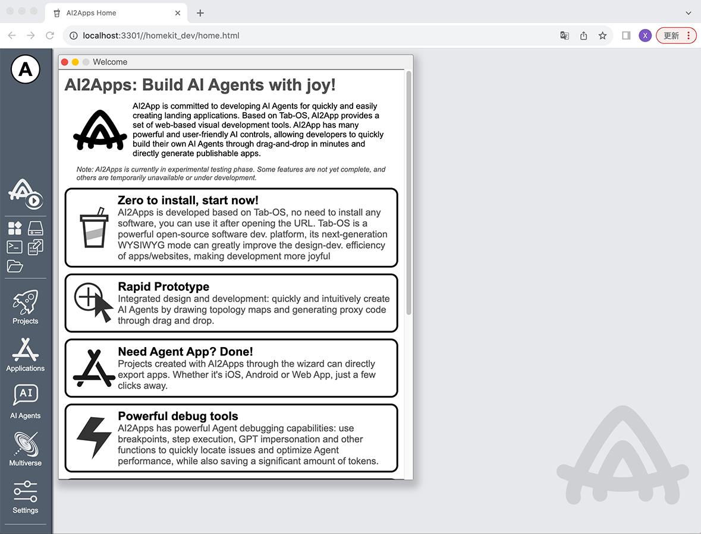
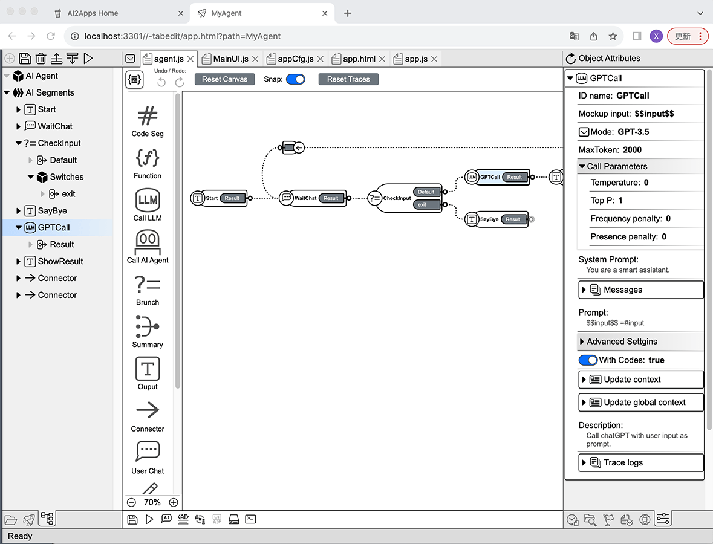
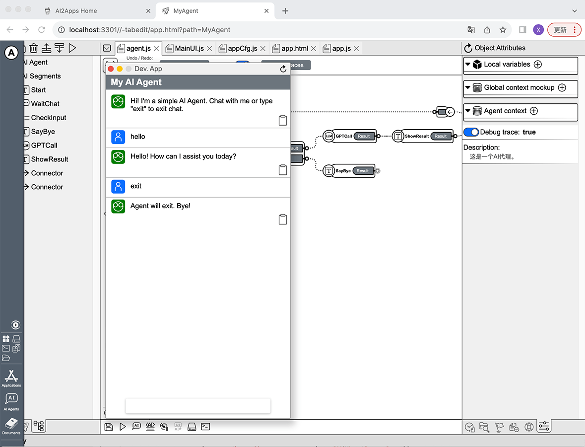
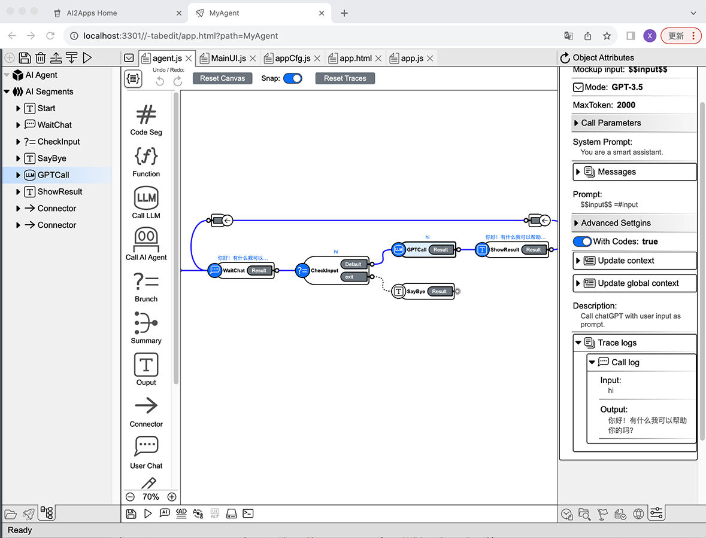

# AI2Apps Experimental Public Beta

## Overview of AI2Apps
AI2Apps is dedicated to the rapid development of practical AI Agent Apps. 
Based on Tab-OS, AI2Apps provides a complete web-based visual development tool-set. 
AI2Apps includes powerful and easy-to-use AI controls, 
allowing developers to quickly build their own AI Agents through drag-and-drop and directly generate publishable apps.

## Getting Started
AI2Apps can be used directly on the website or deployed locally using this project.

### 1. Using the Web Version Directly
From a desktop browser, open URL:
   
[https://www.ai2apps.com](https://www.ai2apps.com)
  
The first time you open the website, it will install and configure the development environment, 
which may take a few seconds to 1 minute depending on the browser and network. 
During beta testing, to access AI models, registration and login to Tab-OS are required (Tab-OS registration is free). 
After successful registration/login, you can create AI Agent projects using the project wizard.

### 2. Deploying Locally
Download this project in the local environment:
```
git clone https://github.com/Avdpro/ai2apps.git
```
Edit the `.env` file and configure the correct OpenAI Key and server port (default port is 3015):
```
APIROOT=https://www.ai2apps.com/ws/
OPENAI_API_KEY=sk-XXXXXXXXXXXXXXXXXXXXXXXXXXXXXXXXXXXXXXXXXXXXXXXX
PORT=3015
```
Install packages:
```
nmp install
```
Start the service:
```
node ./start.js
```
Assuming the specified port is 3015, open in the browser:
`http://localhost:3015/`
Similar to using ai2apps.com directly, the first visit will go through the installation and configuration.



This is the AI2Apps desktop status after a successful launch. 
Click on "Projects" in the Dock on left side  to start creating AI Agent projects. 
The current version offers several AI Agent project templates to choose from. 
To create the simplest AI Agent, select the first template: "Simple AI Agent App" to begin. 
After entering the project name path (e.g., MyAgent) and clicking the create button, the system will create and open the project development environment.




## Advantages of Development with AI2Apps

#### **1. Design and Coding at Same Time, Rapid Prototyping**  
By dragging and dropping to draw topology diagrams, you can quickly design agent logic. The topology diagram is automatically synchronized to agent code, saving a significant amount of programming time.

#### **2. Agents Can Be Packaged Directly as Apps**  
Completed AI agents can be packaged as standalone web/mobile apps (currently supporting iOS and Android systems). They can also be integrated as AI extensions into existing websites/apps with just a few lines of code.

#### **3. Powerful Debugging Features**  
AI2Apps offers great agent debugging features: breakpoints, step-by-step execution, GPT Cheat, and more, allowing developers to quickly pinpoint issues and optimize agent performance. This can greatly save development time and reduce AI invocation costs.

#### **4. More Efficient Interaction with Users**  
In most cases, chatting is not the best way to interact with users. 
AI2Apps provides various UI controls to support agent development, 
such as menus, buttons, charts, etc., allowing agents to interact with users like professional apps.

#### **5. Localization Support**  
Developing localization support using traditional development methods is often tedious and boring. 
With the assistance of AI in AI2Apps, you can easily develop the entire agent in multiple languages with just a few clicks, 
making the process efficient and enjoyable.

#### **6. Easier Product Maintenance**  
Traditional development methods cannot guarantee real-time synchronization between code implementation and original design. Design documents often cannot serve as effective references during maintenance.  

AI2Apps' "design and coding at same time" mode ensures that the code and design are always synchronized, avoiding the disconnect between design and implementation.  

Compared to reading complex code line by line, the advantages of AI agent code containing topology diagrams in later maintenance are enormous. It not only provides a clear understanding of the original code's design rationale but also allows for quicker identification of code issues.

#### **7. Expansion Through Add-Ons**  
AI2Apps allows easy functional extension through add-ons, 
enabling developers to create their own add-on according to their needs.

## How to Write an Agent

In AI2Apps, each agent is an independent JavaScript (js) file, 
with the topology information saved as comments at the end of the file, 
ensuring that design and implementation are always in sync.

The Agent file editing UI has two modes: "Code" and "Canvas". When you open an Agent, it defaults to use the Canvas mode.

#### Canvas Mode
The development UI in Canvas mode:


On the left is the structure view of the Agent, displaying the Agent object and its list of "execution segment" (SEG) it contains. 
You can click on items to select objects.  

In the middle is the Agent Topology Canvas, where you can create SEG objects by dragging and dropping and connect SEGs by dragging them.  

On the right is the object property editor view, where editable properties of the currently selected object are listed, such as model selection and temperature parameters when calling ChatGPT.

#### Code Mode
The development UI in Code mode:


The left and right sides remain the same, displaying the structure view of the Agent and object property editing view. 
The middle part contains the Agent code.
When editing the Agent topology diagram and object properties, the code updates automatically. 
Developers can also manually write code to implement logic that cannot be achieved through visual editing.

#### Running the Agent



The run button is located in the left structure view tool bar and the comprehensive toolbar at the bottom of the UI. 
Clicking the run button allows you to run the current Agent project in debug mode or Device-App mode.
Once the Agent is running, you can test it through dialogue.

#### Debugging the Agent


Starting the AI Agent in Debug mode enters debugging mode. In debugging mode, clicking the "Debug" button at the top of the UI enters the debug view.  

**Data Flow and Breakpoints**  
The left side of the debug view shows the running data flow, 
where you can view detailed conversation processes, including the content of each step input/output. 
Clicking the step names in the flow allows you to open detailed infomation on the right and set breakpoints.

**Step-by-step Execution and Breakpoint Operations**  
You can enable step-by-step execution at the bottom of the UI. 
When executing the AI Agent step-by-step or encountering breakpoints, 
the debugger pauses agent execution and reports the current step's execution information to the user. 
Users can modify input/output data for the step to see different effects.

**GPT Cheat**
During debugging, you can use GPT Cheat. Clicking on the step that calls GPT allows you to add GPT Cheat in the right panel. 
GPT Cheat can simulate (bypass) ChatGPT calls with pre-set results, saving time and costs.

**Topology Trace Debugging Information**



During the debugging process of the AI Agent, the Agent's topology diagram is updated synchronously, indicating the path of execution calls and the process of various parameter transmissions.
The paths taken during execution are highlighted with bold blue curves, and the input/output of execution is listed in the **Trace Log** of the object property view.

### Gas and Consumption
If you use your own deployed AI2Apps runtime and use your own OpenAI Key, 
calling ChatGPT will consume the your own OpenAI traffic.
In this case, there are no restrictions on the system.  

If you run/debug the Agent in the www.ai2apps.com web environment, the system will incur OpenAI costs when your agent making ChatGPT calls.
To avoid excessive billing, the system limits users' usage of ChatGPT through "Gas".

### Obtaining Free Gas
After successful registration and login to Tab-OS, users will receive a certain amount of free gas.
Upon logging in each day, users will also receive additional gas based on their current user rank. 
Recommending new members successfully can also earn users free system tokens, 
which can be used to exchange for gas.

## Publishing an Agent
Developed Agent can be packaged and published as a web or mobile application (iOS/Android). 
The current AI2Apps beta test version does not provide the packaging function.
Once the system is more stable and complete, the packaging function will be provided in later versions.

## Future Plans for AI2Apps:
- Support for more LLM models, such as Llama-2, MPT, Falcon, and Pythia
- Support for drawing / seeing AI models
- Support for speech recognition/synthesis AI models
- Programming sandbox
- Browser plugin development
- More documentation and examples
