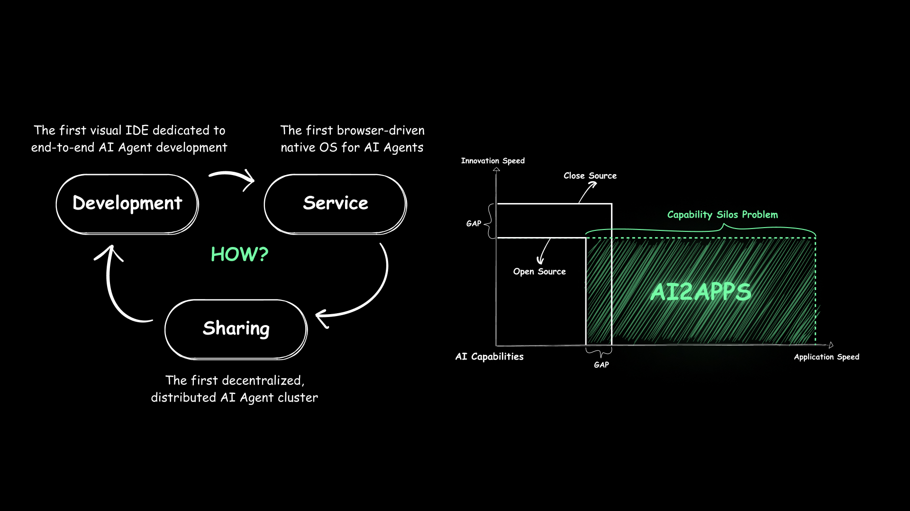

<div align="center"><a name="readme-top"></a>


<h1>AI2Apps</h1>

Developing, Serving, Sharing: An Open-Source Distributed PC-Side AI Agent Infrastructure

[English](./README.md) · 中文

</div>

## Overview

<div align="center">
  
</div>

> This project is the first fully open-source PC-side AI Agent application infrastructure, dedicated to solving the "AI capability silo" problem. By unifying the architecture, it connects fragmented AI capabilities into AI Agent applications, enabling users to access and flexibly combine the latest AI technologies at any time. 

> It covers the entire lifecycle from development, service, to sharing, supporting end-to-end autonomous encapsulation of user-specific AI capabilities through the browser. Whether for enterprise-level production needs or personal daily scenarios, customized AI applications can be rapidly implemented.

> Through this architecture, developers can seamlessly integrate AI capabilities from different sources without relying on closed cloud services or complex technology stacks, breaking down technical barriers. Meanwhile, community users can freely share and reuse AI capabilities across devices, promoting the democratization of AI technology.

<div align="center">
  
</div>

#### Developing

<div align="center">

[](https://youtu.be/seRTYtwgLrk)

</div>

#### Serving

<div align="center">

#### Spark TTS
[](https://youtu.be/b3Ym69arLGw)

#### 3D
[](https://youtu.be/DhERLlXPK6I)

### JiMengAI
[](https://youtu.be/p4cl-FNlW8I)

</div>

#### Sharing

<div align="center">

[](https://youtu.be/x-q4Jc4Zukc)

</div>

## 🖥 Environment Support

| Mac | Windows(Partial support) | Linux |

## 📦 Installation

For details about the installation, please see [user manual](https://github.com/continue-ai-company/AI2Apps-user-manual/blob/main/README.md).

## 💟 Getting help

If you encounter problems, you can seek help in the following ways.

1. [Feishu](https://applink.feishu.cn/client/chat/chatter/add_by_link?link_token=01ao0c08-31dd-4dcf-9947-d645796e2dae)
<div align="center">
  
</div>

2. [Discord](https://discord.gg/qgqeaWk62e)

## 📝 Citation

If you find our work useful for your research or application, please cite our paper [AI2Apps](https://arxiv.org/abs/2404.04902)
```
@article{pang2024ai2apps,
  title={AI2Apps: A Visual IDE for Building LLM-based AI Agent Applications},
  author={Pang, Xin and Li, Zhucong and Chen, Jiaxiang and Cheng, Yuan and Xu, Yinghui and Qi, Yuan},
  journal={arXiv preprint arXiv:2404.04902},
  year={2024}
}
```

<p align="right" >
  <a href="#readme-top">
    ↑ Back to Top ↑
  </a>
</p>