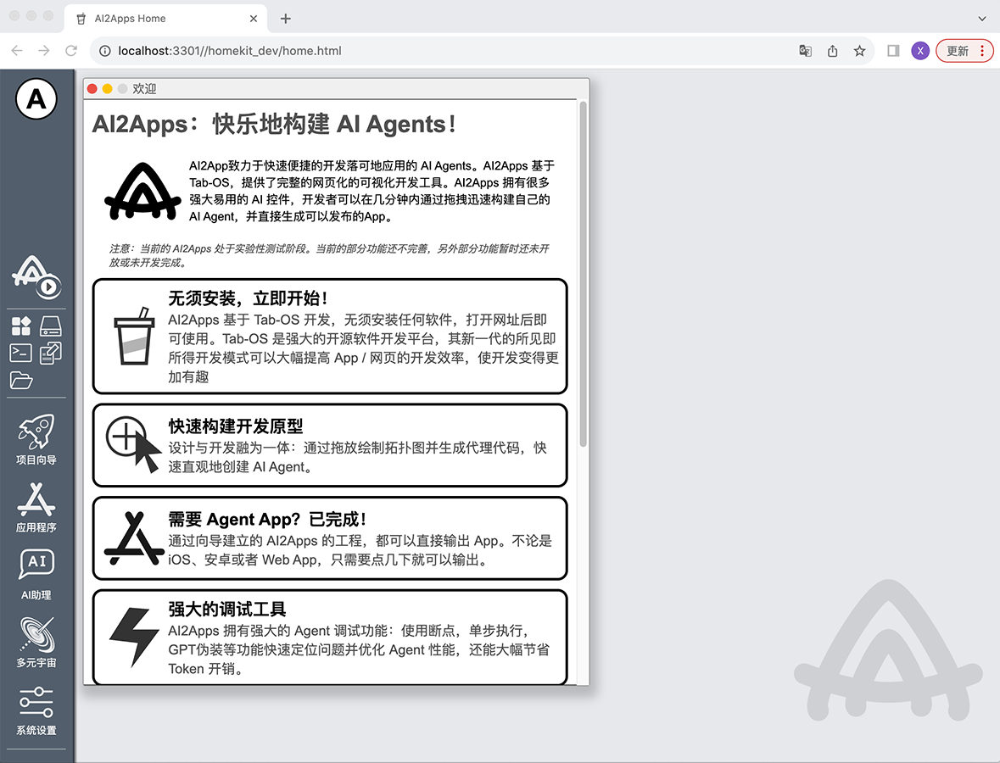
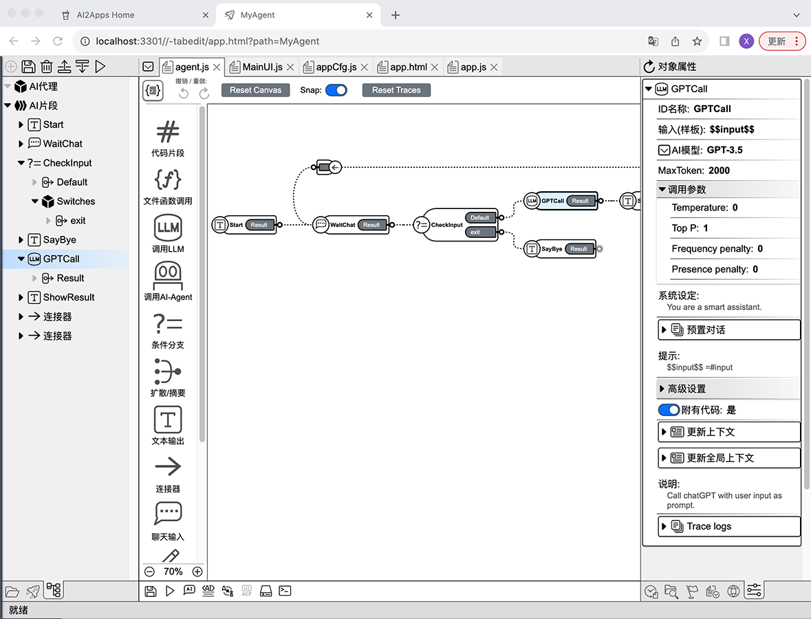
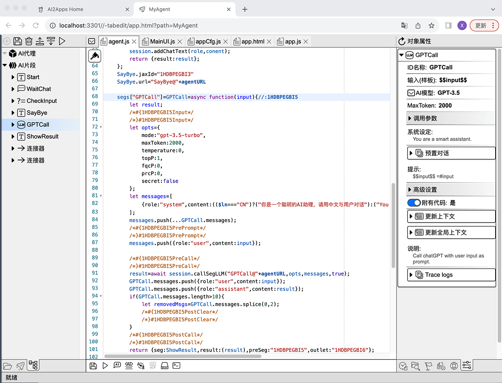
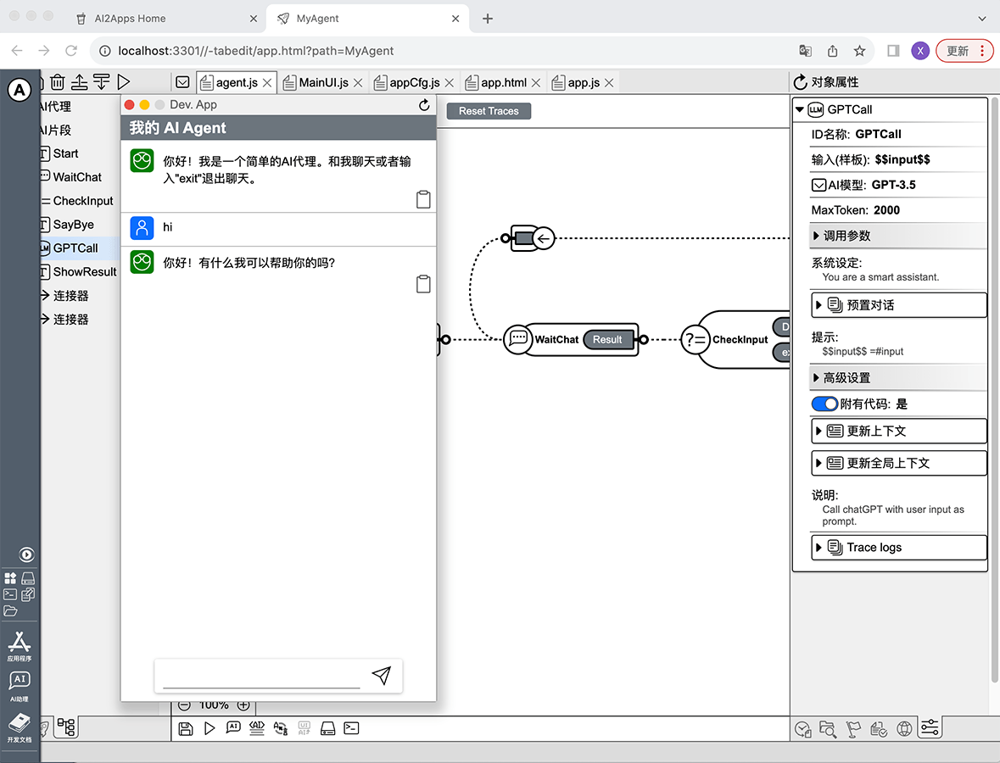
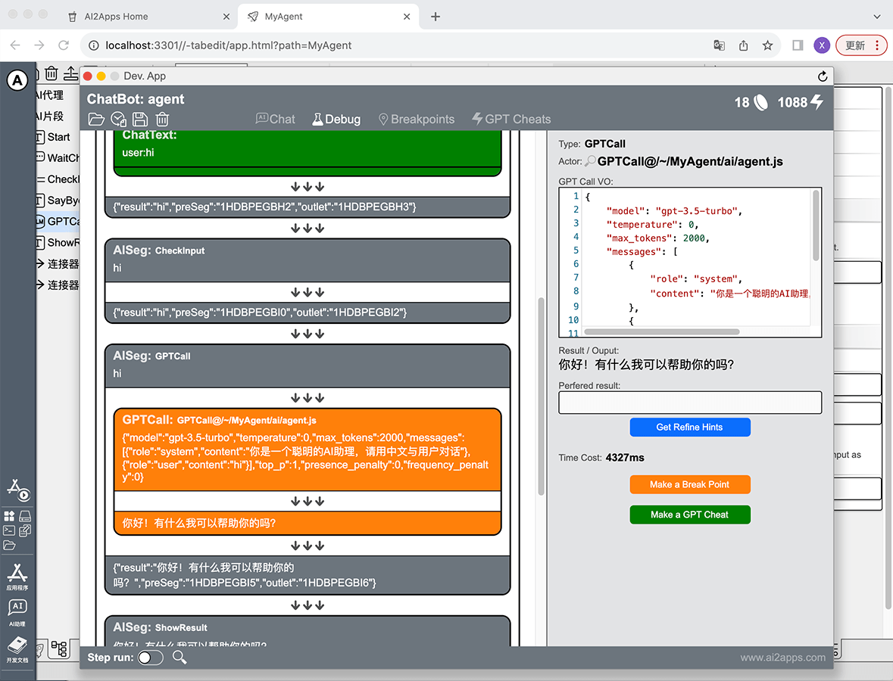
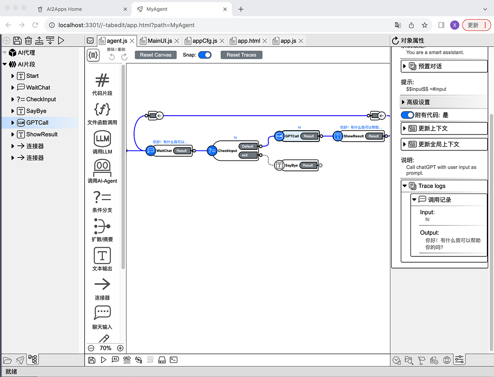

# AI2Apps 实验测试版说明

## AI2Apps概览
AI2App致力于快速便捷的开发落可地应用的 AI Agents。AI2Apps 基于 Tab-OS，提供了完整的网页化的可视化开发工具。
AI2Apps 拥有很多强大易用的 AI 控件，开发者可以在几分钟内通过拖拽迅速构建自己的 AI Agent，
并直接生成可以发布的App。 

## 快速开始
AI2Apps可以直接在网页中使用，也可以用本项目部署在本地使用。

### 1. 直接使用网页版
用桌面浏览器访问： [https://www.ai2apps.com](https://www.ai2apps.com)  
第一次打开网页会进行开发环境安装与配置，根据浏览器以及网络的不同，大概需要几秒到1分钟的时间。  
测试期间，要访问 AI 模型，需要注册并登录 Tab-OS（注册 Tab-OS 账号完全免费）。成功注册/登录后，
就可以使用项目向导就创建 AI Agent 项目了。

### 2. 部署本地环境
在本地环境下载本项目：
```
git clone https://github.com/Avdpro/ai2apps.git
```
编辑 `.env` 文件，配置正确的OpenAI Key以及服务端口，默认的端口是3015：
```
APIROOT=https://www.ai2apps.com/ws/
OPENAI_API_KEY=sk-XXXXXXXXXXXXXXXXXXXXXXXXXXXXXXXXXXXXXXXXXXXXXXXX
PORT=3015
```
启动服务：
```
node ./start.js
```
假设指定的端口是3015，则用浏览器打开:
`http://localhost:3015/`
与直接使用ai2apps.com一样，第一次访问会进行安装配置。  
  
  

这是成功启动后的AI2Apps桌面状态。点击左侧 Dock 中的"项目向导"开始创建 AI Agent项目。当前版本有几个可以选择的 AI Agent 项目模版。要创建最简单的 AI Agent，可以选择第一个模版："简单的 AI Agent 应用"开始。  
输入项目名称路径（例如：MyAgent）后，点击创建按钮，系统会创建并打开项目开发环境。  
  
  

## 使用 AI2Apps 开发的优势

#### **1. 设计即开发，快速构建开发原型**  
通过拖拽绘制拓扑图，快速设计 Agent 逻辑，拓扑图自动同步为 Agent 代码，节省大量编程时间。

#### **2. Agent 可直接打包为App使用**  
开发完成的 AI Agent 可以打包输出为独立的网页/移动App（目前支持iOS和安卓系统）。也可以作为 AI 扩展集成入
现有的网页/App，仅需几行代码就可以完成整合。  

#### **3. 强大的调试功能**  
AI2Apps 拥有强大的 Agent 调试功能：使用断点，单步执行，GPT伪装等功能快速定位问题并优化 Agent 性能，
能大幅节省开发的时间以及 AI 调用成本开销。

#### **4. 与用户更高效的交互**  
在大多数情况下，聊天并不是与用户交互的最佳方式。AI2Apps 在开发时支持菜单、按钮、图表等多种 UI 控件，可以让 Agent
像专业的 App 一样与用户交互。  

#### **5. 多语言支持**  
使用传统开发模式进行多语言支持开发总是很繁琐和无趣。在 AIApps 中借助 AI 的辅助，只需几下点击就可以完成整个 Agent 的
多语言开发，高效又有趣！  

### **6. 产品更容易维护**  
传统开发模式无法保证代码实现与原始设计的随时同步，设计文档在进行维护时经常不能作为有效的参考。
AI2Apps的"设计即开发"模式可以保证代码与设计随时同步，不会出现设计与实现脱节的情况。
与逐行阅读晦涩的代码相比，包含拓扑图的 AI Agent 代码在后期维护中的优势巨大，不仅可以清晰的掌握原有代码的
设计思路，还可以更迅速的定位代码问题。

#### **7. 通过插件扩展**  
AI2Apps 可以通过 Add-On 方便的进行功能扩展，开发者可以根据需要制作自己的插件。  
  

## 如何编写 Agent
在AI2Apps中，每个 Agent 是一个独立的js文件，拓扑图信息以注释的形式保存在文件末尾，
从而保证了设计与实现随时同步。  
Agent文件编辑界面有"代码"和"画布"两种模式，打开 Agent 后默认进入画布模式。

#### 画布模式
开发 IDE 在画布模式下：  
  
  


左侧是 Agent 的组织结构视图，这里显示 Agent 对象以及其包含的"执行片段"对象列表，点击项目可以选中对象。 
中间是 Agent 拓扑图画布，在这里可以通过拖拽创建"执行片段"对象，并通过拖拽把片段之间连接起来。  
右侧是对象属性编辑器视图，在这里会列出当前选中的对象的可编辑属性，例如调用 ChatGPT 时的模型选择、温度参数等。
 
#### 代码模式
开发 IDE 在代码模式下：  
  
  

左、右侧不变，依然是 Agent 的组织结构与对象属性编辑视图，中间部分则是 Agent 代码，
编辑 Agent 拓扑图以及对象属性时，代码会自动更新，开发者也可以自己手动编写代码实现可视化编辑无法完成的逻辑。

#### 运行 Agent

  

运行按钮在 IDE 左侧的组织结构栏和 IDE 底部的综合工具栏中。点击运行按钮即可以调试模式或者终端模式运行当前的 Agent 项目。
Agent 启动后，你可以通过对话测试 Agent。

#### 调试 Agent

  

以 Debug 模式启动 AI Agent 即进入调试模式。在调试模式中，点击 UI 顶部的"Debug"按钮就可以进入调试视图。  
**信息流及断点**   
调试视图左侧是信息流，在这里可以查看详细的对话流程，每一步进/出的内容。点击流程中步骤的的名字可以在右侧打开步骤的详细记录，并可以设置断点。  

**单步执行与断点操作** 
在 UI 底部可以打开单步执行功能，在单步执行 AI Agent 时或遇到断点时，调试器会暂停执行并向用户汇报当前步骤的执行信息，用户可以修改步骤的输入/输出信息查看不同的效果。  

**GPT Cheat**
在调试时可以使用GPT Cheat，点击调用 GPT 的步骤，可以在右侧的面板中添加 GPT Cheat。通过 GPT Cheat 可以用预先设置好的结果模拟（绕过）ChatGPT 调用，从而节省时间与成本。

**拓扑图追踪调试信息**

  


在调试 AI Agent 的过程中，Agent 的拓扑图会同步更新，标注执行调用的路径及各种参数传递的过程。
执行经过的路径会用加粗的蓝色曲线高亮显示，执行的输入输出则会在对象属性视图的**Trace Log**中列出。

### 能量及消耗
如果使用自己部署的AI2App环境并配置了 OpenAI Key，调用 ChatGPT 将使用开发者本人的 OpenAI 流量。
这种情况下系统不会有任何限制。   
如果使用的是www.ai2apps.com环境运行/调试 Agent，在执行ChatGPT调用时会产生由系统承担的 OpenAI 费用。
为了避免账单崩溃，系统通过"能量"限制用户对ChatGPT的调用量。  

### 获得能量
在成功注册登录 Tab-OS 后，用户会获得一定的免费能量，
每天登录后也会根据当前用户等级为用户补充一定的能量。推荐新成员用户成功也可以获得免费的系统代币，
可用于兑换能量。

## 发布 Agent
编辑好的 Agent 可以打包发布为网页或移动应用（iOS/安卓）。当前的AI2Apps测试版本并没有开放打包功能，
待系统更加完善稳定后，打包功能会在稍后的版本中会提供。 

## AI2Apps后续计划：
- 支持更多LLM模型，例如Llama-2、MPT、Falcon和Pythia
- 支持绘图 AI 模型
- 支持语言识别/合成 AI 模型
- 编程沙箱
- 浏览器插件开发
- 更多文档及例子
