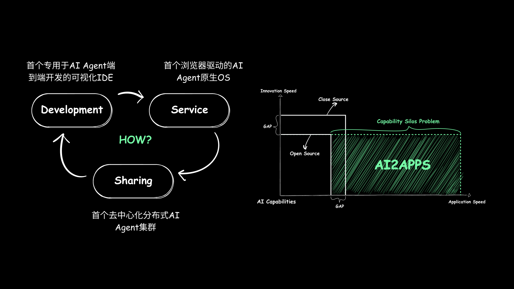

<div align="center">

  <a name="readme-top"></a>

  

  <h1>AI2Apps</h1>

  <div>开发、服务、共享：开源分布式 PC 端 AI Agent 基础设施</div>

  [English](./README.md) · 中文

</div>

## 🏠 概览

<div align="center">
  
</div>

> 本项目是首套完全开源的 PC 端侧 AI Agent 应用基础设施，致力于解决“ AI 能力孤岛”问题，通过统一架构将分散的 AI 能力连接起来变成 AI Agent 应用，让用户能够随时触及并灵活组合最新的 AI 技术。

> 它覆盖从开发、服务到共享的全链路，支持通过浏览器端到端自主封装用户所需的 AI 能力，无论是企业级生产需求还是个人日常场景，均可快速实现定制化 AI 应用。

> 通过这一架构，开发者无需依赖封闭的云服务或复杂的技术栈，即可将不同来源的AI能力无缝集成，打破技术壁垒。同时，社区用户可在端侧之间自由共享和复用 AI 能力，推动 AI 技术的民主化。

<div align="center">
  
</div>

#### 开发

<div align="center">

| [Automatic Deployment Video](https://youtu.be/seRTYtwgLrk) | 
|---|
|[](https://youtu.be/seRTYtwgLrk)|

</div>

#### 服务

| [Spark TTS Video](https://youtu.be/b3Ym69arLGw) | [3D Video](https://youtu.be/DhERLlXPK6I) | [JiMengAI Video](https://youtu.be/e5OaLM8qfGc) |
|---|---|---|
| [](https://youtu.be/b3Ym69arLGw) | [](https://youtu.be/DhERLlXPK6I) | [](https://youtu.be/e5OaLM8qfGc) |

#### 共享

<div align="center">

| [Tool Mart Video](https://youtu.be/x-q4Jc4Zukc) | 
|---|
|[](https://youtu.be/x-q4Jc4Zukc)|


</div>

## 🖥 兼容环境

- 推荐环境：Mac
- 兼容环境：Linux、Windows

## 📦 安装

详细安装步骤，请参考[用户手册](https://github.com/continue-ai-company/AI2Apps-user-manual/blob/main/README-zh_CN.md)。

## 💟 社区互助

如果您在使用的过程中碰到问题，可以通过下面几个途径寻求帮助。

1. [飞书群](https://applink.feishu.cn/client/chat/chatter/add_by_link?link_token=01ao0c08-31dd-4dcf-9947-d645796e2dae)
<div align="center">
  
</div>

2. [Discord](https://discord.gg/qgqeaWk62e)

## 📝 引用
如果您觉得我们的工作对您的研究或应用有帮助，请引用我们的论文： 
1. [AI2Apps](https://arxiv.org/abs/2404.04902?context=cs.SE)
2. [AI2Agent](https://arxiv.org/abs/2503.23948)

```
@article{pang2024ai2apps,
  title={AI2Apps: A Visual IDE for Building LLM-based AI Agent Applications},
  author={Pang, Xin and Li, Zhucong and Chen, Jiaxiang and Cheng, Yuan and Xu, Yinghui and Qi, Yuan},
  journal={arXiv preprint arXiv:2404.04902},
  year={2024}
}
```

## 🤝 贡献者

<a href="https://github.com/Callione" target="_blank">
  
</a>
<p></p>

<a href="https://github.com/jarlor" target="_blank">
  
</a>
<p></p>

<a href="https://github.com/pilgrim00" target="_blank">
  
</a>
<p></p>

<a href="https://github.com/shi0712" target="_blank">
  
</a>
<p></p>

<a href="https://github.com/zdq93" target="_blank">
  
</a>
<p></p>

<p align="right" >
  <a href="#readme-top">
    ↑ 返回顶部 ↑
  </a>
</p>


