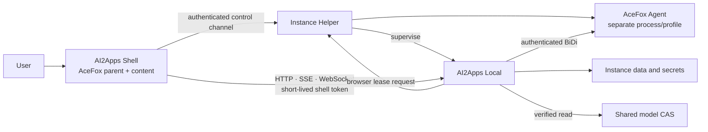

# AI2Apps AceFox 客户端产品定义、实现方案与开发计划

Status: End-to-end implementation baseline v0.4
Last updated: 2026-08-18
Target platform: macOS arm64 first
Related: [AI2Apps Platform Architecture](ai2apps-platform-architecture.md),
[Backend Development Plan](ai2apps-backend-development-plan.md),
[Electron Desktop Plan](ai2apps-electron-desktop-development-plan.md),
[Managed Browser Baseline](ai2apps-browser-agent.md),
[Runtime Isolation on macOS](ai2apps-package-runtime-isolation-macos-v1.md),
[Local Capability Sharing](ai2apps-local-capability-sharing-v1.md),
[Authority and Secret Baseline](security-authority-baseline.md)

## 1. 文档目的

本文定义基于 AceFox（定制 Firefox/Gecko）的 AI2Apps macOS 客户端，包括产品形态、
进程边界、启动与退出语义、多实例隔离、Local 端口管理、受管浏览器、跨实例调用、共享
模型缓存、实现拆分、测试要求和阶段性发布门槛。

本文是 AceFox 客户端路线的权威设计输入。现有 Electron Desktop 仍可作为原型、兼容客户端
或实现参考，但不再决定 AceFox 版 AI2Apps 的窗口、Helper、Local 生命周期和浏览器运行时架构。

### 1.1 当前实施状态（2026-08-18）

已经落地并通过本机端到端验证：

- Swift Package 客户端工程、版本化实例/配置/Runtime/运行描述/bootstrap 契约；
- AI2Apps Local 的 supervised 动态端口、原子运行描述和公开只读 bootstrap 接口；
- Local Supervisor 的固定端口冲突检查、启动探活、实例/boot/PID 校验、安全停止与 Helper 重启接管；
- 菜单栏 Helper 的配置端口/实际端口显示，以及启动、停止、重启、退出 Helper、彻底退出 Local；
- Helper 每实例单进程锁；
- Helper 的带 token、权限 `0600` 的 Unix Socket 控制通道；
- AceFox `--ai2apps-shell` 专用无 Tab/地址栏窗口、Loading、descriptor/bootstrap 校验和本地首页切换；
- Shell 模式原生 App 菜单收敛为 `AI2Apps / File / Edit / Window / Help`，独立 Agent 仍保留完整浏览器菜单；
- AI2Apps Launcher：启动 Helper、使用实例专属 Shell Profile，并以 AceFox 替换主进程；
- 可双击的开发版 `AI2Apps.app` 组装、临时签名和严格 bundle 校验；
- 自包含 Release App：内嵌 CPython 3.11、MLX Runtime 和当前 AI2Apps/oMLX 源码，不依赖开发环境；
- Runtime manifest 路径、大小、SHA-256、协议版本及可执行入口校验器，启动前 fail closed；
- 认证用户触发的独立 AceFox Agent；Profile ID 同时绑定实例与 actor，重复请求聚焦原进程；
- Agent 使用随机回环 BiDi 端口和 256 位凭证；AceFox WebSocket upgrade 强制 Bearer 认证；
- 无凭证连接被拒绝、带凭证 `session.status` 成功，以及同用户会话复用的端到端验证；
- Local `BrowserBackend` 已接入受保护的 AceFox BiDi，覆盖导航、Tab、快照、点击、输入、等待、截图、上传、下载和文章提取；
- Desktop Shell Session 使用 Helper 256 位凭证建立、5 分钟签名 HttpOnly Cookie，并绑定实例与 Local boot；
- Shell 特权请求拒绝浏览器 Origin，Local HTML 默认附加 CSP、Referrer Policy、nosniff、frame 和权限策略；
- Shell 每 2 秒校验 descriptor/bootstrap；Local boot 或动态端口变化后自动回到 Loading、换发会话并重连；
- 37 项 Swift 测试和 52 项 Shell/Agent/Local 认证 Python 聚焦回归测试通过；AceFox lint、增量编译通过；
- 本机 Release smoke 已验证 1.6 GB App、严格深度签名、零断链、内嵌 Runtime 进程和动态端口启动；
- 首次启动后再次验签通过，Runtime 保持零 bytecode 写入；Developer ID v3 的 532 MB 只读压缩 DMG 已通过完整校验。
- 三个实例已在不同动态端口并行运行，实例 A 凭证访问实例 B 的 Shell Session 明确返回 `401`；
- 实例配置、数据、运行描述、日志、下载和浏览器 Profile 根目录创建后统一收敛为 owner-only `0700`；
- Developer ID 显式嵌套签名和 Hardened Runtime 已打通；`allow-jit` 正确绑定 `acefox-bin`，启动后严格二次验签通过；
- Developer ID v3 App（实例 `developer-id-v3`）及 532 MB DMG 已签名并通过 CRC/严格深度验签；从只读挂载卷真实启动后，Helper/Local 分别为 PID `31892/31893`，Local 在动态端口 `50197` Ready。
- v3 DMG 的外部文件名保留版本号，但卷内产品名固定为 `AI2Apps.app`；从只读卷关闭 Shell PID `31891` 再打开后，新 Shell PID `31932` 复用原 Helper/Local 与端口，启动后再次严格验签通过。
- v3 Release 的默认模型模式已实测为 `isolated`，实例专属 Hugging Face Hub 与 HF Home 目录均以 `0700` 创建；先前 v2 Release 内 Agent 已完成 launch→release 实测（PID `62990`），沿用相同匿名 Profile 且 release 响应不泄露自动化凭证。
- v3 当前 Gatekeeper 结果符合未公证 Developer ID 预期：`source=Unnotarized Developer ID`；完成 Apple notarization/staple 前不作为面向最终用户的可分发包。
- 已新增 fail-closed 发布元数据生成器：先严格验证 App/DMG 签名、Bundle/签名身份和 Runtime manifest，再原子输出版本、架构、CDHash、Team、Hardened Runtime、公证状态、大小与 SHA-256；结果不含凭证/用户数据且拒绝覆盖。v3 元数据固定 DMG SHA-256 `74b9da1cb9352dccd7a0df8091b431f406e69773b0db06fd749700ea239bb068`，公证状态为 `not_stapled`。
- Developer ID v4 已把安全诊断摘要纳入实际发布包，使用独立 Build Number `2193`；App/DMG/发布元数据位于 `.build/artifacts/developer-id-v4/`，DMG SHA-256 为 `187e7bf9128170b0ae998a6f8b5d4915a2ecacbf86cec213f2fb98ded4c58920`。
- v4 从只读 DMG 真实启动到动态端口 `55275`：关闭 Shell PID `99741` 后 Helper/Local PID `99742/99743` 保持 Ready，重新打开得到 Shell PID `99797` 且复用原后端；启动后二次严格验签通过。
- v4 运行审计发现 objdir 开发 bundle 会让 Gecko 内容进程携带源码/objdir `-sbTestingReadPath`；v4 因此被 v5 取代，不作为分发候选。打包器和独立 App 验证器现均强制要求 Gecko 与 browser 两个 `omni.ja`，objdir 输入会 fail closed。
- Developer ID v5 改用 `mach package` DMG 内的 packaged AceFox，Build Number `2194`；真实内容进程使用 `-greomni/-appomni` 且不再带任何 `-sbTestingReadPath`。从只读 DMG 启动到端口 `58092`，Shell `52454` 退出后 Helper/Local `52456/52457` 持续，新 Shell `52528` 复用后端，二次验签通过。
- v5 App/DMG/发布记录位于 `.build/artifacts/developer-id-v5/`，DMG SHA-256 为 `07df7fdd5f7f57f7708612f04377059c411e64d6ee35b0dbbe7cf42dc793dc16`；独立验证器已通过真实工件，并拒绝仅篡改一位 SHA-256 的记录。
- Helper 已支持生产包内无参数自举：从自身嵌套位置反向验证主 App、签名 `AI2AppsInstanceID`、内嵌 Runtime 和 AceFox；生产包中的 CLI/环境路径覆盖会 fail closed。主 App 与 Helper 的最低系统版本现统一为 macOS 13.0。
- Developer ID v8（Build Number `2197`）已内嵌实例专属 LaunchAgent plist，并使用 `SMAppService.agent(plistName:)` 管理。安装到用户 Applications 的 APFS 克隆实测注册后由 launchd 管理，状态为 `enabled`；将 `start_at_login` 改为 false 后状态变为 `not_registered`，对应 LaunchAgent 从用户域移除。
- v8 Helper 将登录项状态以 `0600` 写入 `run/login-item.json` 并在托盘明确显示。只读 DMG 实启时状态为 `skipped_read_only`，不会从临时挂载路径注册服务；Helper/Local 仍正常 Ready（动态端口 `50418`），启动后二次严格验签通过且 launchd 中不存在该实例服务。
- v8 App/DMG/发布记录位于 `.build/artifacts/developer-id-v8/`，DMG SHA-256 为 `4b65f63efdf0f75f27fff7e1d6901d5de0692e21670b532912df04931f5b1528`；当前 Gatekeeper 唯一拒绝原因仍为 `Unnotarized Developer ID`，与发布记录的 `not_stapled` 一致。
- Developer ID v9（Build Number `2198`）在 Helper 菜单增加可勾选的“登录时启动”，并由签名 Launcher 的 `--update-login-item-only` 独立模式应用配置，不会启动第二个 Shell、Helper 或 Local。安装副本实测从 `enabled` 切换到 `not_registered` 后，原 Shell PID、Local PID/boot/端口 `53681` 均保持不变，LaunchAgent 已从 launchd 用户域移除；切换后二次严格验签通过。
- v9 自身的只读 DMG 已再次实启，登录项状态为 `skipped_read_only`，Helper/Local 在动态端口 `54776` Ready，系统中无该实例 LaunchAgent，启动后二次验签通过。v9 App/DMG/发布记录位于 `.build/artifacts/developer-id-v9/`，DMG SHA-256 为 `637ad61bd1119231600008399bdbae338c4ca3b1d95d7b8125154b5a8090319d`，公证状态仍为 `not_stapled`。
- Helper 会以 `0600` 原子发布版本化 `helper.json` 启动阶段；Loading 页显示稳定状态/错误码，并在故障时提供实例日志入口。
- Helper 托盘新增“打开 AI2Apps”：Launcher 将已验证的绝对 `.app` 路径传给常驻 Helper，主 Shell 退出后可重新拉起同一实例，并复用原 Helper/Local。
- Helper 托盘新增“导出安全诊断摘要”：仅输出有界的实例/版本/系统/阶段/端口/缓存模式/PID/boot ID/Agent 数量元数据，文件与目录分别为 `0600/0700`；不包含日志正文、Prompt、Token、Cookie、Authorization 或 actor 原文。
- Helper 已实现受管 Agent 实时进程回收与异常退出恢复；同一 actor 再次请求会使用相同匿名 Profile ID 启动新进程。
- Agent 的 launch/focus/exit/terminate 事件以 `0600` 追加写入实例审计日志，不记录 actor 原文、Bearer 凭证或 Authorization；Helper 正常退出会终止受管 Agent，但 Local 继续运行。
- 固定端口冲突已完成双实例实测：B 争用 A 的 `64321` 时以稳定 `port_conflict` fail closed，A 的 PID/监听保持不变；B 改为 `64322` 后两个实例同时 Ready。
- 模型下载缓存新增显式 `isolated/shared` 模式，旧配置默认 `isolated`；Helper 显示并可切换模式，切换后重启 Local。
- 共享模式只复用 Hugging Face Hub 下载工件；HF Home/Token、数据库、配置、浏览器数据和推理/KV Cache 仍按实例隔离，并清除父进程继承的 HF 凭证/缓存变量。
- 共享 Hub 快照发布新增按 `repo_id/revision` 派生的跨进程文件锁，锁目录/文件固定为 `0700/0600`；16 路并发导入只发布一个完整快照且不残留 partial 目录。
- 已发布共享快照在复用前会按 pinned tree 逐文件复验 SHA-256/Git Blob 摘要；完整快照的底层 Blob 被篡改后会 fail closed，不再把“文件齐全”视为可信。
- Agent 新增认证且幂等的 `browser.release`：Local BrowserBackend 关闭时主动释放对应 actor，响应不返回 BiDi 地址/凭证；真实进程 `95013` 已验证 launch→release→exit，重复 release 返回 `not_running`。
- release 审计记录匿名 Profile ID、PID 与结果；真实验收日志覆盖 `browser.release/terminate_requested`、`browser.exit/status_15` 和幂等 `not_running`。

主窗口重开 smoke 已验证：Shell PID `63615` 退出后 Helper/Local PID `63617/63619`
继续运行；重新打开同一 App 后新 Shell PID `63656` 启动，Helper PID 和 Local PID/端口
`63648` 均保持不变。

重连 smoke 已验证 Local 从 PID/端口 `21298/51882` 自动恢复到
`21452/52941`，主窗口无需重启即进入新 Origin；重连前后原生菜单均保持
`AI2Apps / File / Edit / Window / Help`。

下一开发切片：

- 将已完成的 Agent lease TTL/renewal 纳入下一签名候选并执行真实到期/暂停/恢复 smoke；
- 完成 Apple 公证、staple、干净 Mac Gatekeeper 验收和更新通道；
- 用显式迁移工具迁移当前 DeepSeek-V4-Flash 与 Qwen3.8-27B-NVFP4，不提供旧缓存自动接管；
- 落地每实例 App Sandbox 容器和只代理模型不可变对象的窄权限 Cache Broker，并完成同一 macOS 用户攻击面验收；
- 补齐真实多 App 安装/升级、并发下载、磁盘耗尽和回滚验收矩阵。

## 2. 决策摘要

第一阶段确认以下产品与技术决策：

1. 最终面向用户的发行物是一个 `AI2Apps.app`；
2. `AI2Apps.app` 使用 AceFox/Gecko 作为 UI Shell，但主窗口不呈现 Tab、地址栏、导航栏和
   其他通用浏览器 Chrome；
3. App 启动后立即显示包内置 Loading 页面，确保 Local 尚未启动时也有可用 UI；
4. 菜单栏 `AI2Apps Helper` 是 Local 生命周期的唯一桌面控制方，负责启动、停止、重启、
   状态恢复、端口配置、日志和诊断；
5. Local Ready 后，主窗口在同一个内容容器中从 Loading 页面切换到 AI2Apps 本地首页，
   不打开普通 Firefox Tab；
6. 退出 AI2Apps 主窗口或主进程，不退出 Helper 和 Local；
7. Helper 可单独停止、启动、重启或彻底退出 Local；
8. 需要网页操作时，由 Local Browser Service 请求启动独立 AceFox Agent 进程；Agent 使用
   与当前 AI2Apps 实例和用户绑定的持久 Profile；
9. AI2Apps Shell 和 AceFox Agent 必须进程隔离、Profile 隔离；Shell 永远不开放远程控制端点；
10. 同一台 Mac 可安装和运行多个 AI2Apps App 实例；每个实例拥有独立身份、Helper、Local、
    端口、数据、密钥、日志和浏览器 Profile；
11. 每个实例的 Local 端口由自己的 Helper 配置并明确显示，支持固定端口和自动端口；
12. AceFox Agent 使用 Helper 强制执行的 30 分钟空闲租约；自动化活动续期，人工接管期间
    暂停，恢复自动化后重新起算，会话关闭立即释放；
13. 同一 macOS 用户下的多 App 强隔离采用每实例 App Sandbox/独立容器；跨实例共享模型
    仅经窄权限 Cache Broker，不共享数据库、凭证或可变推理状态；
14. 当前尚未公开发布，不支持旧全局缓存自动接管；只对明确列出的现有模型执行
    repo/revision 校验后的手动迁移；
15. Developer ID 候选获准提交 Apple notarization；只有 stapled、Gatekeeper 和发布记录
    全通过的工件才能进入公开更新通道；
16. `127.0.0.1` 和端口号不是安全边界；Shell、Helper、Local 和跨实例请求均需显式认证；
17. 不同实例默认互不信任，只能通过明确授权的网络能力协议互相调用；
18. 实例可共享按内容寻址、不可变并经过摘要校验的模型 Blob Cache；配置、密钥、会话、
    推理结果和浏览器数据不得共享；
19. 生产版只运行预构建、签名、可校验的 Runtime，不在用户设备执行 `uv sync`、`pip install`
    或源码编译；
20. AI2Apps Local 继续作为 App、Agent、Session、Service、Capability、数据和审计的权威后端，
    AceFox Shell 不复制领域模型。

## 3. 产品定义

### 3.1 用户看到的产品

用户安装并打开一个 `AI2Apps.app`。正常使用时它表现为桌面 App，而不是浏览器：

- 单一主窗口；
- 无 Tab、地址栏、前进后退和书签栏；
- 启动过程有明确进度、错误和恢复入口；
- Local Ready 后显示统一 AI2Apps Web Shell；
- 菜单栏图标持续显示 Local 状态和端口；
- 关闭主窗口不影响后台 Agent、Local 服务或模型任务；
- 需要用户登录网站或接管网页时，出现独立、可识别的 AceFox 浏览器窗口。

### 3.2 逻辑组件

```text
AI2Apps.app
├── AI2Apps Shell
│   ├── AceFox/Gecko 内核
│   ├── App 风格单窗口
│   ├── 包内 Loading 页面
│   └── Local Web Shell 内容容器
├── AI2Apps Helper.app
│   ├── 菜单栏 UI
│   ├── Local Supervisor
│   ├── Runtime Manager
│   └── Browser Process Launcher
├── AI2AppsHost
│   └── 受管 AI2Apps Local Runtime
└── AceFox Agent Runtime
    └── 独立进程和用户 Profile
```

### 3.3 第一阶段非目标

- 用 Gecko 前端重写 AI2Apps Web Shell；
- 让网页内容直接访问文件系统、Keychain、Shell 或任意 XPC 服务；
- 让主窗口的浏览器会话承担 Agent RPA；
- 通过隐藏 CSS 把普通 Firefox 窗口伪装成 App；
- 让多个实例共享数据库、Cookie、Secret、Agent Memory 或浏览器 Profile；
- 无授权扫描和调用其他本机 AI2Apps 实例；
- 在第一版完成 Windows/Linux AceFox Shell；
- 第一版即提供强隔离 Model Cache Broker；第一版允许经过校验的共享 CAS 目录实现。

## 4. 进程与信任边界



边界规则：

- Shell 父进程只暴露最小、结构化的特权接口；
- Shell 内容进程只加载受信的包内页面或当前实例的 Local Origin；
- Helper 只管理自己的实例，不读取其他实例的数据；
- Local 不因来自 loopback 就信任请求；
- AceFox Agent 不继承 Shell Profile、Cookie、Local Token 或特权通道；
- 共享 Cache 只包含可验证、不可变的内容 Blob。

## 5. macOS 包结构

```text
AI2Apps.app/
└── Contents/
    ├── Info.plist
    ├── MacOS/
    │   └── AI2Apps
    ├── Frameworks/
    │   └── Gecko and signed dependencies
    ├── Library/
    │   ├── LoginItems/
    │   │   └── AI2Apps Helper.app
    │   └── Helpers/
    │       └── AI2AppsHost
    └── Resources/
        ├── ai2apps-shell/
        ├── runtime-manifest.json
        ├── runtime-seed/
        └── browser-runtime-manifest.json
```

Helper 使用 `SMAppService` 注册。主 App、Helper、Host 和可选嵌套 Agent App 必须统一完成
Developer ID 签名、Hardened Runtime 配置和公证验证。

当前 macOS 13+ 实现使用位于 `Contents/Library/LaunchAgents/` 的实例专属 plist 与
`SMAppService.agent(plistName:)`。LaunchAgent 的 label 与主 App Bundle ID 绑定，
`BundleProgram` 指向嵌套 Helper，`RunAtLoad=true`，并仅在 Helper 异常退出时由
`KeepAlive.SuccessfulExit=false` 重启。只读 DMG 不注册；用户关闭“登录时启动”后注销服务，
但当前会话所需的 Helper 仍可由 Launcher 显式启动并安全接管已有 Local。

第一版默认复用 `AI2Apps.app` 内的 Gecko 二进制启动独立 Agent 进程，避免重复携带完整浏览器
资源。如果产品要求 Agent 在 Dock、菜单和进程列表中具有独立的 AceFox 名称、图标和 Bundle
Identity，可在后续引入嵌套的 `AceFox Agent.app`。

## 6. Shell 实现

### 6.1 专用 Shell 模式

AceFox 增加专用启动模式，例如：

```text
--ai2apps-shell
--ai2apps-instance <instance-id>
```

Shell 使用专门的受信窗口，而不是普通 Firefox Browser Window。候选内部入口：

```text
chrome://ai2apps/content/shell.xhtml
about:ai2apps-loading
```

Shell Window 只包含一个远程内容 `<browser>`，不创建 `gBrowser` Tab 模型，不加载 URL Bar、
书签、扩展工具栏和浏览器菜单。禁止网页通过快捷键、窗口恢复或异常导航重新显示普通浏览器
Chrome。

### 6.2 Loading 页面

Loading 页面必须随 App 打包，可在完全离线且 Local 不存在时运行。它显示：

- 当前实例名称；
- Helper 连接状态；
- Runtime 检查、迁移和 Local 启动阶段；
- 配置端口和实际端口；
- 启动耗时；
- 可恢复错误、重试、打开日志和诊断入口；
- Runtime 安装或更新进度。

网页内容不得直接启动 Python、执行 Shell 或读取进程。Loading 页面通过受限父进程桥接读取
Helper 发布的结构化状态。

### 6.3 Ready 切换

Local 同时满足以下条件后才可进入 Ready：

1. 进程存活；
2. loopback 监听成功；
3. `/health` 成功；
4. Platform 存储迁移完成；
5. bootstrap capability/version handshake 成功；
6. Helper 成功签发 Shell Session；
7. 返回的 Installation/Instance Identity 与当前 App 一致。

Ready 后在同一个内容容器中导航至 Local Shell URL。不得先关闭 Loading 窗口再创建普通浏览器
窗口，以避免闪烁、状态丢失和浏览器 Chrome 暴露。

### 6.4 导航策略

- 只允许当前实例的精确 Local Origin 和包内 `about/chrome` 入口；
- 外部 HTTP(S) 链接通过用户确认后交给系统默认浏览器或受管 AceFox Agent；
- 拒绝 `file:`、`javascript:`、任意扩展页和未知特权协议；
- 新窗口请求默认拒绝或路由回同一 Shell；
- 下载、文件选择和通知通过最小特权桥接完成；
- 第二次启动只聚焦现有窗口并处理受信 deep link。

## 7. Helper 与 Local 生命周期

### 7.1 Helper 职责

Helper 是本实例 Local 的生命周期所有者，负责：

- 注册登录项和菜单栏；
- 读取实例级 Local 配置；
- 定位并校验 Runtime；
- 启动、停止、重启和重新接管 Local；
- 检测端口冲突但不终止占用者；
- 健康检查、崩溃恢复和指数退避；
- 发布结构化启动状态；
- 维护日志、诊断和当前运行描述；
- 启动独立 AceFox Agent 进程；
- 执行 Runtime 更新、回滚和完整性验证。

### 7.2 状态机

```text
stopped
  -> validating_runtime
  -> starting
  -> migrating
  -> ready
  -> degraded / unresponsive
  -> stopping
  -> stopped

starting / ready -> failed -> restart_backoff -> starting
```

主动“停止 Local”必须关闭自动崩溃重启，直到用户再次启动；异常退出才进入 backoff。

### 7.3 退出语义

| 用户操作 | Shell | Helper | Local |
| --- | --- | --- | --- |
| 关闭主窗口 | 关闭窗口 | 保留 | 保留 |
| 退出 AI2Apps 主程序 | 退出 | 保留 | 保留 |
| Helper：停止 Local | 不强制退出 | 保留 | 停止 |
| Helper：重启 Local | 可显示重连页 | 保留 | 重启 |
| 退出 Helper | 不影响 | 退出 | 默认继续 |
| 彻底退出 AI2Apps Local | 可退出或离线 | 退出 | 停止并关闭自动启动 |

Helper 重启后必须重新接管仍在运行的 Local，不重复启动第二份 Host。

### 7.4 运行描述

每个实例维护权限为当前用户可读的原子描述文件：

```text
~/Library/Application Support/AI2Apps/instances/<instance-id>/run/local.json
```

```json
{
  "schema_version": 1,
  "instance_id": "customer-a",
  "pid": 12345,
  "configured_port": 18431,
  "actual_port": 18431,
  "boot_id": "random-uuid",
  "runtime_version": "1.2.0",
  "started_at": "2026-08-17T13:00:00Z"
}
```

接管时校验 canonical data root、instance identity、PID、进程签名、boot ID 和健康响应。
认证根密钥和长期 Token 不写入该文件。

## 8. Local 端口配置

### 8.1 菜单栏显示

Helper 必须始终明确显示：

```text
● 运行中
实例：customer-a
地址：127.0.0.1:18431
版本：1.2.0
```

停止、启动和故障状态分别显示配置端口、实际端口或冲突信息。提供“复制 Local 地址”和
“端口设置…”入口。

### 8.2 端口模式

- `fixed`：使用用户配置的端口；
- `automatic`：绑定 `127.0.0.1:0`，由操作系统选择可用端口；
- `temporary fallback`：固定端口冲突时，经用户选择只在本次启动使用其他端口。

默认采用自动模式。绑定地址第一版固定为 `127.0.0.1`；LAN Sharing 使用独立 listener 和
现有 Capability Sharing 策略，不通过修改 Local 管理端口实现。

实例配置示例：

```json
{
  "schema_version": 1,
  "bind_address": "127.0.0.1",
  "port_mode": "fixed",
  "configured_port": 18431,
  "start_at_login": true,
  "auto_restart": true
}
```

### 8.3 冲突与修改行为

- 固定端口被占用时 fail closed，不杀进程、不静默换端口；
- Helper 显示占用进程或已验证的 AI2Apps 实例信息；
- 修改端口需要明确提示 Local 重启和任务中断风险；
- 配置原子落盘，重启失败时允许恢复旧端口；
- Shell 始终从 Helper 获取本次 actual origin，不缓存固定 URL；
- 端口不是授权凭证，复制地址不会授予 API 权限。

## 9. 多 AI2Apps 实例

### 9.1 实例身份

同一台 Mac 可以存在多个独立打包的 AI2Apps App。每个实例必须具有唯一：

- `CFBundleIdentifier`；
- `instance_id` / `local_security_identity`；
- Helper Bundle ID 与 Mach/XPC Service 名称；
- Application Support、Caches 和 Logs 根目录；
- Keychain namespace；
- Local API 和 Shell Session 密钥；
- AceFox Profile 根目录；
- URL Scheme 或 Universal Link 路由身份。

不能把相同 Bundle ID 的 App 副本当作独立实例，因为 LaunchServices、`SMAppService`、Keychain
和 Helper 注册会冲突。实例应由构建/发行系统生成独立的签名身份和不可变 manifest。

### 9.2 数据布局

```text
~/Library/Application Support/AI2Apps/instances/
├── customer-a/
│   ├── config/
│   ├── data/
│   ├── runtime/
│   ├── logs/
│   ├── run/
│   ├── downloads/
│   └── browser-profiles/
└── customer-b/
    └── ...
```

数据库、Secret、配置、任务、日志、下载临时文件、Cookie、Agent Memory 和 Profile 不共享。
两个实例即使绑定同一个 AI2Apps Cloud 用户，也保持独立 Local Installation 和本地授权域。

模型下载缓存使用显式 `model_cache_mode`：

- `isolated`（默认）：`~/Library/Caches/AI2Apps/instances/<instance>/model-weights/`；
- `shared`：仅将 Hugging Face Hub 工件指向
  `~/Library/Caches/AI2Apps/shared/model-weights/huggingface/hub/`；
- 两种模式下 `HF_HOME`、`HF_TOKEN_PATH` 均位于实例自己的 `data/huggingface/`，Helper 启动
  Local 前移除继承的 HF Token 与 Cache 变量；
- SSD prompt/KV、视觉特征、响应状态等运行期 Cache 不进入共享根；
- 共享工件仍按不可信输入处理，后续以固定 revision、内容 manifest 和回收 Broker 完成完整性闭环。

当前实现会以 `0700` 创建每个实例的私有目录，这可以阻止其他 macOS 用户读取，但不能阻止同一
登录用户下的另一个普通进程直接读取。因而 `0700` 是最小文件权限基线，不等同于严格的同用户
进程隔离。公开发布前必须再引入 App Sandbox 与独立容器、受限文件 Broker，或等价的密钥封装与
访问控制；在该门槛完成前，文中“严格隔离”只对协议凭证、端口、Cookie、Profile 和逻辑数据域成立。

### 9.3 Localhost 安全

`127.0.0.1` 上的其他进程可以发现端口，因此每个实例必须：

- 在 Keychain 保存独立根密钥；
- 由 Helper 为 Shell 签发短期、限定 audience/scope 的 Session；
- 对 HTTP、SSE 和 WebSocket 执行一致认证；
- 严格校验 scheme/host/port Origin；
- 防止 DNS rebinding；
- 令牌绑定 instance identity、boot ID 和过期时间；
- 禁止通过 query string、日志或诊断输出长期凭证。

### 9.4 Helper 拓扑

严格隔离模式下，每个实例携带并运行自己的 Helper，Helper 只管理自己的 Local。未来若引入
全局 Discovery Broker，Broker 只能发布公开实例元数据和协助交换授权证明，不能读取实例数据、
Keychain、Profile 或管理 Token。

## 10. AceFox Agent 浏览器

### 10.1 启动与 Profile

当 Agent 需要浏览器能力时：

```text
AI2Apps Local Browser Service
  -> authenticated request to instance Helper
  -> Helper starts AceFox Agent process
  -> Local establishes authenticated BiDi session
```

Profile 路径同时绑定实例和当前 principal：

```text
browser-profiles/<instance-id>/<principal-id>/default
```

候选启动参数：

```text
-no-remote
-profile <profile-path>
--remote-debugging-port 0
--ai2apps-agent
--ai2apps-instance <instance-id>
```

### 10.2 安全规则

- Shell Profile 永不用于 Agent；
- Shell 进程永不开放 WebDriver/BiDi；
- 一个 Profile 同时只允许一个浏览器 owner lease；
- Helper 维护的运行进程表必须在 Agent 退出时立即回收；同一 principal 后续请求使用相同匿名 Profile ID 启动替代进程；
- Helper 正常退出时终止其受管 Agent，但不终止 Local；Agent 自身崩溃不得带走 Helper、Local 或 Shell；
- launch、focus、exit 和 terminate 写入实例级 owner-only 审计日志，禁止记录 principal 原文和任何控制凭证；
- Local 会话关闭通过认证 `browser.release` 主动回收对应 Agent；操作幂等，release 响应不得返回自动化凭证；
- BiDi 使用随机 loopback 端点，并增加 AceFox nonce/握手认证；
- Agent Token 绑定 instance、principal、browser session 和启动 boot ID；
- Local-B 不得连接 Agent-A，即使知道端口；
- 密码、OTP、CAPTCHA、支付和敏感确认继续沿用 `user_required` 与 `commit` 基线；
- 用户接管期间暂停 Agent 读取、截图和交互；
- 发布、发送、购买、删除等动作仍需 `browser.commit`。

### 10.3 后端适配

将现有 Chrome 直连实现抽象为 `BrowserBackend`，至少提供：

```text
ChromeBrowserBackend
AceFoxBrowserBackend
```

现有 `BrowserManager` 的 Session 所有权、用户接管和操作审计语义保持不变。AceFox 自定义
BiDi 命令只能作为适配层能力，不绕过 Platform capability policy。

## 11. 跨实例调用

不同 AI2Apps 实例默认互不信任。跨实例只能通过显式 Capability Export 和 Peer Grant 发生，
复用现有 Local Capability Sharing 的“默认不导出、独立凭证、可撤销、可审计”原则。

Grant 至少绑定：

```json
{
  "caller_instance": "customer-a",
  "callee_instance": "customer-b",
  "capabilities": ["app.catalog.read", "app.invoice.search"],
  "background_allowed": false,
  "expires_at": "2026-09-01T00:00:00Z"
}
```

要求：

- 实例发现不等于授权；
- 首次调用显示来源、目标、能力范围和持续时间；
- 支持允许一次、持续允许、拒绝和撤销；
- 双方记录不含正文和 Secret 的审计元数据；
- 禁止转授权，除非 Grant 显式允许；
- 浏览器控制、Secret、Terminal 和系统管理能力默认不可跨实例导出；
- 第一版可以使用认证 HTTP，后续可增加本地 XPC/Unix Socket Broker。

## 12. 共享模型 Cache

### 12.1 可共享内容

多个实例可以共享模型权重和其他大体积、不可变、可按摘要验证的 Blob：

```text
~/Library/Caches/AI2Apps/model-cas/sha256/<prefix>/<digest>
```

每个实例保留自己的模型安装 manifest、启用状态、Provider 配置、License 接受状态和 Runtime
选择；共享 Cache 只负责字节去重。

### 12.2 CAS 规则

- Blob 以 SHA-256 或更强摘要寻址；
- 下载先进入实例独立临时目录；
- 完成后校验来源 manifest、长度和摘要；
- 使用原子 rename 写入 CAS；
- 完成 Blob 不允许原地修改；
- 每次加载前重新验证摘要或可信验证记录；
- 并发下载使用 digest 级锁和崩溃恢复；
- 清理器不得删除仍被实例引用或正在映射的 Blob；
- Cache 中禁止存储凭证、Prompt、输出、会话、日志和可执行配置。

### 12.3 安全级别

第一版可以采用共享 CAS 目录并在消费时重新校验，防止一个实例通过同名文件替换影响其他
实例。若威胁模型要求“一个实例完全被攻破后仍不能删除或损坏其他实例可用的 Cache”，则升级
为独立 Model Cache Broker，由 Broker 持有写权限并向实例发放只读文件描述符。

## 13. Helper 菜单定义

建议菜单：

```text
AI2Apps Local
────────────────────────
● 运行中
实例：customer-a
地址：127.0.0.1:18431
版本：1.2.0

打开 AI2Apps
复制 Local 地址
端口设置…

启动 Local
停止 Local
重启 Local

浏览器 Agent 状态
查看日志
运行诊断
────────────────────────
登录时启动
退出 Helper
彻底退出 AI2Apps Local
```

“退出 Helper”和“彻底退出”必须使用不同文案和确认行为，避免用户误以为关闭菜单栏图标会停止
Local，或误操作中断后台任务。

## 14. Shell、Helper 与 Local 协议

### 14.1 Helper 控制面

优先采用 XPC/Mach Service；开发阶段可采用权限为 `0600` 的 Unix Domain Socket。候选操作：

```text
GetInstanceInfo
GetLocalStatus
StartLocal
StopLocal
RestartLocal
UpdatePortConfiguration
SubscribeLifecycleEvents
CreateShellSession
OpenLogs
RunDiagnostics
LaunchBrowserAgent
StopBrowserAgent
```

每个请求验证调用方签名、实例身份和操作权限。网页内容不能获得通用控制通道。

### 14.2 Local bootstrap

Local 提供版本化 bootstrap 响应，例如：

```text
GET /v1/platform/client/bootstrap
```

返回：

```json
{
  "api_version": 1,
  "instance_id": "customer-a",
  "installation_id": "...",
  "boot_id": "...",
  "shell_url": "http://127.0.0.1:18431/app",
  "product_version": "1.2.0",
  "capabilities": ["shell", "browser.agent"]
}
```

Helper 和 Shell 验证该响应后才能进入 Ready。

### 14.3 Runtime 位置与更新

签名 App 内的 seed Runtime 只读。可更新 Runtime 安装到：

```text
~/Library/Application Support/AI2Apps/instances/<instance-id>/runtime/<version>/
```

Runtime manifest 包含版本、平台、架构、入口、文件摘要、签名、最低 Shell/API 版本和回滚信息。
Helper 在切换 current Runtime 前完成完整验证；失败则保留上一个可启动版本。

## 15. 可复用的现有实现

### 15.1 AI2Apps 后端

- 继续使用现有 Web Shell 和 App/Agent/Session/Service 数据模型；
- 继续使用 BrowserManager 的单 Session owner 和用户接管机制；
- 继续使用 Capability、ownership、Local identity、Origin 和审计基线；
- 继续使用 Local Capability Sharing 的 Export/Grant 原则实现跨实例调用；
- 为 Browser Runtime 增加 AceFox backend，而不是在 Shell 中复制 RPA。

### 15.2 Swift/macOS

`tools/AI2AppsTray.swift` 只作为菜单原型参考，不进入生产路径。它当前依赖硬编码源码目录、
`/bin/zsh` 和 `uv sync`，不符合签名 Runtime 要求。

应从 `apps/omlx-mac` 提取或重用以下能力，形成 `AI2AppsSupervisorCore`：

- `ServerProcess` 状态机、健康检查、优雅退出、异常重启和日志；
- `PortConflictResolver` 的非破坏性端口检查；
- `PythonRuntime` 的 Runtime 定位思想，但改为签名 manifest 驱动；
- `AppConfig` 的持久配置与迁移；
- `MenubarController` 的状态呈现和操作路由。

### 15.3 AceFox

- 保留已完成的 AceFox 品牌、Bundle 和 macOS 图标；
- 增加 Shell 专用窗口和命令行模式；
- 增加 Agent 专用模式和 Profile 锁；
- 将现有自定义 BiDi 窗口/阅读命令纳入版本化 capability handshake；
- 为 remote agent 增加实例/会话 nonce，避免任意本地进程接管。

## 16. 开发计划

### Phase A0：设计冻结与契约测试

交付：

- 本文通过评审并标记关键决策；
- 定义 instance manifest、Local config、run descriptor 和 Runtime manifest schema；
- 定义 Helper lifecycle event、Shell session 和 bootstrap DTO；
- 建立 Shell/Helper/Local 兼容矩阵；
- 为退出语义、端口冲突和多实例身份编写契约测试。

退出门槛：协议字段版本化，未知字段向前兼容，安全敏感默认值 fail closed。

### Phase A1：AceFox App Shell

交付：

- `--ai2apps-shell`；
- 无 Tab/导航栏的专用窗口；
- 包内 Loading 页面；
- Local Origin 导航 allowlist；
- 第二次启动聚焦和基本 deep link；
- 主窗口退出不向 Local 发送 stop。

退出门槛：自动化测试证明普通浏览器 Chrome 不可通过启动恢复、快捷键和新窗口请求出现；外部
Origin、`file:` 和未知特权协议被拒绝。

### Phase A2：生产 Helper 与 Supervisor

交付：

- 嵌套 Login Item Helper 和 `SMAppService` 注册；
- 提取 `AI2AppsSupervisorCore`；
- 固定/自动端口设置和菜单显示；
- Runtime 验证、Local 启停、健康检查、日志和 crash backoff；
- Helper 重启后安全接管 Local；
- 退出 Helper、停止 Local、彻底退出的不同语义。

退出门槛：Shell 连续退出/重启、Helper 崩溃/重启、Local 崩溃、端口占用和系统登录恢复均不
产生重复 Local，不终止其他实例进程。

### Phase A3：认证 Shell 会话与完整 Web Shell

交付：

- Helper 到 Local 的实例认证；
- 短期 Shell Session；
- bootstrap/version/capability handshake；
- Loading 到本地首页的无窗口切换；
- SSE、WebSocket、上传、下载、文件选择和通知适配；
- Local 重启时 Shell 自动回到可诊断重连状态。

退出门槛：知道端口但没有实例凭证的进程无法读取或修改 Local；跨端口 Origin、WebSocket 和
DNS rebinding 测试 fail closed。

### Phase A4：多实例隔离

交付：

- 构建时实例 manifest 和唯一 Bundle/Helper identity；
- 实例级目录、Keychain namespace、Socket、日志和配置；
- 并行运行至少三个不同固定/自动端口实例；
- 端口冲突诊断；
- 复制数据根、复用 instance ID、复用 PID 描述和交叉 Helper 调用的拒绝路径。

退出门槛：实例 A 无法用自己的 Shell、Helper、Local Token 或浏览器控制端点访问实例 B 的
管理面、数据库、Secret、日志和 Profile。

### Phase A5：AceFox Agent BrowserBackend

交付：

- `BrowserBackend` 抽象和 `AceFoxBrowserBackend`；
- 按 instance/principal 创建持久 Profile；
- 独立进程、Profile 锁、随机 BiDi endpoint 和 nonce handshake；
- 用户接管、敏感字段和 commit 能力兼容；
- Helper 菜单显示 Agent 状态并支持定位窗口。

退出门槛：Shell Cookie/Token 不出现在 Agent Profile；Local-B 无法控制 Agent-A；用户接管
期间所有 Agent 页面读取和交互被阻断。

### Phase A6：跨实例能力调用

交付：

- 本机实例发现的公开元数据；
- Peer Grant 创建、一次授权、持久授权、撤销和过期；
- 授权 HTTP 调用与审计；
- 默认拒绝敏感能力；
- 循环调用、转授权和重放保护。

退出门槛：未授权实例即使知道完整 URL 也无法调用；撤销立即生效；双方审计可关联但不记录
Prompt、输出、Tool 参数和 Secret。

### Phase A7：共享模型 CAS

交付：

- digest-addressed 共享 Blob；
- 原子下载、并发锁、校验和崩溃恢复；
- 实例独立模型 manifest 和引用；
- 空间统计、清理和占用诊断；
- Cache 污染、截断、符号链接和 TOCTOU 测试。

退出门槛：一个实例写入损坏或同名文件不能让另一实例加载未校验权重；并发下载不会生成可见
的部分 Blob；清理不会删除活跃映射。

当前进度：第一阶段安全引用和保守回收已经实现。共享模式为每个实例写入 `0600` 引用文件，
仅接受固定 40 位十六进制 revision；下载/导入和清理统一经过全局共享/独占 `flock`。引用先原子
发布、随后才写 managed marker，因此任一写入点崩溃都只会造成安全保留，不会把仍在安装或使用
的 snapshot 暴露给清理器。清理只删除新协议明确接管且无引用的 snapshot；所有旧版未标记内容
默认保留。Blob 仅在没有任何保留 snapshot 指向时回收，符号链接、路径穿越、非法引用和可变
revision 均 fail closed。Helper 已加入共享 Cache 状态检查和需确认的清理入口，子进程使用最小
环境、不携带 Local Token，报告只含有界计数与字节数，不暴露实例或路径。39 项聚焦 Python
测试覆盖权限、并发门、引用 Blob 保留、孤儿回收、旧数据保留、符号链接/TOCTOU 与崩溃注入。

冷启动对账现以激活的受信 Package recipe 和已提交安装 manifest 为完整事实源：在没有安装任务的
lifespan 边界先发布缺失引用，再只撤销当前实例的陈旧引用；其他实例引用永不修改，非法 manifest
或任一实例的非法引用会在变更前整批 fail closed，但 Local 仍能启动诊断 UI。删除已提交转换模型
时，仅在磁盘删除成功后立即撤销本实例引用；撤销失败保持安全泄漏，并由下次冷启动重试。跨进程
测试已证明清理器的独占 gate 会阻塞另一进程发布引用。签名 v17 黑盒验收还并发启动了两个真实
Local：实例数据、HF Home、Token 和 run 根相互隔离，共享同一模型 Cache，并分别在自动端口
`56219`、`56220` 健康就绪；终止后日志无对账错误。
签名包内运行时的另一项双实例矩阵证明：A/B 同时引用时 snapshot 受保护，撤销 A 后 B 仍保护，
撤销 B 后才精确回收 1 个 snapshot 与 1 个无主 Blob。

仍未完成：旧缓存显式迁移，以及真实多 App 的并发下载、安装/升级、磁盘耗尽和回滚矩阵；因此
Phase A7 尚未达到完整退出门槛。

### Phase A8：发布、更新与恢复

当前进度：Developer ID v9 显式签名、Hardened Runtime、entitlement 审计、只读压缩 DMG、运行前后
严格验签和从挂载 DMG 首次启动已经通过；v9 Helper/Local 从只读卷启动到动态端口 `54776`，
默认隔离模型目录权限、稳定卷内 `AI2Apps.app` 产品名、Shell 重开复用后端以及只读卷跳过登录项
注册均已实测；安装副本的 LaunchAgent 注册/注销和托盘开关独立刷新闭环已通过，安全诊断契约
已进入 v9 Release 并通过权限/敏感字段测试；v2 Release Agent
launch→release 也已实测。发布门禁会拒绝 objdir `moz.build`、Gecko
`.purgecaches`、Python bytecode、断链以及与内嵌 CPython 3.11 ABI 不匹配的扩展。Apple 公证、
staple 与干净 Mac Gatekeeper 验收尚未执行。

公证流水线已新增离线 preflight 和公证后独立 gate，并改为不可变源候选：内部 DMG 与其
`not_stapled` 发布记录永不原地修改，公证只对临时副本执行，成功 staple、Gatekeeper、签名和
校验和检查后才原子发布到新的最终 DMG 路径，并生成新的 `stapled` 发布记录。v9 已通过完整
离线 preflight；当前未公证 v9 被后验 gate 在“无 stapled ticket”处明确拒绝，符合预期。

发布关联门禁现会只读挂载 DMG，要求顶层恰有一个稳定命名的 `AI2Apps.app`，并将其 CDHash、
Team、Bundle/版本/实例、最低 macOS 版本和 Runtime manifest 与源 App 逐项配对。v9 正确组合
已通过；故意用 v8 App 配 v9 DMG 会在 CDHash 处 fail closed。该检查已进入 DMG 构建、元数据
生成/独立验证和公证 preflight，避免“两个工件分别有效但彼此不对应”。

更新资格门禁现已独立实现：候选必须先通过上述 App/DMG/元数据完整配对，再与已安装 App 的
Bundle ID、实例 ID、Developer ID Team 和签名 Identifier 精确匹配；Hardened Runtime 必须开启，
Build Number 必须为严格递增的正整数，并覆盖当前 Mac 架构且最低系统版本兼容。正式更新只接受
`stapled` 发布记录；仅开发测试可显式使用 `--internal-candidate` 接受准确记录为 `not_stapled` 的
候选，且不会放宽任何身份、签名或版本规则。真实同身份夹具已验证 v9 Build `2198`→`2199` 通过，
同版本、`2199`→`2198` 降级、跨实例和正式通道未公证候选均 fail closed。该阶段只做资格判定，
不修改已安装 App；后续替换事务必须在退出 Shell 后执行，并保留已验签上一版本用于原子回滚。

替换事务核心和独立 Updater 已实现。声明 `AI2AppsUpdaterProtocol=1` 的新包必须携带单独签名的
`Contents/Helpers/AI2AppsUpdater`；执行前把它复制到待替换 App 之外，等待精确 Shell PID 退出，
在安装目录以独占锁串行化更新，候选先复制到随机同卷兄弟路径并二次验签，然后以 rename 完成
旧版备份和新版就位。新 Launcher 的 `--post-update-health-only` 只验证嵌套 Helper 身份和完整
Runtime manifest，不注册登录项、不拉起 Helper/Local、不显示 UI；失败时 Updater 自动把已验签
旧版恢复到原路径。旧包未声明协议时仍可复验，但不能声称支持原子更新。

49 项 Swift 测试已通过，其中新增覆盖成功保留备份、候选校验失败不移动安装、健康失败回滚、
已有备份和并发锁 fail closed。微型 Developer ID App 实测了成功与失败回滚；完整 1.6 GB v9
克隆也已由 v10 Build `2200` 的签名 Updater 从 `2198` 原子升级，Runtime 健康检查通过，旧版
备份和新版均再次严格深度验签。v10 App/DMG/发布记录位于
`.build/artifacts/developer-id-v10/`，DMG SHA-256 为
`570bc3fadb66616b7380c1ca349845032bb455068b70870a54be758c4780f8a5`，当前仍是 `not_stapled`
内部候选。公证后的公开更新尚未执行。

Helper 候选 staging 工具已实现：仅接受 DMG 与发布记录，只读挂载并要求唯一真实顶层
`AI2Apps.app`，在 `0700` 随机私有目录中沿用发布记录绑定的精确源文件名复制，卸载镜像后再跑
完整更新资格门禁；复制前后 CDHash 必须一致且深层验签通过，最后才原子发布为实例固定 staging
App。正式模式对明确 `not_stapled` 记录在复制前快速拒绝，内部接受必须显式传参，篡改状态仍会被
后续全量元数据/Stapler 复验拒绝。该能力由独立 `AI2AppsUpdateStagingProtocol=1` 声明，避免
破坏已存在的 Updater Protocol 1 工件验证。

实例私有 `run/update.json` 契约已加入，阶段覆盖 idle/checking/ready/installing/succeeded/failed，
只允许实例、当前/候选 Build、安全单行提示、稳定错误码和时间戳，不暴露 DMG/App 路径、签名
输出、凭证或原始异常；降级状态和注入内容会 fail closed。Helper 托盘已接入“检查已下载更新”与
“安装更新并退出 AI2Apps…”：只读取实例私有固定下载路径，确认后仅关闭经验证的当前 Shell，
Helper 与 Local 保持运行。Launcher 在 `exec` 前发布 `0600` 的 `run/shell.json`，Helper 同时核对
实例、App 路径、AceFox 路径、PID 和活进程真实可执行路径。Updater 在所有结束路径移除精确的
sibling pending marker，因此 Helper 中途崩溃不会永久锁死 Launcher。

Developer ID v17（Build `2207`）现为最新完整候选，App/DMG/发布记录位于
`.build/artifacts/developer-id-v17/`。DMG SHA-256 为
`e2e672318380c902310ac0856818a386ebbf8d23e004ddff247bb946dcc666eb`，App CDHash 为
`f27d8167d1237a687c65048019456237610f51fc`，离线公证 preflight 已通过，状态仍为 `not_stapled`。
v16 Build `2206`→v17 Build `2207` 的完整原子替换已通过，旧版备份、健康检查、签名和 pending
marker 清理均符合契约。签名 App 内置共享 Cache CLI 的最小环境冒烟也已通过，报告不含路径。

验收过程中发现并封住了内嵌 Python 污染签名包的问题：v11/v13 在测试暂存时因递归校验子进程
生成 `__pycache__` 而被拒绝，不作为发布候选。v14 将 `-I -B` 与禁写 bytecode 环境传播到整棵
Python 校验进程树；新增 `smoke-immutable-staging.sh` 在真实挂载/暂存前后深验源 App，并要求
源 App 内零 `.pyc`。该黑盒门禁已通过。v15 虽通过签名与打包，但后验安全审查发现 managed
marker 早于引用发布，存在崩溃窗口，因此已被 v16 取代且不得分发。v16 改为先发布保护引用、
再标记可回收，并加入故障注入测试。v17 又加入冷启动引用对账、模型删除后撤销和跨进程 gate
验证。完整 Swift 测试现为 49 项并全部通过；新增测试要求 Shell
描述符的实例、App 路径、可执行文件路径与实时 PID 进程身份全部精确匹配，并验证共享 Cache
报告的版本、操作与计数一致性。两实例矩阵进一步证明共享模式只复用权重根，实例 ID、数据目录、
run descriptor、HF Home 和 Token 路径仍分离，自动端口均由各自 Helper 独立分配。

每个最终发布工件还必须生成不可覆盖的 `*.release.json`：该记录在生成前复验 App/DMG 签名，
并绑定产品版本、实例、Runtime manifest、签名身份、公证状态和 DMG SHA-256。公证/staple 会改变
最终分发工件，因此必须在 staple 后重新生成新的发布记录，不能沿用内部候选的 `not_stapled` 记录。

交付：

- Developer ID、Hardened Runtime、公证和 entitlement 审计；
- Shell、Helper、Host、Runtime 和 Agent 的签名链验证；
- Runtime 独立更新和回滚；
- 首次启动、升级迁移、磁盘不足和损坏恢复；
- 退出 Shell 后的原子 App 替换、失败回滚和更新后健康确认；
- 不含 Secret/正文的诊断包；
- Client/Full 发行矩阵和自动更新策略。

退出门槛：干净 Mac 上安装、首次启动、离线启动、升级、回滚和卸载验证通过；发布包不依赖
源码仓库、系统 Python、`uv`、开发证书或可写 App Bundle。

## 17. 测试矩阵

### 17.1 生命周期

- Local 未安装、已停止、已运行、启动缓慢、迁移失败和崩溃循环；
- 主窗口关闭/退出后 Helper 与 Local 持续；
- Helper 退出后 Local 持续，重启 Helper 后重新接管；
- Helper 正常退出后所有受管 Agent 结束，Local 持续；Agent 异常退出后可按同一 Profile 身份重新启动；
- 停止 Local 后不自动拉起；异常退出按 backoff 拉起；
- macOS 重启和登录恢复；
- 运行中升级和回滚。

### 17.2 端口

- 两个固定端口实例并行；
- 自动端口并行；
- 固定端口被普通进程或另一个实例占用；
- 临时 fallback 不修改持久配置；
- 修改端口后的 Shell 重连；
- IPv4/IPv6、LAN listener 与管理 listener 不混淆。

### 17.3 安全隔离

- 跨实例 Cookie、Token、Origin、XPC、Socket、PID 和 Profile 攻击；
- Localhost 无认证请求和 WebSocket upgrade；
- 恶意页面导航、弹窗、下载和自定义协议；
- Shell 到 Agent、Agent 到 Shell 的 Cookie/Profile 泄漏；
- run descriptor 替换、符号链接、PID reuse 和 boot ID 重放；
- Runtime/Cache manifest 篡改和签名失败。

### 17.4 浏览器 Agent

- 并发 Session 和 Profile lease；
- 登录、密码、OTP、CAPTCHA 和用户接管；
- commit 操作审批；
- Agent 进程崩溃、Helper 重启和 Profile 修复；
- Agent 生命周期审计不泄漏 principal、Bearer Token 或 Authorization；
- 自定义 BiDi 命令的 capability/version 不匹配。

### 17.5 性能体验

- 点击 App 到 Loading 首帧时间；
- warm/cold Local Ready 时间；
- Loading 到 Web Shell 切换无闪烁；
- 后台 Helper CPU/内存和健康检查频率；
- 三个实例同时运行的资源开销；
- 大模型 Cache 去重比例和并发下载吞吐。

## 18. 首个可用版本验收标准

首个内部可用版本至少满足：

1. 用户只需打开一个签名的 `AI2Apps.app`；
2. 500ms 目标内显示包内 Loading 首帧；
3. Helper 可配置并显示 Local 固定/自动端口；
4. Local Ready 后在同一窗口显示本地首页，无 Tab 和地址栏；
5. 退出主 App 后 Helper 和 Local 继续运行；
6. Helper 可可靠启动、停止、重启和彻底退出 Local；
7. Helper 重启不会产生重复 Local；
8. 两个独立 AI2Apps 实例可在不同端口并行运行且数据、密钥和 Profile 隔离；
9. 未持有实例凭证的本机进程无法调用 Local 管理/API 面；
10. AceFox Agent 使用独立 Profile，Shell 不开放 BiDi；
11. 用户接管和敏感操作遵循现有 managed browser 安全基线；
12. 生产包不在用户机器安装开发依赖或从源码构建 Runtime；
13. 生命周期、端口、多实例、Origin、Token 和浏览器隔离测试进入 release gate。

## 19. 风险与待冻结决策

### 19.1 已知高风险

- Firefox 上游升级可能持续影响自定义 App Window 和 remote agent patch；
- 同一 Gecko 资源启动 Shell 与 Agent 时，需要验证 macOS Dock/菜单身份和进程隔离；
- loopback BiDi 若无 AceFox 自定义认证，会被其他本地进程接管；
- 多 Bundle 实例的签名、Helper service 名称和自动更新需要构建系统支持；
- 共享可写 CAS 只能保证内容完整性，不能保证遭入侵实例无法造成可用性破坏；
- Runtime、Local Schema 和 Shell 独立升级需要严格兼容窗口。
- POSIX `0700` 无法隔离同一 macOS 登录用户下的兄弟 App；强隔离仍依赖 Sandbox/容器或 Broker。

### 19.2 后续产品决策

- AceFox Agent 是否必须具有独立 Dock 名称、图标和 Bundle Identity；
- 第一版发行 `Full` 还是同时提供不含 Runtime 的 `Client`；
- 多实例是预先打包的品牌/客户实例，还是允许用户在同一 App 中动态创建实例；
- Model Cache Broker 是否进入首个公开版；
- 跨实例调用只限本机，还是直接兼容 LAN/Cloud NodeLink；
- App 更新是否由每实例独立更新器管理，或使用受限的全局更新协调器。

这些决策不改变本文的核心边界：实例身份、Local 数据、Helper 权限、Shell 会话和浏览器 Profile
必须严格隔离；共享仅通过显式授权协议或经过验证的不可变内容发生。
