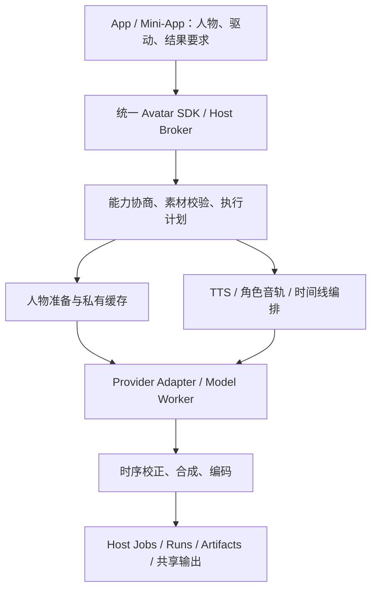

# 通用数字人能力接口 v1

日期：2026-10-01。状态：总体接口设计稿，尚未作为完整公共 SDK 上线。

当前开发实现覆盖单人照片加音轨的离线生成：签名模型能力发现、预设/分辨率/时长校验、持久视频队列、mount-bound 任务查询/取消/冻结输入重试及 Host 输出投影。Mini-App 私有桥接使用 `avatar.models/jobs/cancel/retry` 和 `video.avatar_generation`，不等同于下文完整公共接口。`plan`、人物准备、实时会话、多人物和通用 Provider 成熟度协商仍待实现。

目标：App/Mini-App 描述人物、驱动内容和结果要求。替换满足相同要求的模型，只调整 Host 的 Provider 选择与适配器，不修改 App。不同模型不能互相替代的能力必须通过协商显式表达。

## 1. 应用场景与边界

| 场景 | 人物素材 | 驱动 | 必需语义 | 当前实现候选，不代表已完成产品验收 |
| --- | --- | --- | --- | --- |
| 照片口播、讲解、祝福视频 | 单人图片 | 已有音轨 | 保留人物、按音轨驱动口型、保留原音轨 | FlashHead Lite/Pro、EchoMimic；Ex-Omni Teacher、InfiniteTalk 单人 |
| 文本口播、批量播报 | 图片或已准备人物 | 文本 + Voice Character | 先合成语音，再按实际语音时长生成视频 | 现有 TTS + 上述视频模型的组合 Provider |
| 模板主播 | 模板视频 | 新音轨 | 复用模板运动/背景、明确循环策略 | MuseTalk；需补自动人物准备 |
| 原视频翻译与口型替换 | 源视频 | 对齐后的目标音轨 | 保留源视频时间线与非编辑区域 | 能通过区域与时序验收的重绘 Provider；当前待验收 |
| 长课件、长篇讲解 | 图片或模板 | 长音轨或分段文本 | 跨块身份/运动连续、音视频同步 | 支持分段的 Provider；各自长时长门槛独立验证 |
| 多人对话、访谈 | 同框多个人物或布局 | 分离的角色音轨/台词 | 明确角色映射、时间重叠和空间区域 | InfiniteTalk 多人路线待真实权重验收；也可独立生成后排版合成 |
| 实时对话、客服、直播 | 已准备人物 | 连续音频流 | 低延迟、背压、打断、同步播放 | 预留会话契约，目前没有已验收 Provider |
| 批量生产 | 上述任一组合 | 多个独立请求 | 排队、幂等、独立失败和重试 | Host 批量编排复用同一 render 请求 |

v1 统一输出二维视频。全身、手势、表情、同框多人、透明背景分别是可选能力，不从“支持数字人”推导。3D mesh/rig、动作捕捉数据需要独立输出契约；将来不能把它们塞进 MP4 结果里冒充兼容。

照片生成与源视频口型替换是不同操作。可以跨模型切换同一操作，不能悄悄把“保留原视频”降级成“取首帧生成新视频”。

## 2. 架构与现有代码边界



复用现有 `video.avatar_generation` 权限及 Studio 私有 MessageChannel，模型推理继续使用现有 Runtime/Model Worker 隔离。通用能力逻辑放在 `ai2apps/avatar/`；`studio/avatar.py` 仅负责挂载授权与 Studio 输出适配，普通 App 调用同一服务。

当前差距已经核查：

- `studio/avatar.py` 固定 `ECHO_MODEL_ID`、`512x512`、`exact|fast`，`avatar_models()` 仅接受 EchoMimic。
- 当前 `generate_avatar()` 把请求断开映射为取消；v1 持久任务需要区分 UI 订阅结束与任务取消。
- 现有 `video_capabilities/v1` 描述视频输入组合、分辨率、音轨、进度等，但缺少人物准备、口型编辑语义、角色映射和实时会话。
- 现有 `video.tasks` 提供持久视频队列、取消和重试；`ModelWorkerRequest` 提供 payload/parts/progress，`ModelWorkerArtifact` 约束输出路径，优先复用。
- 现有 Mini-App bridge 没有通用持久 Job API；本文中的 SDK/Jobs 方法是明确需要新增的能力，不是现有方法别名。

不在本阶段新增 Runtime。Cloud API 无需参与首版 Local 设计；未来若涉及 Cloud，另写 Cloud 需求交接文档。

## 3. 面向 App 的接口

统一 SDK 命名空间建议为 `avatar`；下列为 SDK 方法名，不是额外开放的 Worker URL。

| 方法 | 用途 | 返回 |
| --- | --- | --- |
| `avatar.probe(query)` | 查询当前用户、设备、权限下支持的操作/选项和安装状态 | `CapabilityView` |
| `avatar.plan(request)` | 检查素材与要求，选择兼容 Provider，冻结执行配置 | `RenderPlan`；不启动模型推理或安装 |
| `avatar.prepare(subjectRequest, options)` | 可选：准备可复用人物、检测人脸/分割/模板预处理 | `Job`；完成后得到 `avatarRef` |
| `avatar.render({planId, idempotencyKey})` | 提交已协商的离线任务 | `Job`，立即返回 |
| `avatar.jobs.get({jobId})` | 重连后读取任务快照 | `Job` |
| `avatar.jobs.subscribe({jobId, afterSeq})` | 订阅进度/结果；可断线续接 | 事件流 |
| `avatar.jobs.cancel({jobId})` | 幂等请求取消 | 更新后的 `Job` |
| `avatar.jobs.retry({jobId, idempotencyKey})` | 对失败/取消任务用原冻结计划新建一次执行 | 新 `Job`；不是自动跨模型续算 |
| `avatar.sessions.*` | 实时会话，见第 9 节 | v1 预留，未实现时返回不支持 |

素材上传需复用/扩展 Host 上传桥接，返回不透明 assetId；在提交时锁定已验证素材摘要与生命周期，保证后台任务期间可读取。草稿不直接保存临时 Blob 地址，来源过期时要求重新选取。

SDK 使用同一传输适配层服务普通 App 和 Mini-App。Mini-App 永远通过 Host bridge；普通 App 使用自身认证上下文。actor、安装实例、Studio 输出归属、mount 等由 Host 注入，不接受调用方伪造。

### 最小照片说话示例

```json
{
  "schema": "ai2apps.avatar-render/v1",
  "operation": "portrait_animation",
  "subjects": [
    {
      "id": "host",
      "appearance": {"kind": "image", "assetId": "asset_portrait"}
    }
  ],
  "driver": {
    "kind": "audio",
    "tracks": [
      {"subjectId": "host", "assetId": "asset_speech", "offsetMs": 0}
    ]
  },
  "output": {
    "width": 512,
    "height": 512,
    "fps": {"numerator": 25, "denominator": 1},
    "fit": "contain",
    "format": "mp4",
    "audio": "preserve_driver"
  },
  "policy": {
    "preference": "speed",
    "execution": "local_only",
    "allowedTransforms": []
  }
}
```

提交流程（伪代码，待实现）：上传文件取得 Host `assetId` → `plan(request)` → 显示计划中的必要提示 → `render({planId, idempotencyKey})` → 订阅 Job。普通兼容模型切换由 Host 设置完成；App 不引用模型 ID、步数、VAE、采样器或 checkpoint。

### RenderRequest 的稳定字段

| 字段 | 契约 |
| --- | --- |
| `operation` | `portrait_animation`、`template_animation`、`video_lipsync`、`dialogue_scene`；实时不伪装成离线 render |
| `subjects[].id` | 请求内唯一人物 ID，驱动/区域/布局统一引用；未引用、重复或含糊映射报错 |
| `subjects[].appearance` | tagged union：`image {assetId}`、`video {assetId}`、`prepared {avatarRef}`；每个人物选一种 |
| `subjects[].region` | 可选，在源图片/视频归一化坐标中的人物区域；视频多脸跟踪用 Host 发放的 `regionTrackRef`，不能只靠人物描述猜测 |
| `driver` | tagged union：`audio` 或 `text`，内容与权限见下文 |
| `output` | 最终尺寸、fps、有无 alpha、文件格式、`fit`、音频策略。显式字段是要求；省略时在计划中给出固定有效值 |
| `timeline` | 默认由驱动决定；可明确区间、模板 `shortage: reject|loop|freeze_last`。默认 reject，不能默默截断或加速 |
| `composition` | 多人 `same_scene` 或 `layout`，后者引用预设/明确布局；不能把布局合成当作原场景多人生成 |
| `controls` | 可选标准项：`expression`、`motionIntensity`、`gaze`、`poseAssetId`、`background`。只有 probe 声明后才可请求；明确值不支持时拒绝 |
| `policy` | `preference: speed|balanced|quality`，是 Provider 选择偏好；`execution: local_only|remote_allowed`；`allowedTransforms` 显式允许的输出变换，默认空 |
| `requirements` | 可选硬限制，例如 `maxPeakMemoryBytes`、必须 alpha/原背景保留。未知内存不能当成满足上限；Host 仍执行自己的安全上限 |
| `seed` | 可选复现输入；只对同 Provider/权重/版本/配置定义意义，不保证跨模型同画面 |

`fit` 指源素材到目标画布的构图，`contain` 保留主体并补边；`cover` 允许裁切，计划提供裁切范围。模型不原生支持目标分辨率/fps 时，只有 `allowedTransforms` 包含 `resize`/`fps_resample` 才能使用该变换，并在计划与结果记录；fps 重采样不等于原生生成或实时达标。

音频驱动：每条 track 包含 `subjectId`、音频 `assetId`、整数 `offsetMs`，可选裁切区间。单人输入默认要求明确的人声；多人必须按角色分轨，或显式请求经授权的说话人分离/分轨步骤。仅有混合音轨不能凭空知道每一时刻该驱动谁。

文本驱动：`driver.kind=text`，包含 `utterances[{id,subjectId,text,voiceRef,language,startMs?}]`。不指定 startMs 时顺序排布；指定时用于定位起点，语速/目标时长另行协商。Voice Character 复用现有 Host 身份，不把人物外观 ID 当作音色 ID。不自动从图片推断声音。默认组合既有 TTS；原生联合语音/视频 Provider 也必须满足同一音色和音轨契约。

文本 TTS 的真实时长在生成前未知，计划对此明确标为未知。TTS 完成后检查持续时间上限、重叠与预算；超过硬限制则以 `realized_constraints_exceeded` 结束，并保留可重试诊断，不悄悄删字/改语速。

批量场景由 Host 以父任务关联多个标准请求，逐项返回 Job、结果与错误，初版不增加一套不同的批量模型参数。

## 4. 人物准备：可复用身份与 Provider 缓存分离

`avatar.prepare` 输入与 subjects 中 appearance 一致，可包含用户选定的人脸区域和来源素材版本，返回普通异步 Job。成功结果：

```json
{
  "schema": "ai2apps.avatar-profile/v1",
  "avatarRef": "avatar_opaque_id",
  "revision": 1,
  "supportedOperations": ["portrait_animation"],
  "sourceKind": "image",
  "readiness": "ready"
}
```

`avatarRef` 是 Host 管理的源素材身份，不是某个模型生成的 latent。Host 保留获准使用的原素材，按 Provider/revision/权重摘要/预处理版本/素材摘要/区域/尺寸生成私有缓存；切换模型可重新准备而不改变 App 引用。

若用户删除原素材、只剩不可迁移缓存，probe/plan 返回 `reprepare_required` 或 `asset_expired`，不能承诺可迁移。素材更新创建新 revision；正在运行的 Job 继续使用锁定 revision。私人脸缓存、参考音色、模板素材不得进入成片输出历史，也不得被输出历史清理删除。

一次性图片可直接 render，由执行计划包含 prepare 阶段；App 不必为了单次生成先创建长期人物。自动检测发现多张脸或低可信区域时返回 `subject_selection_required`，由 Host 标准素材选择器提供区域引用。

## 5. 能力协商与 Provider 选择

`probe` 返回的是操作组合的能力集合，不能把不同模型的独立选项拼成一个不存在的组合。例如模型 A 支持 512²、模型 B 支持 alpha，不代表 512²+alpha 有可执行 Provider。

每个可执行组合包含：

- 支持的 operation、source kind、驱动类型、人物数量、同框/排版模式、可选 controls。
- 输入格式、原生尺寸/fps/时长区间、分段能力及已验收最大时长；`unknown` 与“无限”不同。
- 输出、alpha、原音保留/联合生成、原视频编辑区域等保证。
- 准备需求、离线/实时支持、取消与恢复能力。
- `implementation: native|composed`、`maturity: experimental|validated`、`availability: ready|setup_required|incompatible|unavailable`；四种安装状态与成熟度独立。
- 性能估计的硬件、版本、测量配置、样本数量、是否含加载以及置信度；无可靠数据返回 null，不使用伪精确 ETA。

选择顺序：权限与执行位置 → 已验证操作组合 → 输入及硬要求 → Runtime/权重准备状态与设备预算 → 用户在 Host 中的模型偏好 → speed/balanced/quality 排序。失败必须返回具体未满足条件。自动候选默认只包含 validated Provider；开发开关可显式纳入 experimental，并显示状态。

不在 App 中维护 FlashHead/Ex-Omni 名称白名单。Provider 由经过验证的 Model Package 声明和已实现 Adapter 注册；单纯出现 `avatar_video` 字符串不足以开放能力。

### RenderPlan

plan 不运行 TTS/模型或安装依赖，只做有界素材探测、能力匹配和成本估计。若必须通过重型人脸预处理才能确定人物选择等关键条件，标记 `needs_prepare`，先执行 prepare 再 plan；已明确单个人物/区域、只需建立 latent 等缓存时可以把准备作为 render 内部阶段。未知区域不会被标为已确认。

计划包含：`planId`、`requestDigest`、`expiresAt`、`readiness`、`effectiveRequest`、`stages`、`transforms`、`warnings`、`estimate`、用户可见的 Provider 标签。Host 私有部分冻结模型/权重/Runtime/Adapter/预设版本、源素材摘要、权限及输出归属。

只有 readiness=ready 且没有未解决必选项时才能提交。输入、权限、Provider 版本发生变化时返回 `plan_stale`，重新 plan。模型偏好变更不修改既有计划。模型选择完成后执行失败默认不自动换模型；跨模型重试必须重新协商，原计划内同 Provider 重试保持输入与配置。

speed/quality 是选择策略，不是全模型可比的画质分数。`balanced` 也不允许忽略明确的尺寸、背景保留或时长要求。

## 6. Job、事件和最终输出

任务状态：`queued → running → succeeded|failed|cancelled`；取消处理中通过 `cancelRequested=true` 表达，直到 Worker 停止并清理临时产物才进入 cancelled。禁止“界面已取消，后台仍继续发布结果”。过期结果用 `resultAvailability=expired` 表达，不篡改已成功任务的执行事实。

阶段统一为 `prepare / synthesize_audio / render / compose / encode / publish`；不需要的阶段可跳过。每条事件至少含 `schema`、`jobId`、单调 `seq`、`timestamp`、`type`、`payload`。`progress` 包含 stage、阶段进度或 null、已生成媒体时长/总时长（已知时）、可选 ETA；禁止把分块采样次数伪装成准确总进度。

- `idempotencyKey` 在 actor + App instance + operation 范围唯一，保留至少 24 小时且不少于活动任务寿命；相同 key/请求摘要返回原 Job，不同摘要返回冲突。素材摘要参与幂等判断。
- 事件可能重复，客户端按 seq 去重；超过事件保留窗口时返回最新快照与新 cursor，不假装补齐全部历史。
- 关闭窗口/断开订阅默认不取消离线 Job。重连需重新授权，不能用 Job ID 越权读结果。卸载/权限撤销由 Host 撤销访问并取消尚未完成任务；不是普通 remount 的副作用。
- retry 创建新 jobId，记录 `parentJobId` 和 attempt。模型支持检查点恢复时才可在冻结配置下恢复，否则从头重算；内部潜变量和半成品不跨模型续用。
- Provider 请求停止后超时，Host 可终止该隔离 Worker；取消与完成竞态只允许一次终态提交和一次成片发布。

最终结果示例：

```json
{
  "schema": "ai2apps.avatar-result/v1",
  "jobId": "job_123",
  "status": "succeeded",
  "artifacts": [
    {
      "role": "primary_video",
      "artifactId": "artifact_123",
      "mediaType": "video/mp4",
      "width": 512,
      "height": 512,
      "frameCount": 50,
      "fps": {"numerator": 25, "denominator": 1},
      "durationMs": 2000,
      "hasAudio": true
    }
  ],
  "effective": {"operation": "portrait_animation", "audio": "preserve_driver"},
  "warnings": []
}
```

Host 可另附授权 preview/download URL；URL 不等于永久素材身份。可选 artifact roles：`generated_audio`、`captions`、`poster`。输入音轨默认不重复发布，内部 TTS 分句和分块视频不进入输出历史。

同一次 Job 在所属 Studio 的共享 Preview & Output 中只发布一次成片。普通 App 使用其 Host Artifact 输出范围。Voice Studio 按现有 Quick Read 输出所有权合同处理；Mini-App 不实现独立播放、下载、历史或任意输出路径。

### 时间与音画同步

离线公共时间线使用非负整数毫秒，内部以音频采样数与有理数 fps 精确计算；区间为左闭右开。照片/模板口播以驱动音频为主时钟，多轨默认时长取各轨 offset + 有效长度的最大值；没有人声的时间段维持已协商的 idle 行为，不自动裁掉静音。`preserve_driver` 表示保留内容、速度和时间线，允许输出编码所需的重采样/有损封装，不承诺位级一致。

`video_lipsync` 则保持源视频时间线（或显式指定的源区间）：目标音轨必须覆盖或按明确策略补静音到该区间，超长音轨默认拒绝，不自动改变语速或视频时长。

对音频决定时长的单轨生成，音频样本数 N、采样率 S、fps=P/Q 时，目标帧数为 `ceil(N*P/(S*Q))`。尾部不足一帧可由适配器补齐，视频尾差小于一帧；不裁掉最后一段音频。模型额外参考帧、窗口补齐、overlap、lookahead 由适配器校正，并在调试元数据记录。

已有 FlashHead 的 floor 帧数和 Ex-Omni 的额外参考帧需要在适配层统一；底层 smoke MP4 不能直接视为已符合通用输出契约。多人采用同一合成音频时间线，背景音乐不参与驱动；音轨重叠与人物区域一一对应。

## 7. 错误与降级

统一错误对象：`code`、可本地化 `messageKey`、`retryable`、`details`、`suggestedActions`；详情不泄漏本机路径或凭据。

稳定错误至少包括：`unsupported_operation`、`unsupported_combination`、`unsupported_control`、`constraint_unsatisfied`、`setup_required`、`asset_expired`、`subject_selection_required`、`reprepare_required`、`plan_stale`、`permission_revoked`、`resource_exhausted`、`realized_constraints_exceeded`、`provider_failed`、`cancelled`。

App 使用共同的错误处理，不根据模型名字分支。自动安装、改人物、删掉某个角色、改音色、缩短音轨、将实时退化成离线均不是默认降级策略。可接受的 resize/fps 变换须由请求明确允许，计划和结果同时报告。

## 8. Provider Adapter 与声明

建议在 Model Package 的 `models[].metadata.avatar` 下新增独立 `ai2apps.avatar-provider/v1` 声明，由 `model_providers` 显式校验并投影；保留现有 video_capabilities/v1，不随意添加其不认识的 content role。

声明包含 operation/source/driver 组合、人物与 controls、原生几何和时长、编辑保证、prepare 需求、execution/streaming/cancel/resume、Runtime 要求、内存与性能证据。纯组合 Provider 由 Host 注册同结构声明，清楚列出子能力和额外权限。TTS/分轨能力必须在 App 授权闭包内，不能因请求 avatar 自动获得其他模型能力。

通用 Adapter 边界：`describe`、`validate`、`prepare`、`render`、`cancel`；实时另加 session 生命周期。这里是内部接口，不逐项复制为公共网络 API。

初版单图+音频 Adapter 将冻结计划翻译到既有 `video_generation` Worker operation，通过现有 parts 传入本地已验证素材，输出现有 ModelWorkerArtifact。prepare 与多人需要新增版本化 payload/operation 时，应显式协商 Worker 支持；旧 Worker 收到未知操作必须拒绝，不能绕过当前 video validator。

| Provider | 内部需封装的差异 | 当前对外声明策略 |
| --- | --- | --- |
| FlashHead Lite/Pro | 16 kHz 编码、LTX/Wan VAE、33 帧窗口、9/5 帧重叠、色彩和时序校正 | 首个 portrait_animation 适配目标，通过输出合同后开放 |
| EchoMimic V3 | 原生窗口、最短音频、exact/fast、已有 Worker 参数 | 保留 legacy，补标准参数映射；短音频不能默默截断/补成更长输出 |
| MuseTalk | 检测/分割、逐帧框、模板缓存、嘴部融合、循环 | prepare 完整前只作为 experimental；不能声称任意源视频保真编辑 |
| InfiniteTalk | 中文 Wav2Vec2、角色区域、单/多人、长窗口 | 单人逐步验收；多人声明关闭直到真实测试通过 |
| Ex-Omni | Teacher 步数、512 文本位置、codec 音频条件、可选语言/语音组合 | 图像+音轨先适配；完整对话/多模态不随视频通过自动开放 |
| AVTR-1 | 待授权检查点和完整网络还原 | unavailable；没有完整接口验收前不能作为候选 |

Provider-specific 诊断参数只用于 Host 开发工具，不进入可移植 App 请求。执行收据记录模型、Package/权重/Runtime/Adapter 版本、seed、实际设置、耗时/内存；用于重放和比较，App 不依赖这些字段控制流程。

## 9. 实时数字人会话：共享人物，独立执行合同

预留 `video.avatar_streaming` 权限，与离线 generation 分开；当前 probe 必须返回 unsupported。能分块生成文件、输出 SSE 进度或达到短样例高 FPS，都不能据此声明实时支持。

SDK 预留 `sessions.open / pushAudio / interrupt / endInput / close / subscribe`。open 协商主体、PCM 编码/采样率/声道、输出分辨率/fps、媒体封装、最大缓冲、首次出画与持续速率目标、是否录制。ASR/LLM/TTS 由上层会话服务组合，avatar 会话主要接收音频，不强迫每个视频模型内置对话模型。

音频块具有 `sessionId`、`generationId`、单调 seq、`startSample`、`sampleCount`，每个人物同一 clock。重复块幂等；缺失/乱序显式报告，不用到达墙钟猜测音画时间。

Host 返回接收额度与缓冲水位，发送方按 credit 背压，不允许无限堆积。达到会话声明的延迟/吞吐硬限制时拒绝或报告失效；预估目标与硬保证区分。

interrupt 原子增加 generationId，抛弃旧代未播放音频、视频和推理队列；接收方必须丢弃迟到旧代帧，ACK 表示已完成清空边界。close 幂等释放缓存与 Worker；endInput 表示 drain 后正常结束。可选录制仅在关闭并封装成功后发布一个 Host Artifact。

控制事件可复用 bridge，媒体不能用 SSE/base64 高频传帧。实现实时阶段时再冻结 Host 管理的媒体传输方案及协议版本；不把 Worker 地址暴露给 Mini-App。现阶段不承诺该未实现传输的兼容性。

## 10. 兼容性、落地顺序与验收

请求/结果 schema 独立版本化。未知主版本拒绝；未知请求语义字段或必需 feature 拒绝，防止以“忽略字段”造成静默降级。响应新增可选字段客户端可忽略；新 control、实时/多人特性通过 probe + required feature 协商后使用。

既有 multipart `video.avatar_generation` 调用保留兼容层，转换为统一请求。旧 `exact|fast` 含有模型精度语义，不能直接当成通用 speed/quality：legacy 请求维持既有 Echo 绑定直到旧 UI 迁移；新 SDK 从开始就无模型耦合。桥接版本/feature 协商失败时提示升级 Host，而不是把新请求送进旧 handler。

实施顺序：

1. 新增不可变请求/计划/结果类型、严格验证、Provider registry 和 capability probe；先实现单人图片+音轨。保留原服务运行路径。
2. 接入 FlashHead Lite 与 EchoMimic 两个 Adapter，补时序校正、持久 Job bridge、共享输出；用完全相同的 App 请求证明可切换。迁移照片说话 Mini-App 后删除其模型绑定。
3. 补 prepare、MuseTalk 模板、标准 TTS 组合；接入 Pro/InfiniteTalk/Ex-Omni 已验收路径与设备预算。
4. 逐项开放长视频、源视频口型编辑、多人和批量；每个操作保留自己的验收门槛。
5. AVTR 解锁后再评估实时 Provider，冻结流媒体传输并实现会话合同。

最低验收：

- 同一图片/音轨请求在两个 Provider 间切换，App/Mini-App 源码和请求 JSON 均不变，输出格式/尺寸/时间语义一致；只允许执行收据和画面内容不同。
- 不支持角色数、alpha、control、源视频保持或实时延迟时，模型调用前失败；不出现静默忽略。
- 小于一帧、刚好一个窗口、跨窗口、末尾非整数帧音轨，均遵守音频主时钟和目标帧数；同步误差逐段测量，不能只看 MP4 有音轨。
- 幂等重复提交、刷新重连、取消/完成竞态、Worker 崩溃与 Host 重启不重复执行或发布；不能恢复的任务明确失败。
- 人物缓存可失效重建；切模型不改变 avatarRef；删除输出不会删除人物/Voice Character 私有素材。
- 旧 Mini-App、其他 Studio 能力与 Voice Studio 共享输出回归通过；普通 App 和 Mini-App 均经过同一 capability 逻辑与各自授权。
- 适配器实际在最终 Python 3.11 Runtime 运行，发布门槛包含成片质量、内存、持续吞吐及设备失败行为。

相关依据：[模型状态](ai2apps-avatar-model-port-status.md)、[整体计划](ai2apps-avatar-studio-implementation-plan.md)、[Studio Mini-App 合同](ai2apps-studio-mini-app-package-contract-v1.md)。
