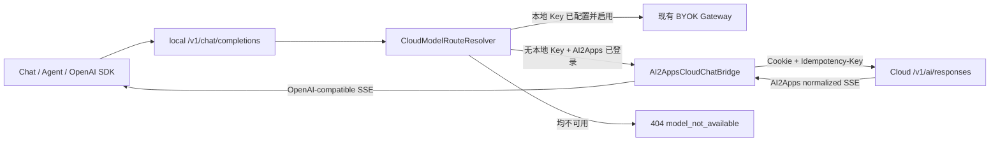

# AI2Apps Cloud SSE 与本地 OpenAI 兼容网关对接方案

Status: Cloud contract confirmed; local bridge pending

Last updated: 2026-08-14

Cloud verification: `ai-gateway-api-v1.md`, `client-integration-v1.md`,
`openapi-v1.yaml` and the implementation under `src/ai/` were checked on
2026-08-14. `npm run check` and all 30 Cloud tests passed. The Cloud repository
worktree was clean at verification time.

## 1. 目标

AI2Apps Cloud 继续向 AI2Apps 官方客户端提供统一、与厂商无关的
`/v1/ai/responses` 协议。AI2Apps local 继续向 Chat、Agent、第三方 SDK 提供现有的
OpenAI-compatible `/v1/chat/completions` 协议。

服务器端增加一层有状态协议桥，使同一个逻辑模型 ID：

```text
cloud/{provider}/{model}
```

按照以下优先级执行：

1. 对应模型存在已启用的本地 API Key 时，沿用当前 BYOK Provider 路径；
2. 没有本地 Key，但存在有效 AI2Apps Session 且 Cloud 模型目录包含该模型时，调用
   AI2Apps Cloud `/v1/ai/responses`；
3. 两条路径都不可用时返回模型不可用，不影响任何本地模型和本地功能。

本地 Key 调用失败后不得静默切换到 AI2Apps 点数路径。凭证来源只在请求开始前解析
一次，请求过程中保持冻结，避免意外扣点和难以解释的重试行为。

## 2. 非目标

- 不把 AI2Apps Cloud 的 Session 变成本地账户或本地授权前提；
- 不把 Provider Key、Cloud Cookie 或 prototype token 暴露给浏览器和 Swift UI；
- 不要求现有 OpenAI-compatible 客户端理解 AI2Apps Cloud 原生 SSE；
- 不把厂商原始 SSE 直接透传给客户端；
- 不在 Cloud 数据库或应用日志中保存 Prompt、回答正文或完整工具参数；
- 不因 Cloud 离线、Session 过期或点数不足影响本地模型加载和推理。

## 3. 当前实现与缺口

### 3.1 AI2Apps Cloud

当前 `ai2apps-cloud/src/ai/routes.ts` 已实现：

- `GET /v1/ai/models`；
- `POST /v1/ai/responses`；
- `GET /v1/ai/requests/:requestId`；
- `POST /v1/ai/requests/:requestId/cancel`；
- `response.created`、`output_text.delta`、`tool_call.delta`、
  `response.completed`、`response.failed` 五类 SSE 事件；
- Idempotency-Key、点数预留、结算、失败释放和显式取消；
- OpenAI、Anthropic、Google 和 OpenRouter Adapter。

最新实现和 OpenAPI 均已声明 `tools`，并且可以无损表达下一轮所需的：

- assistant 历史消息中的 `tool_calls`；
- `role=tool`；
- `tool_call_id`；
- 工具执行结果。

Cloud 路由会校验调用 ID、工具名、JSON object 参数以及每个历史调用都有后续结果；
四个 Provider Adapter 均已有结构化历史转换测试。local 仍须完成第 7 节的 OpenAI
tool delta 转换和本地 capability approval，之后才能开放完整 Agent 工具循环。

### 3.2 AI2Apps local

当前 local 的外部接口是 OpenAI Chat Completions：

```text
POST /v1/chat/completions
```

流式响应格式为：

```text
data: {"object":"chat.completion.chunk",...}

data: [DONE]

```

当前 `ai2apps/cloud_gateway.py` 只会把请求直接转发到用户配置的 Provider，并假设上游
也是 OpenAI Chat Completions。新路径不能直接转发 AI2Apps Cloud SSE，因为 Cloud
使用带 `event:` 的规范化事件，现有 Chat 和 SDK 不认识该格式。

## 4. 总体架构



协议桥必须位于 local 后端，不放在 Web UI 中。这样 Cookie jar、幂等、取消、错误
清洗和协议转换都由受信任进程统一管理。

## 5. Cloud 端规范化 SSE 契约

Cloud 保留当前事件名，不改成厂商事件，也不新增一个重复的 Chat Completions API。
每个 SSE frame 使用：

```text
event: <event-name>
data: <single-line JSON>

```

所有事件的 `data` 必须是 JSON object。字段新增保持向后兼容；删除字段、改变类型或
改变结算语义需要新协议版本。

### 5.1 `response.created`

点数预留和请求记录成功后立即发送一次：

```text
event: response.created
data: {"requestId":"uuid","model":"openai/gpt-x","pointsReserved":"12"}

```

约束：

- 必须是第一条业务事件；
- `requestId` 是后续查询、取消和审计的唯一标识；
- 所有点数字段保持十进制字符串；
- 发送该事件表示请求已产生 Cloud 状态，不能再把断开连接视为“从未请求”。

### 5.2 `output_text.delta`

```text
event: output_text.delta
data: {"type":"output_text.delta","delta":"Hello"}

```

`delta` 是追加文本，不是完整快照。Cloud 和 local 都不得重复、重排或自行 trim。

### 5.3 `tool_call.delta`

```text
event: tool_call.delta
data: {"type":"tool_call.delta","callId":"call_1","name":"search","argumentsDelta":"{\"q\":"}

```

约束：

- `callId` 在一次响应内稳定；
- `name` 可以只在第一次出现；
- `argumentsDelta` 是原样追加的 JSON 字符串片段；
- 不允许 local 在收到完整参数前执行工具；
- 工具执行仍受 local capability policy 和用户审批控制。

### 5.4 `response.completed`

成功结算后发送一次并结束响应：

```json
{
  "requestId": "uuid",
  "model": "openai/gpt-x",
  "status": "completed",
  "usage": {
    "inputTokens": 100,
    "cachedInputTokens": 20,
    "outputTokens": 30,
    "reasoningTokens": 5
  },
  "points": {
    "reserved": "12",
    "charged": "4"
  },
  "pointsReleased": "8",
  "balance": "796",
  "pricingVersion": "usd-x100-2026-08-13"
}
```

Cloud 应保证结算事务提交后才发送该事件。收到它后 local 不再调用取消接口。

### 5.5 `response.failed`

HTTP headers 已发送后发生的错误只能通过终止事件表达：

```text
event: response.failed
data: {"requestId":"uuid","error":{"code":"AI_PROVIDER_ERROR","message":"provider request failed"}}

```

Cloud 必须先释放点数预留或把失败释放纳入同一可靠事务，再发送该事件。错误信息不能
包含 Provider Key、Cookie、完整 Prompt、完整回答或厂商原始响应。

### 5.6 Keepalive 与代理缓冲

Cloud 当前应补充 15 秒一次的 SSE comment heartbeat：

```text
: keepalive

```

同时保持：

```http
Content-Type: text/event-stream; charset=utf-8
Cache-Control: no-cache, no-transform
Connection: keep-alive
X-Accel-Buffering: no
```

Node 写入端必须处理 `raw.write()` 返回 `false` 的情况并等待 `drain`，避免慢客户端令
进程无限积压内存。Heartbeat 不参与业务状态机，local parser 应直接忽略或转发为
comment。

## 6. local 请求转换

local 收到 `ChatCompletionRequest` 后，只有路由解析结果为 `ai2apps-managed` 才执行
以下转换。

### 6.1 模型 ID

```text
local: cloud/openai/gpt-x
cloud: openai/gpt-x
```

转换前必须确认 Cloud 模型目录中存在精确 ID，不能只按显示名或后缀匹配。

### 6.2 消息

初始文本/图片阶段采用：

| OpenAI Chat 字段 | Cloud 字段 |
| --- | --- |
| `role=system` | 合并到顶层 `system` |
| `role=user/assistant` + string content | `input[].content[{type:"input_text"}]` |
| content part `text` | `input_text` |
| content part `image_url.url` | `input_image.imageUrl` |

多个 system message 按原顺序用换行连接。不能把 system message 降级成 user
message。音频、文件、`reasoning_content` 及尚未定义的 part 必须返回明确的
`400 AI2APPS_CLOUD_INPUT_UNSUPPORTED`，不能静默丢弃。

### 6.3 生成参数

| OpenAI Chat 字段 | Cloud 字段 | v1 行为 |
| --- | --- | --- |
| `max_tokens` | `maxOutputTokens` | 直接映射并受目录上限约束 |
| `temperature` | `temperature` | 直接映射 |
| `stream` | `stream` | 直接映射 |
| `tools[].function` | `tools[]` | 去掉外层 `type/function` 包装 |
| `top_p` | 无 | 明确拒绝或 Cloud 增加字段后再启用 |
| `stop` | 无 | 明确拒绝或 Cloud 增加字段后再启用 |
| `response_format` | 无 | 明确拒绝 |
| `tool_choice` | 无 | v1 只允许缺省/`auto`，其他值明确拒绝 |

不支持的参数不能被无声忽略，否则相同请求在 BYOK 和 AI2Apps 路径会产生不同且不可
解释的行为。

### 6.4 Idempotency-Key

AI2Apps 自有 Chat UI 每次“发送”生成一个 UUID，并通过 local 请求头传入：

```http
Idempotency-Key: <uuid>
```

local 使用同一个值调用 Cloud。网络结果不确定时重试原业务发送必须复用该值；“重新
生成”必须创建新值。

第三方 OpenAI SDK 通常不发送该头。local 可以为该次 HTTP 请求生成 UUID，但必须
承认这种客户端无法在跨 HTTP 重试时获得完整幂等保证。不得用 Prompt hash 代替业务
幂等键，因为完全相同的 Prompt 也可能是用户有意再次生成。

## 7. local 响应转换

协议桥为一次请求生成一个稳定的 OpenAI completion ID：

```text
chatcmpl-ai2apps-<cloud-request-uuid>
```

同一流中的所有 chunk 必须使用相同 ID、原始 local 模型 ID 和创建时间。

### 7.1 事件映射

| Cloud 事件 | OpenAI-compatible 输出 |
| --- | --- |
| `response.created` | `delta.role="assistant"` 的首 chunk，并记录 Cloud requestId |
| `output_text.delta` | `delta.content=<delta>` |
| `tool_call.delta` | `delta.tool_calls[]`，按 callId 分配稳定 index |
| `response.completed` | finish chunk；可按 `stream_options.include_usage` 附带 usage |
| `response.failed` | OpenAI error frame，然后结束流 |
| Cloud EOF after completed/failed | `data: [DONE]` |

文本示例：

```text
data: {"id":"chatcmpl-ai2apps-...","object":"chat.completion.chunk","model":"cloud/openai/gpt-x","choices":[{"index":0,"delta":{"role":"assistant"},"finish_reason":null}]}

data: {"id":"chatcmpl-ai2apps-...","object":"chat.completion.chunk","model":"cloud/openai/gpt-x","choices":[{"index":0,"delta":{"content":"Hello"},"finish_reason":null}]}

data: {"id":"chatcmpl-ai2apps-...","object":"chat.completion.chunk","model":"cloud/openai/gpt-x","choices":[{"index":0,"delta":{},"finish_reason":"stop"}]}

data: [DONE]

```

如果响应产生过 tool call，最终 `finish_reason` 使用 `tool_calls`，否则使用 `stop`。
Cloud 的结算详情可放进 AI2Apps 专用扩展字段 `delta.ai2apps.cloud`，供自有 UI 更新
点数；普通 OpenAI 客户端会忽略未知扩展。点数仍以字符串呈现。

### 7.2 Usage 映射

```text
usage.inputTokens       -> usage.prompt_tokens
usage.outputTokens      -> usage.completion_tokens
两者相加                 -> usage.total_tokens
usage.cachedInputTokens -> usage.prompt_tokens_details.cached_tokens
```

`reasoningTokens` 和点数结算不是标准 Chat Completions usage 字段，只能进入明确命名的
AI2Apps 扩展，不能塞入另一个标准字段。

### 7.3 非流式响应

Cloud `stream:false` 返回的 `output[{type:"output_text",text}]` 转换为现有
`ChatCompletionResponse`：

```json
{
  "id": "chatcmpl-ai2apps-...",
  "object": "chat.completion",
  "model": "cloud/openai/gpt-x",
  "choices": [{
    "index": 0,
    "message": {"role": "assistant", "content": "Hello"},
    "finish_reason": "stop"
  }],
  "usage": {
    "prompt_tokens": 100,
    "completion_tokens": 30,
    "total_tokens": 130
  }
}
```

## 8. Cloud 已实现的完整工具历史协议

Cloud request contract 已扩展 `AiInputMessage` 来支持历史工具消息，没有把工具记录
拼成普通文本：

```ts
type AiInputMessage =
  | {
      role: "user" | "assistant";
      content: readonly AiInputPart[];
      toolCalls?: readonly {
        callId: string;
        name: string;
        arguments: string;
      }[];
    }
  | {
      role: "tool";
      toolCallId: string;
      content: readonly AiTextPart[];
    };
```

Cloud 各 Provider Adapter 负责转换为厂商语义：

- OpenAI Responses：`function_call` / `function_call_output`；
- Anthropic：`tool_use` / `tool_result`；
- Gemini：`functionCall` / `functionResponse`；
- OpenRouter Chat：assistant `tool_calls` / tool message。

Cloud 必须校验：

- `toolCallId` 引用前面已出现的 tool call；
- tool name 在本次请求的 definitions 中存在；
- arguments 是 JSON object 字符串；
- message 数量、单项长度和总字节上限；
- Cloud 只生成 tool call，绝不代替 local 自动执行工具。

此扩展已同步写入 `openapi-v1.yaml`、`ai-gateway-api-v1.md` 和 Adapter contract
tests。local 对该结构的双向转换仍是接入任务。

## 9. 取消、断线与重试

local 在收到 `response.created` 后保存本地请求与 Cloud requestId 的临时映射。

以下情况调用：

```text
POST /v1/ai/requests/{requestId}/cancel
```

- 用户点击停止；
- 下游 Chat SSE 连接断开；
- local 关闭且仍能完成有界清理；
- local 主动超时。

取消调用是幂等清理意图。`409 AI_REQUEST_NOT_RUNNING` 表示请求已经进入终态，可通过
GET request 状态确认，不应覆盖原始完成结果。

Cloud 不保存 Prompt 和回答正文，因此不能在断线后重放已经发送的文本。恢复策略是：

1. local 保留客户端已经收到的部分文本；
2. 查询 Cloud request 状态确认 completed/failed/cancelled；
3. 不自动重新调用模型；
4. 用户选择重新生成时使用新的 Idempotency-Key。

同一个 Idempotency-Key 收到 `AI_REQUEST_IN_PROGRESS` 时，local 只能等待/查询原请求；
不能换 Key 绕过冲突并产生第二次扣点。

## 10. 错误映射

在 Cloud 尚未发送 SSE headers 前，local 保留 HTTP 状态并转换成稳定的 OpenAI error
外壳，同时保留机器错误码：

| Cloud 状态/错误 | local 行为 |
| --- | --- |
| `401 AUTHENTICATION_REQUIRED` | 将 Cloud Session 标为失效；本地功能保持可用 |
| `402 INSUFFICIENT_POINTS` | 返回余额不足，不尝试厂商直连 |
| `404 AI_MODEL_NOT_FOUND` | 刷新 Cloud 模型目录；当前请求失败 |
| `409 AI_REQUEST_IN_PROGRESS` | 查询原 requestId，不创建新扣费请求 |
| `409 AI_IDEMPOTENCY_CONFLICT` | 报告客户端幂等键复用错误 |
| `429` | 透传 `Retry-After`，不自动无限重试 |
| `502/503` | Cloud 路径不可用；不静默切 BYOK 或本地模型 |

SSE 已经开始后的 `response.failed` 转成流内错误 frame。无论哪种错误，日志均不得包含
Cookie、Provider Key、完整请求体、完整输出或完整工具参数。

## 11. Cloud 服务器完成情况

### 11.1 已确认完成

1. `src/ai/routes.ts`
   - 已使用异步 `AiSseWriter` 处理串行写入和 backpressure；
   - 已增加 15 秒 comment heartbeat；
   - 已保证 completed/failed 是唯一终止业务事件；
   - 已在结算事务完成后发送 completed；
   - 已实现并校验完整历史工具消息。
2. `src/ai/types.ts`
   - 已固定公开 SSE payload 类型；
   - 已增加完整历史工具消息 union；
   - 已定义 stop reason 标准化集合。
3. `src/ai/adapters/*.ts`
   - 四个 Provider 已实现历史 tool call/result 转换；
   - 已测试稳定 callId、name 和 arguments delta；
   - 已统一 stop reason 和最终 usage。
4. `openapi-v1.yaml`
   - 已把 `tools` 加入 `AiResponseRequest`；
   - 已增加完整 SSE event schemas；
   - 已增加工具历史消息 schema；
   - 已标明点数字段为十进制字符串。
5. `docs/ai-gateway-api-v1.md`
   - 已写明 heartbeat、终止事件、断线不可重放和工具安全边界。

### 11.2 不建议修改

- 不新增 `/v1/chat/completions` 到 Cloud；
- 不让 Cloud 同时维护 OpenAI、Anthropic 和 AI2Apps 三套客户端输出协议；
- 不在 Cloud 保存正文来实现 SSE replay；
- 不允许浏览器提供“应扣多少点”或厂商 usage；
- 不让 Cloud 执行 local 工具。

## 12. local 服务器修改清单

1. `ai2apps/model_manager.py`
   - 将模型身份与 credential route 分离；
   - 合并 BYOK inventory 和 AI2Apps model catalog；
   - 对同一逻辑 ID 执行 BYOK-first 解析。
2. `ai2apps/cloud_gateway.py`
   - 保留现有 BYOK 路径；
   - 增加 `AI2AppsCloudChatBridge`；
   - 实现请求、SSE、非流式响应和错误转换；
   - 请求开始后冻结 route，不做失败后付费 fallback。
3. `ai2apps/cloud_client.py`
   - 继续私有维护 Cookie jar；
   - 提供模型目录缓存、request 查询和 cancel；
   - 401 时使 Cloud Session 失效，但不影响 local runtime。
4. `omlx/server.py`
   - `/v1/models` 合并已登录用户可用的 AI2Apps 模型；
   - `/v1/chat/completions` 使用统一 route resolver；
   - 下游断开时触发有界 Cloud cancel。
5. Model App
   - 分开显示 Personal API Keys 与 AI2Apps Provider；
   - 显示 `Personal Key`、`AI2Apps Points` 和 `Preferred` 路由状态；
   - 登录、退出或目录刷新后更新可用性，不改变本地模型。

## 13. 测试矩阵

### 13.1 Cloud contract tests

- 每次成功流严格为 created → zero-or-more delta → completed；
- 每次失败流严格为 created → zero-or-more delta → failed；
- completed/failed 只出现一次；
- heartbeat 不改变事件顺序；
- 慢消费者触发 backpressure，不产生无界缓冲；
- 四个 Provider 的文本 delta、tool delta、usage 和 stop reason 一致；
- 取消释放原点数桶；
- 同 Idempotency-Key 不重复调用或扣点；
- 工具历史消息在四个 Adapter 中语义等价。

### 13.2 local bridge tests

- 本地 Key 与 AI2Apps 同时可用时只调用本地 Provider；
- 本地 Key 不存在且已登录时只调用 AI2Apps Cloud；
- 未登录时本地模型和 BYOK 模型照常工作；
- 本地 Key 调用失败时不消耗 AI2Apps 点数；
- 每个 Cloud delta 生成一个合法 OpenAI chunk；
- completion ID 和 tool index 在整条流中稳定；
- completed 生成 usage、finish chunk 和 `[DONE]`；
- failed 生成安全错误并结束；
- 客户端断开触发 cancel；
- 401、402、409、429、502/503 均不破坏本地状态；
- 不支持的请求字段明确失败而不是静默丢失。

### 13.3 端到端验收

使用完全相同的 Chat UI 和 OpenAI SDK，分别验证：

1. local model；
2. BYOK OpenAI-compatible model；
3. AI2Apps-managed OpenAI model；
4. AI2Apps-managed Anthropic model；
5. AI2Apps-managed Gemini model；
6. AI2Apps-managed OpenRouter model；
7. 文本流、非流式、工具调用、取消、余额不足和 Session 过期。

## 14. 分阶段发布

### Phase A：文本闭环

- 合并模型目录；
- BYOK-first 路由；
- 文本/图片输入；
- 文本 SSE 和非流式响应转换；
- 幂等、取消、点数刷新和错误映射；
- 不支持的工具/结构化输出明确禁用。

### Phase B：完整工具循环

- Cloud 工具历史消息 schema（已完成）；
- 四个 Adapter 的 tool call/result 转换（已完成）；
- local tool delta 映射；
- capability policy 审批和多轮 Agent 测试。

### Phase C：GPT Image 2（客户端代理已接入）

Image2 不经过文本 `/v1/ai/responses` 或 SSE 桥。local 使用 Cloud 的同步、
Provider-neutral 图片协议：

```text
POST /v1/platform/cloud/ai/images/generations
POST /v1/platform/cloud/ai/images/edits
```

local 原样转发 `Idempotency-Key` 和 JSON 请求，不记录 Prompt、输入 Data URL 或返回的
图片 Data URL。模型目录中的 camelCase capability 会规范化成 snake_case；例如
`imageGeneration`、`imageEdit`、`imageOutput` 分别成为 `image_generation`、
`image_edit`、`image_output`，供 Model App 和默认能力路由使用。

首版客户端遵守 Cloud 限制：`openai/gpt-image-2`、`n=1`、三种固定尺寸、四种质量、
PNG/JPEG/WebP；编辑输入使用 1 至 4 个受限的 `imageDataUrls` 和可选 PNG
`maskDataUrl`。成功响应中的 Data URL 必须由调用 App 立即保存，因为 Cloud 不保存
图片且相同幂等键不能重放图片正文。

这两个平台端点完成协议接入，但不等同于已经提供用户可见的 Image App。图片生成与
编辑 UI、结果文件落盘和历史管理应作为独立 App 层实现，不能塞进文本 Chat 的 SSE
通道。

### Phase D：生产稳态

- Cloud heartbeat、backpressure 和断线取消（已完成）；
- local 超时、断线取消和终态确认；
- Cloud catalog 后台缓存和失效策略；
- 指标、审计、限流与故障注入；
- 协议兼容 fixtures 和发布门禁。

## 15. 完成定义

满足以下条件后，AI2Apps-managed 模型才可以作为 Model App 中的正式 Cloud 路径：

1. 没有 AI2Apps 账户时所有 local 功能保持完整；
2. 同模型同时具备本地 Key 和 AI2Apps 权益时稳定选择本地 Key；
3. 本地 Key 的运行时错误不会触发隐式点数消费；
4. AI2Apps SSE 对现有 Chat 和 OpenAI SDK 完全兼容；
5. 停止、断线、失败和取消均能释放预留点数；
6. 工具能力只有在完整多轮工具协议通过后才对 Agent 开放；
7. Cookie、Key、正文和完整工具参数不进入 UI、数据库或日志；
8. Cloud 离线、401、402、429 和 Provider 故障均不影响本地模型。
