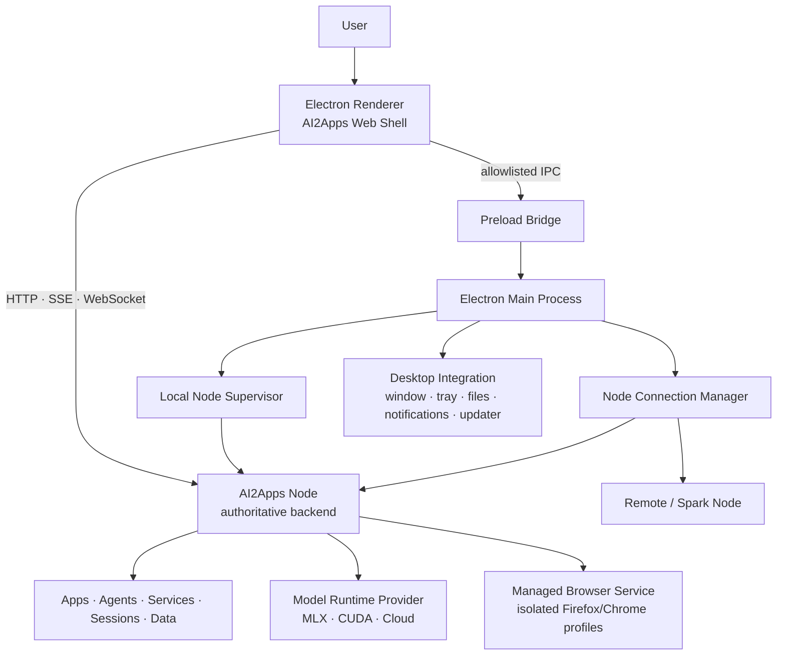

# AI2Apps Electron Desktop 架构与开发方案

Status: Architecture draft v0.3 — D1 macOS Client implemented
Last updated: 2026-08-16
Related: [AI2Apps Platform Architecture](ai2apps-platform-architecture.md),
[Backend Development Plan](ai2apps-backend-development-plan.md),
[Multi-user Gateway](ai2apps-multi-user-gateway.md),
[Managed Browser Baseline](ai2apps-browser-agent.md),
[Authority and Secret Baseline](security-authority-baseline.md)

## 1. 决策摘要

AI2Apps 将开发一个跨平台 Electron Desktop，作为 Local、局域网和远程 AI2Apps Node
的统一桌面入口。它复用现有 AI2Apps Web Shell 和后端 API，不创建第二套 App、Agent、
Session、Message 或设置实现。

第一阶段确认以下产品与技术决策：

1. 只维护一套 Electron Desktop 源码和一个用户可识别的产品身份；
2. 同一 Desktop 支持 `local`、`remote` 和 `hybrid` 三种连接模式；
3. 发布 `Client` 和 `Full` 两种 Desktop 安装包，但二者使用相同 UI、协议和功能代码；
4. `Client` 不含 Python、AI2Apps Server 或模型 runtime，可以连接已有本机 Node、局域网
   Node、DGX Spark 或远程 Node；
5. `Full` 在 `Client` 基础上携带当前平台的预构建 Local Runtime，可让普通用户从零启动；
6. `Client` 可在用户确认后下载签名 Runtime，升级为具备本机 Node 能力的安装；
7. 另行发布无界面的 `AI2Apps Node`，用于 DGX Spark、Linux AI Box、服务器和受管部署；
8. Electron 只负责窗口、系统集成、连接和受管 Node 生命周期，不成为权威业务后端；
9. 生产环境只安装预构建、签名和内容寻址的 Runtime，不在用户设备执行 `uv sync`、
   `pip install -e`、`npm install` 或本地源码编译；
10. 模型、用户数据、安装包、日志和可更新 Runtime 不写入 Electron 应用目录；
11. 第一版 Renderer 直接加载受管 Node 提供的 AI2Apps Web Shell，以最小改动替代浏览器；
12. Electron 与 Node 通过版本化 API、SSE/WebSocket 和 capability handshake 交互，不直接
    import Python、访问 Platform SQLite 或读取内部业务文件；
13. 浏览器 RPA 继续由独立 Browser Service 和隔离 Profile 承载。未来的定制 Firefox 是
    可选 Browser Runtime，不与 Electron Renderer 的 Chromium 会话混用；
14. 现有 Swift oMLX macOS App 的 Runtime 定位、进程管理、端口冲突、首次启动和更新行为
    是迁移参考，但新 Desktop 不依赖 Swift 实现；
15. Firefox 取代 Electron 属于后续“AI 原生浏览器”产品路线，本方案不提前绑定该升级。

## 2. 产品目标

### 2.1 用户目标

普通用户能够：

- 在 macOS 上安装一个 App，从零初始化并启动 AI2Apps Local；
- 不打开通用浏览器即可使用 Chat、Apps、Agents、Coder、Documents、Models 和设置；
- 查看本机 Node 的启动、下载、迁移、错误和资源状态；
- 在本机 Node、DGX Spark、家庭服务器、办公室 AI Box 和远程节点之间切换；
- 对新节点执行可理解的发现、配对、认证和权限确认；
- 在网络中断时继续使用本机已安装能力；
- 在 Desktop 和 Runtime 可兼容但版本不完全相同时继续工作；
- 在 Runtime 损坏、启动失败或端口冲突时获得可操作的修复路径；
- 从 Desktop 打开文件、响应通知、处理授权请求并接管可见浏览器任务。

### 2.2 平台目标

- Web、Desktop、Mobile、CLI 和远程入口共享一个权威 AI2Apps Node；
- Desktop 不复制后端领域模型，不产生仅 Electron 可见的 Session 或配置；
- Desktop 安装包和 Runtime 包可独立构建、签名、发布、升级和回滚；
- 平台差异限制在 Runtime Provider、安装器和系统适配层；
- macOS/Apple Silicon 首发不阻塞 Windows、Linux 和 NVIDIA/CUDA Node；
- Desktop 可以管理本机 Node，也可以作为纯客户端连接能力不同的远程 Node；
- 所有连接都通过可信 Node identity 和 capability negotiation，而不是只相信一个 URL；
- Desktop 主进程、Renderer、Preload、Local Node 和 RPA Browser 具有明确安全边界。

### 2.3 第一版非目标

- 用 Electron 重写 AI2Apps Web UI；
- 将 oMLX、MLX、CUDA 或模型推理移入 Electron/Node.js 进程；
- 让 Renderer 直接访问文件系统、Shell、Secret Backend 或 Platform SQLite；
- 在用户机器从源码构建 Python、Node.js 或原生 kernel 环境；
- 在安装包中携带默认大模型；
- 第一版同时完成 macOS、Windows 和 Linux Full Runtime；
- 第一版把 Electron Chromium 作为正式 RPA Browser；
- 第一版将定制 Firefox 变成 AI2Apps Desktop 主外壳；
- 第一版实现多个 Local Node 同时由同一个 Desktop 管理运行；
- 绕过现有 AI2Apps principal、capability、ownership 和审计体系。

## 3. 产品形态与发行矩阵

### 3.1 一个产品，三种运行模式

```text
AI2Apps Desktop
├── Local mode
│   └── 管理并连接此电脑上的 AI2Apps Node
├── Remote mode
│   └── 连接局域网、Spark、服务器或 Cloud 暴露的 Node
└── Hybrid mode
    └── 保留本机 Node，同时允许按用户选择切换远程 Node
```

`hybrid` 在第一阶段表示“客户端可切换节点”，不表示一个 Session 自动跨节点迁移，
也不表示 Desktop 绕过 Service Gateway 自行将单次请求拆到多个节点。节点联邦仍由
AI2Apps Node 的 Service contract 和 NodeLink 策略负责。

### 3.2 发行物

| 发行物 | UI | Local Runtime | 主要用途 |
| --- | --- | --- | --- |
| AI2Apps Desktop Client | Electron | 不内嵌 | 连接已有 Local/Remote/Spark Node |
| AI2Apps Desktop Full | Electron | 内嵌当前平台 Runtime | 普通用户从零安装、本机离线启动 |
| AI2Apps Node | 无 | 独立 Runtime | Spark、Linux AI Box、服务器、受管部署 |

`Client` 和 `Full` 必须共享：

- product/app ID；
- Renderer、Main 和 Preload 代码；
- Desktop 配置格式；
- Node API client；
- 安全模型；
- 更新兼容规则；
- 测试套件。

二者只允许在构建产物是否携带 seed Runtime、离线资源和安装包尺寸上不同。用户使用
`Client` 安装 Runtime 后，不应进入一条不同的产品代码路径。

### 3.3 初步平台矩阵

| 平台 | Desktop Client | Desktop Full | Headless Node | 初始 Runtime |
| --- | --- | --- | --- | --- |
| macOS arm64 | 首发 | 首发 | 可选 | Python + oMLX/MLX |
| Windows x64 | 后续 | Provider 就绪后 | 可选 | CPU/CUDA Provider 待定 |
| Linux x64 | 后续 | 非首要 | 是 | CUDA/ROCm/CPU Provider |
| Linux arm64 / DGX Spark | 非首要 | 不建议作为 GUI 主入口 | 是 | NVIDIA CUDA Provider |

DGX Spark 的默认产品形态是 Headless Node，由 Mac/Windows Desktop 通过局域网或安全
远程通道连接。只有存在明确本机 GUI 使用需求时，才为 Spark 提供 Electron Client。

## 4. 逻辑架构



### 4.1 Electron Main Process

负责：

- 创建和恢复应用窗口；
- 启动首次运行与节点选择流程；
- 管理受信 Node connection descriptor；
- 调用 Local Node Supervisor；
- 管理菜单栏、Dock、托盘、通知和系统协议；
- 提供文件/目录选择等最小系统能力；
- 执行 Desktop 自身更新；
- 验证和安装可选 Runtime 包；
- 阻止 Renderer 非法导航、弹窗和权限请求；
- 收集不含用户正文和 Secret 的 Desktop 诊断信息。

不负责：

- App/Agent 业务编排；
- 模型请求调度；
- Session 或 Message 持久化；
- Service 生命周期和权限决策；
- RPA DOM 读取或页面控制；
- 直接修改 AI2Apps 数据库。

### 4.2 Preload Bridge

Preload 是 Renderer 唯一的桌面特权入口。第一版候选 API：

```ts
interface AI2AppsDesktopBridge {
  desktopInfo(): Promise<DesktopInfo>;
  currentNode(): Promise<NodeConnectionSummary>;
  chooseFile(options: FilePickerOptions): Promise<ResourceSelection | null>;
  chooseDirectory(options: DirectoryPickerOptions): Promise<ResourceSelection | null>;
  openExternal(url: string): Promise<void>;
  showItemInFolder(resourceId: string): Promise<void>;
  requestRuntimeInstall(target: RuntimeTarget): Promise<OperationRef>;
  subscribeDesktopEvents(listener: (event: DesktopEvent) => void): Unsubscribe;
}
```

Bridge 使用结构化、可验证 DTO；不得暴露通用 `ipcRenderer`、`exec`、任意路径读取、任意
URL 请求或环境变量读取。

优先通过 AI2Apps Node 的 ResourceHandle/File API 传递选中文件。Renderer 不应获得可在
后续任意访问的宿主绝对路径。

### 4.3 Renderer

第一版使用现有 Node 提供的 Web Shell：

```text
Desktop starts or connects Node
  -> readiness and compatibility check
  -> establish Desktop session
  -> BrowserWindow.loadURL(node_shell_url)
```

这样可以保持 Web 与 Desktop 的 UI、路由、i18n 和 App Catalog 一致。后续只有在离线启动
体验、独立前端发布或安全模型证明需要时，才评估把 Shell 静态产物打入 Electron 并通过
`app://` 协议加载。

### 4.4 Local Node Supervisor

Supervisor 是进程与 Runtime 控制面，负责：

- 发现 `embedded`、`downloaded` 或 `system` Runtime；
- 校验 Runtime manifest、签名、digest、平台和架构；
- 为受管 Node 选择 loopback 地址和可用端口；
- 生成一次启动所需的 boot nonce 和最小环境；
- 启动、等待 readiness、停止和超时强制回收子进程；
- 区分“由当前 Desktop 管理的 Node”和“外部已运行 Node”；
- 记录 PID、启动时间、endpoint、Runtime 版本和日志位置；
- 在崩溃循环时停止自动重启并展示诊断；
- 支持 Runtime 原子升级、失败回滚和旧版本延迟回收；
- 在 Desktop 退出时按用户设置决定保持 Node 常驻或停止。

Supervisor 不应以命令行字符串拼接启动进程；使用参数数组和显式 allowlist 环境变量。

### 4.5 Node Connection Manager

每个连接记录至少包括：

```text
connection_id
kind                    managed-local | existing-local | lan | remote
display_name
endpoint
installation_id
node_identity
transport_security
credential_ref
last_seen_at
last_api_version
last_capabilities
trust_state
```

凭证只保存为 Secret Backend 引用，不进入普通 Desktop JSON、日志、Renderer localStorage
或诊断导出。

## 5. Runtime 分发与本地环境策略

### 5.1 Runtime 是发布产物，不是现场构建结果

生产版必须安装平台对应的预构建 Runtime：

```text
Runtime Package
├── runtime-manifest.json
├── Python runtime
├── framework dependencies
├── ai2apps package
├── model backend provider
├── native libraries/kernels
├── licenses/SBOM
└── signature envelope
```

禁止以以下操作作为普通用户启动路径：

```text
git clone
uv sync
pip install -e
npm install
xcodebuild
cmake / local kernel compilation
```

开发者源码安装可以继续使用仓库现有命令，但必须与 Desktop production bootstrap 分离。

### 5.2 Runtime manifest

建议的最小格式：

```json
{
  "schema": "ai2apps.desktop-runtime/v1",
  "runtimeVersion": "0.1.0",
  "nodeVersion": "0.1.0",
  "apiVersion": "ai2apps.node/v1",
  "platform": "darwin",
  "architecture": "arm64",
  "provider": "mlx",
  "entrypoint": "bin/ai2apps-node",
  "sha256": "...",
  "minDesktopVersion": "0.1.0",
  "capabilities": ["local-models", "managed-browser"],
  "sbom": "sbom.spdx.json"
}
```

最终 schema 必须复用 AI2Apps Package 的 canonical JSON、digest、publisher trust 和审计
基础，不能另造一套弱签名实现。

### 5.3 Runtime 来源优先级

```text
1. 用户/管理员明确选择的 system Runtime
2. Desktop 已安装并激活的 downloaded Runtime
3. Full 安装包携带的 embedded seed Runtime
4. 不存在：进入 Runtime 安装或 Remote Node 连接流程
```

不得因为 PATH 上出现任意 `python` 或 `ai2apps` 就自动信任并运行。System Runtime 必须
通过显式选择、descriptor 校验和用户确认进入信任状态。

### 5.4 数据目录

macOS 建议布局：

```text
~/Library/Application Support/AI2Apps/
├── desktop/
│   ├── connections.json
│   ├── preferences.json
│   └── logs/
├── runtimes/
│   ├── 0.1.0-darwin-arm64-mlx/
│   └── active.json
├── node/
│   ├── settings.json
│   ├── platform.db
│   ├── packages/
│   ├── artifacts/
│   └── logs/
└── models/
```

Windows 和 Linux 使用平台标准 application-data 路径，但逻辑布局一致。Runtime、数据、
模型和 Desktop 配置必须可分别迁移、备份、清除和诊断。

Full 第一版可以直接运行 App bundle 内的只读 embedded Runtime。可更新 Runtime 则安装到
版本化目录，并通过原子 active descriptor 切换。不得在已签名 `.app` 内执行 pip 安装或
修改文件。

### 5.5 模型分发

模型不随 Full 安装包发布。首次运行只完成 Node 可启动闭环；模型由 Models App 按用户
选择下载。Cloud-only 或 Remote Node 用户不应为了安装 Desktop 下载本地模型依赖。

## 6. 首次运行与连接流程

### 6.1 Full 从零启动

```text
Launch Desktop
  -> verify embedded Runtime
  -> choose installation/data/model locations
  -> create installation identity and local secret material
  -> start managed Node on loopback
  -> wait for liveness and readiness
  -> establish Desktop session
  -> load AI2Apps Shell
  -> guide user to account binding and optional model download
```

“Server 进程已创建”和“Node 可使用”必须是不同状态。只有数据库迁移、核心 Service、认证
和 Shell readiness 完成后，Desktop 才加载主界面。

### 6.2 Client 连接已有本机 Node

```text
Launch Desktop
  -> inspect trusted local descriptors
  -> probe product identity and API compatibility
  -> if trusted: connect
  -> if unknown: show endpoint, installation identity and pairing decision
  -> establish session
  -> load Shell
```

Desktop 不应仅凭 `127.0.0.1:8000` 返回 HTTP 200 就认定它是可管理的 AI2Apps Node。

### 6.3 Client 连接 Spark/局域网 Node

```text
Discover or enter endpoint
  -> fetch public pairing descriptor
  -> display node name, owner, certificate fingerprint and capabilities
  -> user confirms pairing
  -> Node issues revocable device credential
  -> credential stored in Secret Backend
  -> create authenticated Desktop session
```

局域网 discovery 只提供候选地址，不建立信任。最终身份由配对和加密密钥确认。

### 6.4 Client 安装 Local Runtime

```text
User selects "Install Local Node"
  -> resolve platform/architecture/provider
  -> show size, source, permissions and disk requirement
  -> download signed Runtime to staging
  -> verify manifest, digest, signature and compatibility
  -> install versioned Runtime
  -> start and health-check
  -> atomically activate
  -> keep prior Runtime for bounded rollback window
```

下载和安装是可取消、可恢复、有 Operation ID 的长任务。Renderer 只展示进度，具体文件和
进程操作由 Main/Supervisor 执行。

## 7. Desktop 与 Node 契约

### 7.1 Bootstrap descriptor

Node 应提供一个无需业务权限、但内容严格受限的 descriptor：

```json
{
  "product": "ai2apps-node",
  "installationId": "...",
  "nodeVersion": "0.1.0",
  "apiVersion": "ai2apps.node/v1",
  "minDesktopVersion": "0.1.0",
  "shellPath": "/",
  "pairingRequired": true,
  "capabilities": ["apps", "agents", "documents", "local-models"]
}
```

Descriptor 不返回 API Key、成员信息、路径、模型详情或其他敏感配置。

### 7.2 Readiness

至少区分：

| 状态 | 含义 | Desktop 行为 |
| --- | --- | --- |
| process-started | 子进程存在 | 保持启动界面 |
| live | 事件循环可响应 | 继续等待 |
| migrating | 数据迁移中 | 显示有界进度 |
| ready | 核心能力可用 | 建立 Session 并加载 Shell |
| degraded | 可用但能力缺失 | 加载 Shell并显示原因 |
| failed | 无法继续启动 | 停止重试并提供诊断 |

### 7.3 版本与 capability negotiation

Desktop 与 Node 版本不要求相等，但必须协商：

```text
Desktop-supported API range
Node API version
minimum Desktop version
minimum Node version
capability set
optional feature versions
```

UI 依据 capability 是否存在决定功能可见与可用性，不能以 `darwin`、`win32` 或版本字符串
比较代替能力判断。

不兼容时只允许进入安全的升级、导出诊断和连接其他节点界面，不尝试继续调用未知 API。

### 7.4 本机 Desktop Session

不把 installation API key 放入 Renderer。推荐流程：

1. Main/Supervisor 持有 Node bootstrap secret；
2. Main 请求一次性、短时 Desktop bootstrap ticket；
3. Main 通过 Electron session API 设置 `HttpOnly`、`Secure` 适用、`SameSite` 受限 Cookie；
4. Renderer 加载 Shell 后只使用普通 same-origin Session；
5. Node 将该 Session 绑定 installation、actor、Desktop instance 和可撤销 epoch；
6. Desktop 退出、解绑或 Node 重置时撤销 Session。

最终应与多用户 Gateway 的 RequestPrincipal 和 Cloud handoff 收敛，不能创建永久的
Electron 超级用户旁路。

## 8. Electron 安全基线

### 8.1 BrowserWindow

第一版强制：

```ts
webPreferences: {
  nodeIntegration: false,
  contextIsolation: true,
  sandbox: true,
  webSecurity: true,
  preload: trustedPreloadPath
}
```

另外必须：

- 拒绝未知导航和重定向；
- 主窗口只允许当前可信 Node origin；
- 外部 HTTP(S) 链接经 allowlist 判断后交给系统浏览器；
- 默认拒绝新窗口、摄像头、麦克风、屏幕录制、地理位置和通知权限，按明确产品流程授权；
- 配置严格 CSP，禁止 Renderer 动态加载任意脚本；
- 关闭 DevTools 的生产默认入口，诊断模式需显式启用；
- 不加载远程网页并同时授予 Desktop Preload 权限；
- 将所有 IPC sender frame 与当前可信 origin 绑定验证。

### 8.2 Main 与 Runtime

- Runtime archive 在解包前后都验证边界、digest 和签名；
- 禁止 archive path traversal、symlink escape 和覆盖 active Runtime；
- 启动环境采用 allowlist，不继承开发 shell 中的任意 Python/loader 变量；
- Runtime 进程以当前用户最低必要权限运行；
- 日志过滤 Authorization、Cookie、API Key、pairing ticket 和 Secret 路径；
- 下载和更新使用固定可信 publisher，不相信 Renderer 提供的任意下载 URL；
- 外部已运行 Node 不自动获得“受 Desktop 管理”的停止或删除权限；
- 强制停止前确认 PID identity、启动 nonce、executable 和 data root 均匹配。

### 8.3 本地与远程网络

- 新建 Local Node 默认只绑定 loopback；
- `0.0.0.0`、局域网和公网暴露必须由 Node 管理设置显式启用；
- Remote/Spark 使用 TLS、Node identity、可撤销 credential 和配对审计；
- 不允许未认证的远程 WebDriver BiDi、Marionette 或 Browser Remote Agent；
- Desktop 不将 Local bootstrap secret 转发给 Remote Node。

## 9. Browser RPA 与未来 Firefox 路线

Electron Chromium 是 Desktop UI runtime，不是默认 RPA Browser。原因包括：

- Desktop Renderer 持有 AI2Apps 管理 Session；
- 自动化浏览器需要独立 Cookie、下载目录、代理和用户接管状态；
- Agent 不得控制承载管理后台的浏览器上下文；
- Firefox 和 Chromium 自动化能力需要独立演进与测试。

建议结构：

```text
AI2Apps Desktop
└── renders AI2Apps Shell

AI2Apps Node / Browser Service
├── RPA profile: session-a
├── RPA profile: session-b
└── Browser Runtime
    ├── current Chrome baseline
    └── future AI2Apps Firefox build
```

Desktop 可以响应 Browser Service 的 `user_required` 事件，聚焦或展示受管浏览器窗口，
但页面读取、点击、输入、commit policy 和 Profile ownership 继续由后端 Browser Service
控制。

未来只有在以下条件同时满足后，才评估 Firefox 取代 Electron：

- AI2Apps 产品定位明确升级为 AI 原生浏览器；
- Firefox fork 有独立跨平台 CI、签名和安全更新责任人；
- 上游合并、品牌、更新和 Profile 迁移完成发布门禁；
- AI2Apps 系统 UI 与 RPA Profile/进程保持强隔离；
- Firefox 主外壳相对 Electron 带来的用户价值超过长期浏览器发行维护成本。

## 10. 更新、回滚与迁移

### 10.1 独立更新通道

至少区分：

```text
Desktop update
Runtime update
AI2Apps package update
Model update/download
RPA Browser update
```

这些对象可以由同一 Releases 服务发现，但不得共用不透明的“全部更新”事务。每个更新都
有自己的版本、digest、兼容条件、进度、重启要求和回滚策略。

### 10.2 Runtime 激活

```text
download -> verify -> stage -> preflight -> stop managed Node
         -> activate descriptor -> start -> readiness gate
         -> success: retain prior version temporarily
         -> failure: restore prior descriptor and restart
```

数据库迁移必须遵循后端方案自己的 forward/backward 兼容规则。Runtime 二进制回滚不自动
意味着数据库可以降级；每个迁移都需要声明 rollback compatibility。

### 10.3 Desktop 更新

Desktop 更新不得在未确认兼容 Runtime 存在时移除最后一个可用客户端。更新前检查：

- 当前 Node API 是否在新 Desktop 支持范围；
- 新 Desktop 是否仍能连接已保存 Remote Node；
- 操作系统版本和架构；
- 安装包签名；
- 当前是否有不可中断的 Runtime 安装或迁移。

## 11. 进程、端口与故障处理

### 11.1 进程归属

受管 Node 的 descriptor 至少记录：

```text
pid
parent_desktop_instance_id
boot_nonce
runtime_digest
executable_path
data_root
endpoint
started_at
```

Desktop 只对完全匹配 descriptor 的进程执行停止、重启或强制回收。端口上的未知进程只能
作为连接候选或冲突展示，不能仅凭命令行模糊匹配就终止。

### 11.2 端口策略

第一版可以保留用户可配置的默认端口，但 Supervisor 应支持：

- 配置端口可用时使用配置值；
- 被另一个可信 AI2Apps Node 占用时提供“连接现有 Node”；
- 被未知进程占用时显示冲突并允许选择新端口；
- 自动端口必须写入受信 descriptor，而不是要求 Renderer 猜测；
- Shell、SSE、WebSocket 和 API 始终从同一 connection descriptor 推导。

### 11.3 崩溃循环

在有界时间内连续启动失败达到阈值后：

- 停止自动重启；
- 保留最后退出码、signal、Runtime digest 和有界日志尾部；
- 提供重试、切换 Runtime、打开日志、导出诊断和连接其他 Node；
- 不自动清空数据库、设置、模型或用户数据。

## 12. 可观测性与隐私

Desktop 事件建议包括：

```text
desktop.started
node.discovered
node.pairing_started / completed / failed
runtime.download_started / progress / verified / activated / rolled_back
node.starting / ready / degraded / stopped / crashed
desktop.update_available / installed / failed
```

事件和日志默认不得包含：

- Chat、Document 或网页正文；
- Cookie、API Key、pairing ticket 或 Authorization；
- 用户输入的模型 Prompt；
- RPA 页面快照和表单值；
- 未经处理的完整本机路径；
- Remote Node 的长期凭证。

诊断包由用户显式导出，导出前显示内容类别，并复用平台的审计和 Secret redaction 规则。

## 13. 建议代码结构

```text
apps/
└── ai2apps-desktop/
    ├── package.json
    ├── src/
    │   ├── main/
    │   │   ├── app-lifecycle/
    │   │   ├── connections/
    │   │   ├── runtime/
    │   │   ├── supervisor/
    │   │   ├── updater/
    │   │   └── windows/
    │   ├── preload/
    │   ├── renderer/
    │   │   └── bootstrap/
    │   └── shared/
    │       ├── contracts/
    │       └── validation/
    ├── resources/
    ├── packaging/
    │   ├── client/
    │   ├── full/
    │   └── runtime-manifests/
    ├── scripts/
    └── tests/
        ├── unit/
        ├── integration/
        └── e2e/
```

后端新增 Desktop 专用契约时仍放在 `ai2apps/api`、identity、remote 或 runtime 领域的合适
位置；不得把 Python 后端代码复制进 Electron 目录。

## 14. 开发阶段与验收门禁

### D0：契约冻结与最小 Spike

工作：

- 冻结 Client/Full/Node 三类发行物；
- 定义 Desktop connection、Runtime manifest 和 capability handshake DTO；
- 用最小 Electron BrowserWindow 加载已运行的本机 AI2Apps Shell；
- 验证 SSE、WebSocket Terminal、下载、上传、登录和主要系统 App；
- 完成 Electron 安全配置和导航拦截 Spike。

验收：

- 不修改后端业务状态模型即可完成主要 Web UI smoke；
- Renderer 无 Node.js、文件系统和通用 IPC 权限；
- 外部链接不在特权窗口内打开；
- 浏览器访问和 Electron 访问同一 Session/API 行为一致。

### D1：macOS Client MVP

工作：

- 实现 Main、Preload、连接管理和启动界面；
- 连接已有本机 Node；
- 手工添加并配对 Remote Node；
- 支持文件选择、外部链接、日志和基础菜单；
- 生成签名开发安装包。

验收：

- Client 安装包不依赖系统 Python/Node.js；
- 可连接本机和至少一个局域网 Node；
- 凭证不进入 Renderer storage；
- Node 不可用时不会显示空白 WebView；
- 所有失败路径均可回到节点选择或诊断界面。

### D2：macOS Full MVP

工作：

- 接入现有 venvstacks embedded Runtime 产物；
- 实现 Supervisor、首次运行、readiness 和退出策略；
- 复用/迁移现有 Swift App 的有效进程管理行为；
- 处理端口冲突、日志和崩溃循环；
- 完成 app bundle 内嵌 Runtime 的签名与公证流水线。

验收：

- 干净 Apple Silicon Mac 无 Homebrew/Python/Node.js 也能启动 Node；
- 离线状态可以进入 Shell 和设置，模型下载明确显示需要网络；
- App bundle 在安装后保持只读且签名有效；
- Node readiness 超时不会留下未知子进程；
- 不删除或修改现有 oMLX/AI2Apps 用户数据。

### D3：Runtime 可选安装与独立更新

工作：

- 建立签名 Runtime registry 和平台解析；
- Client 内下载、验证、安装和激活 Runtime；
- Full 支持从 embedded seed 切换到 downloaded Runtime；
- 实现原子回滚和空间回收策略。

验收：

- 下载中断可恢复或安全重试；
- tampered archive 在解包/激活前失败；
- 新 Runtime readiness 失败自动恢复上一可用版本；
- Runtime 更新不要求重装 Electron；
- 用户可以查看当前和回滚 Runtime 版本及来源。

### D4：Remote/Spark 产品化

工作：

- 实现可信 discovery、设备配对和 credential revoke；
- 发布 Linux arm64/x64 Headless Node 安装方案；
- 对接 NodeLink、多用户 principal 和 capability 展示；
- 增加网络变化、证书轮换和远程升级提示。

验收：

- discovery 结果未经配对不能进入可信连接列表；
- Remote Node credential 可单独撤销；
- Desktop 不需要安装本地模型 Runtime 即可完整使用 Spark Node；
- 网络中断重连不重复提交权威业务操作；
- Remote 模式不获得本机 Runtime 管理权限。

### D5：Windows Client 与 Provider 准备

工作：

- 完成 Windows 安装、签名、更新和 Secret Backend；
- 验证 WebView 相关功能在 Electron Chromium 上一致；
- 为 Windows Full Runtime 接入候选 CPU/CUDA Provider；
- 固化平台无关 Supervisor contract。

验收：

- 同一 TypeScript 契约和测试运行于 macOS/Windows；
- 平台差异不进入 Renderer 业务页面；
- Windows Client 可连接 macOS Local 和 Spark Node；
- Full 只有在后端 Provider 通过独立发布门禁后才对外提供。

### D6：定制 Firefox Browser Runtime

这是 RPA Browser 路线，不是 Electron MVP 阻塞项。

工作：

- 将 Firefox 作为独立签名 Runtime 交给 Browser Service；
- 实现按 Session 隔离的 Profile 和用户接管；
- 使用 WebDriver BiDi/受控扩展/Native Host 中满足需求的最小组合；
- 建立 Firefox 上游安全更新和跨平台构建门禁。

验收：

- RPA 实例不能访问 Desktop 系统 UI Session；
- 不暴露未认证 Remote Agent；
- 用户接管期间 Agent 读取和操作被阻断；
- Firefox 更新失败不影响 Desktop 与核心 AI2Apps Node 启动。

## 15. 测试策略

### 15.1 单元测试

- Runtime manifest 和 connection descriptor validation；
- API/capability version negotiation；
- 端口与进程 identity 判断；
- IPC sender/origin 验证；
- navigation/window-open policy；
- Runtime 状态机和崩溃退避；
- Secret redaction；
- 平台路径解析。

### 15.2 集成测试

- 启动本地测试 Node 并完成 readiness；
- Node 启动失败、迁移、degraded 和 crash loop；
- Client 连接已有本机 Node；
- Runtime download、tamper、activate 和 rollback；
- SSE 断线恢复和 WebSocket Terminal；
- Desktop session bootstrap、过期和撤销；
- 文件选择转 ResourceHandle；
- Remote pairing 与证书变化。

### 15.3 端到端测试

- 干净 macOS 用户从安装 Full 到打开 Chat；
- Client 连接 Spark/测试 Remote Node；
- Desktop 与浏览器对同一后端行为 parity；
- App 安装、Session 创建、Agent approval、文件上传和下载；
- Node/Runtime/Desktop 分别更新；
- 重启、休眠、网络切换和异常断电恢复；
- RPA `user_required` 后从 Desktop 引导用户接管。

### 15.4 发布记录

每个 Desktop 发布至少记录：

```text
source commit
Electron/Chromium version
Desktop version
bundled Runtime version and digest（Full）
supported Node API range
target OS/architecture
signing/notarization result
installer size
cold start to Shell-ready time
idle Desktop memory
Node cold start/readiness time
smoke/e2e results
known incompatible Node/Runtime versions
```

## 16. 风险与控制

| 风险 | 控制 |
| --- | --- |
| Electron 安装包和内存较大 | Client/Full 分包；模型不内嵌；测量 idle 和 cold start |
| Renderer 获得主机权限 | sandbox、context isolation、最小 Preload、origin 校验 |
| Desktop 与 Node 版本漂移 | API range、capability handshake、兼容矩阵 |
| Full Runtime 进一步增大安装包 | embedded seed + 独立 Runtime 更新；后续在线组件化 |
| 现场构建导致不可复现和供应链风险 | 只安装签名预构建 Runtime、SBOM 和 digest 验证 |
| 错杀用户进程 | PID + boot nonce + executable + data root 严格匹配 |
| Local 端口被其他进程冒充 | product identity、pairing、descriptor 和 Session bootstrap |
| Remote Node 被发现即信任 | discovery 与 pairing 分离；TLS identity；用户确认 |
| Electron Chromium 与 RPA 权限混淆 | RPA 使用独立 Browser Runtime、进程和 Profile |
| 同时维护 Swift 与 Electron 行为分叉 | Electron 成为新 AI2Apps Desktop；Swift 仅作迁移参考或 oMLX 专用入口 |
| Firefox fork 吞噬 Desktop 交付 | 放在 D6，独立路线和发布门禁，不阻塞 Electron MVP |

## 17. 仍需冻结的设计问题

以下问题不阻塞 D0 Spike，但必须在对应里程碑前冻结：

1. 官网默认提供轻量 Client，还是直接提供 Full/Offline；
2. Desktop 退出后 Local Node 默认常驻，还是随 Desktop 停止；
3. embedded Runtime 与 downloaded Runtime 的具体签名 envelope；
4. Desktop 与 Node 的 bootstrap ticket 如何复用现有 installation identity；
5. Remote Node discovery 使用 mDNS、Cloud device list 或二者并用的优先级；
6. 用户数据根目录是否沿用现有 oMLX 路径，或提供一次性显式迁移；
7. 现有 Swift oMLX App 与 AI2Apps Desktop 的共存期、端口和所有权规则；
8. Desktop 自动更新基础设施和 Runtime registry 的托管位置；
9. macOS Full 首版是否保持整个 Runtime 内嵌只读，还是首次启动安装到版本化目录；
10. Windows Full 的首个本地模型 Provider 和最低硬件门槛。

## 18. 推荐的首个实现切片

第一批代码只完成 D0，不立即引入 Runtime 下载或迁移：

1. 创建 `apps/ai2apps-desktop` Electron 工程；
2. Main 从显式开发配置读取一个 AI2Apps Node URL；
3. 先调用 descriptor/readiness，再创建 BrowserWindow；
4. BrowserWindow 安全加载现有 AI2Apps Shell；
5. 实现外链、下载、文件选择和关闭行为的最小闭环；
6. 为 Chat、Apps、Coder、Terminal、SSE 和 WebSocket 建立 smoke matrix；
7. 测量安装包尺寸、启动时间、空载内存和 Web 行为 parity；
8. D0 通过后再实现 Supervisor 和 macOS Full。

这一切片可以最快验证 Electron 是否真正替代浏览器，同时不会提前把 Desktop 与当前
macOS Runtime 打包细节耦合。

## 19. D0 实现记录

2026-08-16 已新增 `apps/ai2apps-desktop`，完成 D0 的客户端技术基础：

- 固定 Electron 43.2.0，生成 npm lockfile，并声明 Node.js 22.12+ 开发要求；
- 使用现有 `/health` 和 `/v1/platform/health` 契约检查 Node liveness、readiness、产品身份、
  API 版本和 Platform database 状态；
- 已配置 API Key 时，先确认 public health，再进入现有 AI2Apps 登录流程；
- 增加本地 bootstrap/错误页，Node 未就绪时不展示空白 BrowserWindow；
- Main、Preload 和 Renderer 已分层，Renderer 禁用 Node integration，启用 context isolation、
  sandbox 和 web security；
- 导航限制在当前 Node origin；外链交给系统浏览器；未知协议和窗口创建被阻断；
- 所有 Web permission 默认拒绝；下载只接受当前 Node origin；
- Preload 只暴露只读 Desktop/bootstrap 信息和幂等连接重试，不暴露通用 IPC；
- 增加纯 Node 单元测试、语法检查和自包含 Electron launch smoke fixture；
- 使用临时数据目录启动了仓库中的真实 AI2Apps Server，Electron 已成功通过 readiness 检查
  并加载实际 Shell 根页面；测试后 Server 正常停止，临时数据已删除。

自动验证结果：11 个单元测试通过，8 个 JavaScript 文件通过语法检查，自包含 Electron
launch smoke 和真实 AI2Apps Shell launch smoke 均以退出码 0 完成。

D0 仍保留一项产品级验证：在带真实账户、模型、项目和 Browser Runtime 的开发安装上，
人工完成 Chat、Apps、Coder、Terminal、SSE/WebSocket、上传、下载和 Cloud handoff 的
交互 smoke matrix。该验证不改变当前 Desktop 架构，可在进入 D1 前作为发布门禁执行。

## 20. D1 实现记录

2026-08-16 已在同一 `apps/ai2apps-desktop` 工程完成 macOS Client MVP：

- 增加持久化节点连接管理、默认本机节点、节点选择页，以及添加、切换、删除、重连流程；
- 只允许 loopback 使用 HTTP，非本机节点必须使用 HTTPS，并拒绝 URL 内嵌用户名或密码；
- 连接文件只保存节点名称、URL 和选择状态，不保存 Cookie、密码、Token 或 API Key；
- Remote Node 的 D1 手工连接复用 Node 自身的 Web 登录与认证，不在 Desktop 新建另一套凭证；
- 增加原生文件/目录选择、基础菜单、系统外链和日志目录入口；
- Main 对 bootstrap 与 Node origin 分别校验 IPC sender，Renderer 仍无 Node.js 和通用主机权限；
- Desktop 日志默认脱敏并限制单文件大小；客户端数据与现有 AI2Apps Local 数据目录分离；
- 生成 Apple Silicon `.app` 和压缩 `.dmg`；打包脚本会自动发现 Developer ID Application，
  对 Electron 嵌套组件启用 hardened runtime 和可信时间戳，并签署 DMG；无证书环境回退为
  ad-hoc 开发签名；正式外部分发仍需 Apple notarization；
- 打包后的 App 已通过随机 loopback fixture 的 Electron launch smoke；fixture 启动和退出不
  管理或修改任何现有 AI2Apps Local Server。

当前自动验证结果：16 个单元测试通过，13 个 JavaScript 文件通过语法检查，开发态与打包态
Electron launch smoke 均以退出码 0 完成。Apple Silicon `.app` 约 275 MiB，压缩 `.dmg`
约 127 MiB。本机产物已使用 Team `84XL5V265N` 的 Developer ID Application 签名，App 与
DMG 均通过 `codesign` 严格验证；Gatekeeper 正确报告 `Unnotarized Developer ID`，等待公证。

D1 的发布前现场门禁仍包括：用真实局域网 HTTPS Node 完成登录/退出、上传/下载、
SSE/WebSocket 和主要系统 App 的人工 parity matrix。可信 Node identity、设备级加密配对、
credential revoke 与 Spark discovery 仍按 D4 实现，不用 URL 保存伪装成安全配对。

D1 明确不包含 Runtime、Supervisor 或 Local Server 生命周期管理。它不会安装 Python、启动、
停止、迁移或删除当前 Local Server；这些能力从 D2 macOS Full MVP 开始另行实现和验收。
