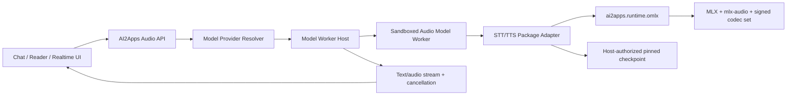

# AI2Apps MLX TTS/STT Model Package 开发技术方案

状态：执行中（阶段 1、2 与 Chat 非实时闭环已落地；Detailed Transcription 隔离原型完成）
日期：2026-08-21
适用范围：Apple Silicon 上的 `ai2apps.runtime.omlx`、Model Worker Package、Chat 语音输入/朗读、文章朗读与后续实时语音交互。

## 1. 结论与核心决策

TTS/STT 应建立在现有 **Inference Runtime Provider + Model Worker Package** 架构上，不新增语音专用 Package 体系，也不新增账号认证、云端签名服务或模型 Package 自带的 HTTP 认证。

开发体验目标是“无需人工签名/认证”，但不建议让正式安装链路接受完全无签名的 `.ai2service`：

- 开发者不需要 AI2Apps Cloud 账号、Publisher 证书或 Apple Developer ID；
- 开发工具自动生成或复用本机开发 Ed25519 密钥，自动登记本地开发 Publisher，并完成构建、验签和安装；
- Model Worker 继续复用 Host 生成的短期内部令牌，Package 不读取、不记录也不依赖令牌格式；
- 只有 Harness/源码调试可以完全不生成签名，但它不代表真实安装和 Sandbox 验收；
- 正式发布仍沿用现有 Publisher 签名和 Runtime 发布流程，不为音频模型降低安全门槛。

每个语音模型 Package 原则上只包含 manifest、Adapter 和少量模型专属配置。MLX、`mlx-audio`、FFmpeg/音频编解码依赖及其他原生库由 `ai2apps.runtime.omlx` 提供，模型权重由 Host 按固定 revision 下载和授权。

### 1.1 2026-08-21 实施快照

已完成并进入测试基线：

- Model Worker multipart、请求级授权 part、WAV 校验、临时目录全路径清理和 Host 内部认证透传；
- `ai2apps.audio-capabilities/v1`、能力校验、静态 voices/capabilities 查询，以及高级能力默认拒绝语义；
- Mock STT/TTS Package 和可复用 `OmlxAudioAdapterBase`、`OmlxSTTAdapter`、`OmlxTTSAdapter`；
- `ai2apps.runtime.omlx` 1.1.0 源码清单及 `audio-stt/audio-tts/audio-processing` capability；
- 真实 SenseVoice Small STT 与 Qwen3-TTS 0.6B CustomVoice Package 源码、固定 checkpoint revision、SBOM、平台要求和开发归档；
- Chat 非实时语音输入/输出源码：本地 Web Audio 录音、浏览器端 PCM16 WAV 编码、STT 回填、TTS 播放/停止、voice、emotion 和自动朗读；
- 音频协议、Package、Adapter、multipart、能力描述和 Chat 模板的无 Metal 自动测试。
- SenseVoiceSmall 已按 FunASR Model License 1.1 完成项目授权确认；Package 保留 SenseVoice/FunASR 名称、原始来源、许可证正文、NOTICE 署名和 SBOM LicenseRef。
- 已使用固定 checkpoint revision 完成真实 Apple Silicon/Metal 冒烟：SenseVoiceSmall 成功转写测试 WAV，Qwen3-TTS 成功生成 24 kHz 单声道 WAV。

仍属于后续发布/实机验收而非已完成能力：

- Runtime 1.1.0 Developer ID 签名、公证、Cloud API 发布与干净 Mac 安装；
- 两个真实模型的完整性能、取消、长音频和内存回落测试；
- 匿名 diarization、获授权 Voice Profile 匹配/克隆、语速分析、独立情感 pipeline；
- `audio-streaming-v1`、VAD、partial/final、流式 PCM、背压与 barge-in。

静态能力描述必须只声明当前 Adapter 真正可执行的能力。未来增强可以升级 Package profile，但当前版本不得以“未来计划”为由宣称 `native` 或 `pipeline`。

### 1.2 SenseVoiceSmall 许可证决策记录

2026-08-21，项目负责人确认：

> AI2Apps 按照 FunASR Model License 使用和发布 SenseVoiceSmall，并保留 SenseVoice/FunASR 模型名称、来源链接、许可证及署名信息。

对应发布物必须同时满足以下条件：

- 使用官方 `FunASR Model License 1.1`，不得把模型权重标记为 Apache-2.0；
- 在 Package 的 `META/licenses/` 保存完整许可证正文；
- 在 `META/NOTICE.md` 记录原始模型、作者、来源、固定 revision、MLX 转换来源和本项目修改；
- `ai2apps.json`、`service.yaml` 与 SPDX SBOM 保留一致的许可证和 attribution；
- Discover 详情页展示模型名称、原始来源、许可证和 NOTICE，安装归档不得删除这些文件。

### 1.3 2026-08-22 高级模型与标点实施快照

以下源码与静态 Package 契约已经落地：

- `SenseVoice Small 0.2.0` 强制依赖 `ai2apps/punctuation-restorer`；Host 在
  非流式转写返回前调用固定 revision 的 CT-Transformer INT8 ONNX Worker，
  返回 `raw_text` 与恢复后的 `text`，并校验恢复结果不得改变原文字词；
- 安装 SenseVoice 时，Host 先自动下载并激活其隐藏的标点 checkpoint，再
  准备 SenseVoice checkpoint；依赖失败会使安装失败，标点模型不出现在普通目录；
- `Qwen3-ASR 0.6B 4-bit` 独立 Package，使用模型原生标点和 prompt biasing；
- `Qwen3-TTS 1.7B` Package 同时声明可独立下载的 CustomVoice 8-bit、
  Base 5-bit 参考音色和 VoiceDesign 5-bit 三个固定 checkpoint；
- Package TTS 参考音频从 Base64 API 输入转换为 Worker multipart 授权 part，
  只在请求生命周期内暴露临时 WAV 路径；
- Chat 根据 Package capability 显示 VoiceDesign/CustomVoice 声音指令，以及
  Base 参考 WAV/逐字稿输入；参考音频只保存在当前页面内存中；
- `VibeVoice Realtime 0.5B 4-bit` Package 支持长文本和最多 32 个 dialogue
  turn 的多角色请求；
- `ai2apps.runtime.omlx 1.3.0` 增加固定 `sherpa-onnx 1.13.4`、`PyAV 18.0.0`，
  以及 `onnx`、`text-punctuation`、`audio-codecs` capability；
- Host 支持 WAV、PCM16、MP3、M4A/AAC、FLAC、Ogg/Opus 和 WebM 输入，
  在进入 Worker 前统一解码为受校验的 PCM WAV；非流式 TTS 支持同组输出格式。

固定 checkpoint、能力声明、许可证/NOTICE/SBOM 和开发归档构建均已完成
源码验证。CT-Transformer 已用真实模型完成中文标点冒烟；大型 ASR/TTS
权重仍需在发布候选 Runtime、Apple Silicon/Metal 与目标内存档位上完成
下载、质量和压力验收后才可进入正式仓库。

### 1.4 2026-09-04 WhisperX 能力路线决策

项目采用“先实现底层模型的 MLX/Metal 推理，再实现可组合流水线，最后形成端到端 MLX-WhisperX”的路线。目标是实现 WhisperX 的能力和兼容输出，而不是把原版基于 PyTorch、faster-whisper/CTranslate2 和 pyannote 的 Python 包直接塞入 oMLX Runtime。

工作名称 `MLX-WhisperX` 表示 AI2Apps 的 MLX/Metal 原生实现；在没有形成对上游代码的实质性兼容或移植关系前，对外应使用“WhisperX-compatible MLX pipeline”，避免让用户误认为它是 WhisperX 官方发行版。若复用上游源码或算法实现，必须保留 BSD-2-Clause 许可和归属说明。

产品边界：这套能力属于字幕、会议纪要、媒体索引等 **Detailed Transcription**，
不作为 Chat 的 STT 后端。Chat 优先低首字延迟和实时交互；Detailed Transcription
优先完整上下文、强制对齐、说话人归属和可审计的批处理结果。两者可以复用底层 Qwen
ASR checkpoint，但使用不同 endpoint、默认参数、延迟预算和能力声明。

这一路线遵循以下原则：

- 能力优先：以准确转写、VAD、词级强制对齐、说话人分离、长音频批处理和兼容结果结构为验收目标；
- MLX 原生：核心模型优先使用 MLX/Metal，不在 `ai2apps.runtime.omlx` 中引入 Torch/CUDA/CTranslate2；
- 模型可替换：不把“WhisperX 能力”等同于某一组 gated checkpoint，允许选用许可证和离线分发更合适的等价底层模型；
- 流水线可组合：Whisper、VAD、Aligner、Diarizer 和 Speaker Assignment 是独立能力，供其他 STT 模型复用；
- 离线默认可用：默认发行组合不得要求 Hugging Face Token 或运行时联网。需要用户另行接受协议的模型只能作为可选导入源；
- 结果可追溯：每个 segment/word 的时间戳和 speaker 字段必须标明来自 native 模型还是 pipeline，以及对应模型 revision。

### 1.5 2026-09-04 MLX-WhisperX 隔离 MVP 实施快照

已在 `experiments/mlx_whisperx/` 落地完全独立于 App、Runtime、Package 注册和
实例模型库的可运行 MVP：

- 使用当前开发环境的 `mlx-audio` Whisper 在 Metal 上完成转写和 native
  attention word timestamps；
- 使用确定性 Energy VAD 完成低配前置切段；高配完整路径已使用同一次 MLX
  Sortformer 推理同时提供训练型 speech activity 与 diarization；
- 使用 MLX Sortformer 完成最多四说话人的 diarization，并按时间交集将匿名 speaker
  回填到 segment/word；零时长 word 确定性继承 segment speaker；
- 输出 `ai2apps.mlx-whisperx-result/v1`；英文逐词与简体中文逐字的独立 MLX
  Wav2Vec2 CTC forced alignment 已落地并完成真实 Metal 验证，未配置或不支持的语言默认拒绝，可显式
  选择 Whisper native attention timing fallback，且不会把 fallback 冒充 CTC；
- checkpoint 采用公开、无需认证的仓库，锁定 immutable revision、权重 SHA-256 和
  本地实验路径；模型二进制与生成物均不进入 Git；
- 自动测试 38 项通过；真实 M5 Max Metal 单说话人、双说话人以及
  Whisper + CTC forced alignment + Sortformer 三模型完整链路通过。

第二轮隔离验证又增加公开真人 LibriSpeech FLAC：Whisper 固定 greedy 解码，VAD
region 与最终时间轴双重裁剪；CTC 使用默认最长 30 秒的相邻 segment 窗口，使长音频
激活内存受窗口约束。同参数完整流水线复跑 JSON 逐字节一致。CTC word score 过滤为
显式可选参数，默认 `0.0` 不静默删词；启用时 effective threshold 写入 feature
execution。

第三轮以中文和英文为首要语言补齐中文对齐路径。公开免认证中文 checkpoint 经相同
adapter 直接运行在 MLX/Metal；4.138 秒简体中文样本得到 19 个逐字 timestamp、CTC
score 和匿名 speaker，进程总耗时 2.88 秒、最大 RSS 约 2.01 GiB，重复运行 JSON
逐字节一致。中文按字构造 target，不插入英文 word delimiter。英文公开真人样本同步
回归，4 段/42 词输出与此前逐字节一致。当前中文词表为 `Hans`，Whisper 简体提示已
通过 smoke，但不能代替通用繁简转换；繁体语义字符继续 fail closed，后续应将文本
normalizer 作为独立、版本化 pipeline capability。

第四轮建立固定 revision、逐文件 SHA-256 的中英文 FLEURS 真人 mini-benchmark，
并加入公开免认证的 `whisper-small-asr-6bit` 与 `whisper-large-v3-turbo-asr-4bit`
候选。5 条中文上 tiny/small/turbo CER 分别为 155.38%/40.51%/6.67%；5 条英文上
WER 分别为 15.53%/18.45%/6.80%。Turbo 的中文/英文 RTF 为 0.056/0.073，含
Sortformer 进程最大 RSS 约 1.21 GiB，是当前 M5 Max 档技术首选。其转换仓库未填写
license 元数据，正式 Package 前必须完成来源和再分发审查；低内存档尚无中文质量
通过者。该样本量只用于快速筛选，不能替代完整测试集。Small 的英文聚合值被一条
局部重复拉高，不能据此否定 larger checkpoint。
评测确认裸 Whisper 会受尾部静音诱发重复，Energy VAD 会过切和漏音，因此完整质量
路径应使用训练型 VAD。同期修复 BCP-47 到 Whisper 主语言码的接口映射；并确认当前
`mlx-audio 0.4.3` 的 beam decoder 尚未实现，不能虚假声明 beam search 支持。

第五轮完成 full split 与十分钟级长音频门槛。Turbo 4-bit + Sortformer 在完整
FLEURS-derived test split 上处理中文 945 条/3.07 小时、英文 647 条/1.77 小时，
分别得到 CER 16.48%、WER 7.82%，RTF 0.02655/0.02845；mini-set 的中文 6.67%
被证实偏乐观。十分钟级 `Whisper -> CTC -> speaker assignment` 中英文均通过
Metal、时间戳边界和单调性校验；敏感 Energy VAD 与 30 秒窗口 Sortformer 解耦时，
合成长测 CER/WER 为 20.92%/18.65%。长测同时增加原子 checkpoint/resume、固定
长音频 composer、CTC 词表外字符的 `skip/reject` 策略，以及有界 Sortformer
窗口。窗口化返回 `speaker_identity=window_local`：它解决四槽模型在任意多人长
录音上的漏检/错误合并，但跨窗口同人聚类、真实会议 DER、噪声和重叠语音仍未通过。
因此当前结论是批处理 MLX-WhisperX 核心能力成立，尚不进入 App/Runtime 集成。

第六轮将已经发布的 `Qwen3-ASR 0.6B 4-bit` MLX Package 后端接入同一独立能力
流水线，而非重复移植模型。完整 FLEURS-derived split 上，Qwen 中文 CER 12.67%，
较 Whisper Turbo 的 16.48% 相对减少 23.1%；Qwen RTF 0.01408，也快于 Whisper
的 0.02655。英文则是 Whisper 7.82% 优于 Qwen 8.97%，因此确定“中文 Qwen、英文
Whisper”的语言感知主模型路由。十分钟完整 `ASR -> CTC -> speaker assignment`
压力测试中，Qwen 中文 CER 8.87%、英文 WER 16.59%，均生成与 Whisper 相同的
segment、字词时间戳、score 和 speaker 结构且通过边界校验。Qwen 本身不必原生
输出 WhisperX 全字段；统一 pipeline 负责补齐并逐字段报告 provider。数字书写规范、
中英混说、技术编号、真实会议 DER 和跨窗口 speaker clustering 仍需继续验证。

第七轮完成此前 1～4 项推进目标。新增公开免认证的 Qwen3-ASR 1.7B 4-bit 高质量档：
完整 FLEURS-derived split 中文 CER 11.99%、英文 WER 7.04%，RTF 0.01888/0.02362，
均优于本机 Whisper Turbo 基线；0.6B 保留为 compact 档。Qwen3 ForcedAligner 0.6B
8-bit 已接入，真实中文 23/23 字有效，10 分钟中文覆盖率 98.93%，并能处理数字和
拉丁单位；输出显式报告 total/aligned/coverage，不隐藏零长度预测。

Sortformer 不再默认使用 window-local speaker ID，而是复用 `mlx-audio 0.4.3` 已有
AOSC speaker cache/FIFO streaming API，在 5 秒块之间保持最多四个全局匿名 speaker
slot。AMI IS1001a 四人真实会议产生四个全局 slot；阈值 0.20、0.25 秒 collar 下含
重叠 DER 34.23%，其中 confusion 1.52%、miss 30.05%。因此跨块身份能力成立，但
会议弱语音/重叠召回仍需优化，不能标为最终生产质量；超过四人只能显式选择
window-local，不能假装具有全局身份。

独立开发 Package/API 已落地 `package.manifest.json`、能力查询和
`POST /v1/audio/transcriptions/detailed`。API 支持 compact/quality、segment/word
timestamps、匿名 diarization、语速分析与 `reject|compatibility` 策略；情绪兼容模式
只能返回带 `status=fallback` 的 neutral，严格模式返回 `unsupported_feature`；未经
授权的 speaker recognition 一律拒绝。真实 HTTP multipart 成功/拒绝路径均已验收，
自动测试 45 项通过。该服务明确 `chat_integration=false`、`streaming=unsupported`，
本轮没有修改或注册 AI2Apps App、Runtime、Chat 或实例模型库。

第八轮补齐两场 AMI 会议端到端门槛、噪声回归和 ACPF 候选源码。Sortformer 阈值
0.20 在 IS1001a/IS1009a 的含重叠 DER 为 34.23%/20.26%；Qwen3-ASR 1.7B +
Qwen3 ForcedAligner + MeetingEnergyVAD 严格对齐正文的全文 WER 为 32.63%/32.95%，正确词
speaker accuracy 为 92.66%/84.73%，permutation-aware cpWER 为 37.29%/52.53%。
第二场暴露的重复幻觉已通过“只有正时长 forced-alignment 单元才能进入最终字幕”
修复，丢弃数量和移除字符数写入 feature provenance。固定 5 条 FLEURS 白噪声回归
中，英文 WER 从 5.83% 增至 10/5 dB 的 8.74%，中文 CER 从 10.26% 增至
10.26%/11.79%。

同 speaker 短缺口的 0.25/0.5/1/2 秒补偿也完成联合验证。1 秒可把两场 DER 降至
24.67%/14.05%，但联合词归属 cpWER 反而升至 39.17%/54.31%；0.25 秒在第二场也
退化。因此正式默认保持模型原生 0.12 秒，更长桥接仅作为显式实验参数，不能用单一
DER 指标覆盖字幕 speaker attribution 的退化。

`package_candidate/` 与 `stage_package_candidate.py` 已固化 compact/quality、两个
内部辅助 checkpoint、Worker Adapter 和自包含源码 staging。候选使用 dedicated
`audio_detailed_transcription` model type/operation、`chat_eligible=false`，并要求
`audio-detailed-transcription-v1`。Runtime 1.6.0 已正式发布，Host schema、专用路由与
能力验证现已接受该类型，同时仍以精确类型隔离 Chat `audio_stt`。正式 Package 源码已
staging 到 `packages/omlx-model-detailed-transcription/`；四个 checkpoint 均声明真实
distribution ID，四个 identity-matched distribution 已在 Registry 发布并完成匿名回读，可以进入
正式 Package 签署。0.1.1 已发布并完成真实安装，但首次推理发现上传音频路径在 macOS
沙箱内不能调用 `Path.resolve()`；0.1.2 已修复该问题，并补充 multipart 布尔参数解析。
相关合同、流水线、Host、Discover mapping 与发布脚本联合回归 136 项通过。0.1.2 已用注册 Publisher 私钥正式发布，
并通过匿名 Snapshot v109、完整 artifact/envelope 等值校验以及公共下载件的中英文真实
managed-service 推理；发布回执见
`docs/ai2apps-mlx-whisperx-detailed-transcription-0.1.2-release.md`。

四个固定 HF checkpoint 均已找到 ModelScope `mlx-community` 同名 MLX 镜像。对
MS Git HEAD、LFS object SHA-256 与本地固定 HF 快照逐文件核验后，全部运行必需文件
一致；MS 只额外包含 `configuration.json`，通过 `allow_patterns` 排除。0.6B ASR、
1.7B ASR、ForcedAligner 和 Sortformer 的四份 identity-matched 双源 distribution
已用现有正式 Publisher key 完成 metadata-verified 构建、Cloud
发布与匿名回读。Sortformer 按 NVIDIA Open Model License 使用条件式分发、许可证
交付、明确同意和规定署名，不把它误标成 Apache-2.0。

真实命令、冷启动耗时、峰值内存、checkpoint 锁定信息、已知识别误差和未通过门槛见
`experiments/mlx_whisperx/VALIDATION.md`。Host 的 dedicated model type 属于可交付的
Desktop 合同变更，已登记到 Desktop 下一版本账本 NXR-016；Package 本身继续独立发布。

### 1.6 2026-09-05 双轨人声提取隔离实验

`experiments/mlx_demucs/` 已建立独立于 App、Runtime、Registry 和已安装 Package 的
双轨分离实验。统一结果为 `ai2apps.audio-separation-result/v1`，输出等长的
`dialogue.wav`、`background.wav` 与 `separation.json`。背景轨固定采用
`mixture - dialogue`，确保模型没有识别为人声的能量不会丢失，并保持原始时间轴。

官方 PyTorch `htdemucs` 仅作为转换与质量 oracle；它不进入 Runtime。公开 80.2 MiB
checkpoint 已成功加载，确认 533 个 tensor、41,984,456 个参数，并可导出为仓库外的
原始布局 NPZ。13.69 秒真人语音加确定性合成伴奏的 CPU smoke 中，输入/输出 dialogue
SI-SDR 为 3.12/17.19 dB，提升 14.07 dB，RTF 0.2485，残差双轨重构最大误差
`7.45e-9`。这些结果建立了双轨合同和 PyTorch 质量基线。

该路线继续复用 Runtime 1.6.0；只有确认缺少不可由 Package 提供的 MLX/Metal 算子时
才考虑升级 Runtime。

同日已经完成第一个 MLX 数值门槛：`n_fft=4096`、reflection-centered padding、periodic
Hann window、orthonormal FFT 的 STFT/iSTFT 已在 Metal 实跑。44,032 点双声道输入对
PyTorch spectrum 最大绝对误差 `5.34e-8`，MLX 往返最大绝对误差 `1.34e-7`。下一步从
单个 encoder/decoder block 开始逐层对齐。

第一组 block parity 随后通过：MLX 已覆盖 time/frequency HEncLayer、HDecLayer、两层
dilated DConv、PyTorch-compatible GroupNorm、GELU/GLU/LayerScale，以及四种卷积权重
布局转换。固定 checkpoint 的第一层 encoder 和最终 decoder 共六个输出形状全部一致；
peak-normalized error 与 relative RMSE 均低于 1%，最差项为 frequency decoder 输出的
0.557%/0.646%。

四层完整网络随后完成：MLX 已覆盖精确 1D/2D 位置编码、五层交替 self/cross
Transformer、bottom channel projection、全部 skip connection、复数频谱重排和最终
iSTFT。完整 7.8 秒窗口输出 `[1,4,2,343980]` 与 PyTorch 形状一致，最终波形的
peak-normalized error 为 0.389%，relative RMSE 为 0.316%。`MlxDemucsBackend` 也已
实现官方兼容的居中补齐、25% 重叠、三角权重和任意长度 overlap-add；9 秒双分块输出
相对 PyTorch 的 relative RMSE 为 0.548%。至此 MLX-native 推理原型成立，且没有发现
需要升级 Runtime 1.6.0 的算子缺口。

同机纯 MLX 7.8 秒窗口冷/热耗时为 0.279/0.244 秒，对应 RTF 0.0358/0.0313；MLX
allocator 报告峰值统一内存 1,611,263,336 bytes，完成后 active memory 回落至 24 bytes。
该数字随后作为首版 Package 的 Publisher benchmark 基础；更广泛硬件与
whole-process RSS 对照仍属于后续目录评测。

checkpoint 已找到无需认证的同仓库双源：Hugging Face 与 ModelScope 的
`mlx-community/demucs-mlx` 均提供 `htdemucs.safetensors` 和配置文件。两边完整下载后
逐字节一致；权重为 168,005,865 bytes、SHA-256
`339d267a7a6983a11eedbdc00413c602a65e9b9103f695fb5c2b2a481cd9d297`。该制品采用
MLX-native 卷积布局和 split Q/K/V，实验已增加只在内存中执行的格式适配器；适配后
与官方 PyTorch state 的 533 个 key、shape 和 float32 value 全部一致，因此 Package
无需再发布一份重复 raw NPZ。固定 revision 分别为 HF
`d4519e24ddc2dd4a11d56a193092433d852c3961` 与 MS
`3e2b356248c71ec999090ca6e5eebc65654b8893`。正式 distribution
`dist_ai2apps_mlx_demucs_htdemucs_d4519e24_v1` 已完成全双端下载校验、签名发布和
匿名 Index v54 回读；许可证审查记录了 HF/model card 标注 MIT、MS 仓库 metadata
标注 `other` 的不一致，Package 随附上游 MIT notice。

现有英文和中文语音 smoke 分别叠加确定性伴奏后，通过该 safetensors MLX 路径得到
+17.22 dB 和 +18.73 dB dialogue SI-SDR 提升，RTF 为 0.0500 和 0.0440；这证明中英文
短语音的基础人声提取有效，但仍不能替代真实会议/影视数据和分离前后 CER/WER 评估。

独立 `ai2apps/model-demucs-mlx` 0.1.0 已于 2026-09-06 发布，并通过 Runtime 1.6.2、
公开双源 checkpoint、干净实例 Managed Service Sandbox 和 9 秒 multipart 推理验收。
后续质量门槛是扩大真实中文/英文会议与视频的分块连续性数据集，并评估分离前后
CER/WER；这些指标不改变首版已经冻结的三种 profile 语义。

## 2. 目标与非目标

### 2.1 目标

1. 支持独立安装、升级、启停和卸载 STT/TTS 模型 Package。
2. 对上层提供稳定、模型无关的音频 API，同时保留 OpenAI 兼容入口。
3. 明确声明每个模型是否支持流式、时间戳、说话人分离、预训练音色、声音克隆、语速和情绪控制。
4. 对模型不支持的高级参数提供可预测的 `reject`、`ignore` 或 `fallback` 行为，并把实际执行结果返回给调用方。
5. 在 Package Worker 中隔离模型代码；禁止可安装音频 Adapter 进入 Host 进程。
6. 为 Chat 语音输入/朗读、文章朗读、角色化小说朗读和实时语音交互提供渐进式实现路径。

### 2.2 非目标

- 第一阶段不实现全双工、随时打断的实时语音对话。
- 不把声纹训练、数据集制作、模型微调混进一次 TTS 推理请求。
- 不让 Package 自行联网下载权重，也不允许 Package 接收任意本地绝对路径。
- 不把情绪识别等独立能力伪装成所有 STT 模型的原生能力。
- 不承诺每个后端都支持全部高级参数。

## 3. 当前基础与差距

### 3.1 已具备

当前 Model Worker v1 已定义以下模型类型和操作：

| 能力 | `model_type` | Worker operation | 对外入口 |
|---|---|---|---|
| 语音识别 | `audio_stt` | `audio_transcription` | `POST /v1/audio/transcriptions` |
| 语音合成 | `audio_tts` | `audio_speech` | `POST /v1/audio/speech` |
| 音频处理/STS | `audio_processing` | `audio_process` | `POST /v1/audio/process` |

现有 Host 路由已经优先解析 Package model，再代理到对应 Worker。当前 oMLX 内置音频引擎已经具备以下基础参数：

- STT：语言提示、prompt、流式文本、最大输出 token、Whisper word timestamps；
- TTS：预训练 voice、language、instructions、speed、参考音频/参考文本、采样参数、WAV/PCM/MP3/M4A/AAC/FLAC/Ogg/Opus/WebM、部分模型的原生流式输出；
- 音色枚举：`GET /v1/audio/voices?model=...`。

打包 Framework 已安装固定版本的 `mlx-audio`，因此语音 Package 不应重复携带它。

### 3.2 当前剩余差距

1. Runtime 1.1.0 尚需走正式签名、公证、Cloud API 发布和干净设备安装链路。
2. 当前真实 Adapter 内部保持稳定的 PCM WAV 闭环，Host 已负责压缩格式编解码；背压、实时 session 和 MLX 内部协作式取消仍待阶段 4 实现。
3. SenseVoice 当前只对外承诺已经透传的转写、语言和 segment 时间戳；情感、语速、diarization 与声纹匹配仍需独立实现并补齐 provenance。
4. Qwen3-TTS 的编解码格式由 Runtime/Host 统一提供；模型专属的 speed、参考音色质量和 voice profile 仍需真实权重验收。
5. Runtime 不调用外部 `ffmpeg`/`ffprobe` 可执行文件；固定 PyAV wheel 内置 FFmpeg 库，编码和解码均在 Host 进程内完成。
6. 需要在真实 Apple Silicon/Metal 环境完成模型加载、内存释放、取消和实时率测试；无 Metal 环境只能覆盖协议和 mock engine。

## 4. 总体架构



职责边界：

| 组件 | 职责 |
|---|---|
| Base App / Host | 鉴权、模型解析、权重下载、Package 验签、权限审批、Worker 生命周期、API 兼容层 |
| `ai2apps.runtime.omlx` | 固定 CPython、MLX、`mlx-audio`、公共音频依赖、可信 Worker launcher |
| STT/TTS Model Package | 模型声明、Adapter、模型专属参数映射、能力描述、少量静态资产 |
| Checkpoint | 模型权重、官方预训练音色及模型配置；由 Host 固定 revision 管理 |
| Voice Profile | 用户授权的参考音频、派生 embedding/codec token、同意记录和删除状态；不属于不可变 Package |

## 5. Package 设计

### 5.1 推荐目录

```text
omlx-audio-stt-example/
├── service.yaml
├── ai2apps.json
├── src/
│   └── adapter.py
├── assets/
│   └── capability-profile.json
└── META/
    └── sbom.spdx.json
```

TTS 使用相同结构。权重、用户声音样本、运行缓存和模型生成结果均不得放进 Package。

### 5.2 STT manifest 示例

```yaml
schema: ai2apps.service/v1
id: ai2apps.model.stt.example
name: Example MLX STT
version: 0.1.0

publisher: {id: ai2apps}

runtime:
  mode: process
  protocol: ai2apps-model-worker/v1
  provider: ai2apps.runtime.omlx
  adapter: src/adapter.py:create_adapter

requires:
  services:
    - id: ai2apps.runtime.omlx
      version: ">=1.1.0,<2.0.0"
      optional: false
      capabilities: [mlx, model-worker-v1, audio-stt]

models:
  - id: ai2apps.model.stt.example/default
    display_name: Example STT
    model_type: audio_stt
    upstream_id: mlx-community/example-stt
    capabilities:
      - speech_recognition
      - streaming_transcription
      - word_timestamps
    weights:
      provider: huggingface
      repo_id: mlx-community/example-stt
      revision: 0123456789abcdef0123456789abcdef01234567
      preparation: {recipe: native}
    metadata:
      family: example
      languages: [zh, en]
      audio_capability_profile: assets/capability-profile.json

permissions:
  network: {outbound: false}
  model_weights:
    huggingface_cache: read
    reason: Read the pinned STT checkpoint prepared by the Host.
  accelerator:
    metal: true
    reason: Run STT inference on Apple GPU.
```

### 5.3 TTS manifest 示例

TTS 使用 `model_type: audio_tts`，并按实际能力声明：

```yaml
capabilities:
  - speech_generation
  - named_voices
  - speed_control
  - instruction_control
  - reference_voice
  - streaming_audio
```

能力名称必须代表真实可验证行为，不能因为统一 API 接受某参数就宣称模型原生支持该能力。

### 5.4 Runtime capability

`ai2apps.runtime.omlx` 的 `service.yaml` 和 `META/runtime-manifest.json` 应按已实现能力同步增加：

```text
audio-stt
audio-tts
audio-processing
```

只有真正完成实时分块、背压和取消验收后才增加 `audio-streaming-v1`。`audio-sts` 只有在成为独立、稳定且有测试的 operation 后再声明，不能作为模糊别名提前发布。

增加 capability 后升级 Runtime minor version。Package 通过 `requires.services[].capabilities` fail closed，避免安装到不含 `mlx-audio` 或不支持所需协议的旧 Runtime。Runtime capability 只表达后端和协议能力；模型原生能力由模型自己的 `audio-capabilities/v1` 声明。

## 6. Adapter 设计

### 6.1 公共类

新增 `ai2apps/model_worker/omlx_audio.py`：

```python
class OmlxAudioAdapterBase:
    async def start(self): ...
    async def stop(self): ...
    async def engine_for(self, model_id, runtime_options=None): ...

class OmlxSTTAdapter(OmlxAudioAdapterBase):
    async def invoke(self, request): ...

class OmlxTTSAdapter(OmlxAudioAdapterBase):
    async def invoke(self, request): ...
```

公共实现负责：

- 使用 `context.checkpoint_for()` 定位唯一获准 checkpoint；
- 按 model/runtime option 复用或切换引擎；
- 将同步 MLX 推理放入 Runtime 统一执行器；
- 在 `stop()`、切换模型和取消时释放模型并执行 `mx.synchronize()`/`mx.clear_cache()`；
- 统一错误码、指标、日志脱敏和能力检查；
- 禁止 Package 自行启动 FastAPI/Uvicorn、监听端口或管理认证。

模型 Package 通常只需要继承公共 Adapter，并覆盖 `create_engine()` 或少量参数映射。

### 6.2 Worker 输入

协议必须支持三种传输形态，并保持 Adapter 与 HTTP 框架解耦：

1. JSON：短文本、控制参数、小型引用数据；
2. multipart：文件上传和一次请求内的参考音频；
3. session stream：实时麦克风帧、增量文本、实时合成音频和控制事件。

HTTP Worker Server 负责解析 multipart，把每个文件安全地落入“请求级 Worker 私有临时目录”，再构造稳定的 `ModelWorkerPart`；Adapter 不得依赖 FastAPI `UploadFile`、multipart parser 或 Host 文件路径。

建议的内部请求合同：

```json
{
  "operation": "audio_transcription",
  "payload": {
    "model": "mlx-community/example-stt",
    "audio": {"part": "file"},
    "language": "zh",
    "stream": false
  },
  "parts": {
    "file": {
      "path": "<worker-private-request-path>",
      "media_type": "audio/wav",
      "filename": "speech.wav",
      "size": 182044,
      "sha256": "..."
    }
  }
}
```

`parts[].path` 只存在于 Worker 内部 Python 对象，不在 HTTP JSON 响应、日志或 Package 元数据中暴露。文件必须只读授权给当前 invocation，并在成功、错误、客户端断开、取消、超时和 Worker 退出时清理。

外部 Host 接受声明的常用压缩格式并统一规范化；Worker 边界只接受单声道 PCM WAV。Host/Worker 必须同时限制：

- 上传字节数；
- 解码后时长、采样数、采样率和声道数；
- MIME、文件 magic 和容器实际内容的一致性；
- multipart part 数量、文件名长度和文本字段长度。

不能只靠压缩文件大小防止解码炸弹，也不能相信扩展名或浏览器上报的 MIME。

### 6.3 实时 Session 合同

实时能力不复用一次性 multipart 请求，而使用有序 session event。传输可以先实现 WebSocket，未来需要浏览器回声消除和弱网音频时再加入 WebRTC；两者必须映射到相同的内部事件模型。

客户端到 Host 的基础事件：

```text
session.start
input_audio.configure
input_audio.append
input_audio.commit
response.create
response.cancel
session.close
```

Host 到客户端的基础事件：

```text
session.ready
input_audio.speech_started
input_audio.speech_stopped
transcript.partial
transcript.segment
transcript.final
response.text.delta
response.audio.delta
response.audio.done
response.cancelled
error
```

所有事件必须包含 `session_id`、单调递增的 `sequence` 和可关联的 `request_id`。音频帧必须声明 format、sample rate、channels 和 frame duration。服务端必须定义队列上限、背压、高水位丢弃策略以及断线恢复边界，不允许无限缓存麦克风或 TTS 数据。

实时 STT 的 `partial` 可以修订，但 `final` 不可回滚；speaker/emotion 结果允许随 pipeline 完成而通过带 segment id 的 update 事件补充。实时 TTS 必须允许 barge-in：收到用户重新开口或显式 cancel 后，停止播放、取消 Chat 生成，并取消或回收 TTS Worker。

### 6.4 Worker 输出与取消

- STT 非流式：统一 JSON；
- STT 流式：SSE `transcript.text.delta`/`transcript.text.done`，后续增加 segment、speaker 和 vad 事件；
- TTS 非流式：`ModelWorkerResponse` 返回真实音频 MIME；
- TTS 流式：二进制 PCM chunk 或有 framing 的音频事件，必须携带 sample rate、channels、sample width、sequence 和时间基准；
- 所有流必须响应取消，不允许在客户端断开后继续占用 GPU。

取消分两级：

1. 协作式取消：生成器在音频 chunk、segment 或 decode step 之间检查 cancel token；
2. 强制取消：后端是不可中断的单体 native 调用时，Host 在取消超时后终止并重建该 Worker。

`asyncio.to_thread()` 的 Task 被取消并不代表底层 MLX 调用停止，因此不能把它当作完整取消实现。第一版规定每个音频 Worker 同时只执行一个 GPU invocation，其他请求进入有界队列；流结束或中止后才释放 invocation lock。

## 7. 统一 API 与高级能力

### 7.1 兼容层和扩展层

保留 OpenAI 兼容入口：

- `POST /v1/audio/transcriptions`
- `POST /v1/audio/speech`

AI2Apps 高级能力以可选参数扩展，并增加模型能力查询：

- `GET /v1/audio/models/{model}/capabilities`
- `GET /v1/audio/voices?model=...`
- 后续：`POST /v1/audio/voice-profiles`
- 后续实时协议：`/v1/realtime` 或独立 WebSocket/WebRTC session API

OpenAI 兼容入口保持最小兼容语义。说话人、声纹、情绪、fallback 执行状态等 AI2Apps 扩展通过专用扩展响应、`X-AI2Apps-*` 响应头或实时事件暴露；TTS 原始音频 body 中不嵌入 JSON。调用高级能力前，客户端应先读取签名能力描述并完成 preflight。

### 7.2 STT 建议输入

```json
{
  "model": "...",
  "language": "zh",
  "prompt": "专有名词提示",
  "stream": false,
  "timestamps": "word",
  "diarization": {
    "enabled": true,
    "min_speakers": 1,
    "max_speakers": 4
  },
  "speaker_recognition": {
    "mode": "anonymous_or_match",
    "candidate_profile_ids": ["vp_alice", "vp_bob"],
    "minimum_confidence": 0.82,
    "unknown_label": "speaker_unknown"
  },
  "speech_rate_analysis": true,
  "emotion_recognition": true,
  "compatibility": {
    "unsupported": "reject"
  }
}
```

统一输出：

```json
{
  "text": "...",
  "language": "zh",
  "duration": 12.4,
  "segments": [
    {
      "id": 0,
      "start": 0.0,
      "end": 2.1,
      "text": "...",
      "speaker": "speaker_0",
      "speaker_match": {
        "profile_id": "vp_alice",
        "confidence": 0.91,
        "status": "pipeline"
      },
      "speech_rate": {
        "words_per_minute": 152.0,
        "status": "pipeline"
      },
      "emotion": "neutral",
      "words": []
    }
  ],
  "features": {
    "timestamps": {"status": "native"},
    "diarization": {"status": "pipeline"},
    "speaker_recognition": {"status": "pipeline"},
    "speech_rate_analysis": {"status": "pipeline"},
    "emotion_recognition": {
      "status": "fallback",
      "value": "neutral",
      "reason": "model_unsupported"
    }
  }
}
```

说话人相关能力分为两层：

- 匿名 diarization：只区分 `speaker_0`、`speaker_1`，不判断身份；
- 指定角色声纹匹配：只在调用方明确提供、且当前用户有权使用的 Voice Profile 候选集合内匹配。低于阈值必须返回 unknown，禁止从本地全部声纹库做隐式身份搜索。

说话人分离、声纹匹配、语速和情绪识别可能来自独立 pipeline，不应默认归功于 STT 模型。每个字段必须携带来源状态、置信度（若有）、pipeline/model revision。若 UI 要求稳定字段，可以显式选择 fallback；默认建议 `reject`，避免把“平静”误当成模型识别结果。

### 7.3 TTS 建议输入

```json
{
  "model": "...",
  "input": "要朗读的文本",
  "voice": "speaker-name",
  "language": "zh",
  "speed": 1.0,
  "style": {
    "emotion": "warm",
    "intensity": 0.6,
    "instructions": "自然、克制地朗读"
  },
  "role": {
    "id": "narrator",
    "voice": "speaker-name",
    "voice_profile_id": null
  },
  "voice_profile_id": null,
  "reference": {
    "audio_part": null,
    "transcript": null,
    "consent_id": null
  },
  "response_format": "wav",
  "stream": false,
  "compatibility": {
    "unsupported": "reject"
  }
}
```

统一参数不等于统一实现。Adapter 根据 capability profile 将参数分为：

- `native`：模型原生支持；
- `pipeline`：通过安全、可说明的前后处理实现；
- `fallback`：使用显式兼容值；
- `ignored`：仅在调用方主动允许时忽略；
- `rejected`：返回 `unsupported_feature`。

建议默认规则：

| 参数 | 默认行为 |
|---|---|
| `voice` | 不支持时拒绝 |
| `speed` | 模型不支持时可选后处理，但必须标记 `pipeline` |
| `emotion`/`instructions` | 不支持时拒绝；只有显式允许才回退到 `neutral` |
| `voice_profile_id` | 不支持声音克隆时拒绝 |
| `reference.audio_part`/`reference.transcript` | 只允许模型明确支持 zero/few-shot voice 时使用；缺少授权或文本配对要求时拒绝 |
| STT diarization | 不支持且没有组合 pipeline 时拒绝 |
| STT speaker match | 没有获授权候选 Voice Profile、声纹 pipeline 或置信度不足时返回 unknown/reject，不猜测身份 |
| STT speech rate | 可由时间戳 pipeline 计算，但必须标记 `pipeline` |
| STT emotion | 默认拒绝；显式兼容模式才返回 `neutral/fallback` |

### 7.4 高级功能兼容与 fallback 协议

每个可选 feature 都产生一条 `FeatureExecution`，状态固定为：

```text
native      模型原生完成
pipeline    由已声明、可审计的组合 pipeline 完成
fallback    使用调用方显式允许的替代行为
ignored     仅在调用方显式允许 ignore 时出现
rejected    请求未执行并返回 unsupported_feature
```

调用方策略：

```json
{
  "compatibility": {
    "unsupported": "reject",
    "allow_pipeline": true,
    "fallbacks": {
      "emotion": "neutral",
      "speed": "postprocess",
      "speaker_recognition": "anonymous"
    }
  }
}
```

约束如下：

- 默认是 `reject`，绝不静默降级；
- fallback 必须由调用方逐 feature 允许，不能用一个全局宽松开关授权身份或声音克隆降级；
- `speaker_recognition -> anonymous` 只保留匿名说话人标签，不伪造角色身份；
- `emotion -> neutral` 表示合成时采用中性风格或识别结果未知，不表示模型识别出了 neutral；
- `reference_voice -> named_voice` 只有调用方指定替代 voice 才允许；
- 响应必须返回 requested/effective value、status、reason、provider 和 revision；
- 签名静态能力是上限，Worker 自检只能缩减能力，不能运行时扩权。

### 7.5 能力描述文件

建议为每个模型提供机器可读 `audio-capabilities/v1`：

```json
{
  "schema": "ai2apps.audio-capabilities/v1",
  "operations": ["audio_speech"],
  "languages": ["zh", "en"],
  "input_limits": {"max_text_chars": 8000},
  "streaming": {"native": true, "formats": ["pcm", "wav"]},
  "tts": {
    "named_voices": true,
    "reference_voice": false,
    "speed": {"mode": "native", "minimum": 0.5, "maximum": 2.0},
    "emotion": {"mode": "instruction", "values": []},
    "voice_profiles": {
      "mode": "unsupported",
      "requires_transcript": false,
      "max_reference_seconds": 0
    }
  },
  "stt": {
    "timestamps": {"segment": true, "word": false},
    "diarization": {"mode": "pipeline", "maximum_speakers": 8},
    "speaker_recognition": {"mode": "pipeline", "candidate_scoped": true},
    "speech_rate": {"mode": "pipeline"},
    "emotion": {"mode": "unsupported", "values": []}
  }
}
```

该文件必须是 manifest 的一等字段或受索引引用的签名资产，不能只藏在任意 `metadata` 中。Host 在安装时校验 schema，并可在不加载 checkpoint 的情况下用于 Discover、模型选择、voice 列表和请求 preflight。运行时以静态能力与 Adapter 自检结果的交集为准。Adapter 不得在运行时宣称超出签名 Package 元数据的权限或能力。

### 7.6 音轨分离能力声明

音轨分离不新增绑定具体模型的顶层类型，继续使用 `model_type: audio_processing` 和
`operation: audio_process`，在请求中以 `task: source_separation` 选择任务。模型必须在
`audio_capabilities.processing.separation` 声明：

- `native_stems`：checkpoint 真正直接预测的 stem；
- `profiles[]`：调用方可请求的稳定输出拓扑，每项包含 `id`、`mode`、`stems`；
- `derivation`：pipeline/fallback profile 的每条输出如何从原生 stem 或 mixture 得到；
- `default_profile` 与 `unsupported_profile_policy`：未支持 profile 是明确拒绝，还是经调用方
  授权后回退到默认 profile；
- `preserves_timeline`、`max_input_channels` 和可选采样率/长度限制。

首个 HTDemucs 声明原生 `drums/bass/other/vocals`，提供 `music_4stem` native profile，
以及 `vocals_instrumental`、`dialogue_background` pipeline profile。由于 vocals 并不严格
等于影视对白，后者必须携带限制说明；未知 profile 采用 `reject`，不静默替换语义。

统一执行结果继续使用 `ai2apps.audio-separation-result/v1` 的 `stems[]`，并在
`features.source_separation` 返回 requested/effective profile、status、derivation、provider
和 revision。这样未来接入原生 `dialogue/music/effects/ambience` 或更多 stem 的模型时，
只扩展声明和模型 Package，不改变上层结果容器。

### 7.7 音色转换能力声明

RVC、Seed-VC 等音色转换模型同样复用 `audio_processing` / `audio_process`，请求使用
`task: voice_conversion`。模型在 `audio_capabilities.processing.voice_conversion` 声明
`mode`、目标音色来源、是否支持检索、半音变调、清辅音保护、多说话人 ID、长音频分块和
流式模式。首个 MLX-RVC 后端接受 `semitones`、`retrieval_rate`、`protect`、`speaker_id`
和可复现 `seed`；不支持的参数必须拒绝，不能静默忽略。

`POST /v1/audio/process` 将上述通用字段作为 multipart form 数据转发给隔离 Model Worker。
RVC 的目标音色由所选签名模型 Package 决定。Seed-VC v2 则接收请求作用域内的
`reference` multipart 音频，并支持 `mode=timbre|voice`、扩散步数、语义/音色双 CFG、长度
调整与随机种子；参考音频不落为隐式 Voice Profile，也不允许用本地路径替换 checkpoint。
旧 FAISS 索引及 Seed-VC 的 PyTorch 权重仅可在可信离线构建环境转换；生产 Worker 只读取
safetensors，因此 Runtime 不包含 FAISS、Torch 或 torchaudio。

## 8. 声音克隆、训练音源与隐私

“训练音源”应拆成两个产品能力：

1. 零样本/少样本参考音频：推理时使用现有模型做 voice cloning；
2. 真正的音色训练/微调：独立异步任务，具有数据集、训练配置、资源配额和产物版本。

第一阶段只实现前者。推荐使用 Host 管理的 `voice_profile_id`，不要把用户文件绝对路径传给 Package：

- 导入时记录来源、用户同意、用途和允许范围；
- 原始音频与派生 embedding/token 放在独立私有数据区；
- Worker 只获得当前请求所需的只读临时授权；
- 支持列出、撤销和彻底删除 Voice Profile；
- API 和日志不返回真实文件路径，不记录参考音频内容；
- 产品界面明确禁止未经授权模仿他人声音。

真正的音色微调应在后续设计独立 `audio_voice_training` operation 或 Job Service，不要塞入 `/v1/audio/speech`。

## 9. 模型选择建议

当前固定的 `mlx-audio` 代码已经包含 Whisper、Moonshine、SenseVoice、Qwen3-ASR、Parakeet、Voxtral、Kokoro、KittenTTS、Chatterbox、Qwen3-TTS、VibeVoice 等后端。具体 Hugging Face repo 和 revision 必须在发布时重新验证并固定，不能在方案文档里使用 `main`。

### 9.1 候选模型与首发约束

| 场景 | 内存较小/算力较弱 | 内存充裕/M5 Max 级别 | 选择理由 |
|---|---|---|---|
| 中文/中英 STT | SenseVoice Small 或合适尺寸 Whisper | Qwen3-ASR 或 Whisper large-v3-turbo | 小模型优先首包速度；大模型优先中文、长音频和上下文提示质量 |
| 英文低延迟 STT | Moonshine | Parakeet/Voxtral realtime 候选 | 小模型适合短语音；高配候选用于流式和实时路径验证 |
| 基础 TTS/Chat 朗读 | Kokoro 或 KittenTTS | Qwen3-TTS CustomVoice | 小模型首包快、预训练音色清晰；高配模型支持更强多语种和指令控制 |
| 参考音色/角色化 TTS | 暂不作为低配第一阶段门槛 | Qwen3-TTS Base/VoiceDesign 或 Chatterbox 候选 | 需要声音克隆、角色和情感表达时再引入 |
| 长文/多角色朗读 | Kokoro 分段流水线 | Qwen3-TTS/VibeVoice 候选 | 长文需要稳定分段、角色映射、预生成和缓存，不只比较单句音质 |

首轮只发布一个真实 STT 和一个真实 TTS。协议阶段先用 Mock Package，不同时调试四个真实模型。

- STT 优先验证 SenseVoice Small；
- TTS 不提前按名称确定。Kokoro、KittenTTS 等候选可能依赖 `misaki`、`phonemizer` 或 espeak，必须先在干净的签名 Runtime/Sandbox 中做依赖探测；
- 若轻量 TTS 需要外部可执行文件，优先选择能在 Runtime 内完整闭环的候选，而不是依赖用户自行安装；
- voice cloning、情绪和角色能力不作为首个 TTS Package 的准入条件。

最终模型不是按参数量直接决定，而应通过统一基准选择：中文/英文 WER 或 CER、首字/首音延迟、实时率、峰值内存、长音频稳定性、长文一致性、许可证、模型来源和 MLX 后端成熟度。

### 9.2 MLX-WhisperX 能力分解与实施顺序

WhisperX 不是单一 checkpoint。目标实现应拆成五个可独立验证、可被其他 STT 复用的组件：

| 组件 | 首选实现方向 | 主要输出 | Package/Runtime 边界 |
|---|---|---|---|
| Whisper ASR | `mlx-audio` Whisper，MLX/Metal | 文本、segment、语言、置信信息 | 独立 `audio_stt` Model Package |
| VAD | 将选定的开放 VAD 模型转换/实现为 MLX | 语音区间和置信度 | 独立辅助模型；不得依赖系统 Python/Torch |
| Forced Aligner | 语言相关 CTC/wav2vec2 类模型的 MLX 实现，或经验证的等价模型 | word/char start、end、score | 按语言拆分的辅助 Model Package |
| Speaker Diarization | MLX segmentation + speaker embedding + clustering | 匿名 speaker 时间区间 | 独立辅助 Model Package；身份识别另行授权 |
| Assignment/Formatter | 确定性区间匹配和结果格式化 | WhisperX-compatible segments/words | 可信 Worker framework 或签名 pipeline 代码 |

实施顺序固定为：

1. **底层模型 MLX 化**：先分别证明 Whisper、VAD、Aligner、Diarizer 在 Metal 上结果正确、内存有界、可取消；每个组件都有独立 fixture 和基准，不能在流水线里掩盖单模型错误。
2. **流水线正确性**：实现一次解码/重采样、VAD 切段、批量 Whisper、语言选择、强制对齐、diarization、speaker assignment 和最终合并。中间结果使用版本化内部 schema，禁止组件间传递任意文件路径。
3. **端到端 MLX-WhisperX**：消除重复音频解码和复制，复用 Mel/PCM buffer，按阶段加载/卸载辅助模型，优化 Metal command 调度，并加入长音频分块、断点恢复、进度和取消。
4. **兼容接口**：提供 WhisperX 风格 `segments[].words[]`、`speaker` 和 score 字段，同时在 AI2Apps `features` 中标出每项结果的 provider、revision 与 `native/pipeline` 状态。

目标流水线：

```text
audio bytes
  -> trusted decode/resample (mono float32 PCM)
  -> MLX VAD
  -> MLX Whisper batched transcription
  -> language-aware MLX forced alignment
  -> MLX speaker segmentation/embedding + CPU clustering
  -> deterministic word/speaker assignment
  -> WhisperX-compatible + AI2Apps provenance response
```

第一版可先交付 `Whisper + native word timestamps + VAD`，随后加入独立强制对齐，最后加入 diarization。Whisper 自身 attention alignment 可以作为早期 word timestamp 能力，但不能在精度报告中等同于独立 CTC forced alignment。

#### Package 组合建议

目标上保持以下逻辑身份：

```text
ai2apps.model.whisper/<variant>
ai2apps.model.audio-vad/<variant>
ai2apps.model.audio-aligner-<language>/<variant>
ai2apps.model.speaker-diarization/<variant>
ai2apps.pipeline.whisperx-mlx/default
```

流水线由 Host 的受控 model invocation/composition 能力编排；如果该跨 Worker 协议尚未完成，首版可以使用一个 composite Model Worker，并通过 `required_model_ids` 获得多个精确 checkpoint 授权。composite 只是交付过渡，不应把底层组件 API 永久耦合在一个 Adapter 中。

#### 离线和许可证约束

原版 WhisperX 默认 diarization 路径使用可能要求 Hugging Face Token 和点击接受协议的 pyannote checkpoint。AI2Apps 默认组合不能依赖这种运行时认证。处理顺序为：

1. 优先选择允许随 Package 目录发布元数据、由 Host 按固定 revision 下载的 ungated 权重；
2. 如果唯一可接受模型是 gated checkpoint，只允许用户显式导入已获授权的本地权重，不把个人 Token交给 Worker；
3. capability 查询必须说明 diarization 是否已安装、许可证来源和当前是否可用；
4. 没有 diarization 模型时返回 `unsupported_feature`，不能伪造单一 speaker 结果。

#### 验收指标

- ASR：WER/CER、VAD 前后 WER、幻觉和漏字率；
- Alignment：词/字边界误差分布、未对齐 token 比例、数字和标点处理；
- Diarization：DER、speaker count error、重叠语音表现；
- Pipeline：长音频总实时率、首段结果延迟、峰值统一内存、阶段切换内存回落；
- Compatibility：对同一 fixture 与上游 WhisperX 比较 schema、segment、word timing 和 speaker assignment，不要求底层数值逐字节一致；
- Reliability：取消、Worker 重启、辅助 checkpoint 缺失、语言无对齐模型等情况下 fail closed，并保留已经完成阶段的可诊断状态。

## 10. 四阶段实施与验收

以下四阶段必须顺序完成。后续协议从第一阶段就保留扩展点，但不能为了未来能力拖延第一条可运行链路。

### 1. 协议闭环

实施内容：

- 在 Worker Server 实现 multipart 解析、`ModelWorkerPart`、请求级临时目录和全路径清理；
- 定义 JSON、multipart、binary response 和 session event 的版本化协议；
- 实现字节、时长、采样率、采样数、声道、part 数量和 magic 校验；
- 实现 `audio-capabilities/v1` schema、安装校验、Package model capability/voices 查询和请求 preflight；
- 实现 `FeatureExecution` 与逐 feature fallback 策略；
- 定义协作式取消、强制终止 Worker、有界队列和超时；
- 实现 Mock STT 与 Mock TTS Package，走真实构建、验签、安装、Sandbox 和 Worker 路径；
- Worker 协议只允许 PCM WAV；外部格式由 Runtime 内固定 PyAV/FFmpeg 库处理，不调用外部可执行文件。

验收用例：

1. 上传 5～10 秒 WAV，Mock STT 返回带 segment 的文本；
2. 输入一句文本，Mock TTS 返回具有正确采样元数据、可播放的 WAV；
3. Package voices/capabilities 查询不加载 checkpoint；
4. unsupported feature 默认拒绝，显式 fallback 返回真实 effective 状态；
5. 成功、失败、取消、断线后临时音频全部清理；
6. multipart 路径穿越、伪 MIME、超限解码和无授权 part 均 fail closed。

### 2. oMLX Audio Runtime 与真实模型 Package

实施内容：

- 发布 `ai2apps.runtime.omlx` 1.1.0，声明 `audio-stt`、`audio-tts`、`audio-processing`；
- 在已安装、签名公证和 Sandbox 环境验证 `mlx_audio` 导入；
- 为当前刻意覆盖的 MLX/mlx-lm/mlx-audio 版本组合增加依赖 smoke suite；
- 实现公共 `OmlxAudioAdapterBase`、`OmlxSTTAdapter`、`OmlxTTSAdapter`；
- 对候选 TTS 运行外部依赖探测，不允许隐式依赖 Homebrew/espeak/ffmpeg；
- 发布一个中文友好真实 STT 和一个 Runtime 内可闭环的真实 TTS；
- 固定 checkpoint revision、许可证、SBOM、平台与 macOS 26.2+ 要求，并通过 Cloud API 发布 Discover；
- 记录冷/热启动、峰值内存、实时率、首字/首音延迟、取消延迟。

验收标准：真实 STT/TTS 在干净 Mac、正式 Package 安装路径、断网 Sandbox 下运行；模型切换、错误和取消后 GPU/内存能按约定回落。Runtime 未就绪或系统版本不满足时，Discover 在下载前阻止安装。

### 3. 高级音频能力与兼容层

实施内容：

- STT 增加 segment/word timestamps、匿名 diarization、候选 Voice Profile 声纹匹配、语速和情绪 pipeline；
- TTS 增加 named voice、role 映射、speed、emotion/instructions 和获授权参考音频/文本；
- 建立 Voice Profile 导入、同意记录、用途范围、候选匹配、撤销和彻底删除；
- 对每项能力返回 `native/pipeline/fallback/ignored/rejected`、effective value、provider 和 revision；
- 增加声音枚举、试听、长文切段、播放队列、失败段重试和生成缓存；
- 真正的音色微调仍作为独立异步 Job，不进入同步 TTS 请求。

验收标准：匿名 diarization 不泄露身份；声纹只在获授权候选集合匹配且低置信度返回 unknown；不支持的角色、情绪、语速或参考音色不会静默伪造；删除 Voice Profile 后 Worker 无法继续访问其原始或派生数据。

### 4. Chat 语音闭环与实时化

先完成稳定的非实时闭环：

- Chat 使用 Web Audio/AudioWorklet 录音并在客户端生成 WAV；
- 录音停止后调用 STT，将结果可编辑地填入输入框；
- Chat 文本回复按句送入 TTS，使用 WAV/PCM 播放队列朗读；
- 支持停止录音、取消识别、停止朗读、切换模型和页面退出清理；
- UI 展示当前 STT/TTS 模型、voice/role、速度、情绪和 fallback 结果。

再增量开启实时能力：

- VAD/turn detection 和实时 session 状态机；
- 流式 STT partial/final；
- Chat token 按稳定短句增量送入 TTS；
- 原生流式 PCM、背压和抖动缓冲；
- barge-in：用户开口时停止播放并取消 Chat/TTS；
- 记录首个 partial、首个 Chat token、首个音频 chunk 和端到端首音延迟。

最终验收标准：用户可在 Chat 完成“录音 → STT → 可编辑发送 → Chat 回复 → TTS 朗读”；取消和退出不遗留临时文件、播放任务或 GPU inference。随后实时模式完成连续交互和可靠打断，才允许 Runtime/Package 声明 `audio-streaming-v1`。

## 11. 开发与签名流程

### 11.1 快速开发

```bash
.venv/bin/python -m ai2apps.model_worker.harness \
  --package /absolute/path/to/audio-model-package \
  --check
```

Harness 不需要 Package 签名，但也没有正式 Sandbox。

### 11.2 本地安装验收

新增统一命令或脚本，逻辑如下：

```text
validate source
-> generate/reuse local development Ed25519 key
-> build indexed .ai2service
-> register exact local public key in this installation
-> verify signature and audit
-> install dependencies/runtime lock
-> activate in Managed Service Sandbox
-> run smoke tests
```

开发者不输入密码、不登录 Cloud、不申请证书。若明确指定 `--private-key` 或 Keychain secret，则沿用现有高级发布路径。

### 11.3 Apple 代码签名边界

- 纯 Python 模型 Package 不需要单独 Apple Developer ID 签名；
- 它复用已安装的 oMLX Runtime 及其中的原生库；
- 本地 Runtime 开发构建可以继续使用 ad-hoc identity `-`；
- 正式 Runtime DMG 仍按现有 Developer ID/notarization 流程发布；
- 若某模型必须携带额外 `.dylib`、可执行文件或自定义 Metal 原生扩展，必须进入 Runtime/variant 原生制品审计与签名流程，不能作为普通模型 Python 文件绕过。

## 12. 测试与发布门槛

### 12.1 协议和安全

- manifest、capability profile、固定 revision 和 SBOM 校验；
- 无内部 Authorization 返回 401；
- Package 无法读取其他 checkpoint、用户 Home、Host Secret 和其他 Package 数据；
- `network.outbound: false` 下不触发下载；
- multipart 边界、文件大小、格式、路径穿越和压缩炸弹测试；
- 解码后时长、采样数、采样率和声道上限测试；
- prompt、文本、参考音频、内部 token 不进入日志；
- 客户端取消会传播到 Adapter 和 MLX 生成循环。
- 非协作 native 推理在取消超时后终止 Worker，并可重新拉起；
- 实时事件 sequence 单调、有界背压，断线后不继续缓存或推理；
- fallback 必须逐 feature 授权，静态签名能力不能被运行时扩大。

### 12.2 STT

- 中文 CER、英文 WER；
- 语言自动识别和显式语言提示；
- 10 秒、1 分钟、30 分钟以上音频；
- 静音、噪声、音乐背景、多人重叠；
- segment/word 时间戳单调且不超出音频长度；
- 流式 partial 不重复、不乱序，final 与非流式结果差异有界；
- 说话人和情绪字段的来源状态准确。
- 匿名 diarization 与指定候选声纹匹配严格分离；
- 声纹匹配低于阈值返回 unknown，且无法枚举未授权 Voice Profile；
- 语速计算的时间范围和单位明确，不把静音计入或漏计而不说明。

### 12.3 TTS

- 空文本、超长文本、中文英文混排、数字/日期/缩写；
- voice/language/speed/instructions 参数映射；
- 固定 seed 下的可复现边界；
- WAV/PCM 元数据和 MP3/Opus/FLAC 可播放性；
- 流式 chunk 连续、无重复、无丢尾；
- 长文分段无明显爆音，角色映射稳定；
- 参考音频删除后不可继续访问。
- role、named voice、Voice Profile 和一次性 reference part 的优先级稳定；
- speed/emotion/instructions 的 requested/effective 值及 fallback 状态准确。

### 12.4 性能

每个正式模型至少记录：

- 硬件和系统版本；
- Runtime、Package、checkpoint revision；
- 冷启动和热启动时间；
- 峰值统一内存；
- STT 实时率、首个 partial 延迟；
- TTS 首音延迟、生成实时率；
- 取消延迟和停止后的内存回落；
- 连续 20 次请求后的稳定性。

## 13. 错误模型

建议新增或统一以下错误码：

| 错误码 | 含义 |
|---|---|
| `model_unavailable` | checkpoint 未安装或不可读取 |
| `model_load_failed` | 模型加载失败 |
| `unsupported_feature` | 模型不支持请求的高级能力 |
| `unsupported_audio_format` | 输入或输出格式不支持 |
| `invalid_voice` | voice 不存在或不属于该模型 |
| `voice_profile_unavailable` | Voice Profile 不存在、已撤销或未授权 |
| `audio_too_large` | 超过长度/大小限制 |
| `transcription_failed` | STT 推理失败 |
| `synthesis_failed` | TTS 推理失败 |
| `generation_cancelled` | 请求被用户或上游取消 |

错误响应中不能包含沙箱路径、完整 checkpoint 路径或底层 Secret 信息。

## 14. 建议的首轮开发任务

按依赖顺序建议拆分为：

1. 扩展 Model Worker v1 的 multipart/parts、binary response、清理和取消合同。
2. 实现 `audio-capabilities/v1`、查询 API、voices 路由和 feature fallback。
3. 建立 Mock STT/TTS Package，完成真实安装与 Sandbox 验收。
4. 为 Runtime 增加已实现的音频 capability，升级 descriptor/service version。
5. 实现通用 STT/TTS Adapter，并验证安装后的 Runtime 能导入 `mlx_audio`。
6. 对 TTS 候选做依赖探测，建立一个真实 STT 和一个真实 TTS Package。
7. 在真实 Apple Silicon 上完成 Metal、内存、取消、实时率和干净设备验收。
8. 接入 Chat WAV 录音、非流式 STT、句级 TTS 和播放取消。
9. 实现 Voice Profile、角色/声纹/语速/情绪 pipeline 和逐 feature fallback。
10. 最后实现实时 session、流式 STT/TTS、背压和 barge-in，并在验收后发布 `audio-streaming-v1`。

## 15. 最终建议

语音支持应沿用“一个稳定 oMLX Runtime + 多个轻量模型 Package”的方向。短期不要为每个模型重复打包 `mlx-audio`，也不要为了获得 unsigned 开发体验恢复 Host 内进程 Model Adapter。

开发工具应屏蔽本地签名细节，但安装器继续验证归档完整性；API 应统一字段和能力发现，但绝不能把不支持的能力静默伪装成原生结果。执行顺序固定为“协议闭环 → Runtime/真实模型 → 高级能力 → Chat 非实时闭环与实时化”。生产验收需要同时覆盖 PCM WAV 内部边界和 Runtime 的压缩格式往返；Voice Profile、角色声纹和实时全双工在基础协议稳定后逐步开放。
