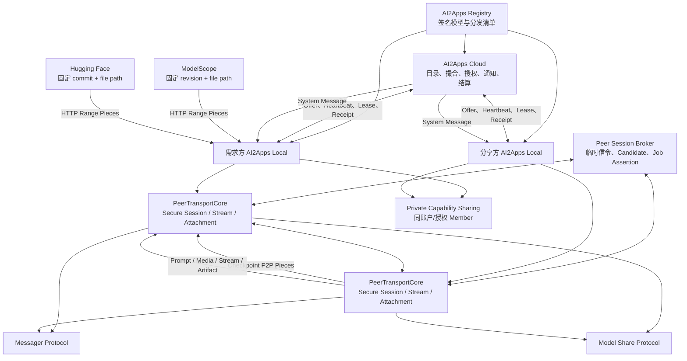
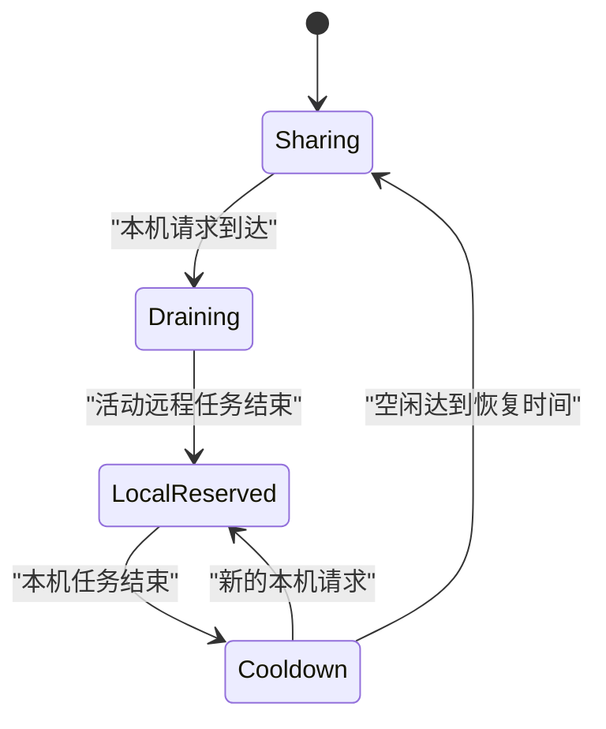

# AI2Apps P2P 模型分发与模型推理能力分享规划 V1

状态：产品与技术方案草案

日期：2026-08-27

范围：Checkpoint MS/HF 双源优先、后续 P2P 分发、Local 推理能力分享、节点撮合与点数结算

## 1. 结论

AI2Apps 可以在现有 Local Capability Sharing、Parent Local、Cloud NodeLink、
NodeGrant、OpenAI-compatible Model API 和点数账本基础上，增加两个彼此独立、但共享
身份、授权、缓存与结算控制面的数据面：

1. **模型分发数据面**：使用标准 BitTorrent/magnet，并从 ModelScope、Hugging Face
   通过 HTTP Range 为不同 piece 并行补块，分发不可变 checkpoint；
2. **模型推理数据面**：复用 Messager 已验证的 Device 身份、Peer Assertion、连接建立、
   加密会话和分块附件基础，使用独立的 Model Share 协议传输 Prompt、图片、语音、视频、
   流式推理事件和结果 Artifact。

Cloud 负责模型目录、节点发现、短期授权、调度、点数预留、结算、元数据审计和风控。
在 P2P 直连成功时，checkpoint、Prompt、媒体和生成结果不经过 AI2Apps Cloud。

交付顺序调整为 **ModelScope + Hugging Face 双源下载优先，P2P 分发后置**。早期用户和同模型
并发下载量不足时，BitTorrent、Tracker、NAT、做种运营和奖励系统难以形成有效 Peer 密度，
不应阻塞可靠下载。首个下载版本只实现 MS/HF HTTP Range 双源 Piece 调度、签名 Manifest、
统一 Partial/Verified Cache 和恢复；接口继续保持 source-agnostic，后续达到激活门槛时通过
新增 P2P Source Adapter 接入 BitTorrent，不改上层安装和缓存契约。

V1 明确不做：

- 公网同步分布式模型训练；
- 任意文件、任意目录或未审核 checkpoint 的公开做种；
- 通过 Model Sharing 分享 MCP、Agent、Service、Tool、Terminal、Secrets、浏览器控制、
  任意进程或其他有副作用能力；
- AI2Apps 自营 Web Seed/OSS/CDN；V1 只预留 source adapter 和 manifest 扩展位，不建设、
  不计费，也不把它作为下载成功的依赖；
- 因 Direct/FRP 路径切换改变已确认价格、结算资产或要求 App 重提任务；
- 声称普通个人节点能对执行环境、模型真实性或输入删除提供硬件级证明。

Model Sharing 的能力边界冻结为：只共享签名 checkpoint 和受限模型推理能力。MCP、Agent、
Service 等能力只允许通过现有 Local Capability Sharing/Parent Local，在同一账户或 Device
明确授权的 Member 设备间共享；它们不进入模型目录、公共撮合或 Currency 结算，也不复用
Model Offer/Contract。

## 2. 产品目标

### 2.1 模型分发

- 降低大模型 checkpoint 对单一源站的依赖和带宽压力；
- 首版让 ModelScope 和 Hugging Face 同时探测并共享一个 piece 调度器；
- MS/HF 并行提供不同 piece，而不是等待一个来源失败后再串行回退；
- 三种来源共享同一套 checkpoint cache，并支持断点续传、跨来源切换和带宽聚合；
- 保留 P2P Source Adapter，待用户规模、并发下载和源站压力达到门槛后接入；
- 用户可选择将已验证、允许再分发的 checkpoint 继续做种；
- 对帮助公共用户完成有效下载的分享节点提供受控、可验证的点数奖励。

### 2.2 模型推理能力分享

- 用户只可通过 Model Sharing 显式分享本地模型推理能力，不分享 MCP、Agent、Service 或 Tool；
- 需求方可按模型、revision、输入模态、上下文、速度、价格、隐私等级和社交关系查找节点；
- 多个候选节点可以软排队竞速，第一个 Ready 的节点获得唯一正式租约；
- Local 始终保留本机资源最终准入权，并可配置本机优先、均衡或分享优先；
- 好友之间的本地算力分享免费，不产生服务收入或平台贡献奖励；
- 公共或非好友任务按实际用量扣点并给提供方入账；
- 复用 Messager 的 Peer Transport 基础设施，但保持协议、授权、密钥上下文、历史和结算隔离；
- 使用 Cloud System Message 发送低频、持久的邀请、状态、完成和争议通知，正文和推理数据
  始终走 Peer Data Plane。

## 3. 现有基础与新增边界

现有实现已经提供：

- `CapabilityExport` 和 `ShareGrant`；
- Local Model、Tool、Service、Agent 的显式分享；
- 独立分享凭证、并发、过期、撤销和 metadata-only audit；
- `ParentTransport`、`DirectParentTransport` 和 `CloudRelayParentTransport`；
- Parent Local 路由、Node ID、祖先路径和环路防护；
- Cloud NodeLink、NodeGrant、短期 Relay assertion 和模型/MCP Relay；
- 固定 revision 的 checkpoint 推荐、下载、准备和 Model Worker 激活；
- Cloud 点数预留、扣除、释放和幂等账本设计；
- Messager Device Key、Peer Assertion、Noise IK、FRP 精确路由、消息幂等和 E2EE 文本传输；
- Messager Cloud Offline System Message、单图附件和生产双向联调基础。

相关现有设计：

- `docs/ai2apps-system-peer-transport-development-plan-v1.md`；
- `docs/cloud-system-peer-session-broker-requirements-v1.md`；
- `docs/ai2apps-local-capability-sharing-v1.md`；
- `docs/ai2apps-parent-local-routing-v1.md`；
- `docs/ai2apps-cloud-relay-local-integration-v1.md`；
- `docs/ai2apps-cloud-work-items.md`；
- `docs/model-adapter-packages.md`；
- `docs/ai2apps-account-messager-development-plan-v1.md`；
- `docs/messager-local-e2ee-cloud-contract-v1.md`；
- `docs/cloud-messager-peer-identity-implementation-v1.md`。

本方案新增：

- 签名 `CheckpointDistributionManifest`；
- BitTorrent 下载/做种引擎和受控 Tracker；
- 上架时固定并验证的 ModelScope/Hugging Face Source Descriptor；
- source-agnostic piece 调度器和 HTTP Range Source Adapter；
- `ComputeOffer`、`ComputeRequest`、`ComputeContract`；
- `SoftOffer`、`CapacityLease` 和竞速调度；
- `PeerComputeTransport`；
- 从 Messager 抽取的共用 `PeerTransportCore`、`PeerSessionBroker` 和 `AttachmentTransfer`；
- 独立、purpose-bound 的 Messager/Model Share/Checkpoint 应用协议与密钥域；
- Model Share System Message 事件和长任务反向通知；
- `ComputeReceipt` 和提供方收入账本；
- 关系感知的发现、准入、优先级和免费好友策略；
- Local `ComputeSharingPolicy` 和本机需求状态机。

当前 Federation 的第一版 billing policy 固定由上游 Installation billing owner 承担费用。
公共市场不能沿用该规则，必须新增需求方预留/扣点、提供方入账和平台服务费账本。公共市场
任务也不应为每次撮合创建长期 Parent Local/NodeLink；它复用 Installation/Node 身份和签名
基础，但使用绑定单次 Contract 的短期 JobGrant。

现有 LAN Sharing 和固定 Parent Local 不被市场机制替换。同一账户或 Device 明确授权的 Member
可以继续通过它们分享 Model、MCP、Agent、Service 等私有 Capability，但这些调用不进入 Model
Sharing 市场。私有 Grant、固定 Parent、好友模型分享和公共模型市场是不同的授权/发现方式；
底层可以复用身份和传输组件，业务协议与权限不能互相替代。

## 4. 总体架构



控制面和数据面必须分离：

| 平面 | 负责 | 不负责 |
| --- | --- | --- |
| Registry | 模型身份、revision、许可、哈希、可用分发方式 | 实时节点和任务调度 |
| Cloud Control | 发现、撮合、授权、System Message、点数、审计、风控 | 默认转发 checkpoint 和推理正文 |
| Peer Signaling | 短期 Assertion、ICE/连接候选、会话协商和过期 | 持久消息、推理正文和长期节点目录 |
| Peer Transport Core | Device 身份绑定、加密、多路流、分块、背压、恢复和 Hash | App 业务权限、聊天历史和结算 |
| Messager Protocol | Conversation、Message、Attachment 和离线兜底语义 | Model Contract、Usage 和算力结算 |
| Model Share Protocol | Contract 绑定的输入、输出、进度、Artifact 和 Receipt | 普通聊天、MCP、Agent、Service 和 Tool |
| Checkpoint Data | BitTorrent/HTTP 分块下载、校验、续传 | 推理 RPC |
| Compute Data | 双向请求、附件流、流式输出、取消 | checkpoint swarm |
| Private Capability | 同账户/授权 Member 的 MCP、Agent、Service 等私有共享 | 公共发现、竞价和 Currency 市场 |
| Local Policy | 本机资源、最终准入、沙箱、暂停、清理 | Cloud 账户结算权威副本 |

System Message、临时信令和数据流是三层不同通道：System Message 保存低频通知；
`PeerSessionBroker` 只交换短期连接信息；`PeerTransportCore` 传输正文和 Artifact。ICE Candidate、
Prompt、媒体、Token 和 Checkpoint Piece 不进入 System Inbox。

## 5. Checkpoint 分发

### 5.1 签名分发清单

Registry 为每个可安装 checkpoint 发布不可变、签名的分发清单：

```json
{
  "schemaVersion": 1,
  "distributionId": "dist_...",
  "modelId": "minimax-h3",
  "repoId": "publisher/model",
  "revision": "40-character-immutable-commit",
  "format": "safetensors",
  "quantization": "mlx-4bit",
  "estimatedSizeBytes": 85899345920,
  "license": {
    "id": "LicenseRef-Example",
    "name": "Example Model License",
    "termsUrl": "https://example.test/model-license",
    "termsHash": "sha256:...",
    "usagePolicy": "personal_noncommercial",
    "accessPolicy": "user_attestation_required",
    "redistributionPolicy": "allowed"
  },
  "files": [
    {
      "path": "model-00001-of-00008.safetensors",
      "size": 10737418240,
      "sha256": "..."
    }
  ],
  "pieceSize": 8388608,
  "pieceHashes": ["sha256:..."],
  "distribution": {
    "p2p": {"allowed": true, "magnet": "magnet:?xt=urn:btmh:..."},
    "sources": [
      {
        "type": "modelscope",
        "repoId": "publisher/model",
        "revision": "immutable-snapshot-id",
        "path": "model-00001-of-00008.safetensors",
        "access": "public_anonymous",
        "verified": true
      },
      {
        "type": "huggingface",
        "repoId": "publisher/model",
        "revision": "40-character-immutable-commit",
        "path": "model-00001-of-00008.safetensors",
        "access": "gated_user_token",
        "verified": true
      }
    ],
    "managedSources": []
  }
}
```

要求：

- revision 必须是不可变标识；
- 文件路径、大小和哈希完整列出；
- torrent/magnet 必须与同一文件字节布局一致；
- MS/HF 固定的是 `provider + repoId + immutable revision + file path`，不是可能过期的最终 CDN URL；
- 上架流水线必须实际下载并验证两个来源的文件大小、整文件 SHA-256、piece hash 和 Range 能力；
- 只有字节完全一致的来源才能进入同一个 distribution；同名文件或同名模型不构成一致性证明；
- 清单和 torrent 的发布者身份必须可验证；
- 运行时不能仅凭 torrent info hash 推断模型身份；
- `redistributionPolicy = unknown | prohibited` 时不提供 P2P 做种；
- 分发政策变化后，Local 立即停止新的做种准入。

### 5.2 用户下载流程

模型安装统一经过：

1. Registry 与本地环境预检；
2. 许可/授权确认；
3. 探测当前启用来源的可用性与轻量测速；首版同时探测 ModelScope 和 Hugging Face，
   后续启用 P2P 时不改变安装流程；
4. 创建统一下载任务，由调度器按 piece 选择来源；
5. 下载到隔离的 partial/staging 区；
6. piece、文件和签名清单多层校验；
7. 原子提升到共享 checkpoint cache；
8. Model Worker 激活；
9. P2P 功能启用后，用户再单独选择是否继续做种；双源首版不显示做种选项。

### 5.3 许可确认

许可确认不是前端布尔值。Local 的可信安装控制面在任何 HTTP、P2P、缓存复用、本地导入或
转换前统一执法。

对于需要特殊许可的模型，对话框至少包含：

- 模型发布者、repo、固定 revision；
- 许可证名称和完整条款链接；
- 个人、非商业用途限制；
- 前往 ModelScope/Hugging Face 申请访问的入口（如该来源需要）；
- 不可预选的“已阅读并同意条款”；
- 不可预选的“已取得下载和使用授权”；
- 不可预选的“仅用于个人非商业用途”。

Local 保存：

```text
installation_id
actor_user_id
repo_id / revision
license_id / terms_hash / terms_url
declared_use = personal_noncommercial
authorization_attested
policy_version
accepted_at / revoked_at
```

HF gated 模型优先使用用户自己的细粒度 HF Token，由 HF 做最终源站授权；ModelScope 的
private/gated 来源同样使用用户自己的凭证和源站授权。Token 只进入安全凭证后端或单次请求，
不进入确认记录和日志。ModelScope 可匿名下载不代表模型允许再分发。

用户确认决定其能否安装和使用；Registry 的 `redistributionPolicy` 决定 AI2Apps 和 Peer
是否可以分发。用户确认不能把禁止再分发的模型变为可做种模型。

### 5.4 多源 Piece 调度与测速

许可确认完成后，双源首版同时启动 ModelScope 和 Hugging Face 预检。未来 P2P 功能启用后，
再同时启动 Peer 发现；届时“P2P 优先”表示 P2P 获得较高的带宽/并发权重，不表示必须等待
P2P 超时后才能使用 HTTP 源。

| 来源 | V1 费用 | 调度方式 |
| --- | --- | --- |
| P2P | 免费 | Peer 直连，优先分配 piece，速度随节点变化 |
| ModelScope | 免费 | 对已上架验证的固定来源执行 HTTP Range 补块 |
| Hugging Face | 免费 | 对已上架验证的固定来源执行 HTTP Range 补块；gated 来源使用用户 Token |

调度规则：

- P2P 使用可用 Peer 数、NAT 状态、近期速度和少量可复用 piece 估计；
- MS/HF 对目标 revision 做轻量 HEAD/Range 探测，探测得到的有效正文可以进入 partial cache；
- 为不同来源分配不重叠的缺失 piece，并根据实时吞吐、延迟、错误率和限流动态重分配；
- P2P 采用 rarest-first 等策略；HTTP 来源优先补充稀缺、尾部或 P2P 暂时不可得的 piece；
- 每个 piece 落盘前校验 hash；来源返回错误字节时立即隔离该来源并重新调度；
- HTTP 源不支持 Range 时，不参与多源 piece 聚合，可降级为独立整文件来源；
- 限制每源并发、退避和请求速率，遵守源站授权、限流和服务规则；
- 许可确认前不得通过测速获取权重正文。

默认不要求用户在已启用来源中二选一或三选一；UI 展示各来源实时速度、贡献字节和状态，并允许
用户按隐私、网络或凭证需求关闭某个来源。若所有来源不可用，则提示失败、稍后重试或重新
检查授权，不存在收费源的静默回退。

### 5.5 Source Adapter 与上架验证

下载体系使用统一来源接口，使首发 MS/HF、后续 P2P 和未来可能的 AI2Apps Managed Source
共用调度器：

```ts
interface PieceSource {
  probe(): Promise<SourceCapability>;
  fetchPiece(fileId: string, offset: number, length: number): Promise<Uint8Array>;
}
```

模型上架流水线负责：

1. 固定 MS/HF 的 repo、不可变 revision 和 file path；
2. 解析当时有效的下载地址，但不把临时重定向/CDN URL 写入长期清单；
3. 从各来源获取目标文件并验证 size、SHA-256 和所有 piece hash；
4. 验证匿名/gated/private 访问类型、HTTP Range 和区域可达性；
5. 生成 torrent metadata 和 AI2Apps 签名 Manifest；
6. 发布后周期性健康检查，异常时只停用单个来源。

客户端下载时只信任签名 Manifest 中列出的来源。Source Adapter 根据逻辑路径解析当前 URL，
不得搜索同名模型或自行加入未经上架验证的镜像。

AI2Apps 自营 Web Seed/OSS/CDN 在 V1 不实现。`managedSources` 和 `PieceSource` 扩展位保留；
未来若启用，只需新增 Adapter 和单独的用户授权/计费流程，不改变 cache、piece map 和调度器。

### 5.6 统一缓存

P2P、ModelScope 和 Hugging Face 共用一套 source-agnostic cache：

```text
checkpoint-cache/
  blobs/       完整验证的不可变内容
  snapshots/   repo + revision 的只读文件视图
  partial/     未完成文件、piece map 和 resume data
  manifests/   签名分发清单和 torrent metadata
```

缓存身份至少包含：

```text
repo_id
revision
checkpoint manifest hash
file SHA-256
torrent info hash
```

行为：

- 同一 checkpoint 完整命中时不下载、不收费；
- 部分命中时只补缺少的文件/range/piece；
- 不同来源之间可切换并复用已验证内容；
- 完整校验后接入现有 HF cache/Model Worker checkpoint 解析；
- 通过共享 blob、硬链接、只读链接或 APFS clone 避免三份副本；
- 活跃模型、下载、做种和多个 snapshot 使用引用计数；
- partial cache 不能被 Model Worker 加载；
- 许可变化可以阻止新的使用或分享，但不能把缓存存在本身当作授权证明。

### 5.7 做种与贡献奖励

做种必须单独 opt-in。Local 只分享：

- Registry 签名且 revision/hash 完全匹配；
- 已完整验证；
- `redistributionPolicy = allowed`；
- 位于 AI2Apps 管理缓存；
- 当前未被用户、Registry 或安全策略暂停。

用户可配置上传带宽、时间表、电池、温度、计费网络、每日时长和缓存上限。

公共 DHT/magnet 产生的流量不能可靠用于点数结算。获得奖励的传输必须由 AI2Apps
`DownloadSession` 协调，并由下载方对有效 piece 生成回执。Cloud 对上传方、下载方、
distribution、piece/range、session 和 sequence 去重后按日结算。

奖励只基于：

- 下载方验证成功的唯一字节；
- 不同的有效 installation；
- Registry 允许奖励的 checkpoint；
- 未被自用、同账户、好友免费或风险策略排除的传输。

奖励加入每日上限、单接收方上限、最低不同接收方数量、异常流量审核和延迟结算。客户端
自报上传字节不能作为单独结算依据。

## 6. P2P 推理能力分享

### 6.1 能力边界

Model Sharing 只允许以下两类公开/社交 Offer：

```text
checkpoint.distribution
model.inference
```

`model.inference` 可以按固定 Schema 细分为：

```text
model.text_generation
model.embedding
model.reranking
model.image_understanding
model.image_generation
model.speech_to_text
model.text_to_speech
model.video_generation
model.digital_human
```

每个能力必须固定 Model、Revision、Runtime、Quantization、输入输出 Schema、资源上限和副作用
声明。公共 Model Share Worker 默认无任意网络、Workspace、Secrets、Terminal、Browser、Tool
和第三方 Capability；所有任务只允许一跳，不能调用另一个 Peer、外部 BYOK 或 Cloud Provider。

MCP、Agent、Service、Tool 以及其他非模型能力只能通过 `CapabilityExport`、`ShareGrant`、
Parent Local 或 NodeGrant，在同一账户或 Device 明确授权的 Member 设备间共享。它们：

- 不创建 `ComputeOffer`；
- 不进入公共/社交模型目录；
- 不参与 SoftOffer、竞价或 Provider 信誉；
- 不产生 Points、Gas 或 Cash；
- 不因好友、关注或粉丝关系自动获得权限；
- 不允许通过 Model Share 请求体包装或间接调用。

### 6.2 共用 Peer Transport 与协议隔离

Messager 与 Model Sharing 共享基础设施，而不是共享业务会话：

```text
PeerTransportCore
  PeerIdentity
  PeerSessionBroker
  SecureSession
  MultiplexedStream
  AttachmentTransfer
  ConnectivityProbe

Application Protocols
  ai2apps.messager.peer/v1
  ai2apps.model-share.peer/v1
  ai2apps.checkpoint.peer/v1
```

可以复用 Device 身份绑定、Peer Assertion、FRP/ICE/NAT 穿透、Noise/QUIC、安全会话、分块、
Content Hash、背压、取消、恢复和 Result Unknown。必须分离：

- `audience`、协议 ID、Noise prologue 和 HKDF context；
- Messager/Model Share/Checkpoint 的 Endpoint、Frame 和大小限制；
- Message Grant、JobGrant 和 Download Grant；
- Conversation/Message、Contract/Lease 和 Distribution/Session 存储；
- 临时目录、审计事件、保留策略和 Feature Flag；
- Messager 历史、Model Usage 和 Currency Settlement。

推荐共享 Device Ed25519 身份签名根，但为 Messager 与 Model Share 使用独立 X25519 Static Key，
并为每个 Job 派生独立 Session Key。至少必须使用以下域分离：

```text
ai2apps/messager-peer/v1
ai2apps/model-share-peer/v1
ai2apps/checkpoint-peer/v1
```

Model Worker 不接触 Device 私钥。`PeerTransportCore` 验证并解密后，只把符合 Model Contract 的
窄化输入流交给 Worker。

### 6.3 连接协议选择

BitTorrent 只用于不可变 checkpoint。推理是低延迟、双向、可取消的 RPC，不使用 torrent
piece 协议传输 Prompt 和 Token。

`PeerComputeTransport` 应使用：

- QUIC/HTTP/3，或 WebRTC DataChannel；
- Cloud/Tracker 协助的候选地址和 NAT 穿透；
- Node 身份绑定和短期、purpose-bound JobGrant；
- 请求、附件、流式事件、取消和用量回执的多路流；
- 直连失败后对调用方透明切换到 FRP C/S；FRP 仍不可达时再提升 Standby 或重新撮合。

浏览器/App 继续连接需求方 localhost OpenAI-compatible SSE。需求方 Local 把 Peer 内部流事件
投影为现有 SSE，从而保持 App、Agent 和 API 客户端兼容。

连接建立应依次尝试 LAN/IPv6、可直接地址、STUN/UDP 和受控端口映射；Cloud 记录按网络类型、
地区和版本聚合的成功率，不承诺统一打洞概率。Compute V1 在提交 Prompt 前完成 Connectivity
Probe；Direct 失败时使用相同 Job/Contract/Grant 自动建立 FRP C/S，不能要求 App 重提请求。
两条路径都不可达时才提升 Standby 或重新撮合；所有候选均不可达时才向调用方返回错误。

### 6.4 能力报价

```json
{
  "offerId": "offer_...",
  "kind": "model.inference",
  "nodeId": "node_...",
  "modelId": "minimax-h3",
  "revision": "...",
  "runtime": "omlx",
  "quantization": "mlx-4bit",
  "modalities": ["text", "image", "video"],
  "limits": {
    "contextTokens": 131072,
    "maxOutputTokens": 8192,
    "maxImageBytes": 52428800,
    "maxVideoBytes": 1073741824,
    "concurrency": 1
  },
  "performance": {
    "estimatedPrefillTps": 800,
    "estimatedDecodeTps": 22
  },
  "settlement": {
    "acceptedModes": ["promo_points", "compute_credits"],
    "freeSocialEnabled": false
  },
  "privacyClass": "public_peer"
}
```

价格不由 Provider 写入 Offer。Cloud 根据 `modelId + revision + quantization + modality + preset`
解析版本化的系统统一 Rate Card；Provider 只能选择接受 `promo_points`、`compute_credits` 或两者。
其中需求方使用 Points 时 Provider 获得 Points；需求方使用 Gas 时 Provider 获得 Cash。Cash 不是
需求方支付资产，不能出现在 `acceptedModes` 中。`free_social` 是独立开关，不因接受 Points 或
Gas 自动启用。

Offer 的结算选择只影响新请求。Provider 修改 `acceptedModes` 后，已建立 Contract 的资产、费率
和结算方式保持冻结。Points-only 首发阶段不展示 Gas-only 配置；若已有预配置为 Gas-only，Offer
保持休眠，直到 Gas + Cash Feature Flag 开启。

V1 公共 `ComputeOffer` 只允许 `local_runtime` 模型。AI2Apps Cloud、从其他 Parent/Peer
投影的模型和 Local BYOK Provider 不允许再次出售或传递，避免传递授权、二次转售和外部
API 成本归属不清。所有公共推理任务只允许一跳，不能把请求继续转发给第三个节点。

Cloud 目录不公开长期连接凭证、真实设备名、精确位置或 Peer IP。成交后才通过短期 Grant
交付必要连接信息。

### 6.5 任务数据面

连接建立后：

1. 双方验证 Node、Installation、Offer、Contract、Lease、request 和 expiry 绑定；
2. Prompt 和小型结构化输入进入请求流；
3. 图片/视频走独立内容哈希附件流，不嵌入 SSE JSON；
4. 提供方在单任务沙箱验证媒体类型、大小、分辨率、帧数和哈希；
5. 推理输出使用结构化流事件；
6. 需求方 Local 转换为 OpenAI-compatible SSE；
7. 任务完成、取消或断线后清理临时附件；
8. 双方提交 metadata-only usage receipt。

Prompt、媒体和输出在直连时不经过 Cloud，但提供算力的节点必须看到普通推理所需的明文输入。
UI 必须明确提示公共节点理论上可以读取或保留输入输出，禁止把公共 Peer 描述为私密计算。

### 6.6 System Message 与临时信令

Cloud System Message 只承载持久、低频、可重放的控制通知：

```text
model_share.invitation
model_share.request_received
model_share.job_committed
model_share.job_started
model_share.job_progress
model_share.job_completed
model_share.job_failed
model_share.job_cancelled
model_share.artifact_expiring
model_share.dispute_action_required
```

通知只包含 Request/Contract/Lease ID、粗粒度状态、时间、跳转目标和安全摘要，不包含 Prompt、
媒体、输出、Checkpoint Piece、Session Key、完整 Assertion 或 ICE Candidate。在线高频进度走
Peer Stream；Cloud 只保存有节流的里程碑进度。

ICE/QUIC/WebRTC Offer、Candidate 和连接确认通过独立、短时的 `PeerSessionBroker` 交换，绑定
双方 Device、JobGrant、用途、Epoch 和过期时间。它们不能写入普通 System Inbox 或成为长期
可枚举的节点地址。

### 6.7 长任务与 Artifact 恢复

视频、长音频等任务不要求需求方持续在线：

```text
matched -> uploading -> accepted -> queued -> running
        -> artifact_ready -> downloading -> acknowledged -> settled
```

要求：

- Provider 只有在输入完整校验并返回 `accepted` 后才进入 Durable Job；
- 需求方断线不自动取消已接受任务，Provider 继续执行并向 Cloud 上报粗粒度状态；
- 完成后 System Message 通知需求方，需求方重新上线取得新的短期 Result Grant；
- Artifact 保存在 Provider Local 的受控目录，包含 Hash、MIME、大小、时长、分辨率和保留期；
- 下载使用 `PeerTransportCore` 分块恢复并由需求方校验；
- Provider 在约定保留期内不得驱逐未确认 Artifact，过期前发送通知；
- 运行中断线不静默换节点，避免双重执行和双重成本；只有 Provider 明确失败后由用户确认重试；
- 除非模型原生支持可验证、可移植的中间 Checkpoint，不承诺跨 Provider 续跑；
- 可取消点、已完成阶段和取消费用必须在 Contract 中冻结。

## 7. 节点负载、排队与择优

### 7.1 动态状态

分享节点周期性上报：

```text
offer/model/revision active state
model loaded/loading and estimated load time
active requests / queue depth / maximum concurrency
available and pressure-adjusted memory
prefill/decode TPS observations
network direct-connectability and upload estimate
power and thermal state
sharing state and accepting-new-jobs flag
```

Cloud 结合请求方实际观察维护首 Token 延迟、TPS、成功率、断线率和 Job Offer 响应时间。
调度不能只相信节点自报性能。

### 7.2 两阶段调度

硬过滤：

- model/revision/quantization/modalities 匹配；
- 上下文、媒体和输出上限满足；
- 节点在线且 Heartbeat 未过期；
- 有足够内存和可售并发；
- 隐私、社交准入、请求结算模式和 Provider `acceptedModes` 匹配；
- 系统 Rate Card、用户预算和所选竞价优先级符合请求；
- deadline 内预计可完成；
- 节点未被暂停、拉黑或风控。

候选评分主要基于：

```text
estimated completion time
= queue wait
+ model cold-load time
+ attachment upload time
+ prompt prefill time
+ expected output tokens / observed decode TPS
```

同时考虑系统价格、网络、可靠性、模型已加载、温度和内存压力。用户可选择最快、均衡、最省点数
或仅使用指定/可信节点。

### 7.3 多节点软排队竞速

默认选择 Top 3 候选，发送同一 `raceId` 的短期 `SoftOffer`。SoftOffer：

- 不包含 Prompt、媒体或其他正文；
- 不冻结多份点数；
- 不硬占推理并发；
- 不默认触发昂贵模型加载；
- 只返回接受意愿、预计 Ready 时间和系统 Rate Card 版本。

第一个 Ready 的节点向 Cloud 原子申请 `CommitLease`。只有唯一 Winner 能接收数据，其他节点
收到取消。Winner 建连期间可以保留一个短时 Standby；建连失败时提升 Standby。

如果所有候选都需要冷加载模型，V1 只允许一个节点获得 `WarmupLease`，避免多台设备同时加载
大模型后只有一台成交。

Cloud 保留长等待队列，Local 只允许很短的远程队列。节点离线、暂停或本机需求到来时，尚未
开始的远程请求返回 Cloud 重新撮合。

### 7.4 任务失败和重试

- 建连前失败：自动尝试 Standby 或下一个候选，不收费；
- Prompt 尚未提交完成：可安全重新调度；
- 未产生首 Token：在确认原任务取消后使用同一幂等键重试；
- 已产生部分 Token：不静默切换节点，结束当前 SSE 并让调用方决定是否重试；
- 断线/取消：只结算可验证的已完成用量，释放剩余预留。

### 7.5 报价、评分与公平性

V1 不做连续拍卖，也不允许 Provider 压价或抬价。系统根据具体模型、Revision、量化、模态和
任务计量单位发布版本化统一 Rate Card。需求方选择基础价，或选择 `+20%`、`+50%`、`+100%`
的固定优先级档位提高排队权重；附加金额及其 Provider 分配规则由平台政策统一确定。

Provider 只能选择接受 Points、接受 Gas，或同时接受两者，不能针对资产或关系修改系统费率。
SoftOffer 只确认接受意愿、Ready 时间、预计完成时间、结算模式和 Rate Card 版本；一旦进入
Contract，价格、费率、优先级档位和资产冻结。余额不足、Provider 不接受所选资产或候选耗尽时，
系统必须要求需求方重新选择，不能在 Points 与 Gas 之间静默回退。

硬过滤通过后，Cloud 以可解释的多目标评分选择候选：

```text
estimated completion time
price and requester budget
observed reliability
relationship/trust tier
direct-connect probability and throughput
warm model bonus
resource/thermal pressure
fair-share correction
```

用户预设至少包括 `trusted_only`、`fastest`、`balanced`、`lowest_cost` 和 `deadline_first`。
关系只影响发现、准入、价格和优先级；粉丝是弱社交信号，不自动提升隐私信任。低优先级使用
加权公平队列或容量配额，避免公共任务永久饥饿。

## 8. 本机需求优先策略

Local 是本机资源的最终权威。推荐三个预设：

| 模式 | 行为 |
| --- | --- |
| `local_first` | 停止新远程准入，清退远程等待任务，活动任务默认完成 |
| `balanced` | 为本机预留并发和内存，其余容量继续分享 |
| `share_first` | 已接受远程任务按正常顺序执行，适合专用分享节点 |

默认配置：

```json
{
  "enabled": true,
  "priorityMode": "local_first",
  "onLocalDemand": "drain_remote",
  "localQueuePriority": true,
  "localReservedConcurrency": 1,
  "allowRemoteWhileLocalActive": false,
  "resumeAfterLocalIdleSeconds": 180,
  "maxRemoteConcurrency": 1,
  "maxRemoteQueueDepth": 1,
  "activeRemotePreemption": "never",
  "pauseWhenOnBattery": true,
  "pauseOnThermalState": ["serious", "critical"]
}
```

状态机：



本机请求可以插到 SoftOffer、未确认 Lease、远程等待队列和未提交输入的任务之前。默认不抢占
已经开始输出的远程任务。高级用户可以启用紧急抢占，但取消会影响节点可靠性，需求方只支付
已完成用量。

## 9. Device 与社交关系策略

### 9.1 四个独立维度

每个 Offer 分别配置：

1. `visibility`：谁能看到；
2. `admission`：谁能使用；
3. `priority`：谁先排队；
4. `pricing`：谁免费或享受何种价格。

关系定义：

- `self_device`：同一权威账户的其他 Installation；
- `explicit_allowlist`：提供方明确授权的用户；
- `friend`：Cloud 权威确认的 active 双向好友；
- `follower`：请求方关注提供方；
- `following`：提供方关注请求方；
- `public`：符合公共市场准入条件的用户。

请求方不能自报关系。Cloud 签发绑定 requester、provider、relationship epoch、Offer 和 expiry
的短期声明。拉黑拥有最高拒绝优先级。

### 9.2 分层发现

建议默认查找顺序：

```text
自己的其他设备
explicit allowlist
好友
提供方关注的人
粉丝
可信社区节点
公共节点
```

用户可选择“只使用好友”“好友优先后扩大范围”或“最快可用节点”。从好友层扩大到公共节点
会改变输入可见对象，必须在策略或交互中明确，不能静默发生。

### 9.3 好友免费规则

好友之间的本地算力分享：

```text
buyer points charged = 0
provider points credited = 0
platform reward eligible = false
settlement mode = free_social
```

要求：

- 只适用于 Cloud 权威确认的双向好友；
- 只适用于 `executionSource = local_runtime` 且没有外部边际成本的能力；
- Cloud 模型、Local BYOK 和未来可能的收费 Managed Source 不自动免费；FRP C/S 仅作为同一
  Local Runtime 推理任务的数据路径，不改变好友任务既有价格语义；
- 免费任务仍生成 Contract、Lease 和 usage receipt；
- 分享方可设置每好友每日请求、Token、媒体、并发和时长额度；
- 超出免费额度默认停止，不自动转为收费；
- 好友任务不计入公共分享奖励、稀缺奖励或服务收入；
- 关系在任务准入时冻结，本次任务不因正常解除好友而追溯收费；拉黑/安全封禁可立即取消。

推荐队列优先级：

```text
本机
自己的其他设备
explicit allowlist
好友
关注/粉丝
公共用户
```

可以使用加权公平队列或容量配额避免低优先级永久饥饿。

### 9.4 三方设置与策略

需求方设置：

```text
允许的关系/隐私等级
trusted only / fastest / balanced / lowest cost / deadline first
预算和最高价格
deadline / max wait / allow cold load
公共节点回退是否允许
失败后自动重试边界
长任务通知和 Artifact 自动下载策略
```

提供方设置：

```text
visibility / admission / priority
允许分享的模型和模态
时间表、并发、队列和最长任务时长
接受 Points / 接受 Gas（至少选择一种已启用资产）
独立的好友免费开关和免费额度
结果 Artifact 保留期和磁盘配额
上传带宽、计费网络、电池、温度和内存水位
local_first / balanced / share_first
暂停接单、drain 和维护窗口
```

Cloud 策略：

```text
身份/关系/Offer/Contract 权威解析
硬过滤、Top-K、唯一 CommitLease 和公平调度
短期通知、信令和过期清理
平台观察性能、信誉、Canary 和风险控制
Receipt、争议、Currency Hold 和 Settlement
全局/区域/模型级暂停和 Feature Flag
```

Provider Local 始终是资源准入权威；Cloud 不能强迫处于本机繁忙、内存压力、高温或维护状态的
Device 接单。Requester Local 负责内容加密、输入上传、Artifact 校验和本地保存。

结算模式是撮合硬条件：Gas-only Provider 不进入 Points 请求候选集，Points-only Provider 不进入
Gas 请求候选集，同时接受两者的 Provider 才能参与两类请求。Provider 关闭某种资产只影响新
Offer/新 Contract，不取消或改写已经接受的任务。

## 10. 点数与账本

### 10.1 推理市场

非好友任务使用 `marketplace_requester_pays`：

```text
buyer charge
= input token charge
+ output token charge
+ image/video processing charge

provider credit
= buyer charge - platform fee
```

开始前按 `max_tokens`、媒体和锁定单价冻结最高点数。完成后双方提交签名/认证用量回执。输入和
输出 Token 使用绑定 model/revision 的固定 tokenizer 在两端计数，不一致进入争议或保守结算。

### 10.2 账本类型

```text
checkpoint_seed_reward
compute_marketplace_charge
compute_provider_credit
compute_platform_fee
compute_refund
compute_reversal
```

账本必须追加写入，退款和追回使用反向条目，不修改历史行。至少记录：

```text
request/session/idempotency key
buyer/provider account and installation
model/distribution/revision
usage units
reserved/charged/released points
provider credit/platform fee
relationship and settlement mode
status and timestamps
```

不记录 Prompt、输出、媒体、HF Token 或 Share/NodeLink credential。

### 10.3 防刷

- 同账户和自有设备不产生平台奖励；
- 好友免费任务不产生平台奖励；
- 同一接收方/提供方设置每日奖励上限；
- 对新账户、新关系、循环调用和异常流量延迟结算；
- 下载奖励要求接收方验证唯一 piece/range；
- 推理奖励只来自实际买方扣费，不额外重复补贴；
- 社交关系、Offer、Contract 和 receipt 在 admission 时冻结并绑定 epoch；
- 客户端单方自报的字节、Token、时间不能直接结算。

### 10.4 服务质量监督

平台只承诺和仲裁可客观验证的 Contract 指标：

```text
Offer/Contract 中的 model、revision、runtime 和参数
accept / ready / queue / start / first-token / completion 时间
输入是否完整接收
Token、时长、分辨率、格式和大小
输出 Artifact Hash、可下载性和可解码性
断线、超时、取消、结果保留和重复执行
双方 Usage/Artifact Receipt 是否一致
```

图片是否好看、回答是否聪明、声音是否有感染力等主观满意度不作为自动退款条件。只要模型、
参数和输出协议符合 Contract，随机生成结果不因用户主观不满意而自动冲正。

Cloud 结合 Provider 自报和需求方实际观察维护按 Model/Revision/Runtime/Device Profile 分组的
Ready 延迟、首 Token、TPS、完成率、断线率、有效 Artifact 率和争议率。节点自报不能单独
决定排名。平台可以发送不含用户数据的 Canary 任务验证协议、性能、常见输入和虚假完成；
普通用户设备仍不能被描述为具有硬件级模型真实性证明。

### 10.5 结算和争议矩阵

| 事件 | 默认结算 |
| --- | --- |
| Commit 前或建连前失败 | 不收费，释放全部 Hold |
| 输入未完整上传/校验 | 不收费 |
| Provider 接受后启动失败 | 不收费，降低可靠性 |
| 文本产生部分可验证 Token 后断线 | 只结算已验证用量 |
| 长任务没有有效 Artifact | 不结算，除非 Contract 明确了可验证阶段计费 |
| 用户主动取消长任务 | 按事前冻结的已完成阶段/用量结算 |
| Artifact Hash、格式或 Contract 参数不合格 | 不结算或冲正 |
| Artifact 合格但用户主观不满意 | 正常结算 |
| Provider 声称完成但保留期内无法取得结果 | 暂缓后退款/冲正 |
| 双方 Receipt 不一致 | 进入 `disputed`，资产保持 Pending |

争议证据默认仅包含 Contract、Lease、事件时间、序列、用量、错误分类、输入/输出摘要 Hash 和
双方签名 Receipt，不包含正文。处理分三层：

1. 自动规则处理超时、Hash、格式、重复收费和 Receipt 一致性；
2. 风控复核关联账户、异常交易、Canary、历史完成率和网络/Worker 事件；
3. 只有用户明确同意时，才上传范围有限、单独加密、短期保留的内容证据供人工处理。

账本使用追加式 `refund/reversal`，不修改原 Settlement。Points 阶段先使用自动规则和人工复核；
Gas/Cash 上线前再冻结准备金、负余额、提现延迟和法定争议流程。

## 11. 安全、隐私与合规

### 11.1 Checkpoint

- 只接受签名清单和固定 revision；
- 路径规范化，拒绝越界路径、危险 symlink 和额外文件；
- partial 内容在完整提升前不可执行；
- safetensors/配置/索引按 Model Worker 既有规则验证；
- 不允许任意目录做种；
- Registry 可暂停整个 distribution、单个 MS/HF 来源或新的 P2P 做种；
- 提供下架、停止分享、缓存清理和审计入口。

### 11.2 推理需求方风险

- 公共节点可以看到明文 Prompt、媒体和输出；
- UI 明确提示不要提交密码、私人文件和商业机密；
- Offer 标明 `public_peer | trusted_peer | verified_provider | attested_compute`；
- 敏感任务默认不扩大到公共节点；
- 节点不能通过模型分享获得需求方 Cloud/Local 管理权限。

### 11.3 推理提供方风险

- 媒体解析和模型调用在受控 Worker/沙箱中；
- 严格限制大小、格式、分辨率、帧数、上下文、输出和时间；
- 禁止 Terminal、Secrets、浏览器、任意进程和未经许可 Tool；
- 每任务临时目录，完成后清理；
- 并发、内存、温度、电池和带宽由 Local 最终控制；
- 远程请求不能改变节点分享策略、安装模型或触发任意下载。

### 11.4 模型真实性

AI2Apps 可以验证登记的 Runtime Package、Adapter、checkpoint 和 revision 哈希，并用实际性能
和结果反馈构建信誉。但在普通用户完全控制的设备上，软件证明不能保证运行期间没有被修改。
产品必须区分“签名配置已验证”和“硬件远程证明”。

### 11.5 Device 信息收集与披露分级

Cloud 内部可收集但不公开：

```text
Account/Node/Installation/Device 内部 ID
Device Key fingerprint、key/access/membership epoch
短期 ICE candidate、公网 IP 和连接诊断
精确 heartbeat、队列、并发和资源压力
Contract、Lease、Receipt、Settlement 和争议状态
关联账户、支付/KYC 和反作弊信号
精确历史交易对手和内部风险理由
```

原始 IP、ICE Candidate 和临时连接信息设置短保留期；长期指标转换为网络类型、区域、版本和
成功率聚合。支付/KYC 只在 Gas/Cash 阶段由相应权限域处理。

目录/候选用户可以看到：

```text
Provider 自选名称和验证等级
与当前请求方有关的好友/Allowlist 等关系
Capability、model、revision、quantization 和模态
输入输出限制、价格和隐私等级
平台观察的性能区间、可靠性等级和预计完成时间
粗粒度硬件能力档位与可选大区
是否接受新任务
```

不公开真实设备名、序列号、邮箱、精确地址、Peer IP、局域网地址、精确队列、交易对手、支付
信息或长期可追踪硬件指纹。硬件只显示例如 `Apple Silicon / 128 GB tier / verified video`
的归一化能力档位。

只有撮合成功的双方通过短期 Grant 获得：

```text
Job/Download scoped Peer Assertion
临时连接 ID 和必要 Candidate
本次会话身份公钥/证明
Contract、Lease、限制和价格
Attachment/Artifact Manifest
Result Retrieval Grant
```

只保留在 Device-Local：真实主机名和序列号、本地路径、Prompt、聊天、文件、媒体、输出正文、
Secret/Token/Cookie、完整 Package/进程列表、无关模型和其他用户任务内容。

## 12. 建议数据模型

Cloud：

```text
checkpoint_distributions
checkpoint_distribution_sources
checkpoint_source_health
p2p_seeder_offers
download_sessions
verified_transfer_receipts
daily_seed_contributions
compute_offers
compute_offer_status
compute_requests
compute_races
compute_soft_offers
compute_capacity_leases
compute_contracts
compute_usage_receipts
compute_settlements
compute_quality_observations
compute_disputes
compute_artifact_manifests
peer_session_assertions
peer_connectivity_observations
model_share_notifications
model_license_policies
```

Local：

```text
checkpoint_distribution_manifests
checkpoint_partial_downloads
checkpoint_blob_references
model_license_acceptances
local_seeding_policies
compute_sharing_policy
compute_offer_projection
compute_peer_sessions
compute_local_activity
peer_transport_sessions
peer_attachment_transfers
compute_durable_jobs
compute_result_artifacts
```

SecretBackend：

```text
HF/ModelScope user token
Tracker/download session secrets
P2P node identity private key
Messager protocol static/session keys
Model Share protocol static/session keys
short NodeLink/JobGrant credentials
```

SQLite 和浏览器不能保存这些秘密正文。

## 13. API 草案

Cloud Checkpoint Registry 的可直接实施契约、状态机、数据库约束与验收测试见
[AI2Apps Cloud Checkpoint Distribution Registry 需求 v1](ai2apps-cloud-checkpoint-distribution-registry-requirements-v1.md)。

### 13.1 Local Checkpoint

```text
GET    /v1/platform/checkpoints/distributions/{distributionId}
POST   /v1/platform/checkpoints/acquisition-preflight
POST   /v1/platform/checkpoints/license-acceptances
POST   /v1/platform/checkpoints/downloads
GET    /v1/platform/checkpoints/downloads
GET    /v1/platform/checkpoints/downloads/{taskId}
POST   /v1/platform/checkpoints/downloads/{taskId}/pause
POST   /v1/platform/checkpoints/downloads/{taskId}/resume
POST   /v1/platform/checkpoints/downloads/{taskId}/switch-source
POST   /v1/platform/checkpoints/downloads/{taskId}/cancel
GET    /v1/platform/checkpoints/seeding
PATCH  /v1/platform/checkpoints/seeding/{distributionId}
```

### 13.2 Cloud Checkpoint

```text
GET    /v1/checkpoint-distributions/{distributionId}
POST   /v1/p2p/download-sessions
POST   /v1/p2p/download-sessions/{sessionId}/announce
POST   /v1/p2p/download-sessions/{sessionId}/receipts
GET    /v1/p2p/contributions/me
```

### 13.3 Local Compute

```text
GET    /v1/platform/compute-sharing/policy
PATCH  /v1/platform/compute-sharing/policy
GET    /v1/platform/compute-sharing/offers
POST   /v1/platform/compute-sharing/offers
PATCH  /v1/platform/compute-sharing/offers/{offerId}
GET    /v1/platform/compute-sharing/activity
GET    /v1/platform/compute-sharing/tasks/{requestId}
POST   /v1/platform/compute-sharing/tasks/{requestId}/cancel
GET    /v1/platform/compute-sharing/tasks/{requestId}/artifacts
POST   /v1/platform/compute-sharing/tasks/{requestId}/artifacts/{artifactId}/download
POST   /v1/platform/compute-sharing/disputes
```

### 13.4 Cloud Compute

```text
POST   /v1/compute/offers/{offerId}/heartbeat
POST   /v1/compute/requests
GET    /v1/compute/requests/{requestId}
POST   /v1/compute/races/{raceId}/offers/{softOfferId}/ready
POST   /v1/compute/races/{raceId}/commit
POST   /v1/compute/leases/{leaseId}/connected
POST   /v1/compute/leases/{leaseId}/cancel
POST   /v1/compute/requests/{requestId}/milestones
POST   /v1/compute/requests/{requestId}/receipts
POST   /v1/compute/requests/{requestId}/artifacts
POST   /v1/compute/requests/{requestId}/result-grants
POST   /v1/compute/disputes
GET    /v1/compute/disputes/{disputeId}
POST   /v1/peer-sessions
POST   /v1/peer-sessions/{sessionId}/candidates
POST   /v1/peer-sessions/{sessionId}/close
GET    /v1/compute/usage/me
GET    /v1/compute/provider-earnings/me
```

所有写接口使用 request ID、幂等键、epoch/revision 和明确错误码。
Cloud 通过既有 System Message/Inbox 投递 Model Share 状态，不新建第二套用户通知存储；
`peer-sessions` 是短期信令资源，不进入 System Inbox，也不保存数据面正文。

## 14. 分阶段落地

### Phase 0：契约与安全基线

- 定义 `CheckpointDistributionManifest` 和许可/再分发枚举；
- 定义统一 checkpoint cache、partial、引用计数和导入边界；
- 定义 Compute Offer/Request/Contract/Receipt；
- 冻结 Model Sharing 只允许 checkpoint 和 model inference 的能力白名单；
- 冻结 Private Capability Sharing 与 Model Sharing 的授权、目录和结算隔离；
- 定义 `PeerTransportCore`、三个应用协议、域分离、System Message 和短期信令边界；
- 定义 Node/Installation/relationship/epoch 绑定；
- 完成 threat model、隐私文本、下架与撤销时序。

### Phase 1：ModelScope + Hugging Face 双源下载 MVP

- 选取少量固定 revision、并且在 ModelScope 有可验证来源的模型；
- 实现 ModelScope/Hugging Face Source Adapter；
- 许可确认、固定 revision、签名清单；
- 上架时验证 MS/HF 文件完全一致、支持 Range，并生成统一 piece hash；
- MS/HF 同时探测，按 piece 并行下载和动态重调度；
- HF 不可达、超时或被用户关闭时快速进入 MS-only，不等待长超时，也不让任务整体失败；
- 统一 partial/verified cache、断点续传、暂停、恢复和来源切换；
- 不集成 BitTorrent、Tracker、DHT、做种和下载奖励。

截至 2026-08-27 的实现状态：

- 已让 Models 的 AI2Apps 目录安装与 ACPF 绑定同一个 `AI2AppsInstaller`，并共享平台持有的
  `HFDownloader`、`MSDownloader`；ACPF 的 ModelScope 镜像预取已复用 `MSDownloader` 的
  revision、目标目录、文件过滤、进度和取消能力；
- 已实现 `CheckpointDistributionManifest` 的拒绝式解析、Ed25519 域分离签名校验、许可与
  再分发政策约束、不可变 HF revision、逐文件 SHA-256、piece 数量和已验证来源约束；
- 已建立 `blobs/`、`snapshots/`、`partial/`、`manifests/` 的 source-agnostic cache 边界，
  verified blob 使用流式 SHA-256 校验和原子提升；
- 已实现通用 HTTPS Range `PieceSource` Adapter，严格校验 `206`、`Content-Range`、返回长度，
  并把不支持 Range 的来源标为只能走独立整文件降级；
- 已实现跨文件 Piece Planner、piece map 持久化与恢复校验、并行 piece 任务、按探测延迟排序、
  来源失败/错误字节回退、跨文件混合健康来源组合，以及 MS-only 调度完成路径；piece 只有在
  拼接哈希正确、文件 segment 写入并 `fsync` 后才会记为完成；
- 已实现 Registry Publisher 绑定的 Checkpoint 签名信封：复用现有 JCS/Ed25519 与 Publisher
  公钥指纹，交叉验证 Registry publisher ID、key ID、签名 key ID、Manifest digest 和签名正文；
- 已实现 HF/ModelScope Hub URL Resolver：只从已验证 descriptor 生成当次固定 revision URL，
  支持官方 CDN 重定向但不持久化临时 URL；HF gated/private 源使用单次用户 Bearer Token，
  ModelScope 首版只允许 `public_anonymous`，在正式 Cookie/Token 契约完成前拒绝认证源；
- 已实现 Checkpoint Registry Index/Client：使用 pin 住的 Repository Key 验证独立 Index，绑定
  distribution URL、Manifest digest 和 Publisher 公钥；具备响应大小上限、同 Cloud origin 限制、
  metadata version 回滚防护，以及仅在签名 Index 尚未过期时允许的网络故障缓存回退；
- 已实现 verified blobs 到只读 snapshot 的同卷硬链接与原子发布，拒绝 partial、符号链接、额外
  文件、错误大小/哈希和非规范 blob；`CheckpointAcquisitionService` 已贯通 Registry、Resolver、
  Scheduler、Cache 与 snapshot，缓存命中不再访问 Hub；
- 已把 `CheckpointAcquisitionService` 注入 ACPF/Models 共用的 `AI2AppsInstaller`；声明
  `weights.distribution_id` 的 Package 会跳过旧的 MS 预取 + HF reconcile，校验 distribution 与
  Package 的 model ID、repo ID、revision 完全一致后，把只读 verified snapshot 原子硬链接到
  Worker 专用的哈希 distribution 目录并激活 Worker；历史 Package 暂时走兼容链路；
- 已升级模型 Package 契约和标准构建门禁：运行时可验证并传播 `weights.distribution_id`，正式
  Contract v1 构建/重新签署和本地模型 Package 构建都会拒绝缺少真实 distribution 引用的模型；
  不允许为了通过构建填写占位 ID，历史 Package 只有在对应签名 distribution 发布后才能升版；
- 已实现离线 distribution Publisher 构建器：从 Package-owned build spec 读取模型、许可、固定
  HF/MS revision 和 include patterns，要求两个本地快照的文件集合、大小、逐文件 SHA-256
  完全一致，按规范文件顺序生成跨文件 piece hashes，并使用 SecretBackend 中的 Publisher
  Ed25519 key 生成且自校验 envelope；Qwen Image 2512/Edit 2511 已加入首批构建规格，其旧
  ModelScope 兼容路径也已从 `master` 固定到 source-lock 中的 resolved revision；
- 尚未完成来源长期健康评分、首批真实 distribution 发布和中国大陆无代理环境下的 MS-only
  Worker 端到端验收；这些项目仍是 Phase 1 的后续交付，不能据当前实现宣称“中国大陆无需
  VPN”验收已经完成。

### Phase 2：双源下载生产化

- 下载来源、速度、有效字节、失败和切换可视化；
- 缓存配额、清理、引用计数和崩溃恢复；
- MS/HF 来源健康检查、区域可达性监控和自动停用；
- 在中国大陆无系统代理/VPN环境下，覆盖至少主要运营商网络的 ModelScope 端到端下载验证；
- 验证 Registry、Manifest、许可页和必要控制面不通过 HF 域名间接加载；
- Source Adapter 限流、退避、Token 安全和错误分类；
- 收集按模型、区域和时间窗口的并发下载与来源压力指标；
- AI2Apps 自营 Web Seed/OSS/CDN 不在本阶段范围，后续按实际可用性数据单独立项。

### 后续里程碑：Checkpoint P2P Pilot 与贡献奖励

只有监控数据证明同一 checkpoint 在相近地区和时间存在足够重叠下载，或 MS/HF 的可用性、
限流、带宽与成本形成持续缺口时，才启动该里程碑：

- Local 集成受控 BitTorrent 引擎和 AI2Apps Tracker；
- 先以少量允许再分发的 checkpoint 验证 Peer 密度、命中率和源站卸载比例；
- P2P、MS、HF 同时探测并共享同一 Piece Scheduler 和 Cache；
- 用户显式 opt-in 做种并配置带宽、电池、温度、网络和缓存上限；
- Pilot 初期不发奖励；确认回执可信后再加入 DownloadSession、Piece Receipt、每日贡献聚合；
- 最后接入 Points 奖励、每日上限、延迟结算和反作弊。

BitTorrent 引擎、DHT/Tracker 和奖励参数不再是 Phase 1 的开工决策。

### Phase 3：可信节点推理 MVP

- 仅文本、审核节点、固定价格；
- 从 Messager 基础抽取 `PeerTransportCore`，保持 Model Share 独立协议和密钥域；
- `PeerComputeTransport` 直连和提交正文前 Connectivity Probe；
- 不允许 MCP、Agent、Service、Tool 或任意副作用能力进入 Offer；
- Cloud Offer、SoftOffer race、CapacityLease；
- System Message 发送邀请、开始、完成、失败和争议通知；
- OpenAI-compatible stream 投影；
- 本机优先、drain 和 cooldown；
- 非好友点数结算、好友免费；
- Direct 失败后自动使用 FRP C/S，调用 API 和 Job ID 保持不变。

### Phase 4：社交和公共市场

- Device、好友、粉丝、关注和 Allowlist 关系投影；
- 分层发现、关系优先和公共回退确认；
- 动态状态、历史性能、信誉和风控；
- 图片输入和受控附件流；
- 节点收入、公共贡献、质量记录和申诉入口。

### Phase 5：视频与高级调度

- 视频上传、时长/分辨率限制和媒体计费；
- Durable Job、粗粒度 Cloud 进度通知、Artifact 保留和断点下载；
- 稀缺模型可用性奖励；
- 更精确的预计完成时间；
- FRP C/S 对文本、媒体、Artifact 保持统一协议语义，并增加带宽、并发和成本控制；
- 支持可信执行环境的独立隐私等级。

## 15. 验收与测试

### 15.1 Checkpoint

1. MS、HF 获取同一 distribution 时得到相同 manifest/file hash；
2. MS、HF 能同时为不同 piece 提供带宽，且不会重复提交同一缺块；
3. 任意来源中断、限流或返回错误后可从另一来源续传，不重复下载已验证内容；
4. 来源返回不同字节时被 piece hash 拒绝并隔离，不会生成混合 revision 文件；
5. 完整 cache hit 不产生下载流量；
6. 条款哈希变化强制重新确认；
7. Gated 来源只使用用户自己的安全 Token，Token 不进入 Manifest、数据库或日志；
8. Partial checkpoint 不能被加载；
9. 进程重启后能从 Piece Map 恢复，不重新下载已验证内容；
10. 用户关闭某一来源后只使用剩余来源，不破坏同一下载任务。
11. 在中国大陆无系统代理/VPN测试环境中阻断 HF 后，标记为“中国大陆可下载”的模型仍能
    仅通过 ModelScope 完成下载、校验、原子入库和 Worker 激活；
12. 如果模型没有合格 ModelScope 来源，UI 必须明确说明其来源限制，不能纳入“无需 VPN”承诺。

启用 Checkpoint P2P Pilot 后追加验收：

1. P2P、MS、HF 获取同一 distribution 时得到相同 manifest/file hash；
2. P2P、MS、HF 可以为不同 piece 提供带宽；
3. Gated 或禁止再分发模型不出现 P2P/做种；
4. 恶意 torrent 路径、symlink、额外文件和哈希错误被拒绝；
5. Registry 暂停后新做种立即停止，已安装本地状态按政策保留。

### 15.2 Compute

1. 只有一个竞速候选能原子获得 CommitLease；
2. Loser 不接收 Prompt/媒体、不扣点、不占正式槽位；
3. Winner 建连失败可提升 Standby；
4. 本机请求能取消 SoftOffer、清退远程队列并进入 drain；
5. 默认不抢占已经开始输出的远程任务；
6. 好友任务不扣点、不入账、不产生平台奖励；
7. Cloud/BYOK 外部成本能力不被好友免费规则覆盖；
8. 关系、Offer、Lease、request 和 epoch 伪造全部拒绝；
9. 节点断线只结算已验证用量并释放余额；
10. Prompt、输出、媒体和 Token 不进入 Cloud/Sharing audit。
11. MCP、Agent、Service、Tool 和任意副作用能力不能创建 Model Share Offer；
12. Messager Grant/Session/Conversation 不能用于 Model Share，反向亦然；
13. System Message 只含状态摘要，不含 Candidate、Prompt、媒体、Token 或 Artifact 正文；
14. 长任务在需求方离线后继续，完成通知后能以新 Result Grant 断点下载并校验 Artifact；
15. 运行中断线不产生两个并行 Provider，用户明确重试前不重新执行；
16. Artifact 参数不合格、无法取得、主观不满意和用户取消分别执行冻结的结算规则；
17. Receipt 不一致进入 Pending/Disputed，不直接采用任一方较高自报；
18. 公共目录、成交双方和 Cloud 内部字段通过信息披露矩阵测试。

### 15.3 性能与稳定性

- Registry/目录控制面在 checkpoint 高峰下不承载模型正文；
- MS/HF 有效带宽、Range、限流、错误和来源切换成功率可观测；
- 启用 P2P 后，Tracker 不承载模型正文，直连率和平均 Peer 数可观测；
- Peer Transport 按 LAN、IPv6、STUN/UDP、port-mapped、relay、failed 分类可观测；
- Heartbeat 过期节点在承诺窗口内退出调度；
- 多节点 race 不导致重复点数预留和硬容量超卖；
- Local 进入低电量、内存压力或高温后停止新准入；
- 进程崩溃后 partial、Lease、点数预留和活动任务能安全恢复或收尾。

## 16. 产品指标

Checkpoint：

- MS/HF 各来源的有效字节占比和双源聚合提速比；
- 完整和部分 cache hit 率；
- 平均下载速度、完成率和来源切换次数；
- MS/HF Range 成功率、限流率、错误率和区域可达性。
- 中国大陆按运营商/地区聚合的 ModelScope 可达率、首字节、吞吐、完成率和 HF 降级时间；

Checkpoint P2P Pilot 启用后再增加：

- P2P 直连下载占比、平均 Peer 数和源站卸载比例；
- 有效做种节点、不同接收方和奖励作弊率。

Compute：

- Offer 在线数和各模型可用容量；
- race 到 Winner、Winner 到首 Token 的时间；
- 模型冷/热启动比例；
- P2P 直连成功率和任务完成率；
- 按网络/区域/版本的直连类型、建连时间、吞吐和失败分类；
- 本机需求触发 drain 的延迟；
- 好友免费、社交、公共市场任务比例；
- 买方成本、提供方收入、退款和争议率；
- Artifact 有效率、结果取得率、Canary 通过率和争议处理时长；
- 节点中断、虚报性能和风控命中率。

## 17. 待确认决策

1. BitTorrent 引擎采用 C++ libtorrent 静态集成、独立受控 Service，还是其他实现；
2. Checkpoint P2P Pilot 是否允许公共 DHT，或仅使用 AI2Apps Tracker；
3. 首批允许再分发的模型清单和审查责任；
4. 做种奖励资金来源、每 GiB 基准和每日上限；
5. P2P 推理数据面优先 QUIC/HTTP/3 还是 WebRTC；
6. NAT 穿透所需 STUN 服务和是否完全不提供 V1 TURN/Relay；
7. 公共推理市场的首批模型、节点审核和平台服务费；
8. 好友免费额度默认值和公共回退提示策略；
9. 许可确认、下架、缓存保留和用户删除流程的最终法务文本；
10. 何种可用性、成本或版本保留指标达到阈值后，再启动 AI2Apps Managed Source 独立项目；
11. Messager/Model Share 是否使用独立 X25519 Static Key，或共享身份根后只做严格域派生；
12. 长任务 Artifact 默认保留期、用户取消点和阶段计费规则；
13. Provider 公开的大区、硬件能力档位和性能区间默认值；
14. 固定优先级加价中 Provider 收入、平台费和风险准备金的分配比例；
15. FRP C/S 的区域容量、带宽上限、平台 Exposure 和扩容阈值。

第 1–4 项属于后续 Checkpoint P2P Pilot，不阻塞 MS/HF 双源 Phase 1。Phase 1 开工前优先冻结
首批模型、MS/HF Revision 映射、Range 验证、Token 边界、Piece Size 和 Cache 配额。

## 18. 推荐的首个可交付切片

首个版本只交付：

- 两到三个固定 revision 的 checkpoint；
- 首发目录中的“中国大陆可下载”模型全部具有经过真实网络验证的 ModelScope 来源；
- 签名分发清单；
- ModelScope、Hugging Face 同时探测和双源 Piece 调度；
- 上架时固定 MS/HF revision；默认以一端完整字节生成 SHA-256/piece hashes并与另一端权威
  SHA-256 元数据核对，首次镜像基线、定期抽审、哈希缺失或高风险发布再执行双端逐字节验证；
- HTTP Range 并行补块、动态重调度和来源隔离；
- 统一 partial/verified cache；
- 断点续传、暂停、恢复、来源开关和崩溃恢复；
- HF 完全不可达时的 MS-only 完成路径；
- 不做 BitTorrent、Tracker、DHT、做种、上传奖励、AI2Apps 自营 Web Seed/OSS/CDN 和推理市场。

第二个切片加入来源健康检查、可视化、缓存配额和生产恢复。Checkpoint P2P 不按日期自动进入
第三个切片，而由活跃用户、同模型并发下载、区域重叠、MS/HF 失败/限流和源站压力数据触发；
触发后先做无奖励 Pilot，再验证 Receipt 和 Points 奖励。P2P 推理作为独立能力仍按审核节点、
Top-K SoftOffer Race、本机优先和好友免费逐步验证；只允许 Model Inference，复用 Messager 的
Peer Transport 基础但保持协议、授权和密钥域隔离。AI2Apps 自营 Web Seed 只保留接口兼容位，
待双源真实运行数据证明存在持续缺口后再独立评估。
