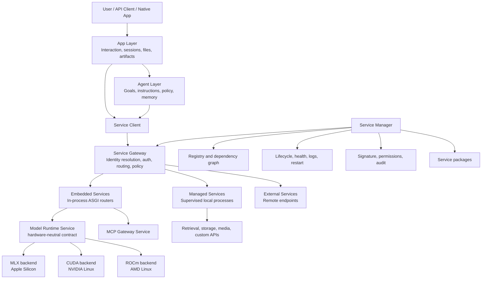
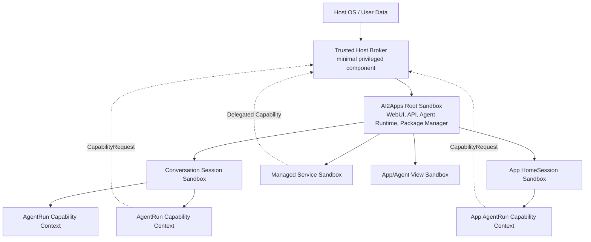

# AI2Apps Platform Architecture

Status: Draft v2.9 — Stabilization active; Coding Harness deferred
Last updated: 2026-08-11
Implementation plan: [AI2Apps Backend Development Plan](ai2apps-backend-development-plan.md)

## 1. Purpose

AI2Apps is evolving from an oMLX-based local model platform into a local-first
AI application and agent platform for unified-memory AI devices. The target
system has three product-level objects—App, Agent, and Service—running on a
hardware-neutral platform above one or more model runtime backends.

Apple Silicon/macOS with oMLX is the first implementation, not the platform
boundary. Target deployments also include Linux AI boxes based on NVIDIA and
AMD accelerators where the device exposes unified, coherent, or otherwise
runtime-managed shared memory suitable for local AI workloads.

The architecture must preserve the existing oMLX model, scheduling, routing,
cache, and inference behavior while adding AI2Apps-owned orchestration,
packaging, security, interaction, hardware discovery, and backend-adaptation
layers. Platform-level App, Agent, Service, package, session, and sandbox
contracts must not depend on macOS, MLX, CUDA, or ROCm details.

## 2. Product model

### 2.1 Core concepts

| Concept | Responsibility | Does not own |
| --- | --- | --- |
| App | Agent-compatible intelligent behavior plus Entry/Mini-Entry, instances, sessions, persistent state, inputs, outputs, and artifacts | Service deployment and unrestricted host execution |
| Agent | Goal-directed reasoning, instructions, model policy, tools, memory, and execution strategy | Service deployment and user-interface implementation |
| Service | Versioned, callable, installable, manageable, and auditable capability exposed through a URL/API contract | User experience and autonomous goal selection |
| Model | A managed inference resource exposed through a model runtime Service | Platform orchestration |

The intended dependency direction is:

```text
User -> App -> Agent -> Service -> Runtime/Resources
```

An App may use one or more Agents and may also call Services directly for
deterministic UI operations. An Agent uses Services to access models, tools,
storage, retrieval, media processing, and other capabilities.

### 2.2 Logical architecture



## 3. Architectural principles

1. **Preserve oMLX as the first model backend.** AI2Apps additions live under
   the `ai2apps` package and use an adapter around oMLX rather than copying or
   rewriting it. The platform contract also permits NVIDIA/CUDA and AMD/ROCm
   backends on Linux without leaking backend details into Apps or Agents.
2. **The server owns Agent execution.** Browsers render state and handle user
   interaction; they do not own the authoritative tool loop.
3. **Service identity is stable; location is not.** Apps and Agents bind to a
   Service ID or capability, not a host and port.
4. **Third-party code is isolated by default.** Untrusted or independently
   versioned Services run in supervised processes rather than the main process.
5. **No package code runs before verification.** Integrity, signature,
   dependencies, permissions, and audit are processed before installation or
   import.
6. **Core state is local and durable.** SQLite stores metadata and execution
   state; the filesystem stores large artifacts and immutable packages.
7. **Existing APIs remain compatible.** Current `/v1/*` and `/admin/*` routes
   continue to work while new App, Agent, and Service APIs are introduced.
8. **The current visual language is retained.** AI2Apps keeps the existing oMLX
   typography, spacing, rounded controls, light/dark themes, and interaction
   style.
9. **Sandboxing is the default execution model.** The AI2Apps runtime, every
   Session, managed Service, Agent/App code Hook, and interactive View operates
   inside an explicit sandbox. Host access is granted only through a minimal,
   auditable capability broker.
10. **Unified-memory AI devices are the primary deployment class.** Hardware
    discovery, memory budgeting, model placement, and scheduling use reported
    device capabilities rather than OS/vendor assumptions. Apple Silicon,
    NVIDIA Linux, and AMD Linux are peer target families.
11. **Worker scheduling is invisible above the platform model boundary.** Apps,
    Agents and domain services express a model operation and execution intent
    through the Host-owned Model Invocation Service. They must not import or
    operate Worker schedulers, workload classes, queue tickets, leases, resource
    estimates, process lifecycle APIs, endpoints, or internal Worker credentials.

### 3.1 Model invocation and Worker encapsulation

The required dependency direction for every local Model Worker call is:

```text
App / Agent / domain service
  -> Model Invocation Service
  -> WorkerJobScheduler + WorkerResourceManager
  -> Package Supervisor
  -> isolated Model Worker
```

The caller may select only a platform-level execution intent such as interactive,
foreground, or background. The Model Invocation Service derives the authoritative
Workload Class and owns admission, queueing, lazy startup, endpoint routing,
progress/cancellation transport, lease release, and retry-safe cleanup.

Reading a model's public capability descriptor—for example model type, supported
media roles, geometry, voices, or context limits—is allowed. Depending on Worker
runtime state or implementation details is not. ACPF remains a capability,
Package, Checkpoint, and Service-lifecycle orchestrator; health and protocol
verification does not enter the inference queue. If ACPF ever requires real smoke
inference, it must submit that operation through the same Model Invocation Service.

This is a release invariant, not an implementation preference. Adding a new App
must not require changes because the Host changes scheduling policy, resource
estimation, Worker placement, local/P2P routing, or process lifecycle behavior.

### 3.2 Deployment and hardware profile

Each AI2Apps node exposes a normalized `HardwareProfile` containing at least:

```text
operating system and architecture
accelerator vendor, devices, and runtime
memory model: unified | coherent | managed-shared | device-local
total, reserved, available, and pressure-adjusted memory
supported data types and kernel features
peer-to-peer/interconnect topology
power and thermal operating state when available
installed model backend providers
```

The primary optimization target is a single-device or tightly coupled AI box
where models, KV cache, routed experts, Agent workloads, and application data
can share a large memory pool without treating host RAM and accelerator memory
as unrelated fixed silos. Backends may still support device-local memory as a
compatibility mode, but Apps, Agents, and Services never assume a particular
memory topology.

Hardware profiles are dynamic. Admission control and model placement use
current available/pressure-adjusted capacity rather than total advertised
memory. Backend-specific metrics are normalized for the Service and WebUI while
remaining available as optional diagnostic extensions.

## 4. Service architecture

### 4.1 Definition

A Service is a versioned execution unit that:

- has a globally stable Service ID;
- exposes a machine-readable API contract, normally JSON over HTTP;
- declares capabilities, dependencies, permissions, and health behavior;
- owns its workload queue, concurrency, and internal load handling;
- can be installed, verified, enabled, disabled, started, stopped, restarted,
  upgraded, rolled back, and uninstalled;
- has immutable source/resources for a given package digest;
- carries publisher integrity information and audit attestations.

The platform manages admission, routing, authentication, process supervision,
health, and lifecycle. The Service manages its own work scheduling and queue.

### 4.2 Identity, capability, and URL

Service consumers should bind to an identity or capability:

```text
service: ai2apps.model-runtime
capability: model.chat@1
```

They must not bind directly to an implementation address such as
`http://127.0.0.1:8123`.

The stable gateway namespace is provisionally:

```text
/services/{service-id}/{path}
```

Examples:

```text
/services/ai2apps.model-runtime/v1/chat
/services/ai2apps.mcp/v1/tools
/services/com.example.retrieval/v1/search
```

The gateway resolves the active Service instance and forwards the request. For
an embedded Service, the implementation may dispatch directly to an ASGI app
without a physical HTTP loopback while preserving the same protocol semantics.

The concrete public URL prefix is still a design decision. Consumers must use
the Service Client abstraction so the prefix can change without affecting App
or Agent definitions.

### 4.3 Protocol profiles

The initial protocol profiles are:

- `http-json`: JSON HTTP API described by OpenAPI 3.1;
- `mcp`: MCP server exposed through the AI2Apps Service system;
- `openai-compatible`: OpenAI-compatible inference or tool endpoint;
- `internal-asgi`: trusted in-process implementation of an HTTP/JSON contract.

Protocol-specific adapters normalize discovery, health, authentication, and
invocation through the Service Client.

### 4.4 Runtime modes

#### Embedded

An embedded Service runs inside the AI2Apps main process and mounts an ASGI
router. It offers the lowest overhead but shares dependencies and failure scope
with the host.

Embedded mode is restricted to built-in or explicitly trusted packages. An
embedded Service must depend only on the stable AI2Apps Service SDK and the host
runtime dependency set.

#### Managed process

A managed Service runs in an isolated process supervised by AI2Apps. It has its
own environment, dependencies, port, logs, health state, and restart policy.
The Service Gateway hides the physical port from consumers.

This is the default mode for third-party Services.

#### External

An external Service points to an endpoint managed outside AI2Apps. Its package
contains the API contract, connection adapter, authentication requirements, and
metadata. AI2Apps manages configuration, enablement, trust, and health, but not
the remote process lifecycle.

### 4.5 Standard control surface

Every Service instance must expose or allow the platform to synthesize:

- descriptor/capabilities;
- liveness and readiness;
- API contract;
- version and package digest;
- queue/load summary when available;
- structured logs and diagnostics;
- graceful shutdown behavior.

The exact `/.well-known/ai2apps-service` control contract remains to be
specified.

### 4.6 Initial implemented control plane

The first implementation uses one shared SQLite registry for Service
descriptors, dependency edges, runtime instances, and Tool descriptors. Durable
identity is separate from both the process-local provider key and physical
endpoint. A process-local registry binds an authenticated provider to each Tool;
the gateway refuses a binding whose provider key does not own the persisted
Service instance.

Tool discovery and invocation use a policy-owned `ToolCallContext` containing
caller, Session, granted capabilities, and trace identity. The gateway verifies
Service/instance lifecycle, active Session existence, capabilities, input and
output JSON Schemas, timeout, and provider identity before returning a result.
Completion, failure, timeout, and cancellation produce semantic Events. Public
HTTP callers cannot submit their own provider identity or capability grants.

The built-in implementation identities are `ai2apps.model-runtime`,
`ai2apps.mcp`, and `ai2apps.diagnostics`. Existing OpenAI-compatible and MCP
URLs remain compatibility endpoints backed by the same providers. External
JSON Services can be bound through the same stable Tool identity; managed
process supervision and package trust are provided by the M8 control plane.

## 5. Service packages

### 5.1 Package layout

The provisional package extension is `.ai2service`:

```text
example-service.ai2service
├── service.yaml
├── src/
├── resources/
├── contracts/
│   └── openapi.json
├── META/
│   ├── files.json
│   ├── permissions.json
│   └── sbom.spdx.json
├── attestations/
│   ├── publisher.json
│   ├── static-analysis.json
│   └── ai-audit.json
└── signatures/
    └── publisher.sig
```

The package contains source code rather than an opaque executable-only payload.
Platform policy may additionally permit reviewed native binaries, but they must
be declared, hashed, signed, architecture-specific, and represented in the
SBOM.

### 5.2 Manifest draft

```yaml
schema: ai2apps.service/v1
id: com.example.retrieval
name: Local Retrieval
version: 1.2.0

publisher:
  id: com.example

runtime:
  mode: process
  protocol: http-json
  entrypoint: service.main:create_app
  contract: contracts/openapi.json

capabilities:
  - retrieval.search@1
  - retrieval.index@1

requires:
  services:
    - id: ai2apps.embedding
      version: ">=1.0,<2.0"
  python: ">=3.11,<3.14"

permissions:
  filesystem:
    - app-data
  network:
    outbound: false
  secrets:
    - embedding-api-key

health:
  path: /health
  startup_timeout_seconds: 30

queue:
  owned_by_service: true
  concurrency: 4
```

### 5.2.1 Installable Model Providers

A managed or external HTTP Service may add models to the unified AI2Apps
catalog. The Package contains the runtime and signed recipe; large checkpoint
weights stay in the provider's model/Hugging Face cache and are verified by the
provider rather than embedded in the Package archive.

```yaml
runtime:
  mode: process
  protocol: openai-compatible

models:
  - id: com.example.media/chat-v1
    display_name: Example Chat
    model_type: llm
    upstream_id: local-chat-checkpoint
    context_window: 32768

  - id: com.example.media/image-v1
    display_name: Example Image
    model_type: image_generation
    upstream_id: local-diffusion-checkpoint
    capabilities: [image_generation]
    endpoints:
      image_generation: /v1/images/generations
      image_edit: /v1/images/edits
```

Supported model types are `llm`, `vlm`, `image_generation`, `audio_stt`,
`audio_tts`, `audio_processing`, and `video_generation`. Model IDs must be
owned by the Service namespace (`<service-id>/...`). Installing a Package does
not change a system default: the user selects the new model in Models. Active
models are exposed through `/v1/models` and use the standard Chat Completions,
Responses, Images, Audio, and Video endpoints. Disabling, stopping, or
uninstalling the Service removes its models from discovery and routing.

Local MLX providers request two narrow, auditable permissions instead of
embedding or duplicating checkpoint weights:

```yaml
permissions:
  model_weights:
    huggingface_cache: read
  accelerator:
    metal: true
```

The first exposes the host Hugging Face cache read-only; downloads, when
needed, go to Package-owned data. The second enables only the Metal/IOKit and
compiler services required by the GPU inside the managed-process sandbox.
Ordinary Services receive neither permission. Platform-to-provider loopback
HTTP also ignores host proxy environment variables so private requests cannot
be redirected through an external proxy.

`packages/qwen35-provider` is the first concrete reference implementation. It
registers Qwen3.5 2B/0.8B 4-bit as independent VLM entries and implements Chat
Completions plus non-streaming Responses without storing weights in the
Package. Build and run its isolated end-to-end smoke test with:

```bash
python scripts/build_model_provider_package.py packages/qwen35-provider
python scripts/smoke_qwen35_provider_package.py
```

### 5.3 Platform and accelerator compatibility

Packages declare portable requirements separately from platform-specific
artifacts. Relevant compatibility fields include OS, CPU architecture, Python
ABI, accelerator family, backend provider/API version, memory-model features,
native libraries, and required kernel capabilities.

One logical Service package may contain signed variants or resolve signed
platform-specific dependency artifacts. Installation selects a compatible
variant before executing package code and presents that selection during audit.
An incompatible package remains installable only if it contains a usable
portable path; the installer must not silently substitute an unaudited binary.

Apps and Agents should normally be hardware-neutral. Only Services and model
backend providers declare accelerator-specific requirements unless an App or
Agent includes its own native executable component.

### 5.4 Integrity and signatures

`META/files.json` contains canonical cryptographic hashes for all immutable
package content. The publisher signature covers the manifest and complete file
index rather than only the archive bytes.

Audit records are independent attestations referring to the same package
digest. This allows a marketplace, organization, or local AI audit to add a
review without modifying the signed source package.

Changing any covered byte creates a new package digest and invalidates all
attestations issued for the previous digest.

The v1 offline signature is Ed25519 over the canonical `sha256:` package digest.
The SQLite trust store pins publisher ID, key ID, algorithm, and public key and
records trusted, untrusted, or revoked status. Key rotation uses a distinct
publisher/key identity rather than silently replacing pinned key material.
Network-backed provenance may be an additional signal but is not required.

### 5.5 Audit model

Installation verification can include:

- manifest and archive safety validation;
- SBOM validation;
- static source analysis;
- permission-to-code consistency checks;
- license and vulnerability policy;
- trusted third-party audit attestations;
- a local AI source review.

A local AI audit records at least:

```text
package digest
audit model and version
audit policy version
review scope
findings and evidence
risk classification
recommended decision
timestamp
```

AI audit is a security signal, not a replacement for integrity verification,
isolation, permissions, or user approval.

### 5.6 Installation pipeline

No package source is imported or executed before the verification and approval
steps finish.

```text
Acquire package
-> parse manifest safely
-> verify file hashes
-> verify signatures and publisher trust
-> resolve dependency graph
-> inspect permissions
-> run configured static/local AI audits
-> present installation plan
-> obtain required approval
-> install transactionally
-> create runtime environment
-> start and health-check
-> activate, or roll back on failure
```

Installed versions are immutable. Mutable configuration and runtime data live
outside the package directory.

## 6. Dependency management

The Service Manager maintains both forward and reverse dependency graphs.
Dependencies use Service IDs and semantic version constraints. Capability-based
binding may be used by Apps and Agents, but installation locks must resolve to
specific Service IDs and versions for reproducibility.

Required behavior includes:

- dependency DAG construction and cycle detection;
- automatic dependency acquisition with a visible installation plan;
- deterministic version resolution and lock generation;
- conflict reporting before mutation;
- reverse-dependency checks before disable, upgrade, or uninstall;
- atomic installation and rollback;
- retention of a previous healthy version for rollback.

The first implementation may allow multiple installed versions but only one
active version per Service ID. Multi-version activation scoped to an App or
Agent is deferred until a concrete need justifies the additional routing and
state complexity.

Disabling or uninstalling a required Service is blocked by default. Explicit
cascade operations may be added later, but must show all affected dependents.

## 7. Service lifecycle and management

### 7.1 States

The initial lifecycle state machine is:

```text
not_installed
-> verifying
-> installed
-> disabled | stopped
-> starting
-> healthy
-> degraded
-> failed
-> upgrading
```

Additional internal transitional states may be introduced, but externally
reported states should remain stable and easy to understand.

### 7.2 Operations

The control plane supports:

```text
install
uninstall
enable
disable
start
stop
restart
upgrade
rollback
audit
view logs
```

Operations are idempotent where practical and return an operation/run ID for
long-running work. Lifecycle events are persisted and streamed to the WebUI.

### 7.3 Service Manager components

The Service Manager consists of:

- package store;
- installed-version registry;
- dependency resolver and lock store;
- signature verifier and publisher trust store;
- audit/attestation store;
- permission and secret broker;
- embedded router registry;
- process supervisor;
- Service Gateway;
- health and readiness monitor;
- structured log collector;
- operation/event store.

## 8. Built-in Services

### 8.1 Model runtime

`ai2apps.model-runtime` is a hardware-neutral built-in Service. The current oMLX
runtime is its first embedded backend provider. Existing oMLX code is not moved
merely to satisfy the abstraction.

Initial capabilities include:

```text
model.list
model.load
model.unload
model.chat
model.responses
model.embedding
model.rerank
model.audio
```

Existing OpenAI-compatible `/v1/*` APIs remain public compatibility routes.
The Service adapter maps the new capability system onto the same runtime.

#### 8.1.1 Model backend provider contract

A `ModelBackendProvider` isolates accelerator/runtime-specific behavior behind
one contract. A provider is responsible for:

- hardware discovery and normalized `HardwareProfile` reporting;
- model format and quantization compatibility;
- memory estimation, allocation, pressure reporting, and release;
- model load/unload and inference execution;
- backend-native scheduling, batching, cache, kernel, and topology behavior;
- normalized health, metrics, errors, cancellation, and capability discovery.

Initial provider families are:

| Provider | Initial environment | Role |
| --- | --- | --- |
| `omlx-mlx` | Apple Silicon on macOS | First/reference implementation preserving current oMLX behavior |
| `nvidia-cuda` | NVIDIA-based Linux AI boxes | CUDA-family backend selected by installed provider and hardware capabilities |
| `amd-rocm` | AMD-based Linux AI boxes | ROCm-family backend selected by installed provider and hardware capabilities |

CUDA and ROCm provider packages are implementation units, not dependencies of
the platform core. They may wrap an appropriate native inference engine while
presenting the same Model Runtime Service contract. A node may install multiple
providers and the runtime selects by explicit policy, model compatibility,
memory pressure, and hardware availability.

The backend abstraction does not attempt to erase useful differences. Common
operations are portable; provider-specific optimizations and diagnostics are
advertised as optional capabilities. Model manifests may state portable
requirements such as minimum memory, data type, architecture, context length,
or kernel feature, plus optional provider-specific constraints.

#### 8.1.2 Unified-memory scheduling

The model runtime publishes reservations for model weights, KV cache, routed
experts, temporary buffers, and safety margin. Admission is based on a shared
node memory budget and live pressure rather than a hard-coded distinction such
as `RAM` versus `VRAM`.

Each backend maps the normalized budget to its actual memory system. This may
be physically unified memory, cache-coherent CPU/accelerator memory, a managed
shared-memory runtime, or a more explicit placement scheme exposed through the
same accounting contract. Eviction and cache policies remain backend-owned but
must report their reservations and pressure to the platform scheduler.

### 8.2 MCP

The existing MCP manager is initially exposed as the built-in embedded Service
`ai2apps.mcp` with capabilities such as:

```text
tools.list
tools.execute
servers.list
servers.manage
```

Individual MCP servers can later be represented as `service.kind: mcp`
instances. `ai2apps.mcp` remains the protocol adapter and aggregation layer.

## 9. Agent architecture

### 9.1 Definition and session ownership

An Agent is an installable intelligent execution definition that can be invoked
with natural language or structured input and runs asynchronously in a
conversation information stream.

The architecture distinguishes:

- `AgentDefinition`: installed, versioned, shareable Agent definition;
- `AgentRun`: one asynchronous invocation of an Agent;
- `AgentView`: an interactive view mounted by a Run in the conversation stream
  or sidebar;
- `EffectiveAgent`: the immutable upstream Agent plus an ordered local Patch
  stack.

An `AgentDefinition` is reusable and does not belong to a single conversation.
Every `AgentRun` belongs to exactly one `ConversationSession` and is anchored to
the message or turn that invoked it.

An Agent definition contains:

- stable ID and version;
- natural-language activation description and examples;
- instructions and optional prompt assets;
- model capability and routing policy;
- allowed Services, tools, and supporting Agents;
- memory and context policy;
- execution limits and approval policy;
- input and output schemas;
- status-line and interactive View definitions;
- tests and result constraints;
- optional Fusion/review policy.

Example:

```yaml
id: general-assistant
name: General Assistant
version: 1.0.0
instructions: You are a helpful local assistant.

activation:
  description: General local assistant for questions, files, and tasks.
  examples:
    - Summarize this document
    - Convert this SVG to PDF
  accepts:
    - text
    - file

model:
  capability: model.chat@1
  preferred_service: ai2apps.model-runtime
  model: qwen3.6

services:
  allow:
    - ai2apps.mcp

tools:
  allow:
    - filesystem__read
    - web__search
  approval:
    - filesystem__write

status:
  primary:
    kind: text
    presentation: pulse

memory:
  conversation: true
  app_scope: true

runtime:
  max_steps: 10
  timeout_seconds: 300
  parallel_tools: true
  max_tool_parallelism: 4
```

### 9.2 Natural-language dispatch and asynchronous API

Agents can be selected through:

1. explicit user selection or an `@Agent` reference;
2. the current App's default Agent;
3. an Agent Resolver matching natural language, attachments, context,
   activation examples, and accepted input types.

Natural language is a dispatch surface over a structured Run request. Ambiguous
matches produce a user-visible choice rather than silently executing a low-
confidence selection. Elevated permissions still require approval regardless
of routing confidence.

The provisional Session-centered API is:

```text
POST /v1/sessions/{session-id}/agent-runs
GET  /v1/agent-runs/{run-id}
GET  /v1/agent-runs/{run-id}/events
POST /v1/agent-runs/{run-id}/inputs/{input-id}
POST /v1/agent-runs/{run-id}/approve/{approval-id}
POST /v1/agent-runs/{run-id}/cancel
POST /v1/agent-runs/{run-id}/resume
```

Run creation returns HTTP 202 with a Run ID and event-stream URL. Multiple Runs
may execute concurrently in one Session. Each Run independently updates the
status-line anchored under its invoking message, so a long-running Agent does
not block subsequent conversation.

### 9.3 Agent Runtime and state machine

The server-side Agent Runtime owns:

- context construction;
- model invocation through Service Client;
- tool and supporting-Agent selection and execution;
- step limits, deadlines, cancellation, and budgets;
- permission and approval checkpoints;
- status, interaction, and artifact event streaming;
- state and artifact persistence;
- retry, pause/resume, and failure policy;
- canonical final result selection.

The initial Run state machine is:

```text
queued
-> planning
-> running
-> waiting_input | waiting_capability | interrupted
-> running
-> completed | failed | cancelled
```

Agent definitions optionally name a durable `concurrency_group` and its limit.
Runs without a group are limited only by the runtime-wide admission bound;
definitions sharing a group also share its capacity. This models an exclusive
accelerator as limit 1, a bounded model pool as limit N, and ordinary I/O
Agents as ungrouped. Capacity is held only while a Run is `planning` or
`running`: waiting for a menu, file, text, or approval response releases it and
the answered Run returns to the priority queue.

Claiming a Run and checking its shared group are one SQLite transaction. Thus
multiple scheduler tasks cannot oversubscribe the same hardware group. Queue
order is priority first and creation order second. This is an in-process
durable scheduler contract; a future multi-process implementation must retain
the same atomic-claim semantics.

The current browser-side MCP loop is treated as a compatibility prototype.
New Agent execution is server-owned. Model actions reuse the authoritative
`/v1/chat/completions` route through an in-process ASGI transport, and Tool
actions pass through the common Tool Gateway.

#### 9.3.1 Built-in General Agent

`ai2apps.general-agent` is the default AgentRun target. A caller supplies one
of two unambiguous durable inputs:

- `message_id`: an existing completed User Message in the Run's Session; or
- `prompt`: text that the Agent idempotently persists as a User Message first.

The executor reconstructs its complete state from Session Messages and
completed RunSteps on every scheduling pass:

```text
bounded Session context
-> model action with active Tool schemas
-> zero or more durable Tool actions
-> Tool results with original tool_call_id
-> next model action
-> idempotent final Assistant Message
-> completed AgentRun
```

It never trusts in-memory loop state. Model-selected Tools use aliases derived
independently from their stable qualified names, including a digest whenever
normalization is required. Installing another Service therefore cannot remap a
Tool alias in a recovering Run. Tool execution still resolves the canonical
qualified name and passes through the Gateway.

Agent manifests bound the Tool allowlist, Session message count, cumulative
model tokens, repeated identical Tool calls, total Run steps, and wall time.
History beyond the deterministic message-count boundary is represented by an
explicit omission marker; a later semantic compactor may replace that marker
without changing the executor interface. When the model has exhausted its
token budget while asking for a Tool, the Run fails before that Tool can cause
an effect.

The final model answer is appended to the Session with an idempotency key
derived from the Run ID and metadata linking it back to the Agent definition
and Run. A crash between Message creation and Run completion can consequently
retry without duplicating the visible answer.

### 9.4 Conversation event, status-line, and interaction protocol

Every AgentRun must always have one primary status-line in the conversation
information stream. An Agent may provide custom status events; when it does not,
the platform derives a safe fallback from the Run state.

The initial status presentations are:

- `plain`: one line of text;
- `pulse`: animated/breathing text;
- `progress`: determinate progress;
- `indeterminate`: unknown progress;
- `warning`: waiting or degraded state;
- `error`: failure state.

Example event envelope:

```json
{
  "id": "evt_12",
  "seq": 12,
  "session_id": "session_1",
  "run_id": "run_456",
  "type": "agent.status",
  "payload": {
    "status_id": "primary",
    "phase": "rendering",
    "text": "Generating image…",
    "presentation": "pulse",
    "progress": null
  }
}
```

The platform fallback labels cover queued, planning, running, waiting for input,
waiting for approval, completed, failed, and cancelled states. A completed Run
retains a collapsed execution summary in conversation history.

Interactive Agent events include:

```text
agent.status
agent.input.request
agent.approval.request
agent.view.mount
agent.view.update
agent.view.focus
agent.view.close
agent.artifact
agent.completed
agent.failed
```

Input requests use JSON Schema plus UI hints for menus, text, numbers, dates,
toggles, forms, files, and directories. File selection returns a scoped resource
handle rather than ambient filesystem access.

Agent Views can be mounted `inline` beneath the invoking message or in the
conversation `sidebar`. Supported View trust levels are:

1. `schema`: host-rendered declarative UI, the default;
2. `safe-html`: strictly sanitized script-free HTML;
3. `sandbox`: signed or local-audited HTML/JavaScript in an isolated iframe,
   communicating through a constrained message bridge.

Arbitrary Agent HTML/JavaScript is never inserted directly into the host DOM.
A primary status-line remains present even while an interactive View is shown.

SSE is the initial durable server-to-client event transport and supports replay
from an event sequence after reconnect. Input, approval, and View actions use
authenticated HTTP requests; a bidirectional transport may be introduced later
without changing event semantics.

The implemented foundation exposes:

```text
GET  /v1/platform/agents
POST /v1/platform/sessions/{session-id}/agent-runs
GET  /v1/platform/agent-runs/{run-id}
GET  /v1/platform/agent-runs/{run-id}/events
POST /v1/platform/agent-runs/{run-id}/interactions/{interaction-id}/respond
POST /v1/platform/agent-runs/{run-id}/approve/{interaction-id}
POST /v1/platform/agent-runs/{run-id}/deny/{interaction-id}
POST /v1/platform/agent-runs/{run-id}/cancel
POST /v1/platform/agent-runs/{run-id}/resume
```

Run creation is idempotent and returns HTTP 202 with the complete initial
snapshot and a Run-scoped SSE URL. The frontend first paints that snapshot,
then subscribes with its last durable Event sequence. `agent.status` replaces
the primary status-line by revision; `agent.input.request` and
`agent.approval.request` mount a control selected from `kind`, JSON Schema, and
`ui_hints`. A response carries a unique `response_id`, so reconnect retries do
not answer twice. Menus, text, files, forms, and approvals all use this one
interaction settlement protocol.

The primary status-line is persisted before a Run becomes visible. Rich status
content is data only: `safe_html` must pass the host sanitizer and
`sandbox_html` must use the isolated View bridge when the WebUI renderer is
implemented. An unanswered interaction expires to a durable failed state; the
runtime never silently approves it.

The first Chat renderer is a registry-based `status-v1` implementation. It
supports semantic tones (`neutral`, `info`, `success`, `warning`, `danger`, and
`accent`), host-owned icons, determinate/indeterminate progress, expandable
plain-text detail, and bounded effects (`pulse`, `blink`, `shimmer`, `dots`,
and `spin`). All motion observes `prefers-reduced-motion`, and terminal states
stop animation regardless of Agent-provided presentation.

`safe-html-v1` and `sandbox-html-v1` are reserved renderer identities only.
The current host never inserts their content into the DOM and displays the
mandatory text fallback instead. File interactions likewise remain visible but
disabled until the Workspace Service can return a scoped ResourceHandle; the
browser must not substitute a local path or ambient file object.

Chat uses authenticated fetch-based SSE rather than native `EventSource`, so
the API key and durable `after` cursor can be sent without query-string
credentials. Events trigger a debounced authoritative Run snapshot refresh.
Active Run references are retained locally for reconnect, while durable User
and Assistant Message metadata provides recovery across devices or cleared
browser state.

On shutdown or restart, pure planning/model work may be queued again. A Tool
step interrupted while its side effect is unknown becomes `uncertain`, and its
Run becomes `interrupted`; resumption then requires an explicit `retry` or
`assume_completed` reconciliation choice. The scheduler never blindly repeats
such a call.

### 9.5 Agent packages and local AI creation

The provisional package extension is `.ai2agent`:

```text
example-agent.ai2agent
├── agent.yaml
├── instructions/
├── workflows/
├── schemas/
├── ui/
├── tests/
├── META/
├── attestations/
└── signatures/
```

Agent packages are declarative by default and contain instructions, model and
Service bindings, workflows, schemas, View resources, constraints, and tests.
They use the same digest, signature, attestation, trust, and immutable package
principles as Service packages.

A local user can create or modify an Agent through a privileged Agent Builder:

```text
natural-language request
-> editable Patch workspace
-> dependency and permission analysis
-> generated definition/resources/code/tests
-> sandbox simulation and UI preview
-> local AI audit
-> user approval
-> device-signed local Agent or local Patch
```

Local packages and Patches explicitly display local/device trust rather than
publisher trust.

### 9.6 Local Patch model

Installed upstream Agent packages remain immutable. User customization is an
ordered, separately stored `local-patch` stack:

```text
EffectiveAgent = ImmutableUpstreamAgent + OrderedLocalPatchStack
```

This keeps the upstream signature, identity, and update channel while allowing
AI-assisted modifications to status presentation, parameters, instructions,
result constraints, workflows, UI resources, tests, and controlled code.

Each Patch records:

1. the user's natural-language intent;
2. the source Agent version and package digest;
3. structured operations and semantic target IDs;
4. expected target kind, schema, and digest;
5. added or changed resources/code;
6. dependency and permission changes;
7. acceptance tests;
8. audit results and local signature.

Patch operations include `merge`, `replace`, `extend`, `transform`, `remove`,
`add-resource`, `code-patch`, and `add-code`. Semantic targets such as
`ui.status.primary` are preferred over raw line numbers. Text/code diffs may be
stored as implementation detail but do not define compatibility by themselves.

An effective version is identified independently from its upstream package:

```text
upstream:        com.example.image-agent@2.1.0
effective:       com.example.image-agent@2.1.0+local.3
upstream digest: sha256:...
patch-set digest: sha256:...
effective digest: sha256:...
```

Trust reporting distinguishes verified upstream content, device-signed local
Patches, and the audit status of the assembled EffectiveAgent.

### 9.7 Upgrade, rebase, and conflict handling

Updating a locally patched Agent is a three-way semantic rebase:

```text
old immutable upstream
+ local effective result
+ new immutable upstream
-> replay/re-synthesize ordered local Patches
-> tests, permission review, and audit
-> atomic activation or retain previous EffectiveAgent
```

Each Patch can declare a rebase policy:

- `strict`: any target change requires review;
- `preserve-local`: retain an explicit local replacement while warning about
  upstream changes;
- `ai-assisted`: use Patch intent and tests to propose a new implementation;
- `drop-if-satisfied`: suggest removing the Patch when upstream now satisfies
  its intent.

Patch states include `clean`, `rebased`, `needs-review`, `conflicted`,
`disabled`, `superseded`, and `failed-tests`.

For example, if an upstream text status-line was locally replaced by an HTML
View and a later upstream version introduces its own interactive HTML status,
the type/schema precondition fails. The system must not silently overwrite the
new upstream View. It presents a conflict workspace with at least these choices:

1. preserve the complete local replacement;
2. merge the local intent into the new upstream View;
3. accept upstream and retain only still-needed customization;
4. disable the Patch;
5. keep the previously active EffectiveAgent and postpone the update.

AI may propose a resolution, but executable code, new permissions, new
dependencies, or changed sandbox behavior require preview, tests, audit, and
explicit user approval before activation. The current effective version remains
active until the replacement passes all gates.

Local Patches may be exported as `.ai2patch` artifacts. A user may also promote
an accumulated Patch stack into a true Fork with a new Agent ID and independent
release lifecycle.

### 9.8 Code and security boundary

Agent-local code is appropriate for status/interaction UI, validators,
workflow conditions, transformations, result constraints, and lifecycle hooks.
It runs in the constrained Agent Runner or UI sandbox and is audited as part of
the EffectiveAgent.

Code requiring broad filesystem/network access, subprocesses, native
dependencies, independent queues, long-running workers, or a new Web API is
materialized as a local Service package. The Agent Patch adds a dependency on
that Service. AI may present this as one Agent edit, but the Service execution
and permission boundary remains explicit.

Patch risk is classified at least by whether it changes only presentation,
instructions/schema, sandboxed code, permissions, or executable Services.
Unchanged upstream audit attestations remain reusable, while each Patch and the
assembled EffectiveAgent receive differential and composition-level checks.

### 9.9 Agent management and Multi-Agent strategy

Agent definition management actions are:

```text
install | uninstall | enable | disable | update | rollback
patch | rebase | fork | edit | audit | test | export
```

AgentRun actions are:

```text
cancel | pause | resume | retry | approve | reject
```

Agents do not have a process-level `restart`; persistent execution processes
belong to Services.

The first implementation focuses on a reliable single-Agent loop. Multi-Agent
composition is added by exposing an Agent invocation as a controlled capability:

```text
Coordinator Agent
  -> call_agent(researcher)
  -> call_agent(writer)
  -> call_agent(reviewer)
```

This reuses the same Run, Step, status, View, permission, event, and audit
infrastructure. A separate graph/workflow engine is deferred until concrete App
requirements show that Agent-as-capability composition is insufficient.

Fusion is a model-quality orchestration strategy, not a replacement for the
Agent Runtime. An Agent may select a Fusion model policy for a model step.

## 10. App architecture

### 10.1 App as an Agent superset

An App is the product interaction layer over Agents and Services and is a
semantic superset of Agent behavior. Every App can be invoked through natural
language or structured input, can create asynchronous AgentRuns, can interact
with users, and inherits the Agent package, trust, audit, and local Patch model.

An App additionally owns complete UI surfaces, persistent instances, a Home
Session, optional additional App-owned Sessions, durable state, and integration
with system navigation.

Conceptually:

```text
App = Agent behavior
    + Entry
    + Mini-Entry
    + AppInstance lifecycle
    + HomeSession
    + optional AppSession collection
    + persistent state
    + navigation integration
```

Implementation should use a shared interactive-unit/event foundation rather
than duplicate the Agent protocol or force all deterministic system Apps to run
an LLM loop. An App activation may delegate to an Agent, invoke a deterministic
action, or only mount a UI surface while preserving the same activation and
event semantics.

### 10.2 App object model

The architecture distinguishes:

- `AppDefinition`: installed, signed, versioned App definition;
- `AppInstance`: one persistent usable instance of an App;
- `AppSession`: a ConversationSession owned by an AppInstance rather than merely
  hosting its Mini-Entry;
- `HomeSession`: the distinguished initial/default AppSession created when an
  AppInstance first runs independently;
- `EntryMount`: the complete App page mounted below the system navigation;
- `MiniEntryMount`: a compact App surface mounted inline or in a conversation
  sidebar;
- `InteractionSession`: the conversation that invoked or currently hosts an App
  mount;
- `EffectiveApp`: immutable upstream App plus an ordered local Patch stack.

An AppInstance owns business state, artifacts, background Runs, its HomeSession,
and any additional AppSessions independently from currently mounted UI. Closing
a page or Mini-Entry normally unmounts the View without destroying the instance,
its Sessions, or background work.

### 10.3 Independent launch and HomeSession

Launching an App from navigation, App Launcher, or a URL performs:

```text
resolve or create AppInstance
-> create or restore HomeSession
-> restore AppSession collection and select the current/default Session
-> mount Entry
-> restore persistent state, artifacts, and background Runs
```

The HomeSession exists even when Entry does not visually resemble a chat page.
AI actions, approvals, notifications, and execution history can still be stored
in this information stream and surfaced by the App when useful. An App may
create additional AppSessions when multiple independent conversation histories
are part of its product model; doing so does not create another AppInstance.

When a Mini-Entry is launched from another conversation, that conversation is
the `InteractionSession`. The App keeps its own HomeSession for durable internal
history and state. The host conversation stores the activation, user-visible
interaction, important results, and an AppInstance reference rather than
copying all private App events into the host stream.

### 10.4 Entry

Every App must define an Entry that runs in the AI2Apps system shell below the
global navigation bar. Provisional routes are:

```text
/apps/{app-id}
/apps/{app-id}/instances/{instance-id}
```

Singleton Apps may expose stable aliases such as `/apps/settings` or
`/apps/dashboard`.

Entry trust/rendering modes are:

- `host`: trusted built-in UI integrated with native AI2Apps WebUI components;
- `schema`: host-rendered declarative UI;
- `safe-html`: strictly sanitized script-free HTML;
- `sandbox`: signed or local-audited HTML/JavaScript in an isolated iframe.

Third-party App code does not execute directly in the system shell DOM. Entry
receives scoped AppInstance state and actions through a constrained App View
bridge.

### 10.5 Mini-Entry and conversational activation

Every App may define a dedicated Mini-Entry for `inline` and/or `sidebar`
placement in a ConversationSession. Mini-Entry is a purpose-built compact
surface rather than a scaled-down Entry.

Mini-Entry and Entry share the same AppInstance, persistent state, active Runs,
permissions, Service bindings, and artifacts. Expanding a Mini-Entry opens the
same AppInstance in Entry without resetting its state.

Apps inherit Agent activation metadata and can be selected by explicit user
choice, the current App's routing policy, or natural-language matching. Example:

```yaml
activation:
  description: Browse nearby restaurants and create food orders.
  examples:
    - I am hungry
    - Help me order lunch
  accepts:
    - text
    - location
  behavior: suggest
```

Activation behaviors are:

- `explicit`: only direct selection or an explicit App reference;
- `suggest`: show a user-confirmable suggestion in the information stream;
- `auto-mount`: automatically mount Mini-Entry after a confident match.

Third-party Apps default to `suggest`. Users may explicitly grant trusted Apps
auto-mount behavior. Activation never authorizes high-risk side effects such as
placing an order or payment; those remain separate approval steps.

If an App has no custom Mini-Entry, the platform may render a generic compact
launcher with App name, status, and an Open Entry action.

### 10.6 Instance policies

The initial instance modes are:

- `multiple`: multiple independent AppInstances may coexist;
- `singleton`: at most one AppInstance exists in the declared scope.

The scope vocabulary reserves:

- `system`: one instance for the local AI2Apps installation;
- `user`: one instance per user;
- `session`: one instance per ConversationSession.

The first local single-user implementation may begin with `multiple` and
`singleton/system` while keeping manifests forward-compatible with the other
scopes.

Typical policies are:

| App | Policy |
| --- | --- |
| Dashboard | singleton/system |
| Settings | singleton/system |
| User Profile | singleton/user |
| Chat | singleton/user; multiple AppSessions/threads |
| Calculator | multiple |
| Game | multiple |
| File Browser | multiple |
| Document Editor | multiple |

Each multiple AppInstance has an independent instance ID, HomeSession, state,
mounted Views, background Runs, and artifacts. Closing a Mini-Entry is distinct
from suspending or closing the AppInstance.

The initial AppInstance lifecycle is:

```text
creating -> active -> background -> suspended -> active -> closed
                            \-> degraded | failed
```

Singleton system Apps normally support reset, disable, or restore rather than
permanent instance deletion.

Instance cardinality and Session cardinality are independent. `singleton`
limits AppInstances, not the number of ConversationSessions an instance may
own. Creating, selecting, renaming, archiving, or deleting an App-owned Session
is ordinary App state/session lifecycle and never implicitly creates or closes
an AppInstance.

### 10.7 App execution and event reuse

Apps do not introduce a second intelligent Run protocol. Natural-language
activation and UI actions that require intelligence create AgentRuns associated
with the AppInstance and current InteractionSession. Deterministic UI actions
may update App state directly through controlled App actions.

App-specific events extend the shared conversation event system:

```text
app.instance.created
app.instance.restored
app.entry.mount
app.mini_entry.mount
app.view.update
app.view.unmount
app.state.changed
app.backgrounded
app.closed
```

Every asynchronous AgentRun started by an App retains the mandatory Agent
status-line. A passive Mini-Entry itself does not need a separate status-line.

### 10.8 App packages

The provisional package extension is `.ai2app`:

```text
example-app.ai2app
├── app.yaml
├── agents/
├── instructions/
├── workflows/
├── schemas/
├── ui/
│   ├── entry.html
│   └── mini-entry.html
├── migrations/
├── tests/
├── META/
├── attestations/
└── signatures/
```

Example manifest:

```yaml
schema: ai2apps.app/v1
id: com.example.food-order
name: Food Order
version: 1.0.0

instances:
  mode: singleton
  scope: user
  on_launch: focus-existing

activation:
  description: Browse restaurants and prepare food orders.
  examples:
    - I am hungry
    - Help me order lunch
  behavior: suggest

entry:
  kind: sandbox
  resource: ui/entry.html

mini_entry:
  kind: sandbox
  resource: ui/mini-entry.html
  placements:
    - inline
    - sidebar
  expandable_to_entry: true

agents:
  entry: order-assistant

services:
  require:
    - location.search@1
    - food.catalog@1
    - order.create@1
```

App packages use the same immutable content, digest, signature, dependency,
permission, attestation, and audit foundations as Agent and Service packages.

### 10.9 Local AI creation and maintenance

Users can create a local App or modify an installed App through an AI-powered
App Studio:

```text
natural-language request
-> editable App/Patch workspace
-> Entry and Mini-Entry generation
-> Agent and Service creation/binding
-> instance policy and state schema
-> Entry/Mini-Entry preview
-> activation and interaction simulation
-> persistence/migration tests
-> dependency, permission, and local AI audit
-> user approval
-> device-signed installation or Patch
```

The App Studio is itself a privileged singleton App with a Builder Agent. It
provides source editing, live Entry/Mini-Entry preview, instance inspection,
state migration tests, audit, and package/Patch export.

Locally created Apps use a new local App ID and device trust. Installed upstream
Apps remain immutable; AI-assisted customization is stored as a local App Patch
stack.

### 10.10 App local Patch model

The App customization model is:

```text
EffectiveApp
  = ImmutableUpstreamApp
  + OrderedLocalPatchStack
  + MigratedInstanceState
```

App Patches reuse the Agent semantic Patch/rebase engine and additionally target:

```text
activation
instances.policy
navigation
ui.entry
ui.mini_entry
ui.routes
ui.actions
state.schema
state.defaults
agents.entry
agents.supporting
services.dependencies
permissions
artifacts
workflows
```

Patch intent, semantic targets, preconditions, resources/code, tests,
dependencies, permissions, audit, local signing, effective digests, and rebase
policies follow the Agent Patch model. App code/definition Patches apply to all
instances of the EffectiveApp. Per-instance differences belong to instance
settings/state rather than separate code Patch stacks.

Accumulated App Patches may be exported as `.ai2patch` or promoted to a Fork
with a new App ID and independent release lifecycle.

### 10.11 App upgrade and instance-state migration

App upgrades must rebase local Patches and migrate persistent AppInstance state:

```text
verify new immutable upstream
-> semantic rebase of ordered local App Patches
-> assemble candidate EffectiveApp
-> compare old/new state schemas
-> select or AI-generate a state migration
-> snapshot current instance data
-> dry-run migration for every instance
-> test Entry, Mini-Entry, activation, Agents, Services, and permissions
-> local audit and user approval
-> atomic activation, or retain the old EffectiveApp
```

App-specific conflicts include changed Entry/Mini-Entry type or bridge contract,
route changes, incompatible instance policy, state-schema incompatibility,
removed Agent/Service dependencies, and navigation or permission changes.

For example, a local sandbox Mini-Entry Patch cannot be silently replayed when a
new upstream replaces the old Mini-Entry with a different schema-based View.
The conflict workspace offers preservation, semantic merge, acceptance of the
new upstream, Patch disablement, or postponing the update. AI may propose and
preview a migrated View, but tests, audit, and explicit approval gate activation.

Any failed instance migration blocks activation by default. The previous
EffectiveApp, instance snapshots, and rollback path remain available.

### 10.12 Code boundary and Safe Mode

Entry/Mini-Entry UI, App state transformations, and constrained lifecycle Hooks
may live in the App package/Patch sandbox. Agent behavior is implemented by an
embedded/referenced Agent. Broad filesystem/network access, subprocesses,
native dependencies, long-running workers, independent queues, or a new Web API
belong to a Service package, even when App Studio presents the change as one App
edit.

Dashboard, Settings, App Studio, and other system Apps may be locally patched,
but AI2Apps must retain an unpatchable minimal recovery surface. Safe Mode can:

- disable all local App/Agent Patches;
- restore built-in system Apps;
- select a previous EffectiveApp;
- inspect Patch conflicts and failed migrations;
- disable or uninstall a broken App.

### 10.13 Initial built-in Apps and UI modes

The current Chat UI becomes the first built-in App, provisionally identified as
`ai2apps.general-chat`. The existing `/admin/chat` route remains as a
compatibility redirect after the App runtime route is available.

#### 10.13.1 Chat instance and thread model

Chat is the reference example of a singleton App with multiple App-owned
Sessions:

```text
ai2apps.general-chat AppDefinition
  -> one Chat AppInstance per user
     -> ThreadCollection
        -> ConversationSession (thread A)
        -> ConversationSession (thread B)
        -> ConversationSession (thread C)
```

In the initial local single-user deployment, `singleton/user` resolves to one
Chat AppInstance for the installation. The existing behavior of creating and
switching among multiple threads is preserved inside that instance.

`ThreadCollection` is Chat-owned collection state built from standard
AppSession/ConversationSession records, not a second platform-wide Session
type. Its durable record holds the selected-thread recovery pointer and
collection revision. Membership records hold pin, stable ordering, and an
optional legacy client identity. Title, lifecycle, metadata, Messages, and
semantic Events remain on the generic Session resource.

Each Chat thread is a full ConversationSession with its own messages, AgentRuns,
status-lines, mounted Views, artifacts, context/memory policy, SandboxInstance,
ResourceHandles, and GrantLeases. A new Chat thread creates a new
ConversationSession—not a new Chat AppInstance. Thread-scoped resources and
authority do not leak into another thread merely because both belong to the
same Chat instance.

The designated initial/default thread fulfills the HomeSession role; that role
is reassigned transactionally if the default thread is removed. The Chat
AppInstance owns collection-level state such as thread order, pinning,
selected-thread recovery, drafts, search index, and UI preferences. Thread
title and archive state remain Session fields. Deleting or archiving a thread
applies its Session retention policy but leaves the singleton Chat AppInstance
running.

Entry renders the selected thread and the thread navigation/sidebar. Multiple
browser windows or EntryMounts may project the same Chat AppInstance and may
select different threads without duplicating App state. Agent execution remains
owned by the selected ConversationSession.

The Chat Entry treats the platform database as authoritative. Browser
`localStorage` may retain an offline/recovery projection, but it never owns the
canonical thread revision. Existing browser-owned oMLX chats are imported once
by stable legacy identity through an idempotent backend transaction; the local
copy is preserved so migration failure cannot erase history. Thread and content
mutations use optimistic Session/collection revisions, and stale projections
surface conflicts instead of applying last-writer-wins overwrites.

#### 10.13.2 Session is broader than Chat Thread

`ConversationSession` is a platform execution and information-stream resource,
not an alias for a Chat App thread. A Session may be owned by any AppInstance,
serve as an App HomeSession, host an Agent child context, or provide a temporary
Mini-Chat/In-App-Chat embedded in another App.

The initial classification dimensions are:

```text
session_kind: app | chat_thread | mini_chat | in_app_chat | agent_child
visibility:   listed | unlisted
retention:    durable | temporary
expires_at:   required UTC expiry for temporary retention; absent for durable
```

Chat's ThreadCollection contains only Sessions explicitly classified as
`chat_thread`, owned by that Chat AppInstance. A Chat thread is always listed
and durable. `mini_chat` and `in_app_chat` default to unlisted and temporary:
they still receive normal Message, Event, Agent, approval, sandbox, and replay
semantics, but they do not appear as persistent threads in the Chat App.

Temporary does not mean browser-only or non-authoritative. The backend may
persist a temporary Session across a short restart window and later expire it
according to retention policy. The initial platform default is 24 hours, with
an explicit expiry allowed at creation. A bounded runtime janitor soft-deletes
expired Sessions and emits `session.expired` atomically; Messages and Events
remain available for audit and recovery policy. Promoting a temporary
conversation into a Chat thread must be an explicit copy/adopt operation with
an audit Event; it is never inferred merely because the interaction looks
conversational.

The initial reusable Entry interaction modes remain:

- `chat`: conversational assistant;
- `form`: structured input followed by execution;
- `workspace`: conversation plus files, previews, and artifacts;
- `workflow`: phases, progress, approvals, and results.

Apps may implement these modes through host-rendered schema UI or sandboxed
custom Entry/Mini-Entry resources while preserving the system shell, trust, and
event contracts.

## 11. Runtime state model

The common state hierarchy is:

```text
AppDefinition
  -> AppInstance
     -> AppSession[]
        -> HomeSession (default role)
        -> SessionSandbox
        -> ConversationTurn / Message
           -> AgentRun
              -> RunCapabilityContext
              -> StatusLine
              -> AgentView
              -> ModelStep
              -> ServiceStep / ToolStep
              -> InputStep / ApprovalStep
              -> Artifact
     -> PersistentState / Artifacts
     -> EntryMount / MiniEntryMount
        -> ViewSandbox
     -> InteractionSessionBinding
        -> external ConversationSession
        -> SessionSandbox
        -> ConversationTurn / Message
           -> AgentRun
              -> RunCapabilityContext
              -> StatusLine
              -> AgentView
              -> ModelStep
              -> ServiceStep / ToolStep
              -> InputStep / ApprovalStep
              -> Artifact
```

Definitions:

- `AppInstance`: persistent stateful instance of an App definition;
- `AppSession`: a ConversationSession in the one-or-more Session collection
  owned by an AppInstance;
- `HomeSession`: the initial/default role assigned to one AppSession;
- `SessionSandbox`: isolated workspace, resources, policies, Grants, quotas,
  and audit stream for a ConversationSession;
- `EntryMount/MiniEntryMount`: full or compact UI projection of an AppInstance;
- `ViewSandbox`: isolated renderer and constrained bridge for executable Views;
- `InteractionSessionBinding`: reference to an external conversation currently
  invoking or hosting an App;
- `ConversationSession`: durable information stream shared by the user, Apps,
  and asynchronous Agents;
- `ConversationTurn/Message`: user, Agent, system, or tool content and the
  anchor for one or more AgentRuns;
- `AgentRun`: one goal-directed asynchronous execution owned by exactly one
  ConversationSession;
- `RunCapabilityContext`: narrowed capabilities delegated from the Session to a
  specific Run;
- `StatusLine`: mandatory primary live status for an AgentRun;
- `AgentView`: interactive inline or sidebar UI mounted by an AgentRun;
- `Step`: a model, Service, tool, approval, or internal orchestration action;
- `Event`: append-only progress/state transition emitted by a Run or operation;
- `Artifact`: a durable output such as a file, document, image, or structured
  result;
- `Memory`: conversation, App-scoped, user-scoped, or Agent-scoped retained
  context.

SSE is the initial transport for live Run and Service operation events. The
event model must support replay after reconnect, not only transient streaming.

Core execution state is stored server-side. Browser `localStorage` is limited
to non-authoritative UI preferences such as theme and panel layout.

## 12. Storage model

The initial local-first storage layout uses:

- SQLite for App/Agent/Service metadata, versions, bindings, sessions, Runs,
  Steps, events, Agent/App package and Patch metadata, EffectiveAgent/
  EffectiveApp assemblies, AppInstances, state-schema migrations, dependency
  locks, SandboxInstances, capabilities, GrantLeases, ResourceHandles,
  SandboxSnapshots, trust decisions, and audit records;
- immutable filesystem directories for installed packages;
- per-Service mutable data directories and per-AppInstance state directories;
- an artifact store for generated files and large outputs;
- a secret store abstraction so manifests refer to secret names rather than
  embedding secret values.

Storage paths, backup semantics, retention, migrations, and multi-user scoping
remain to be specified.

## 13. Sandbox, security, and permission model

### 13.1 Default-deny platform model

Sandboxing is a first-class platform abstraction rather than an optional Agent
or Service setting. The AI2Apps runtime, every ConversationSession, each
managed Service, executable Agent/App Hook, and untrusted View begins without
ambient host access.

Host resources are accessed only through explicit, scoped, expiring,
revocable, and auditable capabilities. Natural-language references to a path,
URL, credential, or external action are requests, not authorization.

The threat model includes malicious or mistaken model output, prompt injection,
untrusted App/Agent/Service packages, compromised UI code, cross-Session data
leakage, excessive permissions, supply-chain compromise, and accidental or
deliberate destructive operations.

### 13.2 Root Sandbox and trusted Host Broker

Most of AI2Apps runs inside a Root Sandbox that limits access to the AI2Apps
installation/data directories, configured model storage, package store,
database, required loopback endpoints, and explicitly allowed system resources.
It does not receive unrestricted access to user files, credentials, devices,
network, subprocesses, or external applications.

If approved operations can cross the Root Sandbox, a minimal trusted Host
Broker must run outside it. Otherwise sandboxed code cannot safely perform an
approved elevation. The Host Broker is part of the trusted computing base and:

- does not execute model output or third-party package code;
- validates signed/scoped capability requests;
- resolves host resources into opaque handles;
- starts approved isolated processes;
- applies or revokes GrantLeases;
- performs approved export/commit operations;
- emits append-only audit events.

The broker interface is narrow and policy-driven. Compromising the general
AI2Apps runtime must not implicitly grant broker authority.

### 13.3 Sandbox hierarchy



The hierarchy is an authorization model even where the host OS does not provide
literal nested sandboxes. Every enforcement layer must preserve equivalent
isolation through processes, resource namespaces, capability tokens, brokers,
and storage boundaries.

### 13.4 Session Sandbox

Every ConversationSession, including an AppInstance HomeSession, owns a
SandboxInstance with:

```text
workspace
temporary storage
artifacts
resource mounts
secret references
network policy
Service grants
process/resource limits
storage quota
audit/event history
```

Sessions are mutually isolated by default. A handle, mount, secret, workspace,
or Grant issued to one Session is invalid in another unless an explicit,
audited delegation is created.

An AgentRun executes with a child capability context derived from its Session.
It can receive narrower time, resource, network, and Service limits, but cannot
expand the parent Session's authority by itself.

Session retention policy determines whether its sandbox is destroyed, archived,
snapshotted, retained for a period, or reduced to selected Artifacts when the
conversation closes.

### 13.5 Service Sandbox and Session delegation

Each managed Service runs in its own process/environment sandbox according to
its signed manifest. Installation permission describes the maximum capability
the Service may request; it is not a permanent runtime grant.

For a Service invocation on behalf of a Session:

```text
EffectiveServiceCapability
  = RootPolicy
  intersection ServiceManifestPermissions
  intersection SessionDelegation
  intersection ActiveGrantLease
```

A Service that handles multiple Sessions must isolate temporary data, queues,
resource handles, secrets, and results by Session/caller identity. It receives
scoped resource handles rather than raw host paths whenever possible.

Embedded Services are not exempt. Privileged embedded operations use the same
broker/capability interface instead of relying on ambient main-process access.

### 13.6 View Sandbox

Agent status HTML, AgentView, App Entry, and Mini-Entry have a separate UI
sandbox boundary controlling DOM access, cookies/storage, navigation, network,
downloads, clipboard, device APIs, and window creation.

Host-rendered Schema Views require no executable third-party UI code.
`safe-html` is script-free and sanitized. Executable `sandbox` Views run in an
isolated iframe with restrictive CSP and communicate only through a constrained,
authenticated View bridge.

View code does not receive host filesystem or Session authority directly. It
requests actions from the App/Agent runtime, which applies Session policy and
the Host Broker flow.

### 13.7 Capabilities and resource handles

The effective authority for an operation is:

```text
EffectiveCapability
  = RootPolicy
  intersection SessionPolicy
  intersection DeclaredPackagePermissions
  intersection ActiveGrantLease
```

Permission classes include:

- scoped filesystem/resource access;
- inbound and outbound network access;
- subprocess execution;
- model/GPU access;
- secrets;
- access to other Services;
- App, Agent, Session, memory, state, and artifact namespaces;
- external side effects such as messages, publication, orders, and payments.

User-selected host resources become opaque handles:

```json
{
  "resource_id": "file_abc",
  "display_name": "app.svg",
  "capabilities": ["read"],
  "scope": "run_456",
  "expires_at": "2026-08-11T15:00:00Z"
}
```

Agents and Services use `resource://file_abc` rather than assuming access to a
host path. File/directory pickers return handles, and paths typed in natural
language still require resolution and authorization.

The schema-v9 implementation gives every active Session a lazily created
managed `workspace/` plus `temporary/` directory beneath the platform sandbox
root. Selected browser files are copied into that workspace before a handle is
issued, so an ordinary read handle contains no ambient authority over the
original host file. A file interaction is resolved only when its handle is
live, readable, and owned by the same Session as the AgentRun.

Artifacts are immutable, SHA-256-addressed blobs stored separately from mutable
workspace files. Artifact metadata and previews remain Session-scoped even
when identical bytes share a physical content blob. Export to the host is a
different operation: it requires an export-capable external directory handle,
an active `artifact.export` GrantLease for Agent calls, and an atomic Host
Export Broker transaction. The current broker is trusted in-process plumbing;
M7 moves privileged filesystem/process enforcement behind OS sandbox adapters.

Schema v10 realizes that Process boundary. Process authority is exposed only
through the Tool Gateway and resolves to a Session-owned, optionally Run-owned
execution record. Invocation is argv-only, the environment is constructed from
an allowlist and opaque Secret references, output is drained into bounded
chunks, and all control operations independently recheck ownership. Network is
an argument-dependent capability and defaults to denied.

On macOS the child runs under a generated Seatbelt profile with the Session
workspace and temporary directory as its only writable roots. On Linux the
same portable contract maps to bubblewrap namespaces and mounts. Both adapters
are behind one fail-closed interface; an unconfined implementation is permitted
only as an explicit conformance-test double. Agent Run terminal transitions,
platform shutdown, and identity-verified restart recovery terminate complete
process groups.

Host Broker spawn authority is represented by a short-lived HMAC envelope
scoped to one operation, Session, Run, request ID, and nonce. Only its digest,
expiry, resolution, and narrowed evidence are persisted. This initial broker
is in-process, but its envelope and audit contract can move across a privilege
boundary when the whole AI2Apps root runtime is placed in its own outer sandbox.

### 13.8 Capability requests and GrantLeases

An operation outside the current capability context creates a
`CapabilityRequest` and moves the AgentRun to `waiting_capability` or
`waiting_approval`.

A request records:

- requesting App, Agent, effective package/Patch digests, Run, and Session;
- operation and precise target;
- reason and relation to the user's current goal;
- requested scope and duration;
- input/output data flow;
- reversibility and expected side effects;
- diff, export preview, or execution plan when available;
- current trust, audit, and permission state.

Approval issues a narrow `GrantLease`, not a general sandbox escape. Initial
Grant scopes are:

- `once`: one operation;
- `run`: current AgentRun;
- `session`: current ConversationSession;
- `app-instance`: current AppInstance;
- `package-version`: a specific EffectiveAgent/EffectiveApp digest;
- `persistent-rule`: an explicit user-created policy rule.

The default is the narrowest practical `once` or `run` scope. Grants are
revocable. Package upgrades, local Patch changes, or effective digest changes
invalidate digest-bound Grants or require review.

The schema-v8 implementation starts with four directly resolvable scopes:
`run`, `session`, `agent`, and `app`. All four stay Agent-definition- and
Tool-pattern-bound; broader names describe lifetime, not authority expansion.
The Chat UI maps these to Allow once (run), Allow for session, and Always allow
agent, with run as the default. The policy engine treats active leases and
deterministic rules as authoritative; the historical AgentRun capability list
is only a compatibility projection. Package-version/persistent-rule UX and
effective package/Patch digest invalidation remain tied to package-manager work.

### 13.9 User approval and configurable AI audit

Each capability class can use one of these decision modes:

```text
deny
ask-user
ai-audit-then-ask
ai-audit-auto-approve
preauthorized-rule
```

Deterministic policy checks run before any AI audit. The executing Agent cannot
approve its own request. AI review uses an independent Policy/Audit Agent or
model context and records the subject digest, model/version, policy version,
evidence, risk, decision, and limitations.

AI audit evaluates at least goal relevance, requested scope, less-privileged
alternatives, destinations, privacy/secrets, reversibility, package/patch trust,
and the complete App -> Agent -> Service call chain.

The initial runtime exposes an independent auditor binding rather than letting
the executing Agent self-approve. Auditor results and evidence are persisted;
malformed/error results fall back to user approval, and deterministic policy
denials cannot be overridden. Concrete auditor model selection, timeout, risk
rubric, and operator configuration UI remain future policy-service work.

Policy may allow AI auto-approval for bounded low-risk operations. The default
policy requires explicit user approval or a precise preauthorized rule for:

- irreversible deletion or overwrite of external data;
- sending messages, publication, orders, and payments;
- exposing or exporting secrets;
- installing executable code;
- privilege escalation;
- security/audit policy modification;
- creation of long-lived or broad grants.

### 13.10 Transactional host operations

Work is performed inside the Session Sandbox before committing side effects to
the host whenever possible:

```text
read approved external resource
-> process in Session workspace
-> generate Artifact/diff/plan
-> user or configured AI review
-> export/commit through Host Broker
```

Reading an external SVG, converting it in the Session, and exporting a PDF are
separate capabilities. The export step can be denied without losing the
in-sandbox result.

Destructive and multi-resource operations should use snapshots, staging,
transactional replacement, trash/recovery, or compensating actions when the
underlying resource supports them.

### 13.11 App, HomeSession, and InteractionSession isolation

An AppInstance HomeSession has its own SandboxInstance. Mounting Mini-Entry in a
different InteractionSession does not transfer all HomeSession authority.

The mount receives only explicitly delegated state/actions. Sensitive App data
is exposed through opaque IDs or scoped App storage capabilities rather than
copied into the host conversation. AgentRuns launched from the mount use the
InteractionSession capability context unless an explicit, audited HomeSession
delegation is required.

### 13.12 Sandbox objects and events

Core objects are:

```text
SandboxPolicy
SandboxInstance
Capability
CapabilityRequest
GrantLease
ResourceHandle
AuditDecision
SandboxEvent
SandboxSnapshot
```

Session, AppInstance, AgentRun, View, and ServiceInvocation records reference a
SandboxInstance or capability context.

Events include:

```text
sandbox.created
sandbox.capability.requested
sandbox.audit.started
sandbox.audit.completed
sandbox.capability.granted
sandbox.capability.denied
sandbox.capability.revoked
sandbox.violation
sandbox.snapshot.created
sandbox.destroyed
```

Sandbox events are append-only and replayable. Policy and audit decisions,
package trust decisions, lifecycle changes, approvals, denials, revocations,
violations, and privileged Service operations are retained according to audit
policy.

### 13.13 Sandbox WebUI and recovery

Every Session and AppInstance exposes a Sandbox panel showing:

- workspace and Artifacts;
- mounted host resources;
- active and pending Grants;
- network and Service access;
- secret references without secret values;
- storage/process quotas;
- audit history and violations;
- revoke, export, snapshot, and cleanup actions.

The user may revoke Grants at any time. New operations fail immediately;
in-flight work is cancelled or allowed to reach a safe boundary according to
capability type.

The minimal Safe Mode/recovery surface is outside locally patchable App/Agent UI
and can disable Patches, revoke Grants, stop Services, restore built-ins, inspect
violations, and roll back EffectiveApps/EffectiveAgents.

Managed-process and UI isolation are defense in depth, not proof of a complete
sandbox. macOS and Linux use separate platform adapters for process, filesystem,
network, device, and UI isolation while preserving the same capability and
Host Broker contracts. Concrete enforcement mechanisms and broker deployment
remain implementation design items for each supported OS/runtime pair.

## 14. API surfaces

The platform separates control-plane APIs from runtime APIs.

### 14.1 Control plane

Provisionally under `/admin/api`:

```text
/admin/api/services
/admin/api/service-packages
/admin/api/service-operations
/admin/api/agents
/admin/api/apps
/admin/api/runs
/admin/api/audits
/admin/api/publishers
/admin/api/sandboxes
/admin/api/capability-requests
/admin/api/sandbox-policies
```

These APIs require administrative authorization.

### 14.2 Runtime plane

Provisionally:

```text
/v1/apps/{app-id}/instances
/v1/app-instances/{instance-id}
/v1/app-instances/{instance-id}/mounts
/v1/app-instances/{instance-id}/sessions
/v1/app-instances/{instance-id}/sessions/{session-id}
/v1/sessions/{session-id}/agent-runs
/v1/agent-runs/{run-id}
/v1/agent-runs/{run-id}/events
/v1/sessions/{session-id}/sandbox
/v1/sandboxes/{sandbox-id}/capability-requests
/v1/capability-requests/{request-id}/approve
/v1/capability-requests/{request-id}/deny
/v1/grants/{grant-id}/revoke
/v1/resources/{resource-id}
/services/{service-id}/{path}
```

Current OpenAI-compatible APIs remain supported independently of the new
resource APIs.

The exact naming, versioning, and route hierarchy remain subject to an API
design pass.

## 15. WebUI information architecture

The WebUI retains the current oMLX-derived design system but separates the
administration/workbench surface from user-facing App execution.

### 15.1 AI2Apps Shell and Dock

The former administration navigation becomes an AI2Apps-owned Dock. The Shell
is an unpatchable recovery boundary containing App Launcher, pinned and running
Apps, the current App frame, system overlays, and Safe Mode. Dashboard, Models,
Settings, Logs, Benchmark, and Chat become built-in Apps rather than permanent
navigation tabs.

`docked` mode reserves a stable top region and sizes the App frame below it.
`immersive` mode keeps the App frame at full viewport dimensions; a delayed
top-edge hot zone, keyboard/touch affordance, or validated App Bridge request
shows the Dock as an overlay without resizing the App. Dock state distinguishes
pinned, running, current, multiple-instance, notification, waiting-approval,
degraded, and failed projections.

App Launcher is a Shell overlay modeled after a device home screen. It lists
enabled Apps by category, supports search, and launches or focuses the correct
AppInstance. Singleton Apps reuse the scoped instance. Multiple Apps focus the
most recent instance unless the user explicitly creates or selects another.

Models remains a pinned high-frequency System App even though it is implemented
by the model runtime Service.

Status and Models show the normalized HardwareProfile, active backend provider,
memory model, total/reserved/available memory, live pressure, loaded-model
reservations, and accelerator health. Provider-specific diagnostics are shown
in an expandable detail area so the primary UI remains consistent across Apple,
NVIDIA, and AMD devices.

### 15.2 App runtime

App UI implementation conventions, including the trusted host-environment
signal and Desktop/browser/mobile Artifact download behavior, are maintained in
the [AI2Apps App development guide](ai2apps-app-development-guide.md).

```text
/apps                                      App launcher
/apps/{app-id}                             singleton/default Entry
/apps/{app-id}/instances/{instance-id}     specific AppInstance Entry
/apps/{app-id}/instances/{instance-id}/sessions/{session-id}
/apps/ai2apps.general-chat/threads/{session-id}  Chat-friendly alias
```

The AI2Apps Shell supplies global navigation, HomeSession access, approvals, files,
artifacts, active-instance status, safe View mounting, and theme behavior.
Mini-Entries mount the same AppInstance inline or in a conversation sidebar and
can expand into Entry without losing state.

For multi-Session Apps such as Chat, the Entry owns Session/thread navigation.
Changing the selected thread changes the projected ConversationSession while
the AppInstance, Entry shell, settings, and collection-level state remain the
same.

System Apps may be pinned directly in the fixed navigation. Third-party Apps
appear in App Launcher by default and enter the fixed navigation only when the
user pins them, preventing uncontrolled navigation growth.

The Shell owns the iframe App Frame Host and browser history. App messages are
accepted only from the exact mounted window/origin and carry AppInstance/mount
identity. The Bridge exposes bounded title, badge, Dock, navigation, Entry,
Mini-Entry, capability, AgentRun, Artifact, and close requests. API credentials
and parent DOM access are never delegated to the frame. Theme, locale,
visibility, HomeSession, resume/suspend, and safe-area state flow from host to
App. Third-party `safe-html` and `sandbox` renderers additionally require
sanitization or iframe CSP/sandbox isolation.

The first implemented compatibility adapter exposes the six built-in system
Apps through this route model. Dashboard-derived Apps share the existing
renderer with a fixed initial page and hide its legacy navigation when framed;
Chat keeps its established Entry while the Shell supplies global navigation.
Presentation mode, pin order, and recent running projections are device-local
preferences. This adapter is intentionally restricted to trusted same-origin
system content. Installed third-party discovery, authoritative AppInstance
projection, instance-bound bridge envelopes, and constrained Entry renderers
remain required before package UI can enter the frame.

The second implementation slice replaces that temporary catalog projection:
built-in and installed Apps now share durable AppDefinitions and the Shell
projects live AppInstances from the platform database. The administrator Shell
calls a session-authenticated lifecycle adapter, never the credential-bearing
model API from an App frame. Pin order and presentation mode remain local UI
preferences; launch, focus, suspend, close, singleton reuse, multiple-instance
identity, HomeSession association, and running state are backend-owned.

Verified package Entries are dispatched through host, schema, sanitized HTML,
or CSP-sandboxed resource hosts. Each package resource is re-hashed against its
active upstream or local-Patch store before serving. A random mount token,
AppInstance ID, source-window match, and expected origin bind the initial Dock,
title, and Launcher bridge messages. The full capability-bearing Bridge keeps
the same envelope but additionally requires the capability and approval checks
defined elsewhere in this architecture.

The W3 migration removes the temporary shared-document projection for built-in
Apps. Dashboard, Models, Settings, Logs, and Benchmark now have distinct Host
Entry templates and DOM ownership while reusing a shared, product-owned
compatibility controller and focused oMLX-derived partials. The App manifest
fixes the permitted former dashboard surface, so query state can select an
internal subpage but cannot turn one App frame into a sibling System App.
Chat remains independently rendered. Historical dashboard tab URLs resolve at
the Shell boundary to the corresponding canonical App.

W4 completes the constrained interaction surface. The full App Bridge is a
request/response protocol bound to the exact frame window, origin, random mount
token, and AppInstance. It exposes bounded Shell actions without exposing API
credentials or parent DOM access. Capability requests still enter the normal
approval path, AgentRun creation is authorized against the owning or mounted
interaction Session, and Artifact export remains a trusted-host operation.

Mini-Entry is persisted as an App mount with placement, interaction Session,
renderer/resource identity, and a JSON context envelope containing information
such as the triggering message ID. Chat renders these mounts inline by default,
can move the same AppInstance to its App sidebar, and can expand that instance
to full Entry. A conservative manifest matcher may suggest an App from natural
language activation examples; installed third-party Apps always require user
confirmation before mounting in the initial policy.

The unpatchable System Control overlay provides package trust evidence, audit
details, permissions/dependencies, Patch order, conflict diagnostics, and Safe
Mode. Patch resolution applies to runtime state, not only metadata: effective
definitions are rebuilt and a conflicted upgrade candidate activates when the
remaining Patch set composes successfully. Safe Mode similarly rebuilds active
definitions without local Patches and restores them on exit.

### 15.3 Service management

The Service list shows:

- name, ID, version, publisher, and type;
- embedded/process/external mode;
- enabled and runtime state;
- health and endpoint;
- trust/audit status;
- platform, architecture, and accelerator compatibility;
- dependent Apps, Agents, and Services.

Service detail tabs are:

```text
Overview | API | Dependencies | Permissions | Audit | Logs | Settings
```

Service installation is a staged review flow:

```text
Package
-> signature and publisher
-> dependency plan
-> permissions
-> audits
-> confirmation
-> installation progress
```

### 15.4 Sandbox and capability management

Sandbox management is available both as a global administration view and as a
contextual panel for each Session, AppInstance, AgentRun, Service, and View.

The global view shows active sandboxes, parent/child relationships, resource
usage, mounted ResourceHandles, active GrantLeases, pending
CapabilityRequests, policy violations, and retained snapshots. The approval
inbox groups compatible requests, but each approval still presents the exact
subject, capability, resource, reason, scope, duration, and audit evidence.

The conversation status-line can enter `waiting_capability` and render a compact
approval card without losing the AgentRun. Approving, denying, or editing the
scope produces an event in the same replayable information stream. A user can
later revoke the resulting GrantLease from the Session panel or global view.

Safe Mode exposes the minimum controls needed to revoke Grants, stop managed
processes, export recoverable Artifacts, and inspect the audit trail even when
normal App or Agent UI is broken.

The first System Control implementation exposes the durable Safe Mode switch,
installed interactive-package verification/audit evidence, and local Patch
conflict resolution. Grant revocation, process stopping, and recovery Artifact
export remain capability-management extensions to this same unpatchable Shell
surface rather than responsibilities of an ordinary App.

The W5 implementation adds a unified Approval Inbox and GrantLease view to
that Shell boundary. Agent approval interactions and generic App
CapabilityRequests share normalized risk, effect, Tool, resource, reason,
deadline, scope, and evidence fields while retaining their different runtime
subjects. Agent approval resumes the waiting AgentRun; App approval resolves
the exact pending Bridge request. A caller AppInstance never receives platform
credentials or authority beyond the returned scoped lease.

Generic App requests and their decisions are durable in schema v14. The
request record links AppInstance, interaction Session, optional AgentRun,
capabilities, Tool, effects, resource selector, risk, deadline, resolution, and
resulting GrantLease. A direct App lease may omit AgentDefinition identity;
Agent-generated leases remain Agent-bound and continue to participate in the
deterministic policy matcher.

Safe Mode now revokes active GrantLeases and stops managed sandbox processes
before rebuilding unpatched effective definitions. These revocations are not
rolled back on exit: permissions must be explicitly granted again. Creation,
allow/deny, expiry, grant, revocation, and recovery transitions are durable
events, providing the first end-to-end approval audit trail.

### 15.5 Agent Harness Tool and Service boundary

The W6 execution layer makes Tool and Service deliberately different
abstractions. A Service is the installable, auditable, dependency-aware runtime
and lifecycle boundary. A Tool is a model-visible, schema-validated,
capability-gated invocation contract exported by that Service. One Service may
export many Tools, and the same Tool Gateway can route an in-process provider,
managed or external JSON Service, MCP adapter, or future supporting Agent
without changing the caller's protocol.

Each accepted Tool call receives durable `tinv_*` identity. Its record binds
the Tool descriptor and provider identity to the caller, Session, Run trace,
arguments, effective timeout, current progress, explicit retry attempt, and
terminal output/error. Provider progress is simultaneously persisted, emitted
as an audit Event, and forwarded to an AgentRun status-line. A process restart
marks any still-running invocation interrupted; RunStep recovery then decides
whether a non-effectful step can be retried or an effectful step must remain
uncertain.

Retries are opt-in descriptor policy rather than a Gateway guess. A policy
declares at most three attempts, bounded backoff, and the stable failure codes
eligible for retry. This prevents an installed side-effecting Tool from being
silently repeated. Capability policy and GrantLease evaluation still occurs
before invocation creation, and every actual provider attempt stays under the
same approved Tool, arguments, resource selector, timeout, and trace.

The first built-in Harness Services are Workspace/Resource/Artifact and
Process. Workspace Tools enforce Session path resolution, quotas, atomic writes
and ResourceHandles. Process Tools enforce argv-only sandbox execution,
Session/Run ownership, bounded environment and output, dynamic network
capabilities, explicit wait timeouts, and process-group cancellation. The
General Agent reconstructs model and Tool conversation from durable Messages
and RunSteps while ToolInvocations supply per-call observability and audit.

## 16. Proposed source layout

```text
ai2apps/
  model_runtime/
    provider.py
    hardware.py
    memory.py
    scheduler.py
    backends/
      mlx.py
      cuda.py
      rocm.py

  services/
    models.py
    manifest.py
    registry.py
    resolver.py
    packages.py
    verification.py
    audit.py
    permissions.py
    gateway.py
    client.py
    supervisor.py
    events.py
    builtin/
      model_runtime.py
      mcp.py

  agents/
    models.py
    manifest.py
    packages.py
    patches.py
    rebase.py
    registry.py
    runtime.py
    policy.py
    memory.py
    views.py
    events.py

  apps/
    models.py
    manifest.py
    packages.py
    patches.py
    rebase.py
    registry.py
    instances.py
    sessions.py
    state.py
    migrations.py
    activation.py
    views.py
    builder.py
    ui_schema.py

  sandbox/
    models.py
    policy.py
    capabilities.py
    resources.py
    sessions.py
    services.py
    views.py
    audit.py
    broker_client.py
    events.py
    platform/
      macos.py
      linux.py

  storage/
    database.py
    artifacts.py
    secrets.py

  api/
    services.py
    agents.py
    apps.py
    runs.py
    sandboxes.py
    capabilities.py
    resources.py

  web/
    templates/
      admin/
        services/
        agents/
        apps/
        runs/
      apps/
        launcher.html
        shell.html
```

This is a responsibility map rather than a commitment to one file per listed
module. Modules should remain small and be introduced only as implementation
requires them.

## 17. Migration plan

### Phase 0: contracts and architecture

- finalize core schemas and stable IDs;
- define Service protocol/control contract;
- define storage and event semantics;
- define package digest and signature model;
- define SandboxPolicy, Capability, ResourceHandle, CapabilityRequest,
  GrantLease, and Host Broker contracts;
- define the default-deny capability vocabulary and configurable audit decision
  policies;
- define `HardwareProfile`, `ModelBackendProvider`, normalized memory accounting,
  and package platform/accelerator compatibility contracts.

### Phase 1: Sandbox foundation

- implement the Root Sandbox boundary and the minimal Host Broker
  client/protocol;
- implement SessionSandbox lifecycle, workspace, temporary storage, Artifacts,
  resource handles, quotas, and cross-session isolation tests;
- implement CapabilityRequest, explicit user approval, GrantLease issuance and
  revocation, deterministic policy evaluation, and append-only events;
- implement managed Service and View sandbox adapters;
- implement common Host Broker semantics with macOS and Linux enforcement
  adapters;
- implement the sandbox/approval WebUI and Safe Mode grant revocation.

### Phase 2: built-in Service foundation

- implement Service Registry and Service Client;
- implement hardware inventory and normalized memory-pressure reporting;
- register the existing oMLX runtime as the first provider of
  `ai2apps.model-runtime`;
- preserve the current oMLX load, cache, scheduling, and inference paths behind
  the provider adapter;
- register the existing MCP manager as `ai2apps.mcp`;
- add the Service Gateway without removing existing routes;
- add read-only Service status to the WebUI.

### Phase 3: Service control plane

- implement lifecycle state and operation/event persistence;
- implement enable/disable/restart for supported built-ins;
- implement process supervision, health, and logs;
- add Service list/detail management UI.

### Phase 4: package and trust system

- implement package parsing and immutable store;
- implement digest/signature verification and publisher trust;
- implement dependency resolution and locks;
- implement permissions, audit attestations, and local AI audit;
- bind installed package digests, EffectiveApp/EffectiveAgent Patch digests, and
  publisher identity into capability policy and GrantLease evidence;
- implement transactional install, upgrade, rollback, and uninstall.

### Phase 5: server-side Agent Runtime

- implement Agent package, definition, activation, and natural-language
  dispatch schemas;
- implement ConversationSession, Run/Step/Status/View/Event persistence and
  replayable SSE;
- bind every AgentRun to its SessionSandbox and a narrower per-run capability
  context;
- route model and tool access through Service Client;
- implement interactive input, sidebar/inline Views, limits, cancellation,
  approval, and audit;
- implement `waiting_capability`, independent configurable AI audit, scoped
  resource delegation, transactional host export, and runtime Grant revocation;
- implement immutable upstream Agents, local Patch stacks, EffectiveAgent
  assembly, tests, and local signatures;
- implement AI-assisted three-way rebase and conflict workspace;
- migrate the browser-owned tool loop to the server.

### Phase 6: App platform

- implement `.ai2app` definitions/packages, AppInstance, AppSession/HomeSession,
  InteractionSession bindings, state, and independent instance/session
  cardinality policies;
- implement Entry/Mini-Entry mounts, trust modes, View bridge, natural-language
  activation, and shared App/Agent event integration;
- enforce HomeSession/InteractionSession capability isolation and explicit
  cross-session ResourceHandle delegation;
- implement App Launcher, system shell integration, active instances, pinning,
  and multiple/singleton lifecycle;
- migrate current Chat into one singleton `ai2apps.general-chat` AppInstance
  whose existing threads become App-owned ConversationSessions;
- implement immutable upstream Apps, local Patch stacks, EffectiveApp assembly,
  AI-assisted rebase, conflict preview, and `.ai2patch` export;
- implement state-schema migrations with snapshots, all-instance dry runs,
  atomic activation, and rollback;
- implement App Studio, Entry/Mini-Entry preview, activation simulation, local AI
  audit, device signing, and App Fork creation;
- implement an unpatchable Safe Mode recovery surface;
- add App and Agent administration pages;
- implement the initial chat/form/workspace/workflow UI modes.

### Phase 7: composition and ecosystem

- Agent-as-capability composition;
- implement and qualify NVIDIA/CUDA and AMD/ROCm Linux model backend providers;
- add cross-backend compatibility, conformance, memory-pressure, and performance
  test suites using identical model/API behavior where formats permit;
- optional multi-version Service activation;
- marketplace/distribution workflows;
- organization policies and additional audit providers;
- custom App UI extension model if required.

## 18. Decisions recorded

The following points are agreed design direction as of this draft:

1. AI2Apps evolves into an Agent platform rather than remaining only a model
   management platform.
2. Apps sit above Agents and own user interaction.
3. Services provide callable capabilities to Apps and Agents.
4. Models and MCP are represented as built-in Services.
5. Services are individually packageable, installable, manageable, versioned,
   dependency-aware, auditable, and signed.
6. Services may run embedded, in managed local processes, or externally.
7. Services own their internal queue/load behavior; AI2Apps owns lifecycle,
   routing, policy, and supervision.
8. Third-party Services default to managed-process isolation.
9. The authoritative Agent loop moves to the server.
10. The WebUI continues the current oMLX visual design language.
11. Existing oMLX and OpenAI-compatible behavior remains available during the
    migration.
12. Agents are asynchronous intelligent endpoints invoked through natural
    language or structured input inside a ConversationSession.
13. Every AgentRun has a mandatory status-line and may mount interactive inline
    or sidebar Views.
14. Agent definitions are installable and reusable; AgentRuns, not definitions,
    belong to conversation Sessions.
15. Installed upstream Agent packages remain immutable. User customization is
    stored as an ordered, auditable, device-signed local Patch stack.
16. Agent upgrades replay or AI-rebase local Patches against the new immutable
    upstream and never activate a conflicted or unvalidated assembly silently.
17. Agent-local UI/hooks run in constrained sandboxes; independently deployed
    or broadly privileged executable capability remains a Service.
18. App is a semantic superset of Agent behavior and adds Entry, Mini-Entry,
    persistent AppInstances, HomeSession, state, and navigation integration.
19. Every App defines a complete Entry under the system navigation and may
    define inline/sidebar Mini-Entries that share the same AppInstance.
20. AppInstances support multiple and scoped singleton policies; independent
    UI mounts do not themselves define or destroy an instance.
21. Apps inherit natural-language activation and shared AgentRun/event behavior;
    third-party conversational activation defaults to a user-confirmable
    suggestion.
22. Users can create and maintain local Apps through AI. Installed upstream Apps
    remain immutable and customization is stored as local App Patches.
23. App upgrades rebase local Patches and migrate every persistent instance's
    state before atomic activation.
24. App definition Patches apply installation-wide; per-instance differences
    remain instance settings/state.
25. System Apps can be patched, but an unpatchable Safe Mode remains available
    to disable Patches, restore built-ins, and roll back broken EffectiveApps.
26. The AI2Apps runtime defaults to a Root Sandbox. A minimal Host Broker outside
    it mediates explicitly approved host access through a narrow protocol.
27. Every ConversationSession, including every AppSession, owns an isolated
    SessionSandbox; an AgentRun receives a narrower child capability context.
28. Host resources are represented by opaque, scoped ResourceHandles. Knowledge
    of a filesystem path or URL is not authorization to use it.
29. Effective authority is the intersection of root policy, Session policy,
    declared package permissions, and active GrantLeases.
30. Crossing a sandbox boundary produces a precise, expiring, revocable, and
    auditable GrantLease rather than a general sandbox escape.
31. Policy modes may deny, ask the user, audit then ask, allow independent AI
    audit to approve within configured limits, or apply a preauthorized rule.
    High-risk operations remain user-approved by default.
32. The Agent or model requesting authority cannot approve its own request;
    automatic approval uses an independent auditor and deterministic policy.
33. Managed Services and interactive Views receive their own sandboxes.
    Embedded Services use the same broker and capability checks as the root
    runtime.
34. Host mutations should be staged and committed transactionally where
    practical so denial, failure, or cancellation does not leave partial writes.
35. An App HomeSession's authority is not automatically transferred to a
    conversation InteractionSession or Mini-Entry mount.
36. AI2Apps targets unified-memory AI devices as a hardware class, not macOS as
    an operating-system boundary.
37. Apple Silicon/oMLX is the first model backend; NVIDIA/CUDA and AMD/ROCm Linux
    AI boxes are peer target families behind the same Model Runtime Service.
38. App, Agent, Service, Session, package, capability, and WebUI contracts remain
    independent of MLX, CUDA, ROCm, and operating-system-specific sandbox APIs.
39. Admission control and model placement use a normalized dynamic
    `HardwareProfile` and shared memory budget rather than hard-coded RAM/VRAM
    assumptions.
40. Accelerator-native runtimes remain responsible for optimized kernels,
    caches, queues, and placement, while reporting normalized capabilities,
    reservations, pressure, health, and errors to AI2Apps.
41. Chat is the first reference App and has one singleton AppInstance per user;
    the initial local single-user system therefore has exactly one Chat
    AppInstance.
42. A Chat thread is an App-owned ConversationSession, not an AppInstance. The
    singleton Chat AppInstance may own any number of threads.
43. The first/default Chat thread fulfills the HomeSession role. Additional
    threads have the same ConversationSession semantics without becoming new
    HomeSessions or AppInstances.
44. Thread creation, selection, rename, pin, archive, retention, and deletion
    are Chat Session/collection operations independent of AppInstance lifecycle.
45. Each Chat thread has an independent SessionSandbox, context, Runs,
    ResourceHandles, and GrantLeases; membership in the same Chat AppInstance
    does not imply cross-thread authority.

### 18.1 Implemented M8 package and lifecycle contract

M8 implements the Service package and lifecycle design in this document with
schema v11 and these concrete boundaries:

- bounded `.ai2service` ZIP parsing, canonical manifest/file-index digest,
  exact file coverage, SPDX validation, Ed25519 verification, and immutable
  content-addressed storage;
- a pinned offline publisher trust store plus digest-addressed local/static AI
  audit attestations whose evidence includes the reviewed source scope;
- deterministic single-active-version resolution, digest locks, cycle checks,
  reverse-dependent safety, compatibility checks, and signed accelerator
  variant selection;
- embedded, sandboxed managed-process, and externally hosted JSON runtimes
  behind the same Service/Tool registry;
- dependency-ordered startup and reverse shutdown, readiness, explicit
  lifecycle operations, bounded logs, restart/backoff, and verified orphan
  cleanup;
- serialized transactional install/upgrade with filesystem and runtime
  compensation, retained-version rollback, and pre-execution revalidation;
- package-digest-bound GrantLeases, preventing an upgraded implementation from
  inheriting authority issued to the previous digest.

Package acquisition/marketplace policy, publisher key-rotation ceremony,
online vulnerability intelligence, richer continuous health policy, and
multi-version simultaneous activation remain extensibility points rather than
part of the v1 local control plane.

### 18.2 Implemented M9 Agent/App/Patch contract

M9 implements the shared interactive-package control plane with schema v12:

- `.ai2agent` and `.ai2app` reuse canonical content digests, trusted publisher
  verification, SPDX, immutable storage, bounded local AI review, operations,
  retained versions, and transactional activation;
- `.ai2patch` is an independently digest-addressed archive signed by an
  installation-local Ed25519 device identity and records intent, base digest,
  ordered semantic operations, resources, tests, audit, and rebase policy;
- `EffectiveAgent` and `EffectiveApp` records cache the immutable upstream plus
  ordered Patch stack using separate upstream, Patch-set, and Effective digests;
- three-way semantic rebase checks target kind/digest preconditions and records
  explicit conflicts while retaining the previously active Effective
  definition; preserve-local, accept-upstream, and disable are explicit
  resolution actions;
- installed Agents bind into the existing Agent Runtime; installed Apps bind
  into existing definitions/instances/Sessions and publish Entry, Mini-Entry,
  activation, navigation, mount, and stable route metadata;
- App activation enforces existing multiple/singleton constraints, creates one
  HomeSession per new instance, snapshots all instance state, dry-runs every
  migration, and atomically switches all instances or none;
- Safe Mode persists prior Patch states, activates clean upstream definitions,
  restores built-in recovery reachability, and can restore the Patch stack
  without relying on a third-party App UI.

The backend intentionally reserves actual host/schema/safe-HTML/sandbox iframe
renderers and the visual conflict workspace for the frontend phase. The API
never returns executable third-party content for insertion into the shell DOM;
it returns declared renderer/resource/mount contracts for a constrained View
host to consume.

### 18.3 Implemented W7A Chat/Agent execution contract

Chat is one singleton App with many persistent thread Sessions, and each
Session stores its own execution mode. In Chat mode a user turn is a direct
model request with no Tool descriptors. In Agent mode the same message becomes
input to `ai2apps.general-agent`; the Agent Runtime, not the Chat frame, owns
planning, Tool selection, capability checks, queueing, side effects, and final
message settlement. Switching mode affects subsequent turns and never rewrites
earlier message provenance.

AgentRun state is projected inline through status-line and replayable event
contracts. Tool activity, structured interactions, approvals, pause, resume,
cancel, and uncertain-effect recovery all remain bound to the Run and Session.
Multiple independent Runs may coexist in one conversation. Schema v16 makes
user pause a durable `interrupted` state: safe work can be requeued, while an
in-flight effectful Tool requires explicit recovery before execution continues.

### 18.4 Implemented W7B Agent selection contract

The Agent catalog is an authoritative projection of installed
`AgentDefinition` records. Chat exposes enabled definitions and persists one
explicit `agent_key` per Session; every Agent turn additionally records the key
used at invocation time. AgentRun snapshots carry definition ID, key, and
display name, preserving understandable provenance across refreshes and future
package updates.

Selection is user-directed and deterministic. Removing or disabling the
selected definition causes a safe fallback to General Agent or the first
enabled definition. Prompt interpretation does not implicitly switch Agents;
future natural-language routing must be represented as an auditable router or
delegation decision with its own policy and status projection.

### 18.5 Implemented W7C invocation-schema contract

An Agent package can publish discoverability, aliases, an object-shaped JSON
Schema for invocation parameters, and declarative UI hints. Package inspection
and Run creation both validate the contract. Chat renders a bounded set of
native controls and persists per-Agent Session defaults; executable markup is
not part of this invocation surface.

`@alias` is an explicit one-turn address, not heuristic routing. The invocation
records its source and parameter snapshot on the message, while the repository
adds authoritative Agent definition identity and package version to durable Run
input. Client validation improves interaction speed but never replaces server
JSON Schema enforcement. Natural-language routing policy remains future work;
explicit parent/child delegation is implemented by W7D.

### 18.6 Implemented W7D parent/child AgentRun contract

`agent.delegate` is a built-in in-process Service Tool that lets an executing
Agent create a bounded child AgentRun in the same Session. A child has its own
durable identity, definition, status-line, steps, interactions, approvals,
deadline, output, and audit events. The delegation Tool waits asynchronously
for that terminal output and returns it to the parent Tool step; only the root
Agent publishes the final Chat assistant Message.

Schema v17 stores `parent_run_id`, stable `root_run_id`, depth, budget/context
snapshot, and a request-keyed `agent_delegations` record. Replay of the same
Tool call reattaches to the existing child instead of creating duplicate work.
The initial safety envelope permits depth 2 and four direct children per
parent, bounds child deadlines by the parent's deadline, and applies the lower
of definition and delegated step/token budgets. Capabilities and GrantLeases
are evaluated for the child itself; authority is never copied from the parent.

While its delegation Tool awaits a child, the parent remains in the compatible
`running` database state and projects the `waiting_subruns` status phase. User
cancel and pause cascade through active descendants. Chat recursively refreshes
and streams child snapshots beneath the root card, where child status and
menu/text/file/approval interactions can be handled without creating a Chat
Thread for the child.

### 18.7 Implemented W8 Agent Manager contract

Agent management is exposed as the singleton built-in `ai2apps.agents` App.
It is a control and observability surface, not an Agent authoring environment.
The App presents the definition catalog, authoritative runtime policy, aliases
and invocation schema, lifecycle state, Run statistics, cross-Agent Run
history, package provenance, Effective Definition identity, and local Patch
status or conflicts.

The management API adds definition enable/disable operations, filtered
AgentRun listing, per-definition terminal/active counts, and one aggregated
detail projection over AgentDefinition, interactive packages, Effective
Definition, local Patches, and recent Runs. Existing pause, resume, cancel,
install, uninstall, rollback, and Patch-resolution contracts remain the
mutation authority and are reused by the App.

Agent Manager deliberately does not edit manifests, source, Patch operations,
or status HTML. Near-term Agent development happens through Codex in a Session
sandbox, then enters the existing signed package/audit/install flow. Agent
Studio is deferred until real Agent development establishes stable coding,
testing, Eval, interaction, and Patch workflows.

## 19. Open design questions

The next design sessions should resolve:

1. Marketplace acquisition and provenance policy beyond the implemented local
   package/import API.
2. Publisher key-rotation/recovery ceremony and optional online revocation
   distribution beyond local trust status.
3. Future simultaneous multi-version Service activation and routing semantics.
4. Continuous health/degradation thresholds and automated operator policy.
5. Concrete macOS and Linux Root/Session/Service sandbox enforcement and Host
   Broker deployment models, including GPU device mediation.
6. Capability vocabulary, secret and ResourceHandle storage, GrantLease token
   format, renewal, and revocation semantics.
7. Service operation/event schemas and health/readiness semantics.
8. Exact Agent event envelope, replay/retention, concurrency, retry, and
   approval semantics.
9. Status-line and Agent View schema, sandbox bridge, CSP, and accessibility
   contract.
10. Visual Patch conflict workspace, AI-assisted re-synthesis policy, and the
    extensible semantic target registry beyond the implemented v1 operations.
11. Fine-grained Patch risk scoring and differential audit reuse beyond the
    implemented device signature, package audit, tests, and composition gate.
12. Concrete host/schema/safe-HTML/sandbox Entry and Mini-Entry renderers plus
    constrained View bridge protocol over the implemented mount contracts.
13. User/session singleton identity in a future multi-user deployment and
    richer focus, suspension, retention, and background execution policy.
14. Cross-App HomeSession/InteractionSession context delegation and privacy UX.
15. Code-authored and AI-authored state migrations beyond the implemented
    declarative all-instance atomic migration and snapshot rollback contract.
16. App Studio privilege boundary and preview sandbox over the implemented
    local device Patch creation/signing API.
17. SQLite schema, migrations, backup, retention, and user/workspace scoping.
18. Exact URL hierarchy and compatibility routing.
19. Packaging and distribution relationship between Service, Agent, and App
    artifacts.
20. Transactional host-operation protocol, conflict handling, mount semantics,
    and Artifact export UX.
21. AI auto-approval risk thresholds, auditor independence, evidence format,
    model availability, and fail-closed behavior.
22. Cross-session resource delegation, privacy indicators, revocation, and
    provenance rules.
23. Sandbox snapshot retention, storage/process/network quotas, cleanup, and
    recovery semantics.
24. Multi-tenant Service isolation, request attribution, cancellation, and
    behavior when a GrantLease is revoked mid-request.
25. View iframe/process isolation, CSP, bridge capability vocabulary, download
    handling, and protection against confused-deputy flows.
26. Exact `HardwareProfile`, memory-pressure, reservation, topology, and thermal
    metric normalization across MLX, CUDA, and ROCm.
27. Model backend provider ABI/API, discovery, lifecycle, error mapping,
    conformance suite, and provider upgrade compatibility.
28. Supported NVIDIA and AMD Linux memory architectures and the boundary between
    primary unified/coherent targets and secondary device-local compatibility.
29. Portable model format/quantization policy and when backend-specific model
    variants may share one logical model identity.
30. Linux distribution, driver, CUDA/ROCm version, native dependency, container,
    and signed package compatibility matrix.
31. Chat thread URL compatibility, collection metadata schema, search/index
    ownership, deletion retention, and migration of existing thread IDs.
