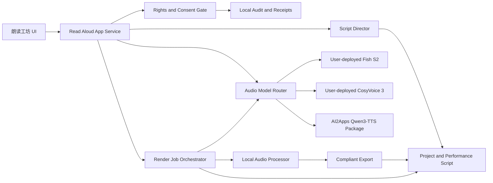

# AI2Apps 朗读工坊产品与技术方案 v1

日期：2026-08-24  
状态：产品与架构决策稿  
内置 App ID：`ai2apps.readaloud`  
中文名称：朗读工坊  
英文名称：Read Aloud Studio

## 1. 结论与核心决策

朗读工坊是 AI2Apps 内置的本地优先有声内容制作 App。AI2Apps 提供创作界面、项目管理、模型发现与编排、音色授权门禁、长文本分段、多角色剧本分析、音频后期、生成记录和合规导出；模型权重、模型运行环境和推理资源由用户安装、部署和控制。

本方案不接入任何云 TTS、云音色训练或云 ASR API。用户可以在本机运行模型，也可以连接其本人控制的 AI2Apps 节点或局域网模型服务；音频和文本不得因为使用朗读工坊而被发送到 AI2Apps Cloud。

模型策略确定为：

1. **Fish Audio S2 Pro 是理想能力与最高效果基准。** 它定义朗读工坊需要达到的目标能力：短样本音色克隆、克隆音色下的细粒度情绪控制、行内表演标记、原生多角色和多轮上下文。
2. **CosyVoice 3 是主要开源自部署兜底。** 它负责在 Fish 不可用、硬件不足或许可证不满足时提供中文友好的音色克隆、指令控制、流式合成和方言能力。
3. **Qwen3-TTS 是 Apple Silicon 本地兼容兜底。** 它复用当前 AI2Apps MLX Package，分别提供 Base 音色克隆、CustomVoice 情绪化预置音色和 VoiceDesign 虚构音色设计。
4. **多角色作品默认由 App 分段编排。** 即使模型支持原生多说话人，工程主格式仍保存为独立角色与独立台词片段，以便局部重做、换声、调参、审计和后期混音。
5. **协议锁定能力，不锁定厂商。** Fish、CosyVoice、Qwen 只是 v1 推荐实现；未来模型只有通过同一能力、许可证、授权和输出协议才能进入路由候选。
6. **所有高级能力均严格拒绝静默降级。** 当实际模型不能在克隆音色下控制情绪，App 必须显示“不支持”或请求用户确认改用另一模型，不得用调速、变调冒充情绪控制。

## 2. 产品定位

### 2.1 目标用户

- 希望用本人或获授权音色朗读文章、课程、小说的个人用户；
- 制作有声书、播客、儿童故事和广播剧的创作者；
- 需要本地处理未公开剧本、商业稿件或敏感录音的小型团队；
- 希望自行选择模型、硬件与部署地点的专业用户。

### 2.2 核心价值

- 一个项目内完成角色设计、音色授权、文本标注、试听、批量生成和导出；
- 同一份剧本可以更换模型或音色，而不需要重做角色和情绪标注；
- 用户知道每一段实际由哪个模型、哪个 revision、什么参数生成；
- 本地优先，模型和数据由用户控制；
- 合规能力是生成流程的一部分，而不是导出前的免责声明。

### 2.3 非目标

- v1 不提供 AI2Apps 托管推理、云端音色库或云 API 代付；
- v1 不提供实时语音通话或全双工语音 Agent；
- v1 不提供音乐生成，背景音乐和音效只能由用户导入；
- v1 不承诺任意模型都能训练或克隆音色；
- v1 不允许绕过授权门禁、生成标识或审计记录；
- v1 不自动发布到播客、视频或社交平台。

## 3. 产品功能

### 3.1 项目与素材

项目支持粘贴文本，以及导入 TXT、Markdown、DOCX、EPUB 和可提取文本的 PDF。导入后保留原文、规范化文本和来源信息，后续剧本分析不得覆盖原文。

每个项目包含：

- 原始文本和权利声明；
- 角色表及角色别名；
- 音色档案及授权状态；
- 结构化演出脚本；
- 生成片段、试听版本和正式版本；
- 背景音乐、音效和混音配置；
- 模型、授权、导出与错误审计记录。

### 3.2 音色档案

音色档案支持三种来源：

1. `synthetic_designed`：模型设计的虚构音色；
2. `self_voice`：当前用户本人的声音；
3. `authorized_person`：已取得用途明确授权的第三方声音。

创建真人音色档案时：

1. 录制或上传干净的参考音频；
2. 使用 ASR 自动转写；
3. 用户校正逐字稿；
4. 检测多人、噪声、削波、过长静音和采样率；
5. 完成声音本人授权挑战或提交可核验授权凭证；
6. 调用模型创建即时 Voice Profile，或提交模型支持的异步训练；
7. 生成中性、开心、悲伤和愤怒测试句，记录实际支持结果；
8. 只有通过授权和能力验证的档案才能用于正式生成。

训练不是统一前提。协议必须区分：

- `reference_conditioned`：每次推理提供参考音频或派生提示；
- `instant_profile`：从短样本生成可复用 profile，不更新模型权重；
- `fine_tuned_profile`：异步训练或微调后的专用音色。

### 3.3 单角色朗读

用户选择文本、角色和输出配置后，可以：

- 控制语言、速度、音量、情绪、情绪强度和停顿；
- 设置姓名、术语、多音字、数字和外文读音；
- 按句试听、重新生成或锁定满意片段；
- 边生成边播放已完成片段；
- 导出 MP3、M4A、FLAC 或 WAV；
- 保存带章节的长音频和逐句时间索引。

### 3.4 故事与广播剧

剧本分析模型将原文转换为可编辑的演出脚本，主要任务包括：

- 区分旁白、对白、内心独白、系统提示和非语音舞台说明；
- 从“他说”“她笑道”等上下文推断说话人；
- 合并姓名、称谓、代词和别名；
- 推断角色年龄范围、声音特征和默认表演方式；
- 为每段建议情绪、强度、语速、音量和前后停顿；
- 标记笑声、叹息、耳语、喊叫、呼吸等表演事件；
- 对不确定说话人和高风险推断给出置信度，不自动定案。

用户确认角色与台词后才允许批量生成。角色识别结果不是原文事实，任何低置信度分配都必须在生成前处理。

### 3.5 时间线与后期

每条台词在时间线上是独立 clip。后期管线支持：

- 片段首尾静音裁剪；
- 响度归一化和峰值保护；
- 角色间停顿及对白重叠；
- 背景音乐自动闪避；
- 音效、环境声和章节分隔；
- 单角色轨、对白干声、混音成品分别导出；
- 单句重做后只重混受影响范围。

## 4. 模型策略

### 4.1 推荐模型矩阵

| 职责 | 理想选择 | 第一兜底 | 第二兜底 |
|---|---|---|---|
| 克隆音色与细粒度情绪 | Fish Audio S2 Pro | CosyVoice 3 | Qwen3-TTS 1.7B Base，情绪受限 |
| 原生多角色生成 | Fish Audio S2 Pro | App 分段 + CosyVoice 3 | App 分段 + Qwen3-TTS |
| 中文本地朗读 | Fish Audio S2 Pro | CosyVoice 3 | Qwen3-TTS 1.7B |
| 虚构音色设计 | Fish 提示词生成 | CosyVoice 指令音色 | Qwen3-TTS VoiceDesign |
| 样本转写 | Qwen3-ASR 1.7B | Qwen3-ASR 0.6B | SenseVoice Small |
| 剧本分析 | Qwen3.8 27B 或用户本地强模型 | Qwen3.5 中型模型 | Qwen3.5 2B |

Fish S2 的官方资料描述了 10–30 秒参考克隆、行内自由情绪标签、原生多说话人和多轮生成，适合作为理想能力基准：<https://github.com/fishaudio/fish-speech>。

CosyVoice 3 官方声明支持零样本与跨语言音色克隆、中文方言、情绪/语速/音量指令和双向流式输出，项目采用 Apache-2.0：<https://github.com/FunAudioLLM/CosyVoice>。

Qwen3-TTS Base、CustomVoice 与 VoiceDesign 分别覆盖参考音色、预置可控音色和文字音色设计：<https://github.com/QwenLM/Qwen3-TTS>。

### 4.2 Fish 许可证边界

Fish S2 代码和权重当前使用 Fish Audio Research License。该许可证允许研究和非商业用途免费使用，但商业用途需要 Fish Audio 另行书面许可；商业用途定义包含产品或服务集成、内部经营以及直接或间接产生收入的使用。正式实现必须以用户安装时实际附带的许可证版本为准：<https://github.com/fishaudio/fish-speech/blob/main/LICENSE>。

因此：

- AI2Apps 内置 App 不捆绑、不镜像、不自动下载 Fish 权重；
- 通用协议和适配接口不得复制 Fish 专属代码；
- Fish Model Package 只能由有权发布者单独提供；
- 安装时展示许可证原文、模型 revision 和使用范围；
- 非商业授权不得用于标记为商业的朗读项目；
- 商业用户必须记录其单独商业授权凭证；
- 许可证不满足时，路由器将 Fish 标记为 `license_blocked`，并选择 CosyVoice 或 Qwen。

### 4.3 路由策略

项目可以选择：

- `quality`：优先满足全部能力的最高质量模型；
- `open_commercial`：只使用声明允许项目用途的模型；
- `local_device`：只使用当前设备可运行的本地模型；
- `pinned`：项目固定到指定模型与 revision，不自动换模型。

候选模型依次通过以下门禁：

1. Package 签名、SBOM、许可证和固定 revision；
2. 当前项目用途与模型许可证兼容；
3. 模型运行节点在线，且不需要未声明的外网权限；
4. 语言、输入格式和输出格式匹配；
5. 所需能力组合已验证，而非仅分别声明；
6. 音色档案格式与目标模型兼容；
7. 设备内存、加速器和预计实时率满足项目要求。

路由结果必须写入生成任务。自动回退发生在任务开始前，并向用户显示原因；已生成到一半的任务不得静默换模型。

### 4.4 能力组合验证

模型同时声明 `voice_cloning` 和 `emotion` 不代表二者可以组合。能力协议必须增加 `feature_combinations`：

```yaml
feature_combinations:
  - features: [voice_cloning, emotion]
    status: verified
    emotion_granularity: inline
  - features: [voice_cloning, emotion, streaming]
    status: declared
  - features: [multi_speaker, emotion]
    status: verified
```

状态含义：

- `declared`：Package 声明支持，但当前设备尚未验收；
- `verified`：已用当前 revision 和运行时通过测试；
- `failed`：实际测试不满足；
- `unsupported`：明确不支持。

每次模型、Adapter 或 Runtime revision 变化都使旧的 `verified` 失效。

## 5. 总体架构



### 5.1 组件职责

| 组件 | 职责 |
|---|---|
| 朗读工坊 UI | 项目、角色、音色、剧本、时间线、任务与导出交互 |
| App Service | 项目状态、权限校验、API、事务和事件 |
| Rights Gate | 声音授权、文本权利、模型许可证和用途策略 |
| Script Director | 角色识别、台词切分、情绪建议与结构化输出 |
| Model Router | 模型发现、组合能力测试、许可证过滤和显式回退 |
| Render Orchestrator | 分片、队列、取消、重试、缓存和任务恢复 |
| Audio Processor | 解码、裁剪、响度、拼接、混音和编码 |
| Exporter | 显式/隐式 AI 标识、章节、收据和交付文件 |
| Model Package/Node | 用户部署的实际 ASR、TTS 或剧本分析推理 |

### 5.2 AI2Apps 边界

- AI2Apps Cloud 不接收项目文本、声音样本、Voice Profile 或生成音频；
- App 只能调用已获用户授权的本地或用户控制节点；
- 远程节点必须通过 AI2Apps 节点授权和加密通道，不接受任意公网 URL；
- 模型 Package 不能读取项目目录，只能访问请求级授权 part；
- 用户声音样本、模型派生 profile 和生成文件不进入不可变 Package。

## 6. 统一协议

现有 `ai2apps.audio-capabilities/v1` 继续作为低层模型能力声明。朗读工坊新增三个上层协议和一个项目格式：

1. `ai2apps.readaloud-provider/v1`：朗读模型组合能力与运行约束；
2. `ai2apps.voice-rights/v1`：声音来源、授权和用途；
3. `ai2apps.synthetic-media-receipt/v1`：生成与导出溯源；
4. `ai2apps.readaloud-project/v1`：可迁移的项目与演出脚本。

### 6.1 Provider 协议

```json
{
  "schema": "ai2apps.readaloud-provider/v1",
  "model": {
    "id": "publisher/model",
    "revision": "immutable-revision",
    "licenseId": "LicenseRef-Example",
    "runtimeOwner": "user"
  },
  "operations": ["audio.transcribe", "voice.profile.create", "speech.synthesize"],
  "capabilities": {
    "languages": ["zh", "en"],
    "voiceCloning": {"mode": "native", "referenceSeconds": [10, 30]},
    "emotion": {"mode": "native", "granularity": "inline", "vocabulary": "freeform"},
    "multiSpeaker": {"mode": "native", "maximumSpeakers": 8},
    "streaming": {"mode": "native", "formats": ["pcm"]}
  },
  "dataPolicy": {
    "execution": "user_node",
    "networkRequired": false,
    "retainsInputs": false,
    "usesInputsForTraining": false
  }
}
```

所有字段必须来自签名 Package 或用户明确批准的节点声明。运行时探测只能收紧能力，不能将未签名探测结果提升为正式能力。

### 6.2 演出脚本

```json
{
  "schema": "ai2apps.readaloud-project/v1",
  "characters": [
    {"id": "narrator", "name": "旁白", "voiceProfileId": "voice_001"},
    {"id": "guo_jing", "name": "郭靖", "voiceProfileId": "voice_002"}
  ],
  "segments": [
    {
      "id": "seg_001",
      "sourceRange": {"start": 0, "end": 11},
      "speakerId": "narrator",
      "text": "月光照在寂静的树林里。",
      "performance": {
        "emotion": "mysterious",
        "emotionStrength": 0.6,
        "speed": 0.92,
        "volume": 1.0,
        "pauseBeforeMs": 0,
        "pauseAfterMs": 600,
        "events": []
      },
      "speakerConfidence": 0.98,
      "reviewStatus": "approved"
    }
  ]
}
```

`sourceRange` 必须可回溯到不可变原文。AI 修改台词时必须创建 adaptation 字段，不能悄悄改变原文。

### 6.3 Voice Rights 协议

```json
{
  "schema": "ai2apps.voice-rights/v1",
  "voiceProfileId": "voice_002",
  "subjectType": "authorized_person",
  "consent": {
    "method": "live_challenge_recording",
    "artifactSha256": "...",
    "scope": ["audiobook", "private_project"],
    "commercialUse": false,
    "issuedAt": "2026-08-24T00:00:00Z",
    "expiresAt": "2027-08-24T00:00:00Z"
  },
  "restrictions": {
    "impersonation": false,
    "politics": false,
    "financialSolicitation": false,
    "adultContent": false
  }
}
```

缺失、过期、撤销或用途不匹配时，Voice Profile 状态变为 `blocked`。已生成文件不自动删除，但禁止继续生成和重新导出，并保留撤销记录。

### 6.4 生成收据

每个片段和最终导出物都生成收据：

```json
{
  "schema": "ai2apps.synthetic-media-receipt/v1",
  "projectId": "project_001",
  "segmentId": "seg_001",
  "modelId": "publisher/model",
  "modelRevision": "...",
  "runtimeRevision": "...",
  "voiceProfileId": "voice_002",
  "rightsArtifactSha256": "...",
  "inputTextSha256": "...",
  "parametersSha256": "...",
  "audioSha256": "...",
  "generatedAt": "2026-08-24T00:00:00Z",
  "aiGenerated": true
}
```

收据保存摘要和必要元数据，不重复保存台词或声音样本。导出收据引用所有片段收据和混音配置摘要。

## 7. 后端 API 与任务模型

实施状态（2026-08-27）：项目、角色、台词、Voice Profile、ACPF 能力配置和单句前台试听已经
接线。schema v56 已增加 `readaloud_render_jobs` 与 `readaloud_render_segments`；批量 Render API
冻结项目 revision 和每段文本/参数，按片段向 Host-owned Model Invocation Service 提交后台
模型调用；业务层不接触 Scheduler、Lease、Worker Endpoint 或启动 API，支持 principal 隔离查询、
queued cancel 和 Host 重启后从未完成片段恢复。平台调用层把 Worker Endpoint 限定为本机 loopback
且不继承系统代理，避免私密台词经环境代理外发。当前输出先保存为受控任务
目录中的 WAV；下一切片补格式/时长/空音频验证、Gallery/Workspace `audio_clip` 物化、缓存收据
和最终混音。

建议新增内部 API：

| 方法 | 路径 | 用途 |
|---|---|---|
| `GET` | `/v1/readaloud/providers` | 返回可用模型、组合能力和阻塞原因 |
| `POST` | `/v1/readaloud/projects` | 创建项目 |
| `POST` | `/v1/readaloud/projects/{id}/import` | 导入并规范化文本 |
| `POST` | `/v1/readaloud/projects/{id}/analyze` | 生成结构化演出脚本 |
| `POST` | `/v1/readaloud/voice-profiles` | 创建虚构或真人音色档案 |
| `POST` | `/v1/readaloud/voice-profiles/{id}/verify` | 执行授权与能力验证 |
| `POST` | `/v1/readaloud/projects/{id}/render` | 创建批量生成任务 |
| `POST` | `/v1/readaloud/render-jobs/{id}/cancel` | 取消未完成片段 |
| `POST` | `/v1/readaloud/segments/{id}/rerender` | 单片段重做 |
| `POST` | `/v1/readaloud/projects/{id}/export` | 混音并合规导出 |

任务状态：

```text
created -> validating -> queued -> rendering -> mixing -> completed
                         |            |           |
                         +-> blocked   +-> failed  +-> failed
                                      +-> cancelled
```

`blocked` 表示许可证、授权或项目权利尚未满足；`failed` 表示模型或音频处理错误。二者不得混用。

### 7.1 分段生成

1. 冻结本次任务的脚本 revision；
2. 校验文本权利、Voice Rights 和模型许可证；
3. 为每个片段解析模型和有效参数；
4. 计算缓存键：模型 revision、Voice Profile、文本、参数和前文上下文摘要；
5. 命中缓存则复用已验证音频；
6. 未命中片段进入有界队列；
7. 同一模型默认串行，只有 Package 明确声明安全并发时才并行；
8. 每段完成后校验格式、时长、空音频、截断和异常重复；
9. 保存片段收据并允许立即试听；
10. 全部片段成功后进入混音。

原生多说话人模型可以一次生成一组连续片段，但必须同时保存可定位的 turn 边界。无法可靠定位时，该能力只能用于预览，不能用于可编辑正式工程。

### 7.2 重试与降级

- 临时运行错误可以在同一模型和相同参数下重试；
- 输出质量失败可以改变随机种子重试，但形成新收据；
- 切换模型属于降级，必须由用户预先允许；
- 已锁定片段不参与批量重做；
- 取消任务必须阻止排队片段开始，并尽力中止当前推理；
- 重启后只恢复未完成任务，不重复已完成且摘要匹配的片段。

## 8. 数据模型与存储

主要实体：

| 实体 | 关键内容 |
|---|---|
| `readaloud_project` | 名称、所有者、用途、文本权利、当前 revision |
| `source_document` | 原文件摘要、原文、规范化文本、导入信息 |
| `character` | 名称、别名、角色说明、默认 Voice Profile |
| `voice_profile` | 来源类型、模型格式、参考素材、状态、删除状态 |
| `voice_rights` | 授权凭证摘要、范围、期限、限制和撤销状态 |
| `performance_segment` | 原文范围、角色、文本、参数、审核状态 |
| `render_job` | 脚本 revision、策略、模型解析结果和状态 |
| `audio_clip` | 文件、摘要、时长、格式、模型与参数引用 |
| `mix_revision` | 轨道布局、响度、淡入淡出和音乐配置 |
| `export_artifact` | 成品文件、标识方式、章节和收据 |
| `audit_event` | 授权、生成、失败、回退、导出和删除事件 |

存储原则：

- 数据库保存结构化状态、摘要和受控文件引用；
- 大型音频存入 AI2Apps Workspace 管理的项目目录；
- Voice Profile 与普通项目附件分区并加密；
- 模型 Worker 只获得请求生命周期内的临时只读 part；
- 临时文件在成功、失败和取消路径都必须清理；
- 删除 Voice Profile 时删除样本和派生数据，但保留最小撤销及审计摘要。

## 9. 法律、道德与安全门禁

### 9.1 声音授权

v1 默认禁止：

- 从影视、直播、播客或社交媒体抓取声音创建真人音色；
- 未获授权的公众人物、政府人员或企业负责人音色；
- 未成年人真人音色克隆；
- 已故人物音色，除非未来建立单独的遗产权利审核流程；
- 用技术手段移除授权限制、AI 标识或生成收据；
- 用克隆声音进行身份冒充、欺诈、政治动员或金融招揽。

“仅供娱乐”不能替代声音本人的授权。

### 9.2 文本和素材权利

项目必须选择：自有版权、已获授权、公版内容或法律允许的有限个人使用。商业项目必须提供更具体的权利来源；用户导入的背景音乐和音效同样需要权利声明。

App 不根据勾选框自动认定权利成立，但将声明、时间、文件摘要和用途写入审计，以便阻止明显矛盾的操作。

### 9.3 生成内容标识

中国《人工智能生成合成内容标识办法》要求生成合成音频具有相应显式标识，并在文件元数据中添加生成属性、服务提供者或编码、内容编号等隐式标识；提供导出功能时同样应确保文件包含所需标识：<https://www.cac.gov.cn/2025-03/14/c_1743654684782215.htm>。

朗读工坊默认执行：

- 编辑器和播放器持续显示“AI 生成语音”；
- 正式音频在片头或片尾加入可感知的 AI 音频提示或标准节奏标识；
- MP3/M4A/FLAC 元数据写入 AI 生成属性、内容 ID 和收据摘要；
- WAV 附带同名收据，并在支持的元数据块写入标识；
- 导出文件生成不可省略的 JSON 收据；
- 默认不提供移除标识的设置。

不同司法辖区可以增加更严格策略，但不能降低项目所属辖区的最低要求。

### 9.4 数据与隐私

- 声音样本属于高敏感度身份相关数据，默认本地处理；
- Provider 必须声明是否保留输入、是否用于训练以及是否需要网络；
- 声明与实测网络行为冲突时立即停止 Worker 并记录安全事件；
- 审计日志不得保存完整声音样本、完整台词或模型密钥；
- 项目导出不包含用户授权录音本体；
- 项目共享时默认排除真人 Voice Profile，接收方需要单独授权。

## 10. 内置 App 形态

建议清单：

```json
{
  "schema": "ai2apps.app/v1",
  "id": "ai2apps.readaloud",
  "name": "Read Aloud Studio",
  "description": "Create local-first narration, audiobooks, and multi-character audio",
  "version": "0.1.0",
  "instances": {"mode": "singleton", "scope": "user"},
  "access": {"capabilities": ["app.use"]},
  "entry": {"kind": "host", "resource": "ai2apps:system/readaloud"},
  "navigation": {
    "category": "AI & Media",
    "icon": "audio-lines",
    "order": 34,
    "pinned_default": true
  },
  "state": {"version": 1, "defaults": {}}
}
```

App 本身为每个用户单例，内部允许创建多个项目。这比每个项目创建一个 App instance 更适合统一管理模型队列、Voice Profile、授权和后台任务。

主要界面：

1. **项目首页**：最近项目、模型就绪状态和阻塞任务；
2. **音色库**：虚构音色、本人音色、第三方授权音色及状态；
3. **文本编辑器**：原文、角色标记、情绪和读音；
4. **角色工作台**：角色、别名、音色映射和试听；
5. **生成队列**：片段进度、模型、回退、错误和成本指标；
6. **时间线**：对白、旁白、音乐、音效与混音；
7. **导出中心**：格式、章节、标识、收据和用途检查。

## 11. 开发阶段

### 阶段 0：协议与评测基线

- 扩展音频 capability，加入情绪粒度和能力组合；
- 定义四个 v1 协议和 JSON Schema；
- 建立中文朗读、情绪、音色相似度、长文本和多角色评测集；
- 为 Fish、CosyVoice、Qwen 制作独立适配计划；
- 明确每个 Package 的许可证、分发方式和支持设备。

退出标准：相同演出脚本可以由 mock provider 和至少一个真实本地 provider 执行；不支持的组合能够 fail closed。

### 阶段 1：单角色 MVP

- 注册内置 App；
- 项目创建和文本导入；
- 音色档案、ASR 转写和授权门禁；
- 分句朗读、试听、停止和单句重做；
- Qwen 本地闭环；
- WAV/MP3 导出、AI 标识和生成收据。

退出标准：用户能在完全离线环境完成一篇中文文章的授权音色朗读和合规导出。

### 阶段 2：Fish 与 CosyVoice Provider

- 实现通用用户节点 Provider 接口；
- 接入 Fish S2 能力声明、许可证门禁和组合测试；
- 接入 CosyVoice 3；
- 建立质量优先与开源商业路由；
- 支持行内情绪事件和模型间显式降级。

退出标准：同一项目可以在 Fish 与 CosyVoice 之间切换，所有差异在生成前可见，片段收据准确记录实际模型。

### 阶段 3：多角色制作

- 剧本分析与角色消歧；
- 可编辑演出脚本；
- 角色音色映射；
- 多片段批量生成、缓存、取消和恢复；
- 多轨时间线、响度与背景音乐闪避；
- 分轨、章节和成品导出。

退出标准：完成一段至少三角色、十分钟的中文广播剧，任何单句都可独立换声重做且不破坏其他片段。

### 阶段 4：质量与生产化

- 模型 revision 升级回归；
- 发音词典、拼音和专名库；
- 质量检测与异常片段自动标记；
- 长项目增量保存和崩溃恢复；
- 授权撤销、项目共享和隐私导出；
- 真实设备性能、内存和持续任务压力测试。

## 12. 验收标准

### 12.1 产品验收

- 用户无需理解具体模型变体即可完成项目，但随时可查看实际模型；
- ASR 转写必须允许人工校正后再创建音色；
- AI 角色分析结果在批量生成前可审核；
- 单句修改只重做对应片段；
- 停止任务后不再启动排队推理；
- 模型回退、能力缺失和许可证阻塞有不同提示；
- 正式导出一定包含生成标识和收据。

### 12.2 模型验收

- 中文测试集统计字错率、漏读、重复、截断和异常停顿；
- 克隆音色测试说话人相似度和跨情绪稳定性；
- 情绪测试覆盖中性、开心、悲伤、愤怒、紧张、耳语和喊叫；
- 行内事件必须在目标位置发生，不能只改变整句风格；
- 10 分钟以上任务不得出现系统性音量漂移和角色串声；
- 能力验证结果绑定模型、Adapter、Runtime 和设备信息。

### 12.3 合规验收

- 无有效 Voice Rights 不能创建正式生成任务；
- 非商业 Fish 授权不能进入商业项目；
- 被禁止的真人类别不能通过普通确认绕过；
- 导出元数据、显式标识和收据摘要一致；
- 删除 Voice Profile 后模型 Worker 无法继续取得样本或派生 profile；
- 日志不出现完整台词、声音样本、密钥或请求级临时路径。

## 13. 风险与应对

| 风险 | 应对 |
|---|---|
| Fish 效果好但商业许可证受限 | 不捆绑权重；用途门禁；CosyVoice/Qwen 兜底 |
| 模型声称能力与实际组合不一致 | revision 绑定的组合测试；未验证能力不用于正式任务 |
| 原生多角色难以局部编辑 | 工程格式始终按角色和片段保存；原生多角色仅作为可验证优化 |
| 长文本出现重复、漏读和角色串声 | 短片段生成、前文摘要、自动质量检测和局部重试 |
| 不同模型情绪词含义不同 | App 使用规范化表演语义，由 Adapter 映射厂商标签并返回 effective 参数 |
| 用户误认为本地部署即可任意克隆 | 声音授权与模型许可证双门禁，禁止高风险类别 |
| AI 标识影响作品体验 | 使用统一、简短的片头/片尾提示和元数据，但不允许完全省略 |
| 用户节点不可信或泄露数据 | 签名 Package、加密节点通道、最小请求 part、网络声明与行为审计 |

## 14. 实施决策摘要

- 产品名称：朗读工坊；
- 产品形态：AI2Apps 用户级单例内置 App，多项目；
- 推理边界：只调用用户部署和控制的模型，不使用云 API；
- 理想模型：Fish Audio S2 Pro；
- 主要兜底：CosyVoice 3；
- Apple Silicon 兜底：Qwen3-TTS；
- ASR：Qwen3-ASR 优先；
- 工程主格式：角色化、片段化的可编辑演出脚本；
- 模型选择原则：许可证与授权先于质量，组合能力验证先于厂商声明；
- 合规原则：声音授权、文本权利、模型许可证、AI 标识和生成收据全部 fail closed。
