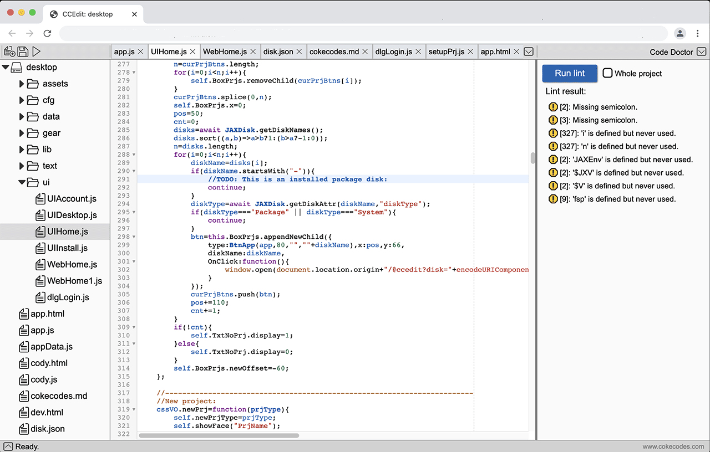

# CCEdit
## What is CCEdit 
CCEdit is the Code/ Text editor in CokeCodes. It based on the great work of CodeMirror.

Get CCEdit at [www.cokecodes.com](www.cokecodes.com)

## Features:
- **Fast** careful optimized, starts in second, smooth edit experience 
- **Project files Navigator** show files tree in project (disk), with cloud status
- **Keyboard shortcuts** you can choose your favorite key binds  
- **Document Tab**: show document tabs on top and quick switch between docs
- **Syntax highlights**: support multiple code languages 
- **Multiple cursors**: edit multi-places in same time
- **Code folding**: inbuilt Javascript support, more can be expended by addons
- **Autocompletion**: inbuilt Javascript support, more can be expended by addons  
- **Linter integration**: inbuilt Javascript, JSON, HTML, CSS support,  more can be expended by addons
- **Search and replace**: Search and replace in document or in project files. RegExp is supported
- **Bracket and tag matching**: inbuilt Javascript, JSON, HTML, CSS support, more can be expended by addons
- **Marks and todos**: define document marks and TODO with comment, list and jump to them in tool box
- **Repository support**: Check/ compare changes since last sync, edit conflicts in 3-column view.
- **Markdown preview**: Preview generated document by side while editing
- **Html view**: Automatic update when you save
- **Run project**: one click to launch your web page/ appcliation
- **Terminal**: access CokeCodes terminal in editor tool window, run handy commands without switch out your editor 

## Addons
Most CCEdit features like file navigator, syntax highlights, are provide by addon. Addons are Javascript modules, load into runtime only when need. You can write your own addons or port popular addons.

## Roadmap
- Better support for touch devices, phones and tablets  
- More inbuilt language supports  
- Night modes  
- Themes support 

## Ideas?
If you like a CCEdit, have ideas to improve, contact me at pxavdpro@gmail.com