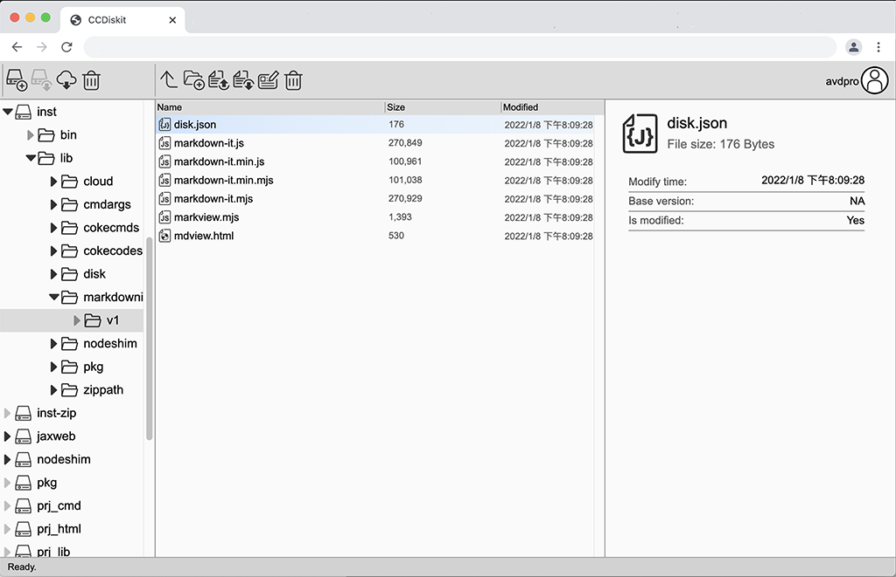

# CokeCodes Diskit
## What is CokeCodes Diskit
Diskit is the file-manager tool in [CokeCodes](https://github.com/Avdpro/CokeCodes).  
  

Try **Diskit** at [www.cokecodes.com](https://www.cokecodes.com)

## Features
- **Diskit** is a file manager application like **File Explorer** and **Finder**. It provide more convenient way to manipulate the file system than the **[Terminal](../terminal/README.md)**

- **Repository** access. You can **check out**, **check in**, **commit**, **update** local disk with cloud.

- **Upload files**. You can upload files into **Diskit** working path.

- **Download files**. You can download files from **Diskit** to your desktop/ device. You can download folders as a ZIP file.

- **Copy and Paste** upload files. You can copy files and folders in your **File Explorer**, **Finder** or **Files** on iPhone/iPad, then paste them at **Diskit**. 

- **Drag and Drop** upload files. You can drag files and folders from **File Explorer**, **Finder** or **Files** on iPhone/iPad, drop them into **Diskit** to upload them.

- **Open files**. Double click at a file, **Diskit** will open an application registered with the file-type.  

## Ideas?
If you like **Diskit**, had ideas to improve, contact me at pxavdpro@gmail.com
