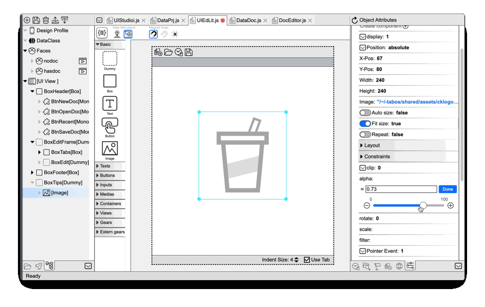

# Tab-OS conecpt preview

### Please try with an desktop browser
**Tab-OS currently only runs with desktop browsers.** Mobile support is incoming.   

## What Tab-OS?
Tab-OS is a virtual OS in Web.  it brings the essence of modern OS (like MacOS, Windows, Linux) into browsers.  
With tools and apps in Tab-OS, WEB and application developers can work (design and code) just in the browser. No need to setup native environment or install native apps.   
Now, almost 100% Tab-OS itself's codes are written in Tab-OS.  
  
## Why work in Tab-OS?

### Super Frontend Dev.
  

Tab-OS comes with an **Visual Editor**, it enables **Practical WYSWYG** design and coding 
for modern Web and Application. It can greatly speed up frontend works.  
**How Practical?**  
**Tab-OS' Visual Editor is made by itself.** _Not like other no/low-codes out there._ 
  
[**Learn more about Tab-OS' Visual Editor.**](veditor/veditor.md)   

### Tab-OS Dev. vs Native OS Dev.
- **No System Contamination:** Setup a new project work environment in Tab-OS won't install 
anything into native OS nor make any changes out side the browser. Your system always 
stay clean. 

- **Domain Sandbox:** By the browser' nature, data is strongly isolated between domains. 
The Tab-OS' **Multiverse App** can create, backup, restore and manage domain sandboxes. 
Each domain-sandbox works as a VM computer. Developer can have unlimited dedicate VM 
computers for each project.  

- **Instant Setup:** Sad fact: in native, setting up a project's development environment can 
be harder than coding it. In Tab-OS, Multiverse app can create a sand-box with existed VM 
images. It's like the **Docker**, but much more **light-weighted**.

- **It's Better**: Applications and tools in browser work just as good as similar ones run in 
native OS. Utilized modern browsers' advanced features, some features (like debug, HMR) can be 
much better.

- **Full Stack**: In Tab-OS, developer can write server codes and debug them just in browser, even 
offline! Debuging javascript server code in browser is far more efficient than other ways.   
`In this concept preview, you can start a HTTP REST API server in browser and access it in 
your client web page/ app, just like it runs in a native OS. Express and Fastify will be 
supported in coming Tab-OS update.`

- **Any Device, Anytime**: Browsers are best cross-platform-environment out there. Tab-OS can 
run on all major modern browsers **desktop and mobile(incoming)**. With inbuilt cloud feature, you can 
developers can easily pick up their work any where, anytime. 

### Tab-OS Dev. vs Other Dev-Clouds or No/Low-Codes: 
- **There is an OS:** Tab-OS run apps and tools side by side. Sharing the same file system, 
they really works together. 

- **More than Toy Apps:** Tab-OS and it's Visual Editor are designed for generic designing and coding. It works with
popular frameworks like React, VUE and more. Tab-OS can handle complex projects (like 
itself) perfectly.

- **Superior Offline:** Tab-OS tools/ apps can and mostly work offline. Developers won't 
concern about the network connection while working. 

- **Not Only for Coders:** Tab-OS' Visual Editor is great for designers too. It works just like
Figma, XD or Sketch, new features like Faces make it event better. Designed UI have the codes that
coders can just work with data-logics. 

- **Custom Tools and Add-Ons:** Coders can write their own tools, apps, and custom 
build commands for projects.

- **Open Source:** Tab-OS and it tools are open sourced. Developer can utilize it at max-power.

## More to mention:
- **Cloud repository**: OS images, projects can be synced and share with Tab-OS' cloud repository. You can access your works anytime, anywhere, on any devices.  
Public clouds (OneDrive, DropBox, GitHub) support is on the way.

- **Packages:** Tab-OS inbuilt a package system. Apps, tools and libs are delivered and installed as packages. With minor modifications, most node.js packages can be port into browser. 
You can make your own packages and share with others too.  
Npm packages support is also incoming.  

- **Team Server:** With the incoming **Team Host** tool, developers can host their own Tab-OS 
server, keep secret works private or behind company firewall.

## Incoming more
This version of Tab-OS is still a concept preview. It proves it's possible to work with in tool-chain in browser. 
Current Tab-OS is in early stage. More features are incoming, check the [**Roadmap**](roadmap.md)  and stay tuned!
