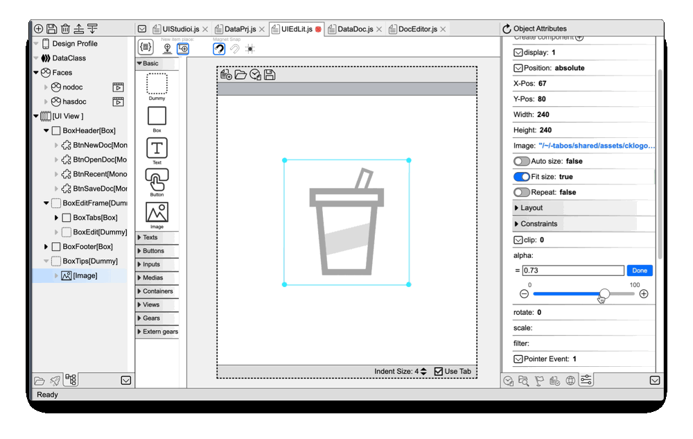

# Tab-OS conecpt preview

## What is Tab-OS?
Tab-OS is a virtual OS in Web. 
It brings the essence of modern OS (like MacOS, Windows, Linux) into browsers.  
With tools and apps in Tab-OS, WEB and application developers can work (design and code) just in the browser. No need to setup native environment or install native apps.   
Now, almost 100% Tab-OS' codes are written in itself.  
  
## Why Develop Tab-OS?

If I were to explain it in one sentence, it would be: To enjoy more fun in creative development!

I have participated in many development projects, whether they were successful or unsuccessful, I always try to find joy in them. I believe that joyful development should focus on creative work. I especially enjoy designing and developing user interfaces (UI) using "What You See Is What You Get (WYSIWYG)" tools. However, due to the constantly changing application environment and the technical stagnation of "WYSIWYG" tools, modern web and app development tend to lean towards the "Full-Code" development mode. Compared to "WYSIWYG," the "Full-Code" development mode is much more tedious.

So, I hope to develop a new and powerful "WYSIWYG" development tool that will allow me to enjoy more fun while working on development projects.

## Why work in Tab-OS?

### Super Frontend Dev.
  

Tab-OS comes with an **Visual Editor**, it enables **Practical WYSWYG** design and coding 
for modern Web and Application. It can greatly speed up frontend works.  

**How Practical?**  
- **Tab-OS' Visual Editor is made by itself.**   
  
[**Learn more about Tab-OS IDE.**](veditor/veditor.md)   

### Tab-OS Dev. VS  Native OS Dev.

- **No Contamination:** Setting up a new project environment in Tab-OS won't install anything on your local operating system, nor will it make any changes outside of the browser. Your system stays clean.

- **Domain Sandbox:** Due to the nature of browsers, data between domains is strongly isolated. Tab-OS's **Multiverse App** can create, backup, restore, and manage domain sandboxes. Each domain sandbox can function as a virtual machine. Developers can have unlimited dedicated virtual machines for each project.

- **Instant Setup:** One frustrating truth is that setting up a development environment for a project in native OS development can be more challenging than writing the code itself. In Tab-OS, Multiverse Applications can create a sandbox using an existing virtual machine image. It's like **Docker**, but much lighter: lightning-fast environment setup with minimal system resource usage during runtime.

- **Better Performance:** Applications and tools in the browser perform as well as similar applications running on the native operating system. Leveraging advanced features of modern browsers, some functionalities like debugging and HMR (Hot Module Replacement) might perform even better.

- **Full-Stack Development:** In Tab-OS, developers can write server-side code in the browser and debug it, even offline! Debugging JavaScript server code in the browser is more efficient than other methods. In this concept preview, you can launch an HTTP REST API server in the browser and access it from client web/apps just like you would in the native operating system. Express and Fastify will be supported in an upcoming Tab-OS update.

- **Any Device, Anytime:** The browser is the ultimate cross-platform application. Tab-OS can run on all major modern browsers, including desktop and soon-to-be-released mobile versions. With built-in cloud capabilities, developers can start working easily anytime, anywhere.

### Tab-OS Dev. vs Other Dev-Clouds or No/Low-Codes: 
- **There is an OS:** Tab-OS can run applications and tools simultaneously, sharing the same file system and network environment, allowing them to truly work together. Compared to other cloud development tools and no/low-code environments, Tab-OS offers an experience closer to a native operating system and is easier to get started with.

- **Excellent Offline Support:** Tab-OS's tools/applications can run in offline mode most of the time. Unlike other cloud development solutions, Tab-OS's file system is based on browser local storage and does not rely on the network for access. Internal network communication in Tab-OS is implemented through service workers and does not depend on external networks. Even in an offline environment, developers can still develop and debug network services.

- **Not Just for Simple Projects:** Tab-OS and its WYSIWYG IDE are designed for designing and programming general-purpose products. The Tab-OS IDE is built on the innovative VFACT framework, offering both code control in Full-Code mode and high development efficiency in WYSIWYG mode. It can also be used with popular frameworks like React, VUE, and more. Even large and complex projects like Tab-OS itself can be handled with ease.

- **Not Just for Coders:** Tab-OS's visual IDE is also well-suited for designers. Its operation is similar to Figma, XD, or Sketch, and unique features (such as Faces) make it even more outstanding. Well-designed user interfaces include interface-related code that programmers can use directly, greatly simplifying design delivery work.

- **Open Source:** Tab-OS and its tools are open source. Developers can extend its functionality according to their needs.

## More Noteworthy Highlights:

- **AI-Assisted Development:** Tab-OS IDE offers AI-assisted code writing and interface design by integrating ChatGPT. It's especially worth mentioning that Tab-OS IDE provides a multilingual AI-assisted solution, making the development of products in multiple languages easy and enjoyable. I completed the entire Chinese version of Tab-OS in just a few days. In the future, Tab-OS will support more AI models and offer additional AI-assisted features.

- **Share and Experience Anytime:** 
The UI designed in Tab-OS IDE can generate interactive preview at any time, 
allowing you to share them with others through the cloud or files. 
Having a working and interactive preview version at all times is 
immensely helpful for streamlining project development and progress tracking.

- **Built-in Version Control and Cloud Repository:** Tab-OS's file system natively supports version control. You can track file changes at any time. System backups and project work can be synchronized and shared with Tab-OS's cloud repository. Developers can access their synchronized work from anywhere and on any device. Tab-OS also has experimental support for GitHub and will gradually roll out support for other public clouds such as OneDrive and Dropbox in the future.

## More Features Coming Soon
This version of Tab-OS is still a concept preview. It demonstrates that building a complete development toolchain in the browser is feasible.
With an efficient and reliable platform, more exciting features are on the way. Please check out the [**ROADMAP**](roadmap.md) and stay tuned!
