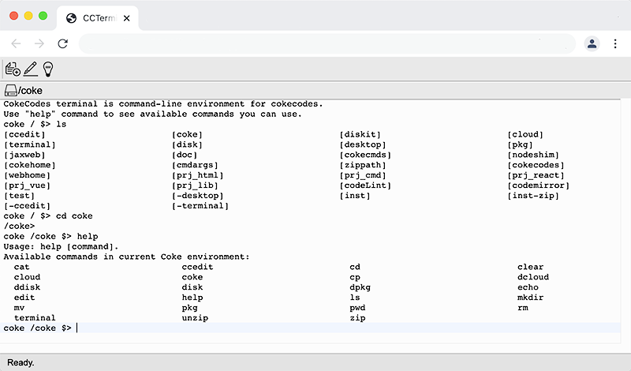

# CokeCodes Terminal
## What is CokeCodes Terminal
Terminal is a UNIX like terminal app in [CokeCodes](https://github.com/Avdpro/CokeCodes).  

Hands on **Terminal** at [www.cokecodes.com](https://www.cokecodes.com)

Terminal and commands runs on it are coded with Javascript.
## Features
- Common **UNIX Bash** commands like: **ls cd, cwd, cp, rm...**
- CokeCodes **cloud account** access commands so you can **register** new account, **login**, **logout**...
- CokeCodes **cloud repository** access commands so you **check in**, **check out**, **commit**, **update** your codes.
- CokeCodes **packages** access commands so you can **import/ install**, **update**, **share** code pacakges. 
- **Upload files** to current working path:
   - Click "Put file" button, select files you want to upload. Upload a single ZIP file can be extracted via upload.
   - In your **File Explorer**, **Finder**, select and **Copy** files & folders you want to upload. In Terminal, **Paste** the to upload them into current path.
   - **Drag and drop** files and folders from **File Explorer**, **Finder** to Terminal.
- Inbuilt **Mark down** support.

## Issues and roadmap
- Some commands are not work exactly like they do in UNIX bash
- Night mode
- Output color support
- Settings: font, color, theme...

## Ideas?
If you like Terminal, have ideas to improve, contact me at pxavdpro@gmail.com
