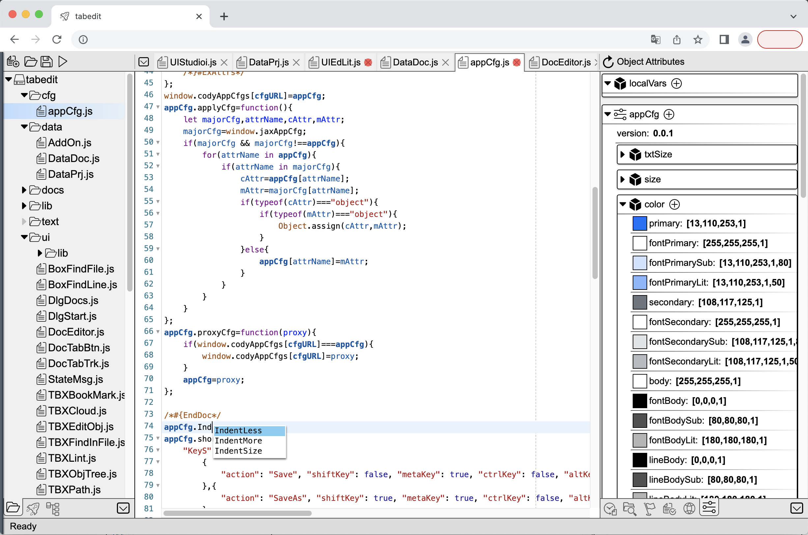
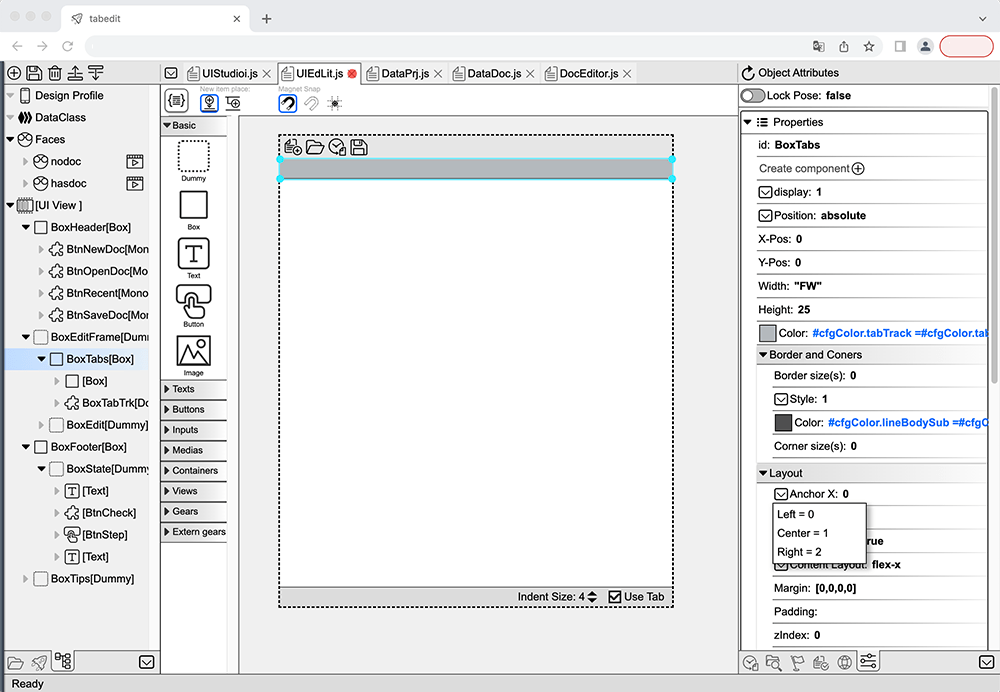
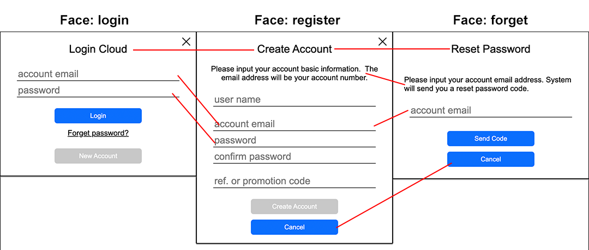

## Overview of Tab-OS IDE

Tab-OS IDE is a universal code editor built into Tab-OS. It is constructed based on add-on components, with nearly all functionalities, from text editing to UI design, being implemented through these add-on components.

### Text/Code Editor

The current text/code editor is based on **CodeMirror 5**, equipped with all the features of a modern code editor.

### UI Editor

The UI Editor in Tab-OS IDE is a **WYSIWYG (What You See Is What You Get)** add-on component that seamlessly collaborates with the code/text editor. It possesses some key features to deliver outstanding performance in achieving a **WYSIWYG** workflow in modern web and application development:

#### 1. Data Binding and Mock Up
One of the reasons why a **WYSWYG** (What You See Is What You Get) tool is not very popular in modern frontend development is the lack of data binding functionality, which is supported by almost all frameworks.

In a UI editor, while editing the UI, you can define data (including simulated data), such as **component creation parameters, internal variables, and state object variables**. The properties of UI components can be bound to your data through code. For example, you can set the color of a box as `${appCfg.colors.error}`, or you can set the content of a text component as `${isLoaded ? user.name : "Loading..."}`. Properties bound to data can track changes in the data. In the UI editor, you can modify the data to simulate different scenarios and see real-time changes in the UI appearance.

#### 2. UI Faces
**UI Faces** is an important innovative feature of the **VFACT** framework used by Tab-OS IDE. 
Another reason why WYSWYG is not very popular in modern frontend work is that 
**static appearance is not sufficient for real-world UI applications**.
   
**Problem:**
Complex user interfaces can have significantly different appearances based on different states 
or user interactions. Typically, in modern user interface frameworks, 
this is controlled using state variables. However, as the interface becomes more complex 
or the need to add new appearances arises, the code (and maintenance work) can become very 
non-intuitive and challenging to write.

**Solution:**
Tab-OS's in-house framework, **VFACT**, introduces a new UI mechanism called **Faces**.

In the UI editor, each UI/component can have multiple **Faces**. 
Each Face is a named preset appearance. You can design/edit properties (visibility, position, 
size, color, content, etc.), data bindings, and transformation animations of affected components for each Face.

The UI editor exports these Faces as code text generated based on your platform/framework. 
You only need to trigger a Face change, such as `showFace("login")` or `showFace("forget")`, 
and the user interface will change according to your settings.

**Faces can be used in combination:** UI can simultaneously be in multiple different states, 
e.g., "busy" and "disabled" states both enabled. Managing complex combination appearances 
is difficult with just state variables.

In the UI editor, you can edit, preview various faces stand along or combined of the UI, 
and test if the UI displays correctly in various edge cases without running the project. 
The Faces mechanism makes UI work more **intuitive** and can **significantly reduce** 
the design, coding, and maintenance costs of the user interface.

#### 3. Component Reusability
In UI editor, all components are reusable. 
You can configure a component's constructor parameters and expose state properties to embed 
them in other UI/components. Embedded components can also bind data and set their interface face. 
Reusing components can **save a significant amount of design/coding time** and make the project 
more organized.

#### 4. Component Library
The UI editor can output a project's components as a component library. 
New projects can import an existing component library. For example, all Tab-OS applications 
import the homekit library, which provides basic UI components like icon buttons, 
menu dialogs, and also uses homekit's UX configurations such as font sizes and colors. 
With the component library, it's easy to **achieve and maintain a consistent UX experience 
across projects**. Developers can also develop and share their own component libraries, 
offering more powerful UI functionality. Additional extension libraries 
(e.g., data presentation/editing, premium buttons, etc.) will gradually be added to the 
standard Tab-OS component library.

#### 5. Cross-Platform/Framework Independence
The UI editor offers a **unified design experience** similar to other UX design tools 
(Figma, Sketch, XD, etc.). During editing, it manages an internal 
**Abstract Component Tree (ACT)** that is platform/framework-independent. 
Each component is described with editor-friendly properties in a tree-like data structure. 
It is then converted into target code based on the project's target platform/framework. 
Designed and generated UI components and code can be applied to different platforms/frameworks 
(e.g., VFACT, VUE).

