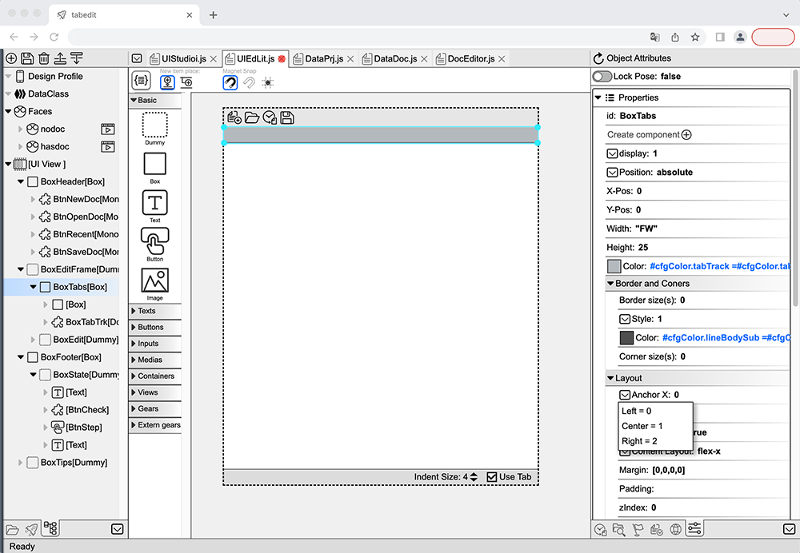

## Tab-OS IDE 概述

Tab-OS IDE 是 Tab-OS 内置的通用代码编辑器。
它是基于附加组件构建的，从文本编辑器到 UI 设计，几乎所有功能都是通过附加组件实现的。

### 文本/代码编辑器 
  
当前的文本 / 代码编辑器基于 **CodeMirror 5**，具备现代代码编辑器的所有功能。
  
### UI编辑器 
  
UI编辑器Tab-OS IDE的**所见即所得**（WYSWYG）附加组件，可以与代码文本编辑器无缝协同工作。
它具备一些关键功能，以便在现代 Web 和应用程序开发中实现**所见即所得**工作的卓越性能：

#### 1. 数据绑定和模拟
一个 **WYSWYG** 工具在现代前端工作中不太受欢迎的原因，是因为缺少几乎所有框架都支持的数据绑定功能。
在UI编辑器中，在编辑UI的时候，您可以定义数据（以及模拟数据），例如 **组件创建参数，内部变量和状态对象变量**。
UI组件的属性可以通过代码与您的数据绑定。例如：您可以将一个框的颜色设置为：`${appCfg.colors.error}`；
或者您可以将文本组件的内容设置为`${isLoaded ? user.name : "加载中..."}`。数据绑定的属性可以跟踪数据变化。
在UI编辑器里，您可以更改数据以模拟不同的情况，并实时查看由此带来的UI外观变化。

#### 2. UI表情
**UI表情**是Tab-OS IDE使用的**VFACT**框架的一个重要创新功能。
现代前端工作中不太受欢迎的另一个原因是：**静态外观对于实际应用中UI来说是不够的。**
   
**问题：**
复杂的用户界面可能根据不同的状态或用户交互而具有非常不同的外观。
通常情况下，现代用户界面框架中通过状态变量来控制它。
但是当界面变得更加复杂或需要添加新的外观时，代码（以及维护工作）可能会变得非常不直观和难以编写。

**解决方案：**
Tab-OS的自用框架**VFACT**引入了一种新的UI机制：**Faces**。

在UI编辑器中，每个UI/组件可以有多个**Faces**。每个Face都是一个具有名称的预设外观。
您可以为每个Face设计/编辑相关的组件的属性（可见性、位置、大小、颜色、内容...）、数据绑定和变换动画。

UI编辑器将这些Faces导出为基于您的平台/框架生成的代码文本。您只需触发Face更改，
如`showFace("login")`或`showFace("forget")`，用户UI就会根据您的设定进行改变。

**Faces可以组合使用：** UI可以同时处于多个不同的状态，例如：“繁忙”和“禁用”状态同时启用。
仅使用状态变量难以维护复杂的组合外观。

在UI编辑器中，无需运行项目，就可以编辑、预览用户UI的各种状态，已经尝试各种边角情况UI的显示是否正确。
Faces机制使UI工作变得**更加直观**，可以**极大地降低**用户UI的设计、编码和维护成本。

#### 3. 组件重用
在可视化编辑器中，所有UI编辑器设计的组件都是可重用的。您可以设置组件的构造参数和
暴露的状态属性以嵌入到其他UI/组件中。嵌入的组件也可以绑定数据并
设置界面Face。重用组件可以**节省大量的设计/编码时间**，并且**使项目更有条理**。

#### 4. 组件库
UI编辑器可以将一个工程的组件为一个组件库输出。新的工程项目可以导入已存在的组件库。
例如：所有Tab-OS应用程序导入了homekit库，用于基本的UI组件
如图标按钮、菜单对话框等，还使用了homekit的UX配置，如字体大小和
颜色。借助组件库，很容易**实现和维护跨项目的一致的UX体验**。  
开发者也可以开发、分享自己的组件库，提供更强大的UI功能。更多扩展组件库（例如：数据展现/编辑，收费按钮等）
也会逐步加入标准的Tab-OS组件库。

#### 5. 跨平台/框架独立
UI编辑器具有像其他UX设计工具（Figma、Sketch、XD等）一样的**统一设计体验**。
在编辑时，它会在内部管理一个跨平台/框架独立的
**抽象组件树（ACT）**。每个组件都用编辑器友好的属性描述在一个树形数据结构中。
然后基于项目的目标平台/框架，
将其转换为目标文本代码。设计和生成的UI组件和代码可以**应用于不同的平台/
框架（例如VFACT、VUE）**。

